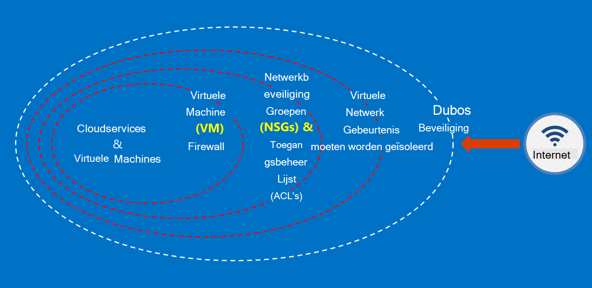

<properties
    pageTitle="Azure overheid Services | Microsoft Azure"
    description="Biedt en overzicht van de beschikbare services in Azure overheid"
    services="Azure-Government"
    cloud="gov"
    documentationCenter=""
    authors="zakramer"
    manager="liki"
    editor="" />

<tags
    ms.service="multiple"
    ms.devlang="na"
    ms.topic="article"
    ms.tgt_pltfrm="na"
    ms.workload="azure-government"
    ms.date="10/18/2016"
    ms.author="ryansoc" />

#  Beveiliging

##  Beginselen voor het beveiligen van gegevens van de klant in Azure overheid

Azure overheid biedt een aantal functies en services die u gebruiken kunt om cloud oplossingen aan uw wensen geregeld/beheerde gegevens te maken. Een klantoplossing compatibele is niets meer dan de effectieve uitvoering van out-van-het-box Azure Government-functies, in combinatie met veiligheidsoverwegingen effen gegevens.

Wanneer u een oplossing in Azure overheid host, omgaat met Microsoft veel van deze vereisten is voldaan op het niveau van de infrastructuur cloud.

In het volgende diagram ziet u het Azure ingrijpende model. Microsoft biedt bijvoorbeeld eenvoudige cloudinfrastructuur DDOS, samen met de mogelijkheden van de klant zoals beveiliging toestellen voor klant-specifiek toepassing die DDOS nodig heeft.

Deze pagina bevat de moeten beschikken over principes voor het beveiligen van uw Services en -toepassingen en biedt richtlijnen en aanbevolen procedures voor het toepassen van deze beginselen; met andere woorden, hoe klanten moeten benutten slimme Azure overheid om te voldoen aan de verplichtingen en de verantwoordelijkheden die zijn vereist voor een oplossing die omgaat met ITAR gegevens.

 De algehele principes voor het beveiligen van gegevens van de klant zijn:

- Gegevens met behulp van versleuteling beveiligen
- Geheimen beheren
- Moeten worden geïsoleerd beperken van toegang tot gegevens

###  Klantgegevens beschermen-versleuteling gebruikt

Risico beperken en wettelijke verplichtingen achter het stuur zit de toeneemt focus en het belang van gegevensversleuteling. De implementatie van een effectieve codering gebruiken voor het verbeteren van huidige beveiligingsmaatregelen voor netwerk- en -toepassing, en de algehele risico van uw omgeving cloud verkleinen.

#### Versleuteling in rust
De codering van gegevens in rust geldt voor de beveiliging van inhoud van klant schijf opgeslagen. Er zijn verschillende manieren die dit kan gebeuren:

#### Opslag Service-versleuteling

Azure opslag Service versleuteling is ingeschakeld op het niveau van de account opslagruimte met resultaat blok BLOB's en pagina BLOB's automatisch gecodeerde geschreven met Azure Storage. Wanneer u de gegevens van Azure Storage gelezen, wordt deze door de storage-service worden ontsleuteld voordat het wordt geretourneerd. Gebruik deze optie als u uw gegevens te beveiligen zonder te wijzigen of de code hebt toegevoegd aan alle toepassingen.

#### Aan de clientzijde versleuteling
Aan de clientzijde versleuteling is ingebouwd in de Java en de .NET opslag clientbibliotheken die van Azure-toets kluis API's gebruikmaken, waardoor dit eenvoudig willen implementeren. Azure-toets kluis gebruiken voor toegang tot de geheimen in Azure-toets kluis voor specifieke personen met Azure Active Directory.

#### Versleuteling tijdens overdracht

De eenvoudige beschikbaar voor connectiviteit met Azure overheid versleuteling ondersteunt Transport niveau beveiliging (TLS) 1.2 protocol en x.509-certificaten. Federale Information Processing Standard (FIPS) 140-2 niveau 1 cryptografische algoritmen ook voor infrastructuur netwerkverbindingen tussen Azure overheid datacenters gebruikt worden.  Windows Server 2012 R2 en Windows 8-plus VMs en Azure bestandsshares kunt SMB 3.0 voor versleuteling tussen de VM en het bestand-aandeel gebruiken. Aan de clientzijde versleuteling voor het coderen van de gegevens voordat ze worden overgebracht op te slaan in een clienttoepassing, en de om gegevens te decoderen daarachter wordt overgebracht geen opslagruimte meer.

#### Aanbevolen procedures voor versleuteling

- IaaS VMs: Versleuteling Azure Schijfopruiming. Opslag Service versleuteling voor het coderen van de VHD-bestanden die worden gebruikt voor het back-up van deze schijven in Azure-opslag inschakelen, maar dit alleen nieuwe geschreven gegevens worden gecodeerd. Dit betekent dat alleen de wijzigingen worden gecodeerd als u een VM maken en klik vervolgens opslag Service versleuteling inschakelen voor de opslag rekening met het VHD-bestand, niet het oorspronkelijke VHD-bestand.
- Aan de clientzijde versleuteling: Dit is de meest veilige methode voor het coderen van uw gegevens, omdat er vóór de overdracht versleutelt en de gegevens in rust worden gecodeerd. Dit is echter vereist dat u code toevoegen aan uw toepassingen met opslag, waarmee u mogelijk niet wilt doen. In dat geval kunt u HTTPs voor uw gegevens in de overdracht en versleuteling voor opslag-Service voor het coderen van de gegevens van de rest. Aan de clientzijde versleuteling ook betrekking heeft op meer belasting van de client, moet u rekening hiervoor in uw plannen schaalbaarheid, vooral als u worden gecodeerd en een groot aantal gegevens.

###  Klantgegevens beschermen door geheimen beheren

Secure key management is essentieel voor het beschermen van gegevens in de cloud. Klanten moeten streven naar vereenvoudigen key management en beheer heeft over sleutels die door cloud-toepassingen en services worden gebruikt om gegevens te versleutelen.

#### Aanbevolen procedures voor het beheren van geheimen

- Gebruik toets kluis om het risico van geheimen worden gepubliceerd via hard gecodeerde configuratiebestanden, scripts, of in broncode. Azure-toets kluis toetsen (zoals de versleutelingssleutels voor Azure schijfversleuteling) en geheimen (zoals wachtwoorden) worden gecodeerd, door ze te slaan in FIPS 140-2 niveau 2 gevalideerd hardware beveiligingsmodules (HSM's). U kunt importeren of toetsen in deze HSM's genereren voor toegevoegde assurance.
- Toepassing en sjablonen mag alleen bevatten URI verwijzingen naar de geheimen (wat betekent dat de werkelijke geheimen zijn niet in code, configuratie of broncode opslagplaatsen). Hiermee voorkomt u belangrijke phishing-aanvallen op interne en externe repo's, zoals oogst-bots in GitHub.
- Gebruik van sterke RBAC besturingselementen in sleutel kluis. Als een vertrouwde operator het bedrijf of de overdrachten aan een nieuwe groep binnen het bedrijf laat, moeten u ze niet mogen voor toegang tot de geheimen.

Voor meer informatie <a href="https://azure.microsoft.com/documentation/services/key-vault">openbare documentatie Azure-toets kluis.</a>

###  Moeten worden geïsoleerd beperken van toegang tot gegevens

Moeten worden geïsoleerd draait allemaal grenzen, segmentatie en containers gebruiken om te beperken van toegang tot de gegevens alleen geautoriseerde gebruikers, services en toepassingen. De scheiding tussen tenants is bijvoorbeeld een essentiële beveiliging om multitenant cloud platforms zoals Microsoft Azure. Logische moeten worden geïsoleerd helpt voorkomen dat een tenant verhinderd met de bewerkingen van een andere tenant.

#### Omgeving moeten worden geïsoleerd
De omgeving Azure overheid is een fysieke instantie die losstaat van de rest van het netwerk van Microsoft. Dit is bereikt door een reeks besturingselementen van fysieke en logische die onder andere het volgende:

- Beveiligen van fysieke grenzen biometrische apparaten en camera's gebruiken.
- Gebruik van bepaalde referenties en meervoudige verificatie Microsoft-medewerkers waarbij logische toegang tot de productieomgeving.
- Alle service-infrastructuur voor de overheid Azure bevindt zich binnen de Verenigde Staten.

#### Per klant moeten worden geïsoleerd
Toegangsbeheer voor Azure implementeert netwerk en scheiding tot en met VLAN moeten worden geïsoleerd, ACL's, laden balancers en IP-filters

Klanten kunnen hun resources verder isoleren over abonnementen, resourcegroepen virtuele netwerken en subnetten.

## Filteren

De onlangs aangekondigde FedRAMP hoog en -afdeling van defensie Impact niveau 4-certificering. Dit is de balk beveiliging en naleving verheven over de overheid Azure-omgeving.

We zijn nu onze operatoren bij het controleren van nationale bureau filteren met de wet en krediet (NACLC), zoals gedefinieerd in de sectie 5.6.2.2 van de DoD Cloud Computing beveiliging vereisten handleiding (SRG):

>[AZURE.NOTE] De minimale achtergrond onderzoek voor CSP personeel die toegang hebben tot niveau 4 en 5 informatie op basis van een "niet-kritieke gevoelige' (bijvoorbeeld DoD van ADP-2) is een nationale bureau Neem contact op met wet en krediet (NACLC) (voor"niet-kritieke gevoelige"aannemers) of een regelmatige risico achtergrond onderzoek (MBI)"beperkt risico"positie toewijzing van.

De volgende tabel bevat een overzicht van onze huidige controle voor Azure overheid operatoren:

Azure beurs screenings en achtergrondcontroles | Beschrijving|
---|---|
Amerikaans burgerschap |Verificatie van Amerikaanse burgerschap.
Microsoft cloud achtergrond controleren (om de twee jaar)|Sofi-nummer zoeken, strafrechtelijke geschiedenis selectievakje, Office van refererende activa toegangsbeheerlijst (OFAC), lijst met Bureau van industrie en beveiliging (BIS), Office van beveiliging Trade besturingselementen uitgesloten personen lijst.
Nationale bureau Neem contact op met de wet en krediet (NACLC) (om de vijf jaar) | Telt vingerafdruk achtergrond gecontroleerd FBI databases. Voor aanvullende informatie, gaat u naar de<a href="https://www.opm.gov/investigations/background-investigations/federal-investigations-notices/1997/fin97-02/"> Site van Office personeel Management</a>. | 
<a href="https://www.microsoft.com/en-us/TrustCenter/Compliance/CJIS">Strafrechtelijke gerechtelijke informatie diensten (CJIS)</a> | CJIS is een staat, lokale en FBI overheid controleren welke processen vingerafdruk records en strafrechtelijke geschiedenis op operationele medewerkers die toegang tot kritieke crimineel Justitie-gegevens (CJI) kan worden gevalideerd.  Elke status heeft een eigen achtergrond selectievakjes en latere goedkeuring van alle werknemers met mogelijke toegang tot CJI.|

Voor Azure bewerkingen personeel, zijn de volgende access beginselen van toepassing:

- Taken zijn duidelijk omschreven, met afzonderlijk verantwoordelijkheden ter aanvragen, goedkeuren en implementeren van wijzigingen.
- De toegang is via gedefinieerde interfaces waarvoor specifieke functionaliteit.
- Access just in time (JUST) is, en alleen op basis van de per incident of voor een specifieke onderhoudsgebeurtenis en altijd een beperkte tijdsduur wordt verleend.
- De toegang is regel gebaseerde, met gedefinieerde rollen die alleen de machtigingen die vereist zijn voor probleemoplossing zijn toegewezen.

Controle standaarden bevatten de validatie van Amerikaanse burgerschap van alle Microsoft-ondersteuning en operationele medewerkers voordat toegang wordt verleend tot systemen Azure voor de overheid die worden gehost. Ondersteuningspersoneel die gegevens overbrengen moeten de mogelijkheden van de secure binnen Azure overheid gebruiken. Beveiligde gegevens doorverbinden vereist een aparte set verificatie referenties om toegang te krijgen. Bijvoorbeeld, voor toegang tot systeem metagegevens, bewerkingen personeel gebruiken specifieke web gebaseerde interne beheerprogramma's, alleen-lezen-API's en JIT leiden tot onrechtmatige uitbreiding.

## Volgende stappen

Voor aanvullende informatie en updates Abonneer u op de <a href="https://blogs.msdn.microsoft.com/azuregov/">Microsoft Azure overheid Blog.</a>
