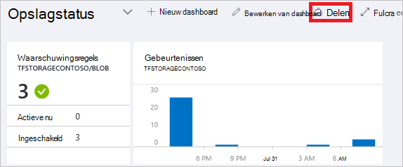
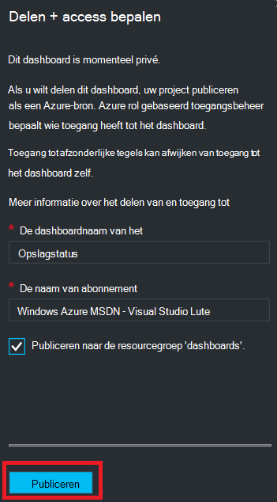
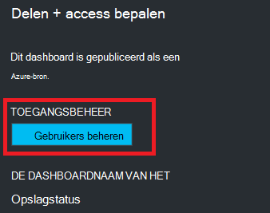
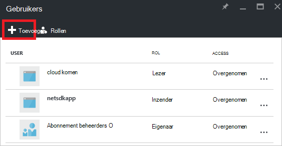
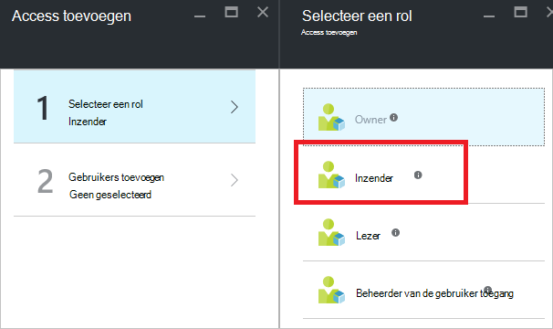
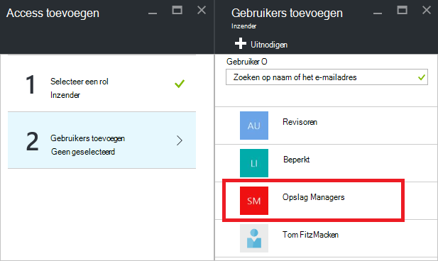
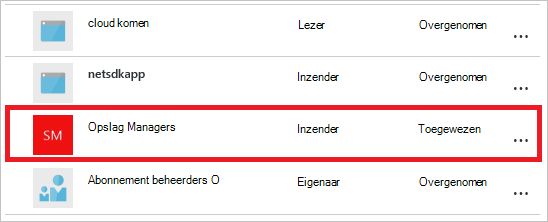

<properties
   pageTitle="Azure portal dashboard access | Microsoft Azure"
   description="In dit artikel wordt uitgelegd hoe u toegang tot een dashboard in de portal van Azure delen."
   services="azure-portal"
   documentationCenter=""
   authors="tfitzmac"
   manager="timlt"
   editor="tysonn"/>

<tags
   ms.service="multiple"
   ms.devlang="NA"
   ms.topic="article"
   ms.tgt_pltfrm="NA"
   ms.workload="na"
   ms.date="08/01/2016"
   ms.author="tomfitz"/>

# Delen van Azure dashboards

Nadat een dashboard is geconfigureerd, kunt u uw project publiceren en delen met andere gebruikers in uw organisatie. U toestaan dat anderen voor toegang tot uw dashboard met Azure [Rol gebaseerd toegangsbeheer](../active-directory/role-based-access-control-configure.md). U een gebruiker of groep gebruikers toewijzen aan een rol en die rol definieert of die gebruikers kunnen bekijken of wijzigen van de gepubliceerde dashboard. 

Alle gepubliceerde dashboards worden geïmplementeerd als Azure resources, hetgeen betekent dat ze bestaan als beheerbare items binnen uw abonnement en zijn opgenomen in een resourcegroep.  Dashboards zijn vanuit het oogpunt een besturingselement access niet verschilt van andere bronnen, zoals een virtuele machine of een opslag-account.

> [AZURE.TIP] Afzonderlijke tegels op het dashboard afdwingen hun eigen vereisten voor het beheer van access op basis van de resources die ze worden weergegeven.  Daarom kunt u een dashboard dat ruim zijn gedeeld tijdens het nog steeds bescherming van de gegevens op afzonderlijke tegels ontwerpen.

## Wat is toegangsbeheer voor dashboards

Met Rolgebaseerd toegangsbeheer, kunt u gebruikers toewijzen aan rollen op drie verschillende niveaus van reikwijdte:

- abonnement
- resourcegroep
- resource

De machtigingen die u toewijst, worden overgenomen van abonnement naar beneden af op de resource. Het gepubliceerde dashboard is een resource. Daarom mogelijk hebt u al gebruikers die zijn toegewezen aan rollen voor het abonnement dat ook voor de gepubliceerde dashboard werkt. 

Hier volgt een voorbeeld.  Stel dat u Azure-abonnement hebt en verschillende leden van uw team de rollen van **eigenaar**, **Inzender**of **lezer** voor het abonnement zijn toegewezen. Gebruikers die eigenaren of inzenders kunnen lijst, weergeven, maken, wijzigen of verwijderen van dashboards in het abonnement.  Gebruikers die lezers zijn niet kunnen mogen lijst en weergave dashboards, maar wijzigen of verwijder deze.  Gebruikers met lezerstoegang krijgen tot lokale wijzigingen aanbrengen in een gepubliceerde dashboard (zoals bij het oplossen van een probleem), maar zijn niet kan worden deze wijzigingen terug naar de server publiceren.  Hebben ze de optie voor het maken van een persoonlijke kopie van het dashboard voor zelf

U kunt echter ook machtigingen toewijzen aan de resourcegroep die verschillende dashboards bevat of een afzonderlijke dashboard. U kunt bijvoorbeeld besluiten dat een groep gebruikers moet hebben beperkte machtigingen via het abonnement maar groter toegang tot een bepaalde dashboard. U toewijzen die gebruikers aan een rol voor die dashboard. 

## Dashboard publiceren

Stel dat u klaar bent met het configureren van een dashboard dat u wilt delen met een groep gebruikers in uw abonnement. De volgende stappen uit een aangepaste groep naam opslag Managers weer, maar u kunt uw groep naam wat u wilt. Zie voor informatie over het maken van een Active Directory-groep en het toevoegen van gebruikers aan die groep [beheren groepen in Azure Active Directory](../active-directory/active-directory-accessmanagement-manage-groups.md).

1. Selecteer in het dashboard **delen**.

     

2. Voordat u toegang toewijst, moet u het dashboard publiceren. Standaard wordt het dashboard worden gepubliceerd naar een resourcegroep benoemde **dashboards**. Selecteer **publiceren**.

     

Uw dashboard is nu gepubliceerd. Als de machtigingen van het abonnement geschikt zijn, hoeft u niet te doen meer. Andere gebruikers in uw organisatie kunnen openen en wijzigen van het dashboard op basis van hun rol voor het niveau van abonnement. Echter voor deze zelfstudie, laten we een groep gebruikers aan een rol toewijzen voor die dashboard.

## Access toewijzen aan een dashboard

1. Selecteer **gebruikers beheren**na het dashboard publiceren.

     

2. U ziet een lijst met bestaande gebruikers die een rol voor dit dashboard al zijn toegewezen. Uw lijst met bestaande gebruikers is anders dan de onderstaande afbeelding. De toewijzingen zijn waarschijnlijk overgenomen van het abonnement. Een nieuwe gebruiker of groep wilt toevoegen, selecteert u **toevoegen**.

     

3. Selecteer de rol die Hiermee geeft u de machtigingen die u wilt verlenen. In dit voorbeeld **Inzender**te selecteren.

     

4. Selecteer de gebruiker of groep die u wilt toewijzen aan de rol. Als u de gebruiker of groep die u in de lijst zoekt niet ziet, gebruikt u het zoekvak. Uw lijst met beschikbare groepen, is afhankelijk van de groepen die u hebt gemaakt in uw Active Directory.

      

5. Wanneer u klaar bent met het toevoegen van gebruikers of groepen, selecteert u **OK**. 

6. De nieuwe toewijzing wordt toegevoegd aan de lijst met gebruikers. Zoals u ziet dat de **toegang** is vermeld als **toegewezen** in plaats van **overgenomen**.

     

## Volgende stappen

- Zie voor een lijst met functies, [RBAC: ingebouwde rollen](../active-directory/role-based-access-built-in-roles.md).
- Zie voor meer informatie over het beheren van resources, [resources Azure beheren via de portal](resource-group-portal.md).