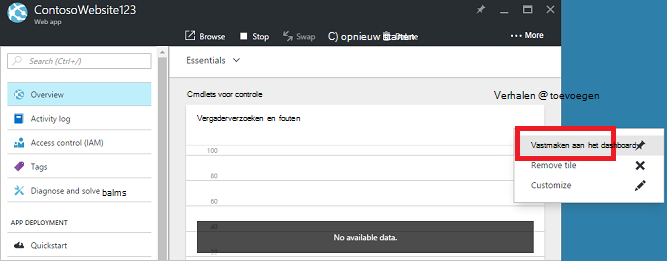

<properties
   pageTitle="Azure portal dashboards | Microsoft Azure"
   description="In dit artikel wordt uitgelegd hoe maken en bewerken van dashboards in de portal van Azure."
   services="azure-portal"
   documentationCenter=""
   authors="sewatson"
   manager="timlt"
   editor="tysonn"/>

<tags
   ms.service="multiple"
   ms.devlang="NA"
   ms.topic="article"
   ms.tgt_pltfrm="NA"
   ms.workload="na"
   ms.date="09/06/2016"
   ms.author="sewatson"/>

# Maken en delen van dashboards in de portal van Azure

U kunt meerdere dashboards maken en deel ze met anderen die toegang tot uw Azure-abonnementen heeft.  Dit bericht doorloopt naar de basisbeginselen van het maken van/bewerken, publiceren en toegang tot dashboards beheren.

## Dashboards versus bladen aanpassen

Sinds het starten van dashboards een aantal maanden geleden, is er een constante weigeren in blade aanpassingen en een snelle stijging in dashboard aanpassingen. Deze trend sterke gebruik ziet u dat u liever het aanpassen van dashboards op bladen. Als u wilt dat trend wordt ondersteund, wordt de mogelijkheid aan te passen bladen en onze inspanningen om te verbeteren dashboard functionaliteit opslagquota verwijderd. Als u een blade aangepast, worden uw aanpassing spoedig verwijderd. Als u wilt deze aanpassingen blijven behouden, vastmaken de aangepaste tegels aan een dashboard. Gewoon met de rechtermuisknop op de tegel en selecteer van **vastmaken aan dashboard** , zoals wordt weergegeven in de volgende afbeelding.

## Een dashboard maken

Als u wilt een dashboard maken, selecteert u de knop **nieuw dashboard** naast de naam van het huidige dashboard.  

Deze actie Hiermee maakt u een nieuw, leeg, privé-dashboard en plaatst u modus aanpassing waarin u kunt uw dashboard een naam en toevoegt of opnieuw rangschikken tegels.  Wanneer u in deze modus heeft de galerie die kunnen worden samengevouwen tegel op het linkernavigatiemenu.  De galerie tegel kunt u tegels voor uw Azure resources op verschillende manieren berekenen: u kunt bladeren door de [resourcegroep](../azure-resource-manager/resource-group-overview.md#resource-groups), door resourcetype, per [label](../resource-group-using-tags.md)of door te zoeken voor de resource op naam.  

Tegels toevoegen door op het dashboard oppervlak positie gewenste te slepen.

Er is een nieuwe categorie **Algemeen** aangeroepen tegels die niet zijn gekoppeld aan een bepaalde resource.  In dit voorbeeld wordt de korting-tegel vastmaken.  Deze tegel kunt u aangepaste inhoud toevoegen aan uw dashboard.  De tegel ondersteuning biedt voor tekst zonder opmaak, [de syntaxis van de korting](https://daringfireball.net/projects/markdown/syntax)en een beperkt aantal HTML.  (Voor beveiliging, u kunt bijvoorbeeld wilt invoeren niet uitvoeren `<script>` labels of gebruik van bepaalde element vormgeving van CSS die met de portal conflicteren mogelijk.) 

## Een dashboard bewerken

Nadat het dashboard is gemaakt, kunt u tegels van de galerie tegel of de weergave naast elkaar van bladen vastmaken. Laten we de weergave van onze resourcegroep vastmaken. U kunt een pincode tijdens het surfen op het item of vanuit het blad van de groep resource. Beide methoden, resulteert in de weergave van de tegel van de resourcegroep vast.

Na het losmaken van het item, wordt deze weergegeven op uw dashboard.

We kunnen nu dat we een tegel korting hebben en een resourcegroep die zijn vastgemaakt aan het dashboard, het formaat wijzigen en opnieuw rangschikken van de tegels in een geschikte indeling.

Aanwijzer en '...' selecteren of met de rechtermuisknop op een tegel kunt u de contextuele opdrachten voor die naast elkaar zien. Standaard zijn er twee items:

1. **Losmaken van dashboard** – Hiermee verwijdert u de tegel vanuit het dashboard
2.  **Aanpassen** – ingevoerd modus aanpassen

Door te selecteren aanpassen, kunt u het formaat wijzigen en opnieuw ordenen tegels. Als u een tegel, selecteert u de nieuwe grootte uit het contextmenu, zoals in de volgende afbeelding.

Of, als de tegel elke grootte ondersteunt, kunt u de rechter benedenhoek naar de gewenste grootte slepen.

Nadat het formaat van tegels wijzigen, moet u het dashboard weergeven.

Zodra u klaar bent met het aanpassen van een dashboard, gewoon selecteren de **klaar aanpassen** om af te sluiten modus aanpassen of met de rechtermuisknop op en selecteer **klaar aan te passen** in het snelmenu.

## Een dashboard publiceren en beheren van toegangsbeheer

Wanneer u een dashboard hebt gemaakt, hoeft u privé al dan niet standaard, wat betekent dat u bent de enige persoon die deze kan zien.  Als u anderen deze kunnen bekijken, gebruikt u de knop **delen** dat wordt weergegeven naast de andere dashboard-opdrachten.

U wordt gevraagd of u een abonnement en de resourcegroep voor uw dashboard naar worden gepubliceerd. Als u wilt naadloos integreren dashboards in het systeem, hebben we geïmplementeerd gedeelde dashboards als Azure resources (zodat u niet kunt delen door een e-mailadres typen).  Toegang tot de gegevens worden weergegeven door de meeste van de tegels in de portal vallen [Toegangsbeheer voor op basis van Azure-rol](../active-directory/role-based-access-control-configure.md ). Vanuit het oogpunt een besturingselement voor toegang tot verschillen gedeelde dashboards niet van een virtuele machine of een opslag-account.  

Stel dat u Azure-abonnement hebt en leden van uw team de rollen van **eigenaar**, **Inzender**of **lezer** van het abonnement zijn toegewezen.  Gebruikers die eigenaren of inzenders kunnen lijst, weergeven, maken, wijzigen of verwijderen van dashboards in die-abonnement.  Gebruikers die lezers zijn niet kunnen mogen lijst en weergave dashboards, maar wijzigen of verwijder deze.  Gebruikers met reader toegang mogen lokale wijzigingen aanbrengen in een gedeelde dashboard, maar zijn niet kan worden deze wijzigingen terug naar de server publiceren.  Ze kunnen nog wel een persoonlijke kopie van het dashboard voor eigen gebruik.  Wees altijd afdwingen afzonderlijke tegels op het dashboard op basis van de resources die ze met overeenkomen regels voor hun eigen access.  

Voor het gemak begeleidt van de portal publicerende ervaring u richting van een patroon waarin u dashboards plaatsen in een resourcegroep **dashboards**genoemd.  

U kunt er ook voor kiezen een dashboard publiceren naar een bepaalde resourcegroep.  Het toegangsbeheer voor die dashboard komt overeen met het toegangsbeheer voor de resourcegroep.  Gebruikers die de resources in die resourcegroep kunnen beheren hebt ook toegang tot de dashboards.

Nadat het dashboard is gepubliceerd, wordt het besturingselement **delen + access** deelvenster vernieuwen en u informatie over het gepubliceerde dashboard, inclusief een koppeling voor het beheren van de gebruikerstoegang tot het dashboard weergeven.  Deze koppeling Hiermee start u het standaard rol gebaseerd toegangsbeheer blad gebruikt voor het beheren van access voor elke Azure resource.  U kunt altijd terugkeren naar deze weergave door te selecteren van **delen**.

## Volgende stappen

- Als u wilt beheren resources, Zie [Azure beheren bronnen via de portal](resource-group-portal.md).
- Als u wilt implementeren resources, Zie [Deploy resources met resourcemanager sjablonen en Azure-portal](../resource-group-template-deploy-portal.md).