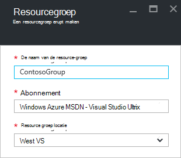

<properties 
    pageTitle="Azure-portal gebruiken voor het beheren van Azure resources | Microsoft Azure" 
    description="Gebruik Azure-portal en Azure Resource beheren voor het beheren van uw resources. Ziet u hoe u werkt met dashboards om te controleren bronnen." 
    services="azure-resource-manager,azure-portal" 
    documentationCenter="" 
    authors="tfitzmac" 
    manager="timlt" 
    editor="tysonn"/>

<tags 
    ms.service="azure-resource-manager" 
    ms.workload="multiple" 
    ms.tgt_pltfrm="na" 
    ms.devlang="na" 
    ms.topic="article" 
    ms.date="09/12/2016" 
    ms.author="tomfitz"/>

# Azure resources via portal beheren

> [AZURE.SELECTOR]
- [Azure PowerShell](../powershell-azure-resource-manager.md)
- [Azure CLI](../xplat-cli-azure-resource-manager.md)
- [Portal](resource-group-portal.md) 
- [REST API](../resource-manager-rest-api.md)

Dit onderwerp wordt uitgelegd hoe u de [Azure-portal](https://portal.azure.com) met [Azure resourcemanager](../azure-resource-manager/resource-group-overview.md) voor het beheren van uw Azure resources. Zie voor meer informatie over het implementeren van resources via de portal, [Deploy resources met resourcemanager sjablonen en Azure-portal](../resource-group-template-deploy-portal.md).

Op dit moment ondersteunt niet elke service de portal of resourcemanager. Voor die services moet u de [klassieke portal](https://manage.windowsazure.com)gebruiken. Voor de status van elke service, raadpleegt u de [beschikbaarheid van Azure portal grafiek](https://azure.microsoft.com/features/azure-portal/availability/).

## Resourcegroepen beheren

1. Alle resourcegroepen in uw abonnement, selecteert u **resourcegroepen**.

    

1. Als u wilt een lege resourcegroep maken, selecteert u **toevoegen**.

    

1. Geef een naam en locatie voor de nieuwe resourcegroep. Selecteer **maken**.

    

1. Mogelijk moet u Selecteer **vernieuwen** om de meest recente resourcegroep weer te geven.

    

1. U kunt de gegevens worden weergegeven voor uw resourcegroepen aanpassen door **kolommen**te selecteren.

    

1. Selecteer de kolommen die u wilt toevoegen en selecteer vervolgens **Update**.

    

1. Zie voor meer informatie over het implementeren van resources aan de nieuwe resourcegroep, [Deploy resources met resourcemanager sjablonen en Azure-portal](../resource-group-template-deploy-portal.md).

1. Voor snelle toegang tot een resourcegroep, kunt u het blad vastmaken aan uw dashboard.

    

1. Het dashboard wordt weergegeven voor de resourcegroep en de bijbehorende bronnen. U kunt de resourcegroepen of selecteren een van de bronnen om te navigeren naar het item.

    

## Tag resources

U kunt labels toepassen op resourcegroepen en bronnen logisch ordenen uw activa. Zie [werken met tags om u te organiseren van uw Azure resources](../resource-group-using-tags.md)voor informatie over het werken met tags.

[AZURE.INCLUDE [resource-manager-tag-resource](../../includes/resource-manager-tag-resources.md)]

## Monitor met resources

Wanneer u een resource selecteert, worden standaard-grafieken en tabellen voor het controleren van dit resourcetype in het blad resource weergegeven.

1. Selecteer een resource en ziet u de sectie **controle** . Grafieken die relevant voor het resourcetype zijn gezocht. De volgende afbeelding ziet u de standaardwaarde voor een account opslag-gegevens bewaken.

    

1. U kunt een sectie van het blad vastmaken aan uw dashboard door het beletselteken (...) boven de sectie te selecteren. U kunt ook de grootte van de sectie in het blad aanpassen of helemaal verwijderen. De volgende afbeelding ziet hoe u vastmaken, aanpassen of de sectie processor en geheugen verwijderen.

    

1. Na de sectie aan het dashboard vast, ziet u het overzicht op het dashboard. En dit direct Hiermee u naar meer informatie over de gegevens gaat te selecteren.

    

1. Als u wilt de gegevens die u via de portal bewaken volledig aanpast, Ga naar uw standaarddashboard en selecteer **nieuwe dashboard**.

    

1. Geef een naam op voor uw nieuwe dashboard en sleep tegels op het dashboard. De tegels gefilterd op verschillende opties.

    

     Zie voor meer informatie over het werken met dashboards, [maken en delen van dashboards in de portal van Azure](azure-portal-dashboards.md).

## Resources beheren

In het blad voor een resource ziet u de opties voor het beheer van de resource. De portal management worden opties weergegeven om dat type bepaalde resource. U ziet de opdrachten voor het beheer aan de bovenkant van het blad voor de resource en aan de linkerkant.

Uit de volgende opties, kunt u bewerkingen zoals starten en een virtuele machine stoppen of de eigenschappen van de virtuele machine opnieuw uitvoeren.

## Resources verplaatsen

Als u verplaatsen van resources aan een andere resourcegroep of een ander abonnement wilt, raadpleegt u [resources naar nieuwe resourcegroep abonnement verplaatsen](../resource-group-move-resources.md).

## Vergrendelen resources

U kunt een abonnement, resourcegroep of resource om te voorkomen dat andere gebruikers in uw organisatie uit per ongeluk verwijderen of wijzigen van kritieke bronnen vergrendelen. Zie [vergrendelen resources met Azure resourcemanager](../resource-group-lock-resources.md)voor meer informatie.

[AZURE.INCLUDE [resource-manager-lock-resources](../../includes/resource-manager-lock-resources.md)]

## Uw abonnement en de kosten weergeven

Voor alle uw resources, kunt u informatie weergeven over uw abonnement en de kosten samengevouwen. Selecteer **abonnementen** en het abonnement dat u wilt zien. U mogelijk slechts één abonnement om te selecteren.

U ziet een tarief branden binnen het blad abonnement.

En een specificatie van kosten per resourcetype.

## Sjabloon exporteren

Nadat de resourcegroep is ingesteld, is het raadzaam om weer te geven van de sjabloon resourcemanager voor de resourcegroep. Exporteren van de sjabloon biedt twee voordelen:

1. Omdat de sjabloon de volledige infrastructuur bevat, kunt u eenvoudig toekomstige implementaties van de oplossing automatiseren.

2. U kunt vertrouwd te raken met de sjabloonsyntaxis van de door te zoeken op de JavaScript Object notatie (JSON) die uw oplossing vertegenwoordigt.

Zie [Azure resourcemanager exporteren sjabloon aan de bestaande bronnen](../resource-manager-export-template.md)voor stapsgewijze instructies.

## Verwijder resourcegroep of resources

Een resourcegroep verwijdert, worden alle resources die zijn opgenomen in deze. U kunt ook de afzonderlijke resources binnen een groep verwijderen. Wilt u voorzichtig wanneer u een resourcegroep verwijdert, omdat er mogelijk resources in andere resourcegroepen die zijn gekoppeld aan dit. Resourcemanager, verwijdert u gekoppelde resources, maar ze werken mogelijk niet goed zonder de verwachte resources.

## Volgende stappen

- Controlelogboeken bijhouden, Zie [bewerkingen met resourcemanager controleren](../resource-group-audit.md).
- Als u wilt oplossen voor implementatie, raadpleegt u [Probleemoplossing resource groep implementaties met Azure-portal](../resource-manager-troubleshoot-deployments-portal.md).
- Als u wilt implementeren resources via de portal, Zie [Deploy resources met resourcemanager sjablonen en Azure-portal](../resource-group-template-deploy-portal.md).
- Als u wilt de toegang tot resources beheren, raadpleegt u [roltoewijzingen gebruiken voor het beheren van toegang tot uw resources Azure-abonnement](../active-directory/role-based-access-control-configure.md).

