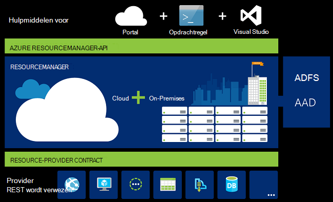
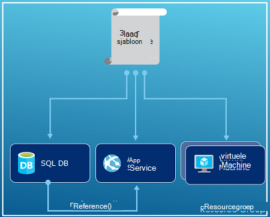
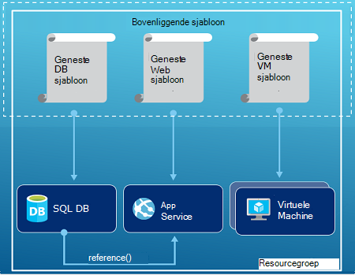
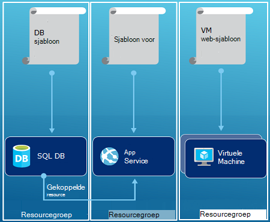

<properties
   pageTitle="Overzicht van Azure resourcemanager | Microsoft Azure"
   description="Wordt beschreven hoe Azure resourcemanager voor implementatie, beheer en toegang tot de besturing van resources op Azure."
   services="azure-resource-manager"
   documentationCenter="na"
   authors="tfitzmac"
   manager="timlt"
   editor="tysonn"/>

<tags
   ms.service="azure-resource-manager"
   ms.devlang="na"
   ms.topic="get-started-article"
   ms.tgt_pltfrm="na"
   ms.workload="na"
   ms.date="10/21/2016"
   ms.author="tomfitz"/>

# Azure resourcemanager-overzicht

De infrastructuur voor uw toepassing is meestal bestaat uit veel onderdelen – wellicht een virtuele machine, opslag-account, en virtueel netwerk, of een web-app, database, database-server en 3e partijen services. Deze onderdelen niet wordt weergegeven als afzonderlijke entiteiten, in plaats daarvan u ze zien als gerelateerde en onderling afhankelijke onderdelen van een eenheid. U wilt implementeren, beheren en deze als een groep controleren. Azure resourcemanager kunt u werken met de resources in uw oplossing als een groep. U kunt implementeren, bijwerken of verwijderen van alle resources voor uw oplossing een eenmalige, gecoördineerde betrekking heeft. Een sjabloon te gebruiken voor implementatie en die sjabloon voor verschillende omgevingen zoals testen, tijdelijke en productie kunt werken. Resourcemanager biedt beveiliging, controle en functies waarmee u uw resources beheren na implementatie labelen. 

## Terminologie

Als u nog niet eerder naar Azure resourcemanager, zijn er enkele termen die u mogelijk niet kent.

- **resource** - een beheerbare item dat beschikbaar is via Azure. Sommige algemene resources zijn een virtuele machine, opslag-account in de browser, database en virtueel netwerk, maar er zijn nog veel meer.
- **resourcegroep** - een container met verwante resources voor een Azure oplossing. De resourcegroep kunt opnemen alle bronnen voor de oplossing of alleen de bronnen die u wilt beheren als een groep. U besluit hoe u wilt dat resources toewijzen aan resourcegroepen op basis van wat het handigst voor uw organisatie. Zie [resourcegroepen](#resource-groups).
- **resource-provider** - een service die de bronnen die u kunt implementeren en te beheren via resourcemanager levert. Elke resource-provider biedt bewerkingen voor het werken met de resources die zijn geïmplementeerd. Sommige algemene resource-providers zijn Microsoft.Compute, waarop de resource VM levert, Microsoft.Storage, waarop de resource van de account opslag levert, en Microsoft.Web, die betrekking hebben op WebApps resources levert. Zie [Resource providers](#resource-providers).
- **Resourcemanager sjabloon** - A JavaScript Object Notation (JSON)-bestand die een of meer bronnen die u wilt implementeren naar een resourcegroep definieert. Deze definieert ook de afhankelijkheden tussen de geïmplementeerd resources. De sjabloon kan worden gebruikt om te implementeren van de bronnen consistente en herhaaldelijk drukken. Zie [de implementatie van de sjabloon](#template-deployment).
- **de syntaxis van de declaratieve** - syntaxis die kunt u aangeven "hier wat ik wilt maken ' zonder te hoeven schrijven van de reeks hoeft te programmeren opdrachten moet maken. De sjabloon voor de Resource Manager is een voorbeeld van de syntaxis van de declaratieve. In het bestand definieert u de eigenschappen voor de infrastructuur om te implementeren naar Azure. 

## De voordelen van het gebruik van bronbeheer

Resourcemanager biedt diverse voordelen:

- U kunt implementeren, beheren en controleren van alle resources voor uw oplossing als een groep, in plaats van deze resources afzonderlijk afhandelen.
- U kunt meerdere keren implementeren van uw oplossing gedurende de levenscyclus van ontwikkeling en betrouwbaarheid die uw resources zijn geïmplementeerd in een consistente status.
- U kunt uw infrastructuur via declaratieve sjablonen in plaats van scripts beheren.
- U kunt de afhankelijkheden tussen resources zodat ze zijn geïmplementeerd in de juiste volgorde definiëren.
- U kunt toegangsbeheer toepassen op alle services in de resourcegroep omdat Rolgebaseerd toegangsbeheer (RBAC) native geïntegreerd is in het platform management.
- U kunt labels toepassen op resources logisch ordenen alle resources in uw abonnement.
- U kunt van uw organisatie facturering verduidelijken door te bekijken van kosten voor een groep resources delen dezelfde tag.  

Resourcemanager biedt een nieuwe manier te implementeren en beheren van uw oplossingen. Als u de eerdere implementatiemodel gebruikt en wilt weten over de wijzigingen, raadpleegt u [inzicht resourcemanager implementatie- en klassieke implementatie](../resource-manager-deployment-model.md).

## Consistente management laag

Resourcemanager biedt een laag consistente management voor taken die u via Azure PowerShell, Azure CLI Azure-portal, REST API en hulpmiddelen voor de ontwikkeling uitvoeren. Alle stukken gereedschap gebruik een gemeenschappelijke set met bewerkingen. U de hulpmiddelen die het meest geschikt voor u, en deze kunnen gebruiken door elkaar zonder verwarring gebruiken. 

De volgende afbeelding ziet u hoe u alle stukken gereedschap interactie met de dezelfde Azure resourcemanager API. De API geeft aanvragen aan de Resource Manager-service, die wordt geverifieerd door en de aanvragen toestaat. Resourcemanager stuurt vervolgens de aanvragen door naar de juiste resource-providers.

## Richtlijnen

De volgende suggesties kunnen u profiteren van Resource Manager tijdens het werken met uw oplossingen.

1. Problemen definiëren en implementeren van de infrastructuur van uw tot en met de syntaxis van de declaratieve in resourcemanager sjablonen, in plaats van via dwingende opdrachten.
2. Alle stappen voor installatie en configuratie definiëren in de sjabloon. U kunt geen handmatige stappen voor het instellen van uw oplossing nodig hebt.
3. Dwingende opdrachten voor het beheren van uw bronnen, zoals starten of stoppen een app of machine uitvoeren.
4. Schik resources met de levenscyclus van dezelfde in een resourcegroep. Markeringen gebruiken voor alle andere ordenen van resources.

Zie [Aanbevolen procedures voor het maken van Azure resourcemanager sjablonen](../resource-manager-template-best-practices.md)voor meer aanbevelingen.

## Resourcegroepen

Er zijn enkele belangrijke factoren u rekening moet houden bij het definiëren van de resourcegroep:

1. Alle resources in de groep moeten de levenscyclus van dezelfde delen. U implementeren, bijwerken en verwijdert u deze samen. Als een resource, zoals een databaseserver, moet bestaan op een andere implementatie-cyclus moet zijn in een andere resourcegroep.
2. Elke resource kan alleen bestaan in één resourcegroep.
3. U kunt toevoegen of verwijderen van een resource aan een resourcegroep op elk gewenst moment.
4. U kunt een resource uit één resourcegroep verplaatsen naar een andere groep. Zie [resources naar nieuwe resourcegroep abonnement verplaatsen](../resource-group-move-resources.md)voor meer informatie.
4. Een resourcegroep kan bronnen die zich in verschillende regio's bevatten.
5. Een resourcegroep kan worden gebruikt om te bepalen van toegangsbeheer voor beheertaken.
6. Een resource kunt werken met resources in andere resourcegroepen. Deze interactie is normaal wanneer de twee resources zijn gerelateerd, maar niet de levenscyclus van dezelfde (bijvoorbeeld WebApps verbinden met een database) delen.

Wanneer u een resourcegroep maakt, moet u een locatie voor die resourcegroep. Vraagt u zich worden af, "Waarom een resourcegroep moet een locatie? En, als de resources verschillende locaties dan de resourcegroep zijn kunnen, waarom is de locatie van de groep resource van belang helemaal?" De resourcegroep slaat metagegevens over de resources. Daarom wanneer u een locatie voor de resourcegroep opgeeft, geeft u waarin die metagegevens is opgeslagen. Voor naleving redenen, is het wellicht om ervoor te zorgen dat uw gegevens worden opgeslagen in een bepaalde regio.

## Resource-providers

Elke resource-provider biedt een aantal bronnen en bewerkingen voor het werken met een Azure-service. Bijvoorbeeld als u bewaren van toetsen en geheimen wilt, werkt u met de provider van de resource **Microsoft.KeyVault** . De provider van deze resource biedt een resourcetype **kluizen** genoemd voor het maken van de belangrijkste kluis en een resourcetype **kluizen/geheimen** voor het maken van een geheim in de belangrijkste kluis genoemd. 

Voordat u aan de slag met het implementeren van uw bronnen, moet u beter inzicht van de beschikbare resource-providers. De namen van de resource providers en resources weet, kunt u bronnen die u wilt implementeren naar Azure definiëren.

U ophalen alle resource-providers met het volgende PowerShell-cmdlet:

    Get-AzureRmResourceProvider -ListAvailable

Of, met Azure CLI, u alle resource-providers met de volgende opdracht ophalen:

    azure provider list

Door de resulterende lijst kunt u zoeken voor de resource-providers die u wilt gebruiken.

Als u meer informatie over een resource-provider, de naamruimte provider opdracht toevoegen aan uw. De opdracht retourneert de ondersteunde resourcetypen voor de resource-provider, en de ondersteunde locaties en API-versies voor elk resourcetype. Het volgende PowerShell-cmdlet krijgt meer informatie over Microsoft.Compute:

    (Get-AzureRmResourceProvider -ProviderNamespace Microsoft.Compute).ResourceTypes

Of met Azure CLI, haal de ondersteunde resourcetypen, locaties en API-versies voor Microsoft.Compute, met de volgende opdracht uit:

    azure provider show Microsoft.Compute --json > c:\Azure\compute.json

Zie [resourcemanager providers, regio's, API-versies en schema's maken](../resource-manager-supported-services.md)voor meer informatie.

## Voor sjabloonimplementatie

Met resourcemanager, kunt u een sjabloon (in de indeling van JSON) die welke infrastructuur en configuratie van uw Azure-oplossing bepaalt maken. Met behulp van een sjabloon, kunt u net zo vaak de overal in de levenscyclus van de-oplossing implementeert en er betrouwbaarheid die uw resources zijn geïmplementeerd in een consistente status. Wanneer u een oplossing van de portal maakt, bevat de oplossing automatisch een implementatiesjabloon. U hoeft niet te maken van uw sjabloon maken, omdat u kunt met de sjabloon voor uw oplossing beginnen en pas deze aan uw specifieke wensen. U kunt een sjabloon voor een bestaande resourcegroep ophalen door de huidige status van de resourcegroep exporteren of de gebruikte sjabloon voor een bepaalde implementatie weergeven. Weergeven van de [sjabloon geëxporteerd](../resource-manager-export-template.md) is een handige manier voor meer informatie over de sjabloonsyntaxis van de.

Meer informatie over de opmaak van de sjabloon en de manier waarop u samenstelt, raadpleegt u [Authoring Azure resourcemanager sjablonen](../resource-group-authoring-templates.md) en [Resourcemanager sjabloon Stapsgewijze instructies](../resource-manager-template-walkthrough.md).

Resourcemanager verwerkt de sjabloon, bijvoorbeeld een andere aanvraag (Zie de afbeelding voor [consistente management laag](#consistent-management-layer)). Er parseert u de sjabloon en de syntaxis van de converteert naar REST API-bewerkingen voor de desbetreffende resource-providers. Bijvoorbeeld als resourcemanager krijgt met een sjabloon met de volgende definitie van de resource:

    "resources": [
      {
        "apiVersion": "2016-01-01",
        "type": "Microsoft.Storage/storageAccounts",
        "name": "mystorageaccount",
        "location": "westus",
        "sku": {
          "name": "Standard_LRS"
        },
        "kind": "Storage",
        "properties": {
        }
      }
      ]

De definitie wordt geconverteerd naar het volgende REST API betrekking heeft, die wordt verzonden naar de provider van de resource Microsoft.Storage:

    PUT
    https://management.azure.com/subscriptions/{subscriptionId}/resourceGroups/{resourceGroupName}/providers/Microsoft.Storage/storageAccounts/mystorageaccount?api-version=2016-01-01
    REQUEST BODY
    {
      "location": "westus",
      "properties": {
      }
      "sku": {
        "name": "Standard_LRS"
      },   
      "kind": "Storage"
    }

Hoe u sjablonen en resourcegroepen definiëren is helemaal naar u en hoe u wilt uw oplossing beheren. Bijvoorbeeld, kunt u uw toepassing drie niveaus tot en met een enkele sjabloon aan een één resourcegroep implementeren.

Maar u niet hoeft te definiëren de infrastructuur van uw hele in een enkele sjabloon. Vaak, is het handig om te delen van uw implementatievereisten voor in een reeks gerichte, doel-specifieke sjablonen. U kunt eenvoudig opnieuw gebruiken voor deze sjablonen voor verschillende oplossingen. Als u wilt een bepaalde oplossing implementeert, kunt u een basispagina sjabloon die alle vereiste sjablonen koppelingen maken. De volgende afbeelding ziet hoe u een oplossing drie niveaus tot en met een bovenliggende site-sjabloon met drie geneste sjablonen implementeren.

Als u voor de levenscyclus van afzonderlijke met lagen ogen hebt, kunt u de drie lagen om te scheiden resourcegroepen implementeren. Zoals u ziet dat de resources kunnen nog steeds worden gekoppeld aan resources in andere resourcegroepen.

Zie voor meer suggesties over het ontwerpen van uw sjablonen, [patronen voor het ontwerpen van Azure resourcemanager sjablonen](../best-practices-resource-manager-design-templates.md). Zie [gekoppelde sjablonen met Azure Resource Manager gebruiken](../resource-group-linked-templates.md)voor informatie over geneste sjablonen.

Azure resourcemanager analyseert afhankelijkheden om ervoor te zorgen resources worden gemaakt in de juiste volgorde. Als een resource is afhankelijk van een waarde uit een andere resource (zoals een virtuele machine dat u een account opslagruimte nodig hebt voor schijven), kunt u een afhankelijkheid instellen. Zie [definiëren afhankelijkheden in Azure resourcemanager sjablonen](../resource-group-define-dependencies.md)voor meer informatie.

U kunt ook de sjabloon gebruiken voor updates voor de infrastructuur. U kunt bijvoorbeeld een resource toevoegen aan uw oplossing en van configuratieregels voor de resources die al zijn geïmplementeerd toevoegen. Als de sjabloon maken van een resource, maar dat er bestaat al een resource, kunt u een update in plaats van het maken van een nieuw activum Azure resourcemanager uitvoeren. Deze worden als nieuwe, Azure resourcemanager het bestaande activum bijgewerkt naar dezelfde staat.  

Resourcemanager biedt uitbreidingen voor scenario's als u extra bewerkingen zoals het installeren van bepaalde software die niet is opgenomen in de instellingen nodig hebt. Als u al een configuratie management-service, zoals DSC, Chef of Puppet, kunt u verder werken met deze service met behulp van extensions. Zie voor informatie over VM uitbreidingen [over VM extensies en functies](../virtual-machines/virtual-machines-windows-extensions-features.md). 

De sjabloon wordt ten slotte deel van de broncode voor de app. U kunt inchecken naar uw bibliotheek van de code bron en werk deze volgens uw app ontwikkeld. U kunt de sjabloon door Visual Studio bewerken.

Na het definiëren van de sjabloon, bent u gereed om te implementeren van de bronnen aan Azure. Voor de opdrachten voor het implementeren van de bronnen, raadpleegt u:

- [Resources met resourcemanager sjablonen en Azure PowerShell implementeren](../resource-group-template-deploy.md)
- [Resources met resourcemanager sjablonen en Azure CLI implementeren](../resource-group-template-deploy-cli.md)
- [Resources met resourcemanager sjablonen en Azure portal implementeren](../resource-group-template-deploy-portal.md)
- [Resources met resourcemanager sjablonen en resourcemanager REST API implementeren](../resource-group-template-deploy-rest.md)

## Labels

Resourcemanager bevat een sociaalnetwerklabels functie waarmee u kunt resources op basis van uw vereisten voor het beheren van of facturering indelen. Markeringen gebruiken wanneer u een complexe verzameling resourcegroepen en resources hebben en moet deze activa in de manier waarop u het handigst visualiseren. U kunt bijvoorbeeld resources die een vergelijkbare rol dienen in uw organisatie of deel uitmaakt van dezelfde afdeling labelen. Zonder labels, kunnen gebruikers in uw organisatie maken van meerdere resources die mogelijk moeilijk later identificeren en beheren. U wilt bijvoorbeeld alle bronnen voor een bepaald project verwijderen. Als deze resources worden niet gecodeerd voor het project, die u moet deze handmatig te vinden. Labelen is een belangrijke manier om onnodige kosten van uw abonnement te verlagen. 

Resources hoeft niet te bevinden zich in dezelfde resourcegroep delen van een tag. U kunt uw eigen taxonomie tag om ervoor te zorgen dat alle gebruikers in uw organisatie veelgebruikte codes in plaats van gebruikers per ongeluk toepassen iets anders tags (zoals "afdeling" in plaats van "afdeling") gebruiken.

Het volgende voorbeeld ziet u een tag toegepast op een virtuele machine.

    "resources": [    
      {
        "type": "Microsoft.Compute/virtualMachines",
        "apiVersion": "2015-06-15",
        "name": "SimpleWindowsVM",
        "location": "[resourceGroup().location]",
        "tags": {
            "costCenter": "Finance"
        },
        ...
      }
    ]

Als u wilt ophalen alle resources met de tagwaarde van een, gebruikt u het volgende PowerShell-cmdlet:

    Find-AzureRmResource -TagName costCenter -TagValue Finance

Of de volgende opdracht uit Azure CLI:

    azure resource list -t costCenter=Finance --json

U kunt ook gelabelde bronnen via de portal van Azure weergeven.

Het [Gebruiksrapport](../billing/billing-understand-your-bill.md) voor uw abonnement bevat tagnamen en waarden, waarmee u kosten ingedeeld door tags. Zie voor meer informatie over de labels, [werken met tags ordenen van uw Azure resources](../resource-group-using-tags.md).

## Toegangsbeheer

Resourcemanager kunt u om te bepalen wie toegang tot bepaalde acties voor uw organisatie heeft. Standaard Rolgebaseerd toegangsbeheer (RBAC) geïntegreerd met het platform management en die toegangsbeheer is van toepassing op alle services in de resourcegroep. 

Er zijn twee belangrijke concepten te begrijpen als u werkt met Rolgebaseerd toegangsbeheer:

- Roldefinities - beschrijven van een set machtigingen en kan worden gebruikt in veel toewijzingen.
- Een definitie voor een identiteit (gebruiker of groep) koppelen roltoewijzingen - voor een bepaald bereik (abonnement, resourcegroep of resource). De toewijzing wordt overgenomen door lagere bereiken.

U kunt gebruikers toevoegen aan de vooraf gedefinieerde platform- en resource / regiospecifieke rollen. Bijvoorbeeld: u kunt profiteren van de vooraf gedefinieerde rol genaamd lezer waarmee gebruikers resources weergeven, maar deze niet wordt gewijzigd. U gebruikers in uw organisatie die dit type toegang tot de rol van de lezer toevoegen en de rol van toepassing op het abonnement, resourcegroep of resource.

Azure biedt de volgende vier platform rollen:

1.  Eigenaar - kunt alles, inclusief toegang beheren
2.  Inzender - kunt alles behalve access beheren
3.  Lezer - alles kunt weergeven, maar geen wijzigingen aanbrengen
4.  Gebruikersbeheerder voor Access - kunt gebruikerstoegang tot Azure resources beheren

Azure bevat ook diverse resource / regiospecifieke rollen. Sommige meest gangbare zijn:

1.  VM Inzender - virtuele machines kunt beheren, maar niet verlenen toegang tot deze en niet het virtuele netwerk of opslag account waarop deze zijn aangesloten beheren
2.  Netwerk Inzender - alle netwerk resources beheren, maar geen toegang verlenen tot deze
3.  Opslag Account Inzender - opslag accounts beheren, maar geen toegang verlenen tot deze
4. SQL Server Inzender - kunt SQL-servers en databases, maar niet hun-beveiliging beleid beheren
5. Website Inzender - kunt websites, maar niet de web-abonnementen waarop deze zijn aangesloten beheren

Zie voor de volledige lijst met functies en toegestane acties, [RBAC: rollen ingebouwd](../active-directory/role-based-access-built-in-roles.md). Zie voor meer informatie over Rolgebaseerd toegangsbeheer, [Azure Rolgebaseerd toegangsbeheer](../active-directory/role-based-access-control-configure.md). 

U wilt uitvoeren code of script die toegang heeft tot resources in sommige gevallen, maar u niet wilt uitvoeren onder de referenties van een gebruiker. In plaats daarvan wilt u maken van een identiteit een service voor de toepassing principal genoemd en de juiste rol voor de service principal toewijzen. Resourcemanager kunt u referenties voor de toepassing maken en de toepassing via programmacode wordt geverifieerd. Voor meer informatie over het maken van principes van de service, raadpleegt u een van de volgende onderwerpen:

- [Azure PowerShell gebruiken om te maken van een service principal voor toegang tot bronnen](../resource-group-authenticate-service-principal.md)
- [Azure CLI gebruiken om te maken van een service principal voor toegang tot bronnen](../resource-group-authenticate-service-principal-cli.md)
- [Portal gebruiken om Active Directory-toepassing en service principal die toegang bronnen tot te maken](../resource-group-create-service-principal-portal.md)

U kunt ook expliciet kritieke resources om te voorkomen dat gebruikers verwijderen of wijzigen van deze bestanden vergrendelen. Zie [vergrendelen resources met Azure resourcemanager](../resource-group-lock-resources.md)voor meer informatie.

## Activiteitenlogboeken

Resourcemanager Logboeken alle bewerkingen die maken, wijzigen of verwijderen van een resource. Om te zoeken van een fout bij het oplossen van of om te controleren hoe een gebruiker in uw organisatie een resource gewijzigd, kunt u de activiteitenlogboeken aan de gebruiken. Als u wilt de logboeken wordt weergegeven, selecteert u **Logboeken aan de activiteit** in het blad **Instellingen** voor een resourcegroep. U kunt de logboeken filteren op veel verschillende waarden, inclusief welke gebruiker de bewerking gestart. Zie voor informatie over het werken met de activiteitenlogboeken aan de [controle bewerkingen met bronbeheer](../resource-group-audit.md).

## Aangepaste machtigingen

Resourcemanager kunt u aangepaste machtigingen voor het beheren van uw resources maken. De soorten beleid, dat u kunnen verschillende scenario's opnemen. U kunt een naamgevingsconventie op resources, beperken welke typen en exemplaren van resources kan worden geïmplementeerd of beperken welke regio's een type resource kunnen hosten afdwingen. U kunt de tagwaarde van een op bronnen die u wilt organiseren facturering per afdelingen vereisen. U maken beleid om verlagen en consistentie van uw abonnement te. 

U beleid met JSON definiëren en pas de beleid over uw abonnement of binnen een resourcegroep. Beleid is anders dan het Rolgebaseerd toegangsbeheer omdat ze zijn toegepast op resourcetypen.

Het volgende voorbeeld ziet u een beleid die ervoor zorgt consistentie van de tag dat door op te geven die alle resources een tag costCenter bevat.

    {
      "if": {
        "not" : {
          "field" : "tags",
          "containsKey" : "costCenter"
        }
      },
      "then" : {
        "effect" : "deny"
      }
    }

Er zijn veel meer soorten beleidsregels die u kunt maken. Zie [Beleid voor het beheren van resources en toegang](../resource-manager-policy.md)voor meer informatie.

## SDK 's

Azure SDK's zijn beschikbaar voor meerdere talen en platforms.
Elke taal implementatie is beschikbaar via het systeem package manager en GitHub.

De code in elk van deze SDK's is gegenereerd op basis van Azure RESTful API specificaties.
Deze specificaties zijn bron openen en op basis van de Swagger 2.0-specificatie.
De code SDK wordt gegenereerd via een open source project AutoRest genoemd.
AutoRest Hiermee transformeert u deze RESTful API-specificaties in clientbibliotheken in meerdere talen.
Als u wilt verbeteren aspecten van de gegenereerde code in de SDK's, zijn de gehele set hulpmiddelen voor het maken van de SDK's openen, gratis en op basis van een schaal aangenomen API specificatie notatie.

Hier vindt u onze opslagplaatsen Open bron SDK. We feedback, problemen, Welkom en aanvragen halen.

[.NET](https://github.com/Azure/azure-sdk-for-net) | [Java](https://github.com/Azure/azure-sdk-for-java) | [Node.js](https://github.com/Azure/azure-sdk-for-node) | [PHP](https://github.com/Azure/azure-sdk-for-php) | [Python](https://github.com/Azure/azure-sdk-for-python) | [Ruby](https://github.com/Azure/azure-sdk-ruby)

> [AZURE.NOTE]Als de SDK niet de vereiste functionaliteit, kunt u ook de [Azure REST API](https://msdn.microsoft.com/library/azure/dn790568.aspx) rechtstreeks bellen.

## Voorbeelden

### .NET

- [Azure resources en resourcegroepen beheren](https://azure.microsoft.com/documentation/samples/resource-manager-dotnet-resources-and-groups/)
- [Een SSH implementeren VM ingeschakeld met een sjabloon](https://azure.microsoft.com/documentation/samples/resource-manager-dotnet-template-deployment/)

### Java

- [Azure resources beheren](https://azure.microsoft.com/documentation/samples/resources-java-manage-resource/)
- [Azure resourcegroepen beheren](https://azure.microsoft.com/documentation/samples/resources-java-manage-resource-group/)
- [Een SSH implementeren VM ingeschakeld met een sjabloon](https://azure.microsoft.com/documentation/samples/resources-java-deploy-using-arm-template/)

### Node.js

- [Azure resources en resourcegroepen beheren](https://azure.microsoft.com/documentation/samples/resource-manager-node-resources-and-groups/)
- [Een SSH implementeren VM ingeschakeld met een sjabloon](https://azure.microsoft.com/documentation/samples/resource-manager-node-template-deployment/)

### Python

- [Azure resources en resourcegroepen beheren](https://azure.microsoft.com/documentation/samples/resource-manager-python-resources-and-groups/)
- [Een SSH implementeren VM ingeschakeld met een sjabloon](https://azure.microsoft.com/documentation/samples/resource-manager-python-template-deployment/)

### Ruby

- [Azure resources en resourcegroepen beheren](https://azure.microsoft.com/documentation/samples/resource-manager-ruby-resources-and-groups/)
- [Een SSH implementeren VM ingeschakeld met een sjabloon](https://azure.microsoft.com/documentation/samples/resource-manager-ruby-template-deployment/)

Naast deze voorbeelden, kunt u zoeken via de galerie met voorbeelden.

[.NET](https://azure.microsoft.com/documentation/samples/?service=azure-resource-manager&platform=dotnet) | [Java](https://azure.microsoft.com/documentation/samples/?service=azure-resource-manager&platform=java) | [Node.js](https://azure.microsoft.com/documentation/samples/?service=azure-resource-manager&platform=nodejs) | [Python](https://azure.microsoft.com/documentation/samples/?service=azure-resource-manager&platform=python) | [Ruby](https://azure.microsoft.com/documentation/samples/?service=azure-resource-manager&platform=ruby)

## Volgende stappen

- Voor een eenvoudige introductie over het werken met sjablonen, raadpleegt u [een sjabloon Azure resourcemanager aan de bestaande bronnen exporteren](../resource-manager-export-template.md).
- Zie voor meer uitgebreide stapsgewijze instructies voor het maken van een sjabloon, [Resourcemanager sjabloon Stapsgewijze instructies](../resource-manager-template-walkthrough.md).
- Als u wilt weten over de functies die u in een sjabloon gebruiken kunt, raadpleegt u de [sjabloon functies](../resource-group-template-functions.md)
- Zie voor informatie over het gebruik van Visual Studio met resourcemanager [maken en implementeren van Azure resourcegroepen tot en met Visual Studio](../vs-azure-tools-resource-groups-deployment-projects-create-deploy.md).
- Zie [werken met Azure resourcemanager sjablonen in Visual Studio-Code](../resource-manager-vs-code.md)voor informatie over het gebruik van VS Code met bronbeheer.

Hier volgt een videodemonstratie over dit overzicht:

[AZURE.VIDEO azure-resource-manager-overview]

[powershellref]: https://msdn.microsoft.com/library/azure/dn757692(v=azure.200).aspx
