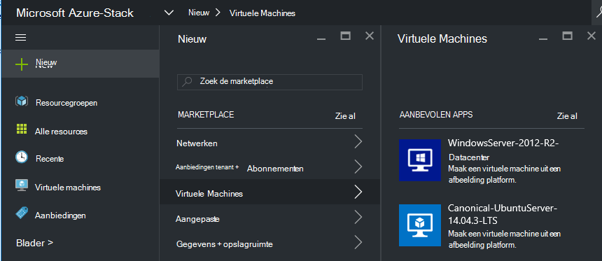
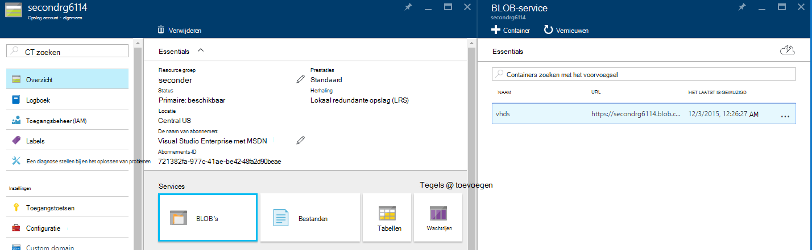
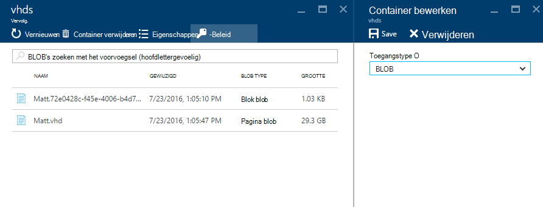
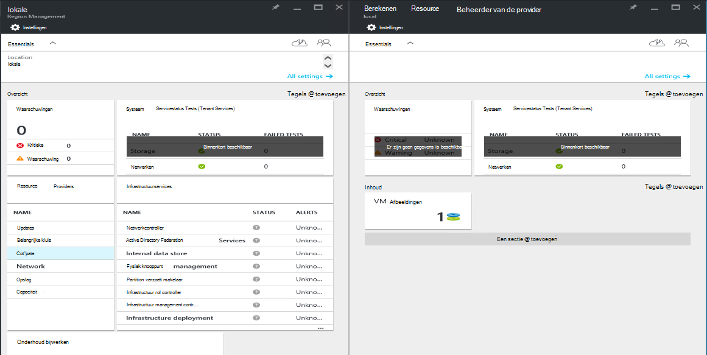
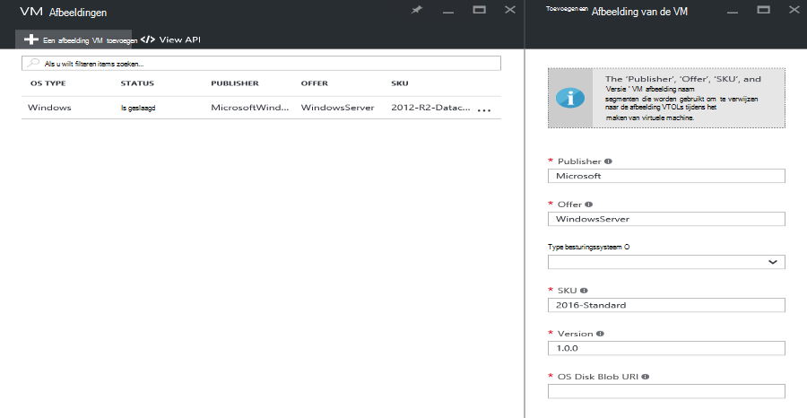

<properties
    pageTitle="Een afbeelding VM toevoegen aan de stapel Azure | Microsoft Azure"
    description="Toevoegen van uw organisatie aangepaste Windows of Linux VM afbeelding voor tenants gebruiken"
    services="azure-stack"
    documentationCenter=""
    authors="mattmcg"
    manager="darmour"
    editor=""/>

<tags
    ms.service="azure-stack"
    ms.workload="na"
    ms.tgt_pltfrm="na"
    ms.devlang="na"
    ms.topic="get-started-article"
    ms.date="09/26/2016"
    ms.author="mattmcg"/>

# <a name="make-a-custom-virtual-machine-image-available-in-azure-stack"></a>Afbeelding van een aangepaste VM beschikbaar maken in Azure-Stack


Azure stapel kan beheerders VM afbeeldingen, zoals aangepaste VHD van hun organisatie beschikbaar maken voor hun tenants. Afbeeldingen kunnen worden waarnaar wordt verwezen door Azure resourcemanager sjablonen of toegevoegd aan de gebruikersinterface van Azure Marketplace met het maken van een item Marketplace. Afbeelding van een Windows Server 2012 R2 wordt opgenomen in de technische bètaversie van Azure stapel standaard.

> [AZURE.NOTE] VM-afbeeldingen met Marketplace items kunnen worden geïmplementeerd door **Nieuw** te selecteren in de gebruikersinterface, en selecteer de categorie **virtuele Machines** . De items van de afbeelding VM worden vermeld.


## <a name="add-a-vm-image-to-marketplace-with-powershell"></a>Een afbeelding VM toevoegen aan Marketplace met PowerShell

Als de afbeelding VM VHD lokaal op de console VM (of een ander extern verbonden apparaat) beschikbaar is, gebruikt u de volgende stappen uit:

1. Een Windows- of Linux-besturingssysteem virtuele harde schijf afbeelding in VHD-indeling (niet VHDX) voorbereiden.
    -   Voor Windows-installatiekopieën bevat het artikel [uploaden van een afbeelding met een VM van Windows Azure voor resourcemanager implementaties](virtual-machines-windows-upload-image.md) afbeelding voorbereiding van instructies in de sectie **voorbereiden de VHD voor uploaden** .
    -   Volg de instructies voor het voorbereiden van de afbeelding of een bestaande Azure stapel Linux-afbeelding gebruiken zoals beschreven in het artikel [implementeren Linux virtuele machines op Azure-Stack](azure-stack-linux.md)voor Linux afbeeldingen.

2. De [Hulpmiddelen voor Azure-Stack opslagplaats](https://aka.ms/azurestackaddvmimage)klonen en importeer de module **ComputeAdmin**

    ```powershell
    Import-Module .\ComputeAdmin\AzureStack.ComputeAdmin.psm1
    ```

3. De afbeelding VM door aan te roepen de cmdlet toevoegen-VMImage toevoegen.
    -  De uitgever, aanbieding, SKU en versie voor de afbeelding VM opnemen. Deze parameters worden gebruikt door resourcemanager Azure-sjablonen die verwijzen naar de afbeelding VM.
    -  Geef waardereeksen als Windows of Linux.
    -  Opnemen van uw Azure Active Directory-tenant-ID in het formulier * &lt;myaadtenant&gt;*. onmicrosoft.com.
    - Hier volgt een voorbeeld-aanroep van het script:

    ```powershell
       Add-VMImage -publisher "Canonical" -offer "UbuntuServer" -sku "14.04.3-LTS" -version "1.0.0" -osType Linux -osDiskLocalPath 'C:\Users\AzureStackAdmin\Desktop\UbuntuServer.vhd' -tenantID <myaadtenant>.onmicrosoft.com
    ```

    > [AZURE.NOTE] De cmdlet vraagt om referenties voor het toevoegen van de afbeelding VM. Referenties van de beheerder van de Azure Active Directory, zoals serviceadmin@ * &lt;myaadtenant&gt;*. onmicrosoft.com, op de vraag.  

De opdracht gebeurt het volgende:
- Wordt geverifieerd bij de stapel Azure-omgeving
- De lokale VHD uploadt naar een nieuw gemaakte tijdelijke opslag-account
- Telt de VM-afbeelding naar de bibliotheek van de afbeelding VM
- Hiermee maakt u een item Marketplace

Controleer of de opdracht is uitgevoerd, gaat u naar marktplaats in de portal en controleer of de afbeelding VM is beschikbaar in de categorie **virtuele Machines** .

> 

Hier volgt een beschrijving van de opdrachtparameters.


| Parameter | Beschrijving |
|----------| ------------ |
|**tenantID** | Uw Azure Active Directory-tenant-ID in het formulier * &lt;AADTenantID*. onmicrosoft.com&gt;. |
|**Publisher** | Het publisher-naam-segment van de afbeelding van het VM die tenants gebruiken bij het distribueren van de afbeelding. Een voorbeeld is 'Microsoft'. Neem een spatie of andere speciale tekens niet in dit veld.|
|**aanbieding** | De aanbieding naam segment van de afbeelding van het VM die tenants gebruiken bij het distribueren van de afbeelding VM. Een voorbeeld is 'WindowsServer'. Neem een spatie of andere speciale tekens niet in dit veld. |
| **SKU** | Het segment in naam van het SKU van de afbeelding van het VM die tenants gebruiken bij het distribueren van de afbeelding VM. Een voorbeeld is 'Datacenter2016'. Neem een spatie of andere speciale tekens niet in dit veld. |
|**Versie** | De versie van de afbeelding van het VM die tenants gebruiken bij het distribueren van de afbeelding VM. Deze versie is in de indeling * \#.\#. \#*. Een voorbeeld is '1.0.0'. Neem een spatie of andere speciale tekens niet in dit veld.|
| **waardereeksen** | De waardereeksen van de afbeelding moet 'Windows' of 'Linux'. |
|**osDiskLocalPath** | Het lokale pad naar de schijf OS VHD die u als een afbeelding met een VM Azure stapel wilt uploaden. |
|**dataDiskLocalPaths**| Een optioneel matrix van de lokale paden voor gegevensschijven die als onderdeel van de afbeelding VM kunnen worden geüpload.|
|**CreateGalleryItem**| Een Boole-vlag die bepaalt of een item maakt in Marketplace. Standaard is ingesteld op waar.|
|**titel**| De weergavenaam van Marketplace-item. Standaard is ingesteld als de Publisher-aanbieding-Sku van de afbeelding VM.|
|**Beschrijving**| De beschrijving van het item Marketplace. |
|**osDiskBlobURI**| Dit script accepteert desgewenst ook een blobopslag URI voor osDisk.|
|**dataDiskBlobURIs**| Dit script accepteert desgewenst ook een matrix van blobopslag URI's voor gegevensschijven naar de afbeelding toe te voegen.|


## <a name="add-a-vm-image-through-the-portal"></a>Een VM toevoegen via de portal

> [AZURE.NOTE] Deze methode moet het item Marketplace afzonderlijk maken.

Een vereiste van afbeeldingen is dat kan worden verwezen door een blobopslag URI. Een Windows- of Linux-besturingssysteem virtuele harde schijf afbeelding in VHD-indeling (niet VHDX) voorbereiden en vervolgens de afbeelding uploaden naar een account opslagruimte in Azure wordt aangegeven of Azure gestapelde. Als uw afbeelding al is geüpload met Blob storage in Azure of Azure stapel, kunt u deze stap overslaan.

Volg de stappen van artikel over [uploaden van een afbeelding met een VM van Windows Azure voor resourcemanager implementaties](https://azure.microsoft.com/documentation/articles/virtual-machines-windows-upload-image/) tot en met het **uploaden van de afbeelding VM bij uw account opslag**. Houd rekening met de volgende:

-   Volg de instructies voor het voorbereiden van de afbeelding of een bestaande Azure stapel Linux-afbeelding gebruiken zoals beschreven in het artikel [implementeren Linux virtuele machines op Azure-Stack](azure-stack-linux.md)voor een afbeelding Linux.

- Efficiënter voor het uploaden van een afbeelding met Azure stapel blobopslag dan met Azure-blobopslag omdat er minder tijd om de afbeelding VM naar de bibliotheek van de afbeelding van de Azure stapel nodig is. Zorg dat u vervangt door de [PowerShell verifiëren met Microsoft Azure stapel](azure-stack-deploy-template-powershell.md) stap voor de stap 'Meld u aan bij Azure' tijdens de upload-instructies te volgen.

- Noteer de blobopslag URI waarnaar u de afbeelding uploaden. Deze heeft de volgende indeling: * &lt;storageAccount&gt;/&lt;blobContainer&gt;/&lt;targetVHDName&gt;*VHD

2.  De blob anoniem als toegankelijk wilt maken, gaat u naar de container opslag account blob waar de afbeelding VM VHD is geüpload naar **Blob,** en selecteer **-Beleid**. Als u wilt, kunt u in plaats daarvan de handtekening van een gedeelde toegang voor de container genereren en opnemen als onderdeel van de blob URI.





1.  Meld u als beheerder aan bij Azure stapel. Ga naar **regio Management**. Schakel onder **RPs**, **Resource-Provider berekenen** > **VM afbeeldingen** > **toevoegen.**

    

2.  Voer op het volgende blad, de uitgever, aanbieding, SKU en versie van de afbeelding VM. Deze segmenten naam verwijzen naar de afbeelding VM in resourcemanager Azure-sjablonen. Zorg ervoor dat de **waardereeksen** correct. Voer voor **osDiskBlobURI**, de URI waar de afbeelding is geüpload in stap 1. Klik op **maken** om te beginnen met het maken van de afbeelding VM.

    

3.  De status van de afbeelding van de VM verandert in 'Geslaagd' wanneer de afbeelding is toegevoegd.

4.  Tenants kunnen implementeren van de afbeelding VM door het opgeven van de uitgever, aanbieding, SKU en versie van de afbeelding VM in een resourcemanager Azure-sjabloon. Als u de afbeelding VM vaker beschikbaar is voor gebruik van de tenant in de gebruikersinterface, is het raadzaam [een Marketplace-item maken](azure-stack-create-and-publish-marketplace-item.md).
