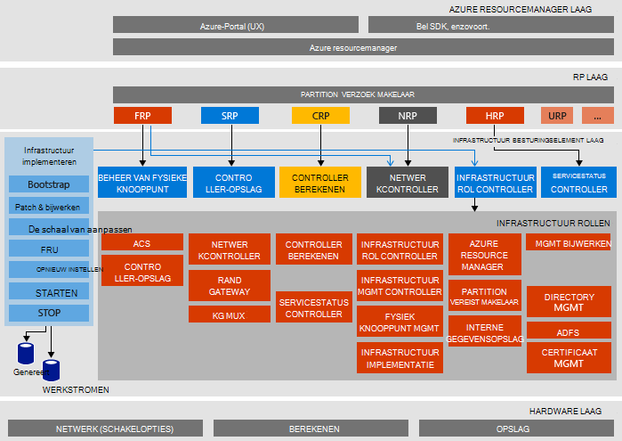

<properties
    pageTitle="Microsoft Azure stapel bewijs van Concept (Haalbaarheidstest) architectuur | Microsoft Azure"
    description="De architectuur van Microsoft Azure stapel Haalbaarheidstest weergeven."
    services="azure-stack"
    documentationCenter=""
    authors="heathl17"
    manager="byronr"
    editor=""/>

<tags
    ms.service="azure-stack"
    ms.workload="na"
    ms.tgt_pltfrm="na"
    ms.devlang="na"
    ms.topic="article"
    ms.date="10/25/2016"
    ms.author="helaw"/>

# Microsoft Azure stapel Haalbaarheidstest architectuur

De Azure stapel Haalbaarheidstest is een een-knooppunt-implementatie van Azure stapel Technical Preview 2. Alle onderdelen zijn geïnstalleerd in de virtuele machines op een computer één host. 

## Architectuurdiagram van de logische
In het volgende diagram ziet u de logische architectuur van de Azure stapel Haalbaarheidstest en de onderdelen.

## VM rollen
De Azure stapel Haalbaarheidstest biedt services met behulp van de volgende VMs op de Haalbaarheidstest-host:

 - **MAS-ACS01** VM Azure stapel opslag hostingservices.

 - **MAS-ADFS01** VM hostingprovider Active Directory Federation Services.  Deze virtuele machine wordt niet gebruikt in Technical Preview-2.  

 - **MAS-ASQL01**  VM waarin u een interne gegevensopslag voor Azure stapel infrastructuur rollen.  

 - **MAS-BGPNAT01** VM fungeert als edge router, alsmede detailinformatie NAT en VPN mogelijkheden voor Azure stapel.

 - **MAS-CA01** VM certificate authority services voor Azure stapel rolservices leveren.

 - **MAS-CON01** VM is beschikbaar voor ontwikkelaars voor de installatie van PowerShell, Visual Studio en andere hulpmiddelen.

 - **MAS-DC01** VM Active Directory, DNS en DHCP hostingservices voor Microsoft Azure Stack.

 - **MAS-GWY01** VM leveren edge gatewayservices zoals VPN naar website verbindingen voor de tenant-netwerken te gebruiken.

 - **MAS-NC01**  VM hostingprovider netwerkcontroller, die worden beheerd Azure stapel netwerkservices.  

 - **MAS-SLB01**  VM biedt taakverdeling services Azure gestapelde voor zowel tenants en Azure stapel infrastructuurservices.  

 - **MAS-SUS01**  Virtuele machines hostingprovider van Windows Server Update Services en die verantwoordelijk is voor het leveren van updates voor andere stapel Azure virtuele machines.

 - **MAS-WAS01**  VM hostingprovider portal en Azure resourcemanager services.

 - **MAS-XRP01** VM waarop de core resource providers van Microsoft Azure stapel, met inbegrip van de resource berekeningscluster-, netwerk- en opslag providers.

## Opslagservices
Opslagservices in het besturingssysteem op de fysieke host opnemen:

 - **ACS Blob-Service** Azure consistente opslag Blob service, waarmee blob en tabel storage-services.

 - **SoFS** Schalen bestandsserver.

 - **Referenties CSV** Robuuste bestand systeem Cluster gedeeld Volume.

 - **Virtuele schijf**, **Opslagruimte**en **Opslag spaties directe** zijn de bijbehorende onderliggende opslagtechnologie in Windows Server voor het inschakelen van de resource-provider van Microsoft Azure stapel core opslag.

## Volgende stappen

[Azure stapel implementeren](azure-stack-deploy.md)

[Eerste scenario's om te proberen](azure-stack-first-scenarios.md)

