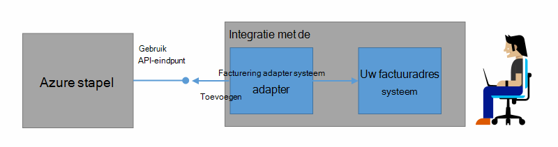

<properties
    pageTitle="Klant facturering en financiële Azure gestapelde | Microsoft Azure"
    description="Informatie over het ophalen van informatie over het gebruik van de resource van Azure stapel."
    services="azure-stack"
    documentationCenter=""
    authors="AlfredoPizzirani"
    manager="byronr"
    editor=""/>

<tags
    ms.service="azure-stack"
    ms.workload="na"
    ms.tgt_pltfrm="na"
    ms.devlang="na"
    ms.topic="article"
    ms.date="10/18/2016"
    ms.author="alfredop"/>

# Klant facturering en financiële Azure gestapelde

Nu dat u de stapel Azure gebruikt, is dit is een goed idee om na te denken over het gebruik bij te houden. Serviceproviders, is afhankelijk van informatie over het gebruik om hun facturen en voor meer informatie over de kosten aan te bieden services.
Ondernemingen, te, bijhouden meestal gebruik per afdeling.

Azure stapel is niet een factureringsbeheerder systeem. Deze schrijven niets van uw tenants voor de resources die ze gebruiken. Maar Azure stapel beschikt over de infrastructuur voor het verzamelen en gegevens over zoekgebruik aggregeren voor elke één resource-provider. U kunt deze gegevens exporteren naar een factureringsbeheerder systeem met behulp van een factureringsbeheerder adapter en exporteren naar een business intelligence hulpmiddel zoals Microsoft Power BI.

## Welke informatie over het gebruik kan ik vinden, en hoe?

Azure stapel resource providers genereren gebruik records per uur tijdsintervallen. De records weergegeven het bedrag van elke resource die verbruikte en welk abonnement verbruikt de resource. Deze gegevens worden opgeslagen. U kunt de gegevens via de REST API openen.

Een service-beheerder kunt ophalen gebruiksgegevens voor alle abonnementen van de tenant. Afzonderlijke tenants kunnen alleen hun eigen informatie ophalen.

Gebruik records bevatten informatie over de opslag, netwerk en het gebruik van de berekeningscluster. Zie voor een lijst met meters, [in dit artikel](azure-stack-usage-related-faq.md).

## Informatie over het gebruik ophalen

Als u wilt genereren records, is het essentieel dat er resources uitgevoerd en het systeem actief gebruikt. Als u niet zeker weet of u hebt er resources is uitgevoerd, implementeren in Azure stapel Marketplace en voer vervolgens een virtuele machine (VM). Kennismaking met de VM blade controleren om te controleren of deze actief.

Het is raadzaam om Windows PowerShell-cmdlets als u wilt weergeven van gegevens over zoekgebruik uit te voeren.
PowerShell oproepen de API's het gebruik van de Resource.

1.  [Installeren en configureren van Azure PowerShell](https://azure.microsoft.com/en-us/documentation/articles/powershell-install-configure/).

2.  Als u zich aanmeldt naar Azure resourcemanager, gebruikt u de PowerShell-cmdlet **Login-AzureRmAccount**.

3.  Als u wilt het abonnement dat u gebruikt om te maken van resources selecteren, typt u **Get-AzureRmSubscription – SubscriptionName 'uw sub' | Selecteer AzureRmSubscription**.

4.  Als u wilt de gegevens ophaalt, gebruikt u de PowerShell-cmdlet [**Get-UsageAggregates**](https://msdn.microsoft.com/en-us/library/mt619285.aspx).
    Als gegevens over zoekgebruik beschikbaar is, wordt deze geretourneerd in PowerShell, zoals in het volgende voorbeeld. PowerShell retourneert 1000 tekstregels gebruik per gesprek.
    U kunt het argument *voortgezet* gebruiken om op te halen sets met regels na de eerste 1000. Voor meer informatie over gegevens over zoekgebruik, raadpleegt u [Resource gebruik API verwijzing](azure-stack-provider-resource-api.md).

    

## Volgende stappen

[Resourcegebruik provider API](azure-stack-provider-resource-api.md)

[Resourcegebruik API tenant](azure-stack-tenant-resource-usage-api.md)

[Veelgestelde vragen over het gebruik betrekking](azure-stack-usage-related-faq.md)
