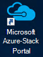
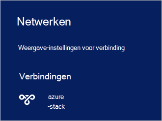

<properties
    pageTitle="Verbinding maken met Azure stapel | Microsoft Azure"
    description="Informatie over het verbinden van Azure-Stack"
    services="azure-stack"
    documentationCenter=""
    authors="ErikjeMS"
    manager="byronr"
    editor=""/>

<tags
    ms.service="azure-stack"
    ms.workload="na"
    ms.tgt_pltfrm="na"
    ms.devlang="na"
    ms.topic="get-started-article"
    ms.date="10/18/2016"
    ms.author="erikje"/>

# <a name="connect-to-azure-stack"></a>Verbinding maken met Azure stapel
Als u wilt resources beheren, moet u verbinding maken met de computer Azure stapel Haalbaarheidstest. U kunt een van de volgende opties:

 - Extern bureaublad: kunt u één gelijktijdige gebruiker snel contact te maken van de computer Haalbaarheidstest.
 - VPN (VPN): kunt meerdere gebruikers tegelijk verbinding maken van klanten buiten de stapel Azure-infrastructuur (hiervoor configuratie).

## <a name="connect-with-remote-desktop"></a>Verbinding met extern bureaublad
Als u één gelijktijdige gebruiker kan een verbinding met extern bureaublad werken met de portal voor het beheren van resources. U kunt ook extra op de MAS CON01 virtuele machine.

1.  Meld u aan bij de fysieke machine Azure stapel Haalbaarheidstest.

2.  Open een verbinding met extern bureaublad en verbinding maken met MAS-CON01. Voer **AzureStack\AzureStackAdmin** als de gebruikersnaam en het administratieve wachtwoord dat u tijdens de installatie van Azure stapel hebt opgegeven.  

3.  Dubbelklik op het bureaublad MAS-CON01, op **Microsoft Azure stapel Portal** pictogram (https://portal.azurestack.local/) om te openen van de [portal](azure-stack-key-features.md#portal).

    

4.  Meld u aan de opgegeven tijdens de installatie van Azure Active Directory-referenties gebruikt.

## <a name="connect-with-vpn"></a>Verbinding maken met VPN
Virtual Private Network connections kunnen meerdere gebruikers tegelijk verbinding maken van klanten buiten de infrastructuur van Azure stapel. U kunt de portal gebruiken voor het beheren van resources. U kunt ook hulpprogramma's, zoals Visual Studio en PowerShell gebruiken op uw lokale client.

1.  Installeer de module AzureRM met behulp van de volgende opdracht uit:
   
    ```PowerShell
    Install-Module -Name AzureRm -RequiredVersion 1.2.6 -Scope CurrentUser
    ```   
   
2. Download de scripts Azure stapel hulpmiddelen.  Deze bestanden kunnen worden gedownload door te bladeren naar de [bibliotheek GitHub](https://github.com/Azure/AzureStack-Tools), of de volgende Windows PowerShell-script uitvoeren als beheerder ondersteuning:
    
    >[AZURE.NOTE]  De volgende stappen moet PowerShell 5.0.  Als u wilt controleren of uw versie, $PSVersionTable.PSVersion uitvoeren en de "" hoofdversie vergelijken.  

    ```PowerShell
       
       #Download the tools archive
       invoke-webrequest https://github.com/Azure/AzureStack-Tools/archive/master.zip -OutFile master.zip

       #Expand the downloaded files. 
       expand-archive master.zip -DestinationPath . -Force

       #Change to the tools directory
       cd AzureStack-Tools-master
    ````

3.  In de dezelfde PowerShell-sessie, navigeer naar de map **verbinden** en de module AzureStack.Connect.psm1 importeren:

    ```PowerShell
    cd Connect
    import-module .\AzureStack.Connect.psm1
    ```

4.  De Azure stapel VPN-verbinding wilt maken, voert u de volgende Windows PowerShell. Voordat u actief is, vullen de beheerderswachtwoord en Azure stapel host adresvelden. 
    
    ```PowerShell
    #Change the IP Address below to match your Azure Stack host
    $hostIP = "<HostIP>"

    # Change password below to reference the password provided for administrator during Azure Stack installation
    $Password = ConvertTo-SecureString "<Admin Password>" -AsPlainText -Force

    # Add Azure Stack One Node host & CA to the trusted hosts on your client computer
    Set-Item wsman:\localhost\Client\TrustedHosts -Value $hostIP -Concatenate
    Set-Item wsman:\localhost\Client\TrustedHosts -Value mas-ca01.azurestack.local -Concatenate  

    # Update Azure Stack host address to be the IP Address of the Azure Stack POC Host
    $natIp = Get-AzureStackNatServerAddress -HostComputer $hostIP -Password $Password

    # Create VPN connection entry for the current user
    Add-AzureStackVpnConnection -ServerAddress $natIp -Password $Password

    # Connect to the Azure Stack instance. This command (or the GUI steps in step 5) can be used to reconnect
    Connect-AzureStackVpn -Password $Password 
    ```

5. Wanneer u wordt gevraagd, vertrouwt u de stapel Azure-host.

6. Wanneer u wordt gevraagd, installeert u een certificaat (de vraag weergegeven achter het venster Powershell-sessie).

7. De portal om verbinding te testen, in een webbrowser, navigeer naar *https://portal.azurestack.local*.

8. Als u wilt controleren en beheren van de verbinding Azure stapel, **netwerken te gebruiken** op uw client te gebruiken:

    

>[AZURE.NOTE] Deze VPN-verbinding biedt geen connectivity aan VMs en andere bronnen. Zie voor informatie over connectiviteit met resources, [Een VPN-verbinding voor knooppunt](azure-stack-create-vpn-connection-one-node-tp2.md)


## <a name="next-steps"></a>Volgende stappen
[Eerste taken](azure-stack-first-scenarios.md)

[Installeren en verbinden met PowerShell](azure-stack-connect-powershell.md)

[Installeren en verbinden met CLI](azure-stack-connect-cli.md)


