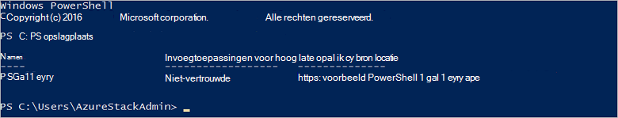

<properties
    pageTitle="Verbinding maken met Azure stapel met PowerShell | Microsoft Azure"
    description="Informatie over het beheren van Azure stapel met PowerShell"
    services="azure-stack"
    documentationCenter=""
    authors="HeathL17"
    manager="byronr"
    editor=""/>

<tags
    ms.service="azure-stack"
    ms.workload="na"
    ms.tgt_pltfrm="na"
    ms.devlang="na"
    ms.topic="article"
    ms.date="10/19/2016"
    ms.author="helaw"/>

# PowerShell installeren en verbinden met Azure-Stack
We begeleiden in deze handleiding, via de stappen voor het verbinding maken met Azure stapel met PowerShell. Als voltooid, kunt deze stappen ook u beheren en implementeren van resources.

## Azure stapel PowerShell-cmdlets installeren

1.  AzureRM cmdlets worden geïnstalleerd via de PowerShell-galerie. Als u wilt beginnen, opent u een PowerShell-Console op MAS-CON01 en voer de volgende opdracht om te retourneren van een lijst met PowerShell opslagplaatsen beschikbaar:

        Get-PSRepository

      

2.  Voer de volgende opdracht voor het installeren van de module AzureRM:

        Install-Module -Name AzureRM -RequiredVersion 1.2.6 -Scope CurrentUser

    >[AZURE.NOTE] *-Bereik CurrentUser* is optioneel. Als u meer dan de huidige gebruiker wilt toegang heeft tot de modules, gebruikt u een opdrachtprompt met verhoogde bevoegdheid en laat uit de parameter *Scope* .

3.  Om te bevestigen de installatie van AzureRM modules, moet u de volgende opdrachten uitvoeren:

        Get-Command -Module AzureRM.AzureStackAdmin

## Verbinding maken met Azure stapel
Een module is beschikbaar voor downloaden die omgaat met het configureren van de PowerShell-verbinding met Azure stapel voor u.  Ga naar [Azure stapel hulpprogramma's](http://aka.ms/ConnectToAzureStackPS) voor de module en aanvullende stappen. 

## Een lijst met abonnementen ophalen
In deze sectie controleert u de PowerShell-cmdlets ten opzichte van Azure stapel worden uitgevoerd door op te halen en selecteren van een abonnement voor gebruik.

Voer de volgende opdracht om op te halen van een lijst met Azure stapel-abonnementen die is gekoppeld aan uw account:

    Get-AzureRmSubscription

## Volgende stappen
[Sjablonen met PowerShell implementeren](azure-stack-deploy-template-powershell.md)

[Verbinding maken met Azure CLI](azure-stack-connect-cli.md)

[Sjablonen met Visual Studio implementeren](azure-stack-deploy-template-visual-studio.md)

