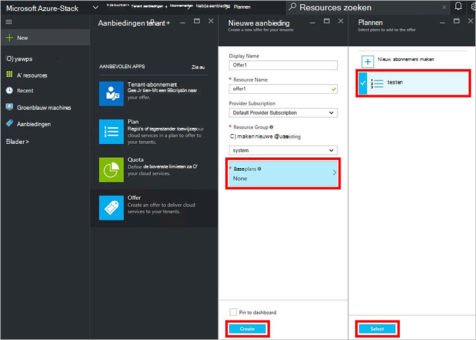
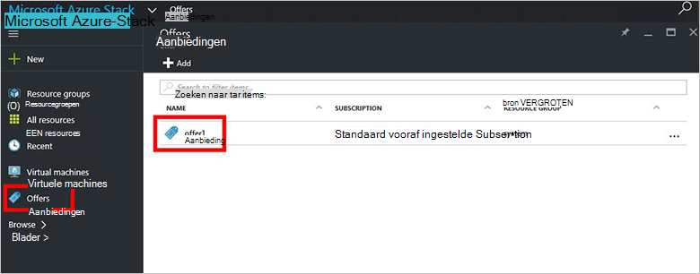

<properties
    pageTitle="Een aanbieding maken in de stapel Azure | Microsoft Azure"
    description="Informatie over het maken van een aanbod voor uw tenants Azure gestapelde als servicebeheerder van een."
    services="azure-stack"
    documentationCenter=""
    authors="ErikjeMS"
    manager="byronr"
    editor=""/>

<tags
    ms.service="azure-stack"
    ms.workload="na"
    ms.tgt_pltfrm="na"
    ms.devlang="na"
    ms.topic="get-started-article"
    ms.date="09/26/2016"
    ms.author="erikje"/>

# Een aanbieding maken in Azure-Stack

[Biedt](azure-stack-key-features.md#services-plans-offers-and-subscriptions) zijn groepen van een of meer-abonnementen die providers presenteren met tenants aan te schaffen of zich hebt geabonneerd. In dit document ziet u hoe u maakt een aanbieding met daarin het [abonnement dat u hebt gemaakt](azure-stack-create-plan.md) in de laatste stap. Deze aanbieding kunt abonnees voor het inrichten van virtuele machines.

1.  [Meld u aan](azure-stack-connect-azure-stack.md#log-in-as-a-service-administrator) bij de portal als de servicebeheerder van een en klik op **Nieuw** > **Tenant biedt + abonnementen** > **bieden**.
    

2.  In het blad **Nieuwe bieden** **Weergavenaam** en **Resourcenaam**invullen en selecteer vervolgens een nieuwe of bestaande **Resourcegroep**. De weergavenaam is de beschrijvende naam van de aanbieding. Alleen de beheerder kan de naam van de Resource zien. Dit is de naam die beheerders gebruiken voor het werken met de aanbieding als een resourcemanager Azure-bron.

    

3.  Klik op **basis van abonnement** , in het blad **plannen** , selecteert u de abonnementen die u wilt opnemen in de aanbieding en klik vervolgens op **selecteren**. Klik op **maken** om te maken van de aanbieding.

    
    
4. Klik op **biedt** en klik vervolgens op de aanbieding die u zojuist hebt gemaakt.

    

5.  Klik op **Status wijzigen**en klik vervolgens op **openbare**.
  
    

Aanbiedingen moeten openbaar worden gemaakt voor tenants zodat u de volledige weergave wanneer abonneren. Aanbiedingen zijn:

- **Openbare**: zichtbaar voor tenants.

- **Privé**: alleen zichtbaar voor de servicebeheerders. Handig tijdens het opstellen van het abonnement of de aanbieding, of als de service-beheerder wil goedkeuren van elk abonnement.

- **Buiten bedrijf**: gesloten voor nieuwe abonnees. De service-beheerder kunt gebruiken om te voorkomen dat toekomstige abonnementen, maar huidige abonnees ongewijzigd laten bedrijf.

Wijzigingen in de aanbieding zijn niet direct zichtbaar zijn voor de tenant. Als u wilt zien van de wijzigingen, u moet mogelijk tot afmelden/login om te zien van het nieuwe abonnement in de kiezer"abonnement" bij het maken van resources/resourcegroepen.

## Volgende stappen

[Abonneren op een aanbod en klikt u vervolgens een VM inrichten](azure-stack-subscribe-plan-provision-vm.md)
