<properties
    pageTitle="Een plan opstellen voor Azure gestapelde | Microsoft Azure"
    description="Als de servicebeheerder van een, maak een plan waarmee abonnees inrichten virtuele machines."
    services="azure-stack"
    documentationCenter=""
    authors="ErikjeMS"
    manager="byronr"
    editor=""/>

<tags
    ms.service="azure-stack"
    ms.workload="na"
    ms.tgt_pltfrm="na"
    ms.devlang="na"
    ms.topic="get-started-article"
    ms.date="09/26/2016"
    ms.author="erikje"/>

# Een plan opstellen voor Azure gestapelde

[Abonnementen](azure-stack-key-features.md#services-plans-offers-and-subscriptions) zijn groeperingen van een of meer services. Als een provider, kunt u plannen om aan te bieden aan uw tenants maken. Uw tenants Abonneer u op zijn beurt op uw aanbiedingen gebruik van de abonnementen en -services omvatten. In dit voorbeeld ziet u hoe u een abonnement met de berekeningscluster-, netwerk- en opslag resource providers maakt. Dit abonnement kunt abonnees voor het inrichten van virtuele machines.

1.  In een webbrowser en navigeer naar https://portal.azurestack.local.

2.  [Meld u aan](azure-stack-connect-azure-stack.md#log-in-as-a-service-administrator) bij de Portal van de stapel Azure als de servicebeheerder van een en voer uw referenties in service-beheerder (het account dat u hebt gemaakt in stap 5 van de sectie [de PowerShell-script uitvoeren](azure-stack-run-powershell-script.md) ) en klik vervolgens op **aanmelden**.

    Servicebeheerders kunnen maken, aanbiedingen en plannen en gebruikers beheren.

3.  Klik op **Nieuw**om een abonnement en de aanbieding die tenants kunnen u abonneren op > **Tenant biedt + abonnementen** > **abonnement**.

    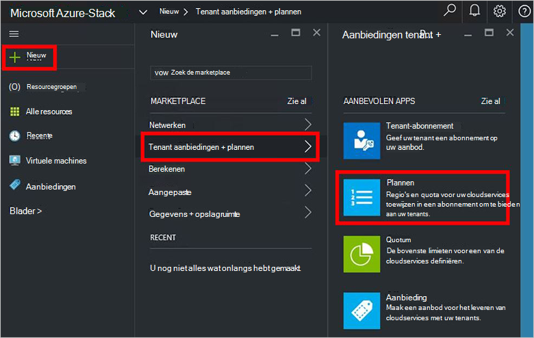

4.  Voer **Naam weer te geven** en **De naam van de Resource**in het blad **Nieuwe plannen** . De weergavenaam is beschrijvende naam van het plan dat tenants zien. Alleen de beheerder kan de naam van de Resource zien. Dit is de naam die beheerders gebruiken voor het werken met het abonnement als een resourcemanager Azure-bron.

    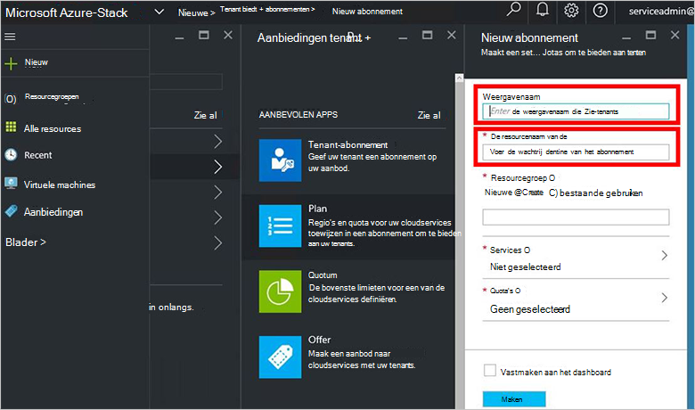

5.  Een nieuwe **Resourcegroep**maken of Selecteer een nieuwe database, als een container voor het abonnement (bijvoorbeeld "OffersAndPlans")

    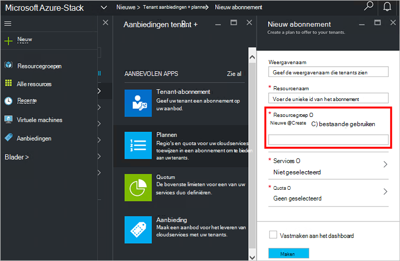

6.  Klik op **Services**, **Microsoft.Compute**, **Microsoft.Network**en **Microsoft.Storage**selecteren en klik vervolgens op **selecteren**.

    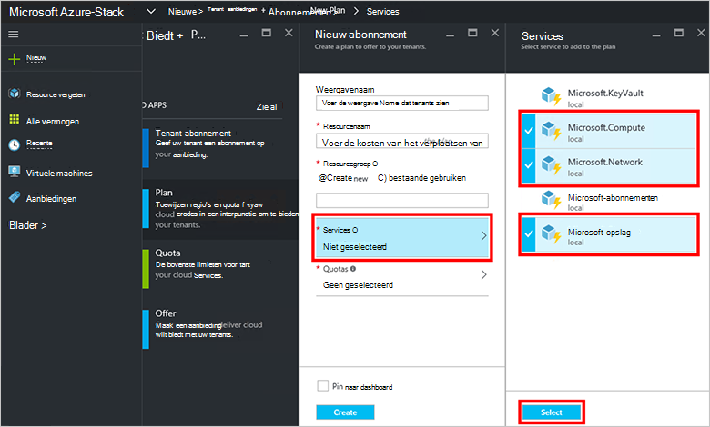

7.  Klik op **quota**, **Microsoft.Storage (lokaal)**, klikt u op en vervolgens selecteert u het standaardquotum voor of klik op **nieuwe quota maken** als u wilt aanpassen van het quotum.

    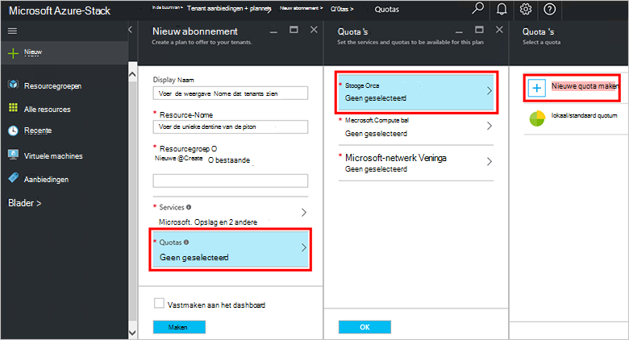

8.  Typ een naam voor het quotum **Quota-instellingen**klikt u op, de quotawaarden instellen en klik op **OK**en klik vervolgens op **maken**.

    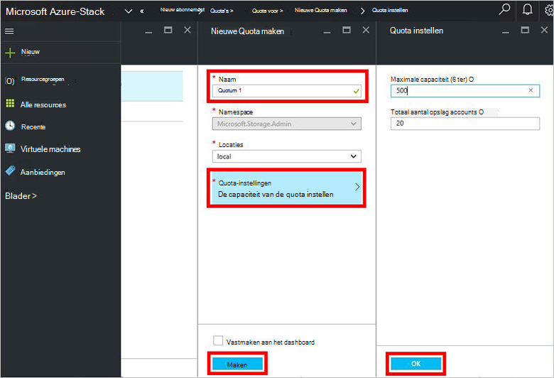

9. **Microsoft.Network (lokaal)**, klikt u op en klik vervolgens selecteert u het standaardquotum voor of klik op **de nieuwe quota maken** als u wilt aanpassen van het quotum.

    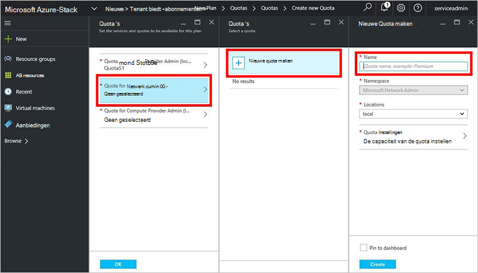

10. Typ een naam voor het quotum **Quota-instellingen**klikt u op, de quotawaarden instellen en klik op **OK**en klik vervolgens op **maken**.

    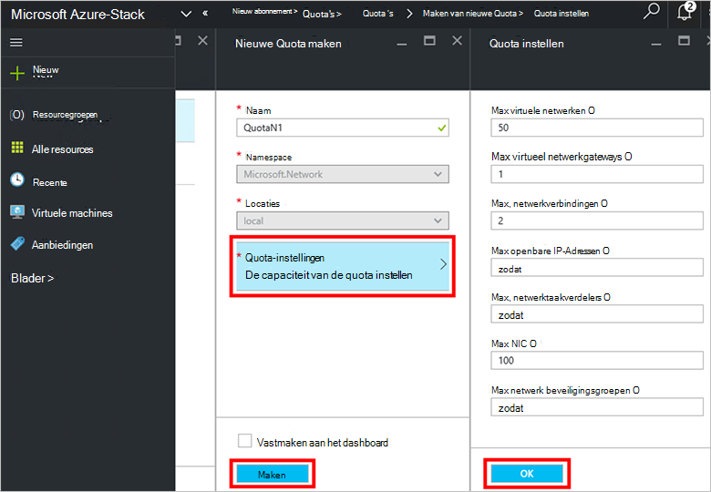

11. **Microsoft.Compute (lokaal)**, klikt u op en klik vervolgens selecteert u het standaardquotum voor of klik op **de nieuwe quota maken** als u wilt aanpassen van het quotum.

    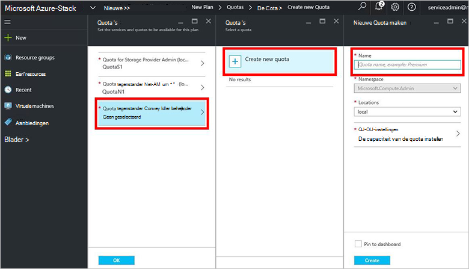

12.  Typ een naam voor het quotum **Quota-instellingen**klikt u op, de quotawaarden instellen en klik op **OK**en klik vervolgens op **maken**.

    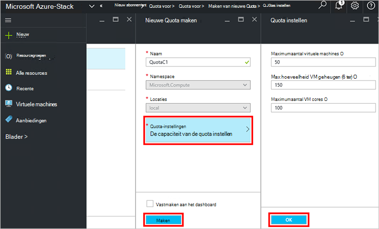

13. Klik op **OK**in het blad **quota** en klikt u in het blad **Nieuw abonnement** **maken** om te maken van het abonnement.

    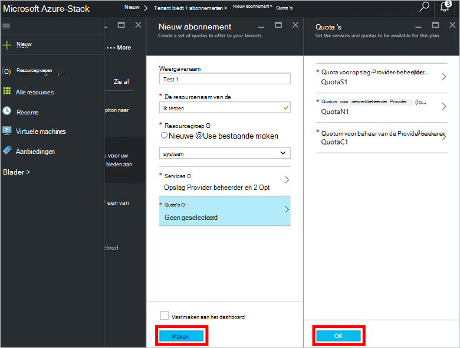

14. Als u wilt zien van uw nieuwe abonnement, klik op **alle resources**, en vervolgens zoekt het plan en klik op de naam.

    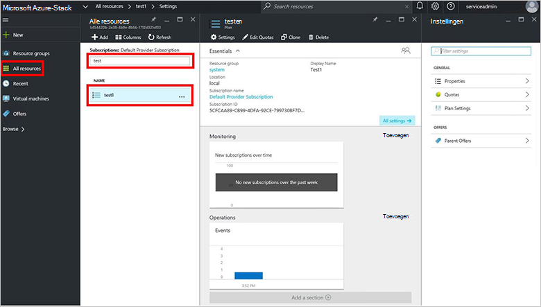

## Volgende stappen

[Een aanbieding maken](azure-stack-create-offer.md)
