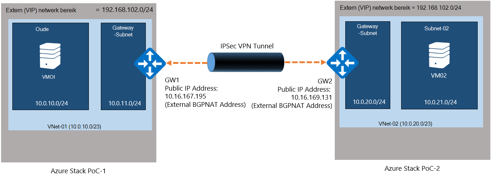
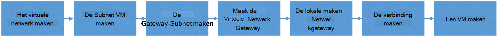
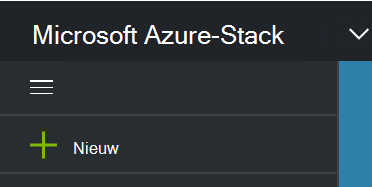
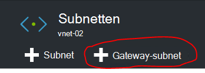
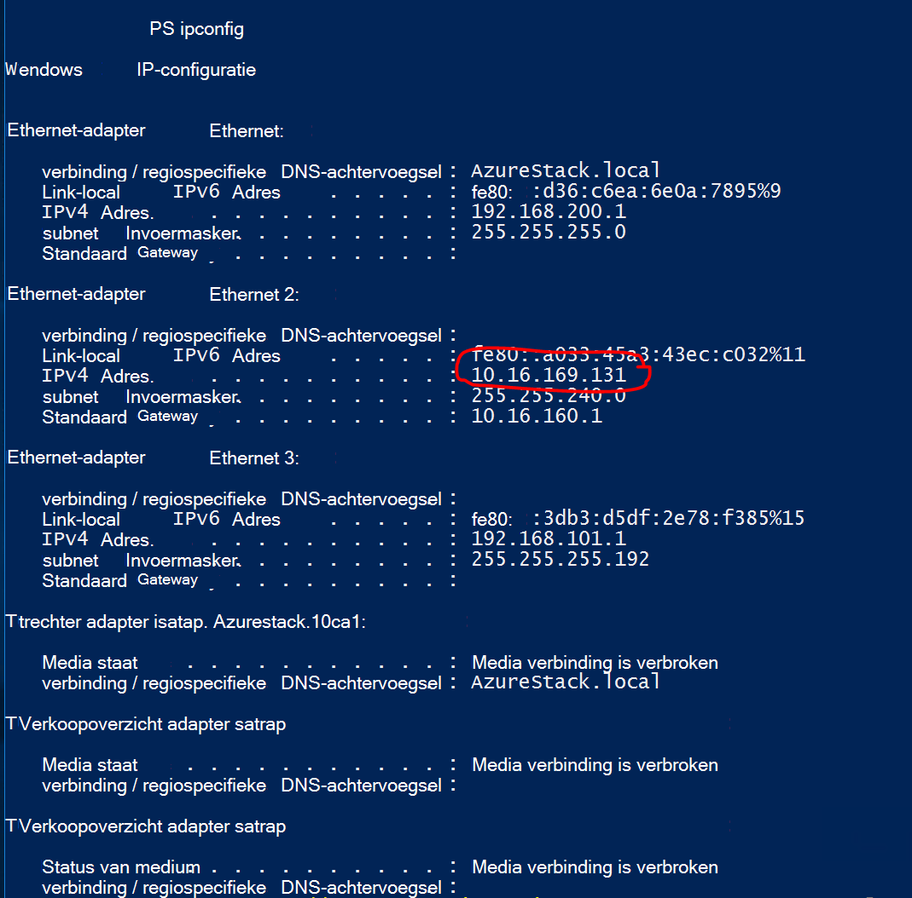
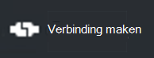
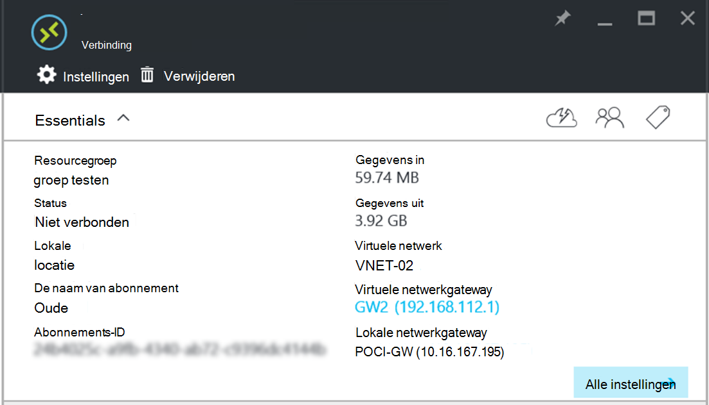

<properties
    pageTitle="Maken van een Site-naar-Site VPN-verbinding tussen twee virtuele netwerken in verschillende omgevingen van Azure stapel haalbaarheidstest | Microsoft Azure"
    description="Stapsgewijze procedure waarmee de beheerder van een wolk een Site-naar-Site VPN-verbinding maken tussen twee één-knooppunt Haalbaarheidstest omgevingen in TP2."
    services="azure-stack"
    documentationCenter=""
    authors="ScottNapolitan"
    manager="darmour"
    editor=""/>

<tags
    ms.service="azure-stack"
    ms.workload="na"
    ms.tgt_pltfrm="na"
    ms.devlang="na"
    ms.topic="get-started-article"
    ms.date="09/26/2016"
    ms.author="scottnap"/>

# Een Site-naar-Site VPN-verbinding tussen twee virtuele netwerken in verschillende Azure stapel haalbaarheidstest omgevingen maken

## Overzicht

In dit artikel begeleidt u bij de stappen voor het maken van een Site-naar-Site VPN-verbinding tussen twee virtuele netwerken in twee afzonderlijke Azure stapel bewijs-van-haalbaarheidstest-omgevingen. Het doel van dit is om te helpen personen die Site-naar-Site wordt geëvalueerd gateways meer informatie over het instellen van een VPN-verbindingen tussen virtuele netwerken in twee verschillende Azure stapel implementaties.  Het proces van als u dit doet, krijgt u de werking van VPN Gateways Azure gestapelde begrijpen.

>[AZURE.NOTE] In dit document geldt specifiek voor de Haalbaarheidstest Azure stapel TP2.

### Diagram van de verbinding

Hier volgt een diagram waarin wordt aangegeven wat onze configuratie ziet er als wanneer we klaar bent.

### Voordat u begint

Als u wilt deze configuratie hebt voltooid, moet u de volgende items zodat Zorg ervoor dat u hier rekening hebt voordat u begint.

-   Twee Servers die voldoen aan de Azure stapel Haalbaarheidstest hardwarevereisten gedefinieerd door de [Vereisten voor de implementatie van de Azure stapel](azure-stack-deploy.md)en de andere vereisten die zijn gedefinieerd door dat document.

-   Het pakket van Azure stapel technische bètaversie van 2-implementatie.

## De omgevingen Haalbaarheidstest implementeren

Implementeert u twee Azure stapel Haalbaarheidstest omgevingen om deze configuratie te voltooien.

-   Voor elke Haalbaarheidstest die u implementeert, kunt u gewoon de implementatie-instructies in het artikel [Implementeren Azure stapel Haalbaarheidstest](azure-stack-run-powershell-script.md)gedetailleerde volgen.
    We wordt verwezen naar elke Haalbaarheidstest-omgeving in dit document generieke als POC1 en POC2.

## Quota's configureren voor berekeningscluster-, netwerk- en -opslag

U moet de quota's configureren voor berekeningscluster-, netwerk- en opslag, zodat deze services gekoppeld aan een abonnement worden kunnen en vervolgens een aanbod die tenants kunt u abonneren op.

>[AZURE.NOTE] U moet doen van deze stappen voor elke Azure stapel Haalbaarheidstest-omgeving.

De ervaring maken quota voor Services is gewijzigd van TP1. De stappen voor het maken van quota in TP2 kunnen worden gevonden op <http://aka.ms/mas-create-quotas>. U kunt de standaardwaarden voor alle quota-instellingen voor deze oefening accepteren.

## Een abonnement en een aanbieding maken

[Abonnementen](azure-stack-key-features.md) zijn groeperingen van een of meer services. Als een provider, kunt u plannen om aan te bieden aan uw tenants maken. Uw tenants Abonneer u op zijn beurt op uw aanbiedingen gebruik van de abonnementen en -services omvatten.

>[AZURE.NOTE] U moet uitvoeren van deze stappen voor elke Azure stapel Haalbaarheidstest-omgeving.

1.  Maak eerst een abonnement. Hiervoor kunt u de stappen in de online-artikel voor [een energiebeheerschema maken](azure-stack-create-plan.md) .

2.  Maak een aanbod de stappen in [een aanbod Azure gestapelde maken](azure-stack-create-offer.md).

3.  Meld u aan bij de Portal als een Tenantbeheerder en [abonneren op de aanbieding die u hebt gemaakt] (azure-stack-abonneren-abonnement-inrichten-vm.md.

## De Resources netwerk in Haalbaarheidstest 1 maken

We gaan nu de resources die we nodig om in te stellen van onze configuratie daadwerkelijk te maken. De volgende stappen illustreren wat we doet. Deze instructies het maken van resources via de Portal wilt weergeven, maar kunt u hetzelfde doen via PowerShell.

### Meld u aan als een tenant

Een service-beheerder kunt aanmelden als een tenant test de abonnementen, aanbiedingen en abonnementen die hun tenants kunnen gebruiken. Als u nog geen al, [een tenantaccount maken hebt](azure-stack-add-new-user-aad.md) voordat u zich aanmeldt.

### Het virtuele netwerk & VM subnet maken

1.  Meld u aan met een tenantaccount.

2.  Klik op het pictogram **Nieuw** in de portal Azure.

     
3.  Selecteer **toegang** in het menu Marketplace.

4.  Klik op het item **virtuele netwerk** in het menu.

5.  Klik op de knop **maken** onder in het blad van resource beschrijving. Voer de volgende waarden in de betreffende velden op basis van deze tabel.

  	| **Veld**             | **Waarde** |
  	|----------------------- | ------ |
  	| Naam                  |vnet-01 |
  	| -Adresruimte         | 10.0.10.0/23 |
  	| De subnetnaam van de           | subnet-01 |
  	| Subnet-adresbereiken  | 10.0.10.0/24 |

6.  Hier ziet u het abonnement dat u eerder ingevuld in het veld **abonnement** hebt gemaakt.

7.  Voor resourcegroep, kunt u een nieuwe resourcegroep maken of als u dat gedaan hebt, selecteert u het bestaande gebruiken.

8.  Controleer of de standaardlocatie.

9.  Klik op de knop **maken** .

### De Gateway-Subnet maken

1.  Open de virtuele netwerk resource die u zojuist (Vnet-01) vanuit het Dashboard hebt gemaakt.

2.  Selecteer op het blad instellingen subnetten

3.  Klik op de knop **Gateway Subnet** als u wilt toevoegen van een Gateway-Subnet bij het netwerk virtuele.

     
4.  De naam van het Subnet is standaard ingesteld op **GatewaySubnet** .
    Gateway-subnetten zijn speciale en deze specifieke naam goed moeten hebben.

5.  Voer in het veld **adres reeks** **10.0.11.0/24**.

6.  Klik op de knop **maken** de Gateway-subnet maken.

### De Gateway virtueel netwerk maken

1.  Klik op het pictogram **Nieuw** in de portal Azure.

    

2.  Selecteer **toegang** in het menu Marketplace.

3.  Selecteer **virtuele netwerkgateway** in de lijst met netwerk resources.

4.  Bekijk de beschrijving en klik op **maken**.

5.  Typ in het veld **naam** **GW1**.

6.  Klik op het item **virtuele netwerk** om een virtueel netwerk te selecteren.
    Selecteer **Vnet-01** in de lijst.

7.  Klik op het menu-item van het **openbare IP-adres** . Klik op naar de nieuwe knop maken wanneer het blad kiezen openbare IP-adres wordt geopend.

8.  Voer in het veld **naam** **GW1-PiP** en klikt u op **Ok.**

9.  Het **type van de Gateway** moet hebben **VPN** optie is standaard ingeschakeld. Deze instelling behouden.

10. Het **type VPN** moet hebben **Route gebaseerde** optie is standaard ingeschakeld.
    Deze instelling behouden.

11. Controleer of het **abonnement** en de **locatie** juist zijn. U kunt de resource tot het Dashboard als u wilt vastmaken. Klik op **maken**.

### De Gateway lokale netwerk maken

De bron van het lokale netwerkgateway is een beetje vreemd in ons scenario.
Dit is dezelfde resource die u in Azure wordt aangegeven vinden, maar in het meestal is bedoeld om aan te geven van een apparaat fysiek, on-premises Azure u kunt verbinding maken met de netwerkgateway virtual in Azure wordt aangegeven. In ons voorbeeld worden beide uiteinden van de verbinding is virtual netwerkgateways!

Een manier om na te denken over dit meer algemeen is dat de lokale netwerkgateway-resource altijd is bedoeld om aan te geven van de externe gateway aan de andere kant van de verbinding. Vanwege de manier waarop die de Haalbaarheidstest is ontworpen, dat is wel moeten we het adres van de externe netwerkadapter op de VM NAT van de andere Haalbaarheidstest als het openbare IP-adres van de lokale netwerkgateway opgeeft. We gaan vervolgens NAT-toewijzingen maken op de NAT VM om ervoor te zorgen dat beide uiteinden goed zijn aangesloten.

### Het IP-adres van de externe Adapter van NAT VM ophalen

1.  Meld u aan bij de fysieke machine Azure stapel voor POC2.

2.  [Windows-toets] + R om het openen van het menu **uitvoeren** en typ **mstsc** en druk op enter.

3.  Voer in het veld **Computer** de naam **MAS-BGPNAT01** en klik op de knop **verbinding maken** .

4.  Klik op het Menu Start en met de rechtermuisknop op de PowerShell en selecteer **Als Administrator uitvoeren**.

5.  Type **IPConfig/alle**.

6.  Zoek de Ethernet-Adapter die is gekoppeld aan uw on-premises netwerk en moet u rekening houden met het IPv4-adres dat is gebonden aan die adapter. In Mijn omgeving, is het **10.16.167.195** maar vergeten is iets anders.

7.  Dit adres opnemen. Dit is wat we gebruiken als het openbare IP-adres van de lokale netwerkgateway resource die we in POC1 maken.

### De Resource van de Gateway lokale netwerk maken

1.  Meld u aan bij de fysieke machine Azure stapel voor POC1.

2.  Voer de naam **MAS-CON01** in het veld **Computer** en klik op de knop **verbinding maken** .

3.  Klik op het pictogram **Nieuw** in de portal Azure.

    

4.  Selecteer **toegang** in het menu Marketplace.

5.  Selecteer **lokale netwerkgateway** in de lijst met resources.

6.  Voer in het veld **naam** **POC2-GW**.

7.  We het IP-adres van onze andere Gateway nog niet weet, maar dat is ok omdat we kunnen keert u terug en deze later te wijzigen. Voer nu **10.16.167.195** in het **veld IP-adres**.

8.  Voer in het veld **Adresruimte** de adresruimte van de Vnet die we in POC2 zal maken. Dit is het verstandig om **10.0.20.0/23** zodat u deze waarde opgeven.

9.  Controleer of uw **abonnement**, de **Resourcegroep** en de **locatie** alles juist zijn en klik op **maken**.

### De verbinding maken

1.  Klik op het pictogram **Nieuw** in de portal Azure.

     

2.  Selecteer **toegang** in het menu Marketplace.

3.  Selecteer **verbinding** in de lijst met bronnen.

4.  Kies in het blad met **eenvoudige** instellingen, **Site-naar-site (IPSec)** als het **type verbinding**.

5.  Selecteer het **abonnement**, de **Resourcegroep** en de **locatie** en klik op **Ok**.

6.  Kies in het blad **Instellingen** de **Virtuele netwerkgateway** (**GW1**) u eerder hebt gemaakt.

7.  Kies het **lokale** **Netwerkgateway** (**POC2-GW**) u eerder hebt gemaakt.

8.  Voer in het veld **Verbindingsnaam** **POC1-POC2**.

9.  Voer in het veld **Gedeeld sleutel (PSK)** **12345**. Klik op **Ok**.

### Een VM maken

Gegevens die via de VPN-verbinding reizen valideren, moet u VMs verzenden en ontvangen van gegevens in elke Haalbaarheidstest. Laten we nu een VM in POC1 maken en zet dit in onze subnet VM van onze virtuele netwerk.

1. Klik op het pictogram  **Nieuw** in de portal Azure.

     

2.  Selecteer **virtuele Machines** in het menu Marketplace.

3.  In de lijst met VM afbeeldingen, selecteert u de afbeelding **Windows Server 2012 R2 Datacenter** .

4.  Voer op het blad **Basisbeginselen** in het veld **naam** de waarde **VM01**.

5.  Voer een ongeldige gebruikersnaam en wachtwoord. U gebruikt dit account voor aanmelding bij de VM nadat deze is gemaakt.

6.  Een **abonnement**, de **Resourcegroep** en de **locatie** en klik vervolgens op **Ok**.

7.  Klik op het blad **grootte** , kies een grootte VM voor dit exemplaar en klik op **selecteren**.

8.  Klik op het blad instellingen kunt u accepteer de standaardinstellingen, zorg ervoor dat het virtuele netwerk geselecteerd **VNET-01 is** en het Subnet is ingesteld op **10.0.10.0/24**. Klik op **Ok**.

9.  Controleer de instellingen op het blad **Overzicht** en klik op **Ok**.

## De Resources netwerk in Haalbaarheidstest 2 maken

### Meld u aan als een tenant

Een service-beheerder kunt aanmelden als een tenant test de abonnementen, aanbiedingen en abonnementen die hun tenants kunnen gebruiken. Als u nog geen al, [een tenantaccount maken hebt](azure-stack-add-new-user-aad.md) voordat u zich aanmeldt.

### Het virtuele netwerk & VM subnet maken

1. Meld u aan met een tenantaccount.

2. Klik op het pictogram  **Nieuw** in de portal Azure.

     

3.  Selecteer **toegang** in het menu Marketplace.

4.  Klik op het item **virtuele netwerk** in het menu.

5.  Klik op de knop **maken** onder in het blad van resource beschrijving. Voer de volgende waarden voor de betreffende velden weergegeven in de onderstaande tabel.

  	|**Veld**              |**Waarde** |
  	| ----------------------|----------|
  	| Naam                  | vnet-02 |
  	| -Adresruimte         | 10.0.20.0/23 |
  	| De subnetnaam van de           | subnet-02 |
  	| Subnet-adresbereiken  | 10.0.20.0/24 |

6.  Hier ziet u het abonnement dat u eerder ingevuld in het veld **abonnement** hebt gemaakt.

7.  Voor resourcegroep, kunt u een nieuwe resourcegroep maken of als u dat gedaan hebt, selecteert u het bestaande gebruiken.

8.  Controleer of de standaard- **locatie**. Als u wilt, kunt u het virtuele netwerk aan het Dashboard voor eenvoudige toegang vastmaken.

9.  Klik op de knop **maken** .

### De Gateway-Subnet maken

1.  Open de virtuele netwerk resource die u hebt gemaakt (**Vnet-02**) vanuit het Dashboard.

2.  Selecteer op het blad **Instellingen** **subnetten.**

3.  Klik op de knop **Gateway Subnet** als u wilt toevoegen van een Gateway-Subnet bij het netwerk virtuele.

     

4.  De naam van het Subnet is standaard ingesteld op **GatewaySubnet** .
    Gateway-subnetten zijn speciale en deze specifieke naam goed moeten hebben.

5.  Voer in het veld **adres reeks** **10.0.20.0/24**.

6.  Klik op de knop **maken** om de Gateway-subnet maken.

### De Gateway virtueel netwerk maken

1. Klik op het pictogram  **Nieuw** in de portal Azure.

     

2.  Selecteer **toegang** in het menu Marketplace.

3.  Selecteer **virtuele netwerkgateway** in de lijst met netwerk resources.

4.  Bekijk de beschrijving en klik op **maken**.

5.  Typ in het veld **naam** **GW2**.

6.  Klik op het item **virtuele netwerk** om een virtueel netwerk te selecteren.
    Selecteer **Vnet-02** in de lijst.

7.  Klik op het menu-item van het **openbare IP-adres** . Klik op naar de nieuwe knop maken wanneer het blad kiezen openbare IP-adres wordt geopend.

8.  Voer in het veld **naam** **GW2-PiP** en klikt u op **Ok.**

9.  Het **type van de Gateway** moet hebben **VPN** optie is standaard ingeschakeld. Deze instelling behouden.

10. Het **type VPN** moet hebben **Route gebaseerde** optie is standaard ingeschakeld.
    Deze instelling behouden.

11. Controleer of het **abonnement** en de **locatie** juist zijn. U kunt de resource tot het Dashboard als u wilt vastmaken. Klik op **maken**.

### De Gateway lokale netwerk maken

#### Het IP-adres van de externe Adapter van NAT VM ophalen

1.  Meld u aan bij de fysieke machine Azure stapel voor POC1.

2.  Druk op en wacht [Windows-toets] + R om het openen van het menu **uitvoeren** en typ **mstsc** en druk op invoeren.

3.  Voer in het veld **Computer** de naam **MAS-BGPNAT01** en klik op de knop **verbinding maken** .

4.  Klik op het Menu Start en met de rechtermuisknop op de PowerShell en selecteer **Als Administrator uitvoeren**.

5.  Type **IPConfig/alle**.

6.  Zoek de Ethernet-Adapter die is gekoppeld aan uw on-premises netwerk en moet u rekening houden met het IPv4-adres dat is gebonden aan die adapter. In Mijn omgeving is **10.16.169.131** maar vergeten is iets anders.

7.  Dit adres opnemen. Dit is wat we later gebruiken als het openbare IP-adres van de lokale netwerkgateway resource die we in POC1 maken.

#### De Resource van de Gateway lokale netwerk maken

1.  Meld u aan bij de fysieke machine Azure stapel voor POC2.

2.  Voer in het veld **Computer** de naam **MAS-CON01** en klik op de knop **verbinding maken** .

3. Klik op het pictogram **Nieuw** in de portal Azure.

     

4.  Selecteer **toegang** in het menu Marketplace.

5.  Selecteer **lokale netwerkgateway** in de lijst met resources.

6.  Voer in het veld **naam** **POC1-GW**.

7.  Nu nodig we het openbare IP-adres wordt opgenomen voor de gateway virtuele netwerk in POC1. Voer **10.16.169.131** in het **veld IP-adres**.

8.  Voer de adresruimte van **Vnet-01** van POC1 - **10.0.0.0/16**in het veld **-Adresruimte** .

9.  Controleer of uw **abonnement**, de **Resourcegroep** en de **locatie** alles juist zijn en klik op **maken**.

## De verbinding maken

1. Klik op het pictogram  **Nieuw** in de portal Azure.

     

2.  Selecteer **toegang** in het menu Marketplace.

3.  Selecteer **verbinding** in de lijst met bronnen.

4.  Kies in het blad met **eenvoudige** instellingen, **Site-naar-site (IPSec)** als het **type verbinding**.

5.  Selecteer het **abonnement**, de **Resourcegroep** en de **locatie** en klik op **Ok**.

6.  Kies in het blad **Instellingen** de **Virtuele netwerkgateway** (**GW1**) u eerder hebt gemaakt.

7.  Kies het **lokale** **Netwerkgateway** (**POC1-GW**) u eerder hebt gemaakt.

8.  Voer in het veld **Verbindingsnaam** **POC2-POC1**.

9.  Voer in het veld **Gedeeld sleutel (PSK)** **12345**. Als u een andere waarde kiest, moet u dat moet overeenkomen met de waarde voor gedeelde sleutel die u in POC1 toegewezen. Klik op **Ok**.

## Een VM maken

Een VM nu in POC1 maken en zet dit in onze subnet VM van onze virtuele netwerk.

1.  Klik op het pictogram **Nieuw** in de portal Azure.

     

2.  Selecteer **virtuele Machines** in het menu Marketplace.

3.  In de lijst met VM afbeeldingen, selecteert u de afbeelding **Windows Server 2012 R2 Datacenter** .

4.  Voer op het blad **Basisbeginselen** in het veld **naam** de waarde **VM02**.

5.  Voer een ongeldige gebruikersnaam en wachtwoord. U gebruikt dit account voor aanmelding bij de VM nadat deze is gemaakt.

6.  Een **abonnement**, de **Resourcegroep** en de **locatie** en klik vervolgens op **Ok**.

7.  Klik op het blad **grootte** , kies een grootte VM voor dit exemplaar en klik op **selecteren**.

8.  Klik op het blad instellingen kunt u accepteer de standaardinstellingen, zorg ervoor dat het virtuele netwerk geselecteerd **VNET-02 is** en het Subnet is ingesteld op **20.0.0.0/24**. Klik op **Ok**.

9.  Controleer de instellingen op het blad **Overzicht** en klik op **Ok**.

## De NAT VM configureren in elke Haalbaarheidstest voor gateway transport

Omdat de Haalbaarheidstest is ontworpen voor zelfstandig en geïsoleerd van het netwerk waarin de fysieke host is geïmplementeerd en wordt het netwerk "Externe" VIP die de gateways met verbonden zijn is niet daadwerkelijk externe, maar in plaats hiervan is verborgen achter een router doen NAT (Network Address Translation). De router is daadwerkelijk een Windows Server VM (**MAS-BGPNAT01**) de functie Routering en Remote Access Services (RRAS) uitgevoerd in de infrastructuur Haalbaarheidstest. Moeten we NAT configureren op de VM MAS-BGPNAT01 toe te staan dat de Site-naar-Site VPN-verbinding tot stand brengen beide uiteinden.

>[AZURE.NOTE] Deze configuratie is vereist voor alleen Haalbaarheidstest-omgevingen.

### NAT configureren

Moet u als volgt te werk in zowel Haalbaarheidstest omgevingen.

1.  Meld u aan bij de fysieke machine Azure stapel voor POC1.

2.  Druk op en wacht [Windows-toets] + R om het openen van het menu **uitvoeren** en typ **mstsc** en druk op invoeren.

3.  Voer in het veld **Computer** de naam **MAS-BGPNAT01** en klik op de knop **verbinding maken** .

4.  Klik op het Menu Start en met de rechtermuisknop op de PowerShell en selecteer **Als Administrator uitvoeren**.

5.  Type **IPConfig/alle**.

6.  Zoek de Ethernet-Adapter die is gekoppeld aan uw on-premises netwerk en moet u rekening houden met het IPv4-adres dat is gebonden aan die adapter. In Mijn omgeving, is het **10.16.169.131** (met een rode cirkel hieronder), maar vergeten is iets anders.

     

7.  Voer de volgende PowerShell-opdracht om het externe NAT-adres van de poorten aangeven dat de verificatie. Onthoud dat het IP-adres wijzigen met de sjabloon die overeenkomt met uw omgeving.

        Add-NetNatExternalAddress -NatName BGPNAT -IPAddress 10.16.169.131 PortStart 499 -PortEnd 501

8. We gaan vervolgens een statische NAT-toewijzing het externe adres om aan te wijzen het openbare IP-adres Gateway toewijzen de ISAKMP poort 500 voor fase 1 van de tunnel IPSEC maken.

        Add-NetNatStaticMapping -NatName BGPNAT -Protocol UDP -ExternalIPAddress 10.16.169.131 -InternalIPAddress 192.168.102.1 -ExternalPort 500 -InternalPort 500

9.  Ten slotte, moeten we NAT-transport die tot stand hebt gebracht de volledige IPEC tunnel via NAT-apparaten met behulp van poort 4500 doen.

         Add-NetNatStaticMapping -NatName BGPNAT -Protocol UDP -ExternalIPAddress 10.16.169.131 -InternalIPAddress 192.168.102.1 -ExternalPort 4500 -InternalPort 4500

10.  Herhaal stappen 1-9 in POC2.

## De verbinding testen

Nu dat de Site op Site-verbinding is gemaakt dat moeten we controleren of de Help verkeer dat door de werkmap. Deze taak is eenvoudig, zoals NET hierbij aanmelden bij een van de VMs die u hebt gemaakt in een van beide Haalbaarheidstest-omgeving en de VM die u hebt gemaakt in de andere omgeving pingen. Om ervoor te zorgen dat we het verkeer via de verbinding van de Site-naar-Site wilt opslaan, horen we om ervoor te zorgen dat we het directe IP-(DIP)-adres van de VM op het externe subnet, niet de VIP pingen. Klik hiertoe moeten we weten wat het adres op het andere uiteinde van onze verbinding is.

### Meld u aan bij de tenant VM in POC1

1.  Meld u aan bij de fysieke machine Azure stapel voor POC1 en meld u aan bij de Portal met behulp van een tenantaccount.

3.  Klik op het pictogram **virtuele Machines** in de linkernavigatiebalk.

4.  Zoek **VM01** die u eerder in de lijst met VMs hebt gemaakt en klik erop.

5. Klik op het blad voor de virtuele machine op **verbinding maken**.

     

6.  Open een opdrachtprompt uit in het VM en typ **IPConfig/alle**.

7.  Het **IPv4-adres** in de uitvoer vinden en noteer deze. Dit is het adres die u uit POC2 wordt ping. In deze omgeving, het adres is **10.0.10.4**, maar in uw omgeving deze mogelijk anders. Dit moet echter vallen binnen de **10.0.10.0/24** -subnetten die eerder is gemaakt.

### Meld u aan bij de tenant VM in POC2

1.  Aanmelden bij de fysieke machine Azure stapel voor POC2 en aanmelden bij de portal met behulp van een tenantaccount.

3.  Klik op het pictogram **virtuele Machines** in de linkernavigatiebalk.

4.  Zoek **VM02** die u eerder in de lijst met VMs hebt gemaakt en klik erop.

5.  Klik op het blad voor de virtuele machine op **verbinding maken**.

     

6.  Open een opdrachtprompt uit in het VM en typ **IPConfig/alle**.

7.  Hier ziet u een IPv4-adres dat binnen 10.0.20.0/24 valt. In mijn testomgeving, het adres is 10.0.20.4, maar vergeten mogelijk anders.

8.  Nu uit de VM in POC2 willen we de VM in POC1, via de tunnel ping. Klik hiertoe ping we de DIP die we van VM01 opgenomen.
    In mijn testomgeving dit 10.0.10.4 is, maar moet u het adres in uw testomgeving ping. Hier ziet u dat er zo uitziet als resultaat.

     

9.  Een antwoord van de externe VM geeft aan dat een geslaagde test! U kunt sluit het venster VM verbinding of als u wilt, doe enkele andere overdracht om uw verbinding (zoals de kopie van een bestand) te testen.

### Weergeven van gegevens overbrengen statistieken via de gateway-verbinding

Als u weten hoeveel gegevens is doorgeven via de verbinding van uw Site-naar-Site wilt, wordt deze gegevens zijn beschikbaar in het blad verbinding. Deze test is ook een andere goede manier om te bevestigen dat de ping die u zojuist hebt gestuurd daadwerkelijk hebben doorlopen de VPN-verbinding.

1.  Terwijl u nog steeds aangemeld bij **ClientVM** in POC2, aanmelden bij de **Portal van Microsoft Azure stapel Haalbaarheidstest** via uw tenantaccount.

2.  Klik op de menuopdracht **Bladeren** en selecteer **verbindingen**.

3.  Klik op de **POC2-POC1** verbinding in de lijst.

4.  Klik op het blad verbinding, kunt u statistieken bekijken voor gegevens in en uit. In de onderstaande afbeelding ziet u dat enkele getallen groter dan alleen ping zou account voor. Dat komt doordat we ook sommige bestandsoverdrachten hebben gedaan. Hier ziet u enkele waarden dan nul.

     
