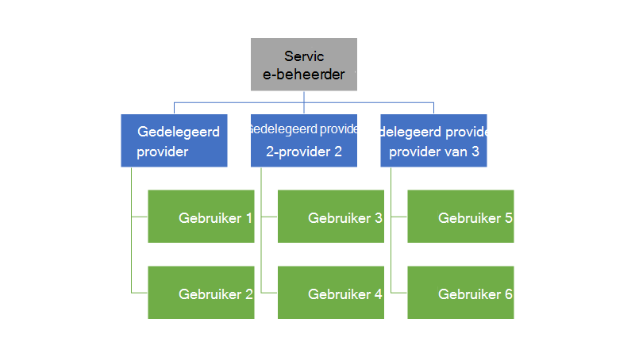
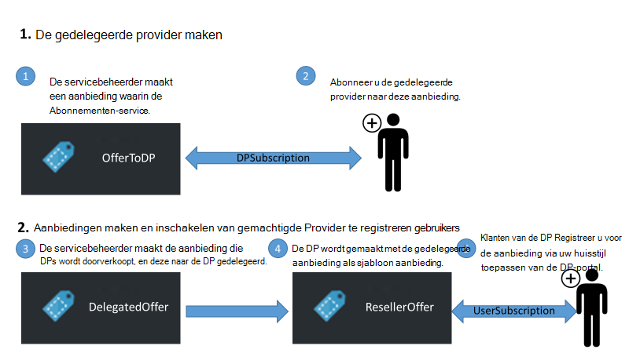
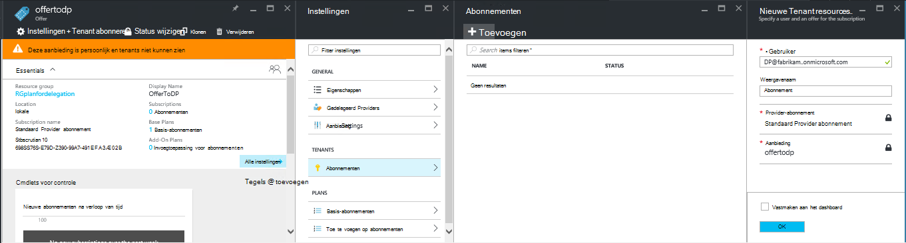
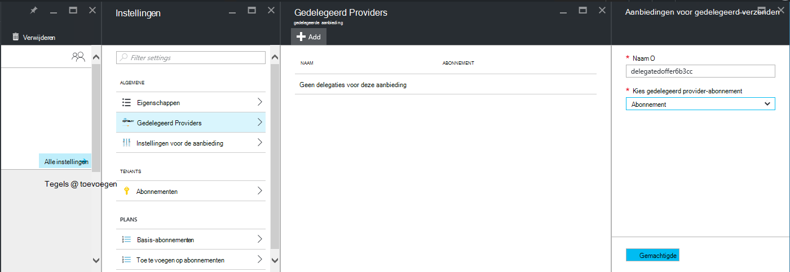
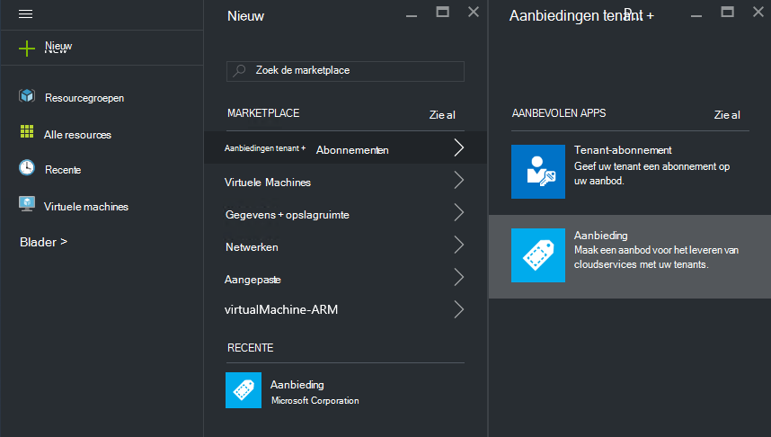
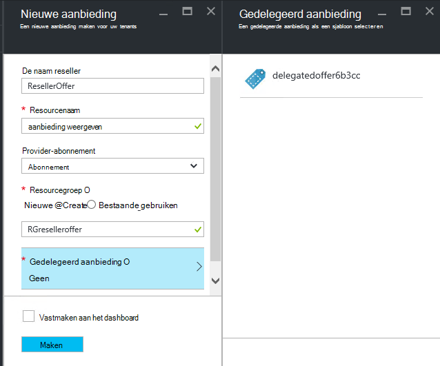
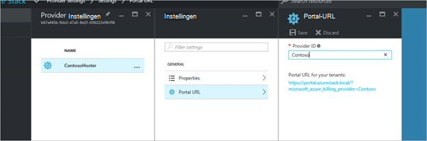
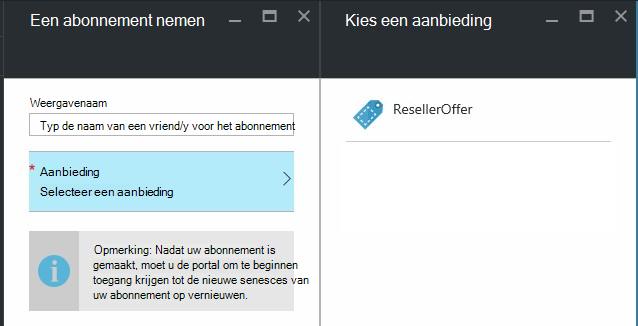

<properties
    pageTitle="Delegeren van aanbiedingen Azure gestapelde | Microsoft Azure"
    description="Informatie over het plaatsen van andere personen verantwoordelijk aanbiedingen maken en zich registreert gebruikers voor u."
    services="azure-stack"
    documentationCenter=""
    authors="AlfredoPizzirani"
    manager="byronr"
    editor=""/>

<tags
    ms.service="azure-stack"
    ms.workload="na"
    ms.tgt_pltfrm="na"
    ms.devlang="na"
    ms.topic="article"
    ms.date="10/07/2016"
    ms.author="alfredop"/>

#Aanbiedingen Azure gestapelde overdragen

Als de servicebeheerder van een wilt u meestal moeten worden geplaatst van andere personen verantwoordelijk aanbiedingen maken en zich registreert gebruikers voor u. Bijvoorbeeld: dit kan gebeuren als u een serviceprovider en gewenste wederverkopers klanten aanmelden en beheren ze namens u. Deze kan ook in een onderneming optreden als u deel van een centrale IT-groep uitmaken en afdelingen of dochterondernemingen te registreren gebruikers zonder uw tussenkomst wilt.

Delegeren kunt u met de volgende taken kunnen uitvoeren, zodat u kunt bereiken en meer gebruikers dan u zou doen rechtstreeks kunnen beheren. De volgende afbeelding ziet u één niveau van de delegatie, maar Azure-Stack ondersteunt meerdere niveaus. Gedelegeerd providers kunnen beurtelings overdragen aan andere providers, maximaal vijf niveaus.

Beheerders kunnen het maken van aanbiedingen delegeren en tenants aan andere gebruikers met behulp van de functionaliteit voor doorschakelen naar gemachtigden.

##Rollen en de stappen in delegeren

Als u wilt weten over taakoverdracht aan, houd er rekening mee dat er zijn drie rollen betrokken:

-   De **service-beheerder** de infrastructuur van Azure stapel beheert, maakt u een sjabloon aanbieding en gedelegeerd anderen voor het aanbieden van deze aan hun gebruikers.

-   De gedelegeerde gebruikers worden genoemd **gedelegeerde providers**. Ze kunnen deel uitmaken van andere organisaties (zoals andere Azure Active Directory-tenants).

-   **Gebruikers** zich registreren voor de aanbiedingen en ze gebruiken voor het beheren van hun werkbelasting, VMs maken, opslaan van gegevens, enzovoort.

Zoals u in de volgende afbeelding ziet, zijn er twee stappen bij het instellen van machtigingen.

1.  Geef aan dat het gedelegeerd providers. Dit doen door ze abonneren op een aanbod op basis van een abonnement dat alleen de abonnementen-service bevat.
    Gebruikers die zich op deze aanbieding abonneren aanschaffen enkele van de service-beheerder-functies, inclusief de mogelijkheid om te aanbiedingen uitbreiden en meld u aan gebruikers voor deze.

2.  Een aanbod delegeren naar de gedelegeerde provider. Deze aanbieding fungeert als een sjabloon voor wat de gedelegeerde provider kunt bieden. De gedelegeerde-provider is nu kunnen de aanbieding duren, kiest u een naam voor deze (maar niet wijzigen van de services en de quota's) en deze te bieden aan klanten.

Als u wilt fungeert als gedelegeerd providers, hoeven gebruikers tot stand brengen van een relatie met de belangrijkste provider; met andere woorden, moeten zij maken van een abonnement. In dit scenario dit abonnement geeft aan wat het gedelegeerd-providers zoals die recht op de huidige aanbiedingen namens de belangrijkste provider.

Wanneer deze relatie is gemaakt, kan de systeembeheerder een aanbod delegeren aan de gedelegeerde provider. De gedelegeerde-provider is nu kunnen de aanbieding duren, wijzig de naam (maar niet de inhoud wordt gewijzigd), en deze bieden aan de klanten.

Een gedelegeerde provider definiëren, een aanbod delegeren verschijnt en controleer dat gebruikers kunnen zich registreren voor deze, voer de aanwijzingen in de volgende secties.

##Rollen instellen

Als u wilt een gedelegeerd provider op het werk wordt weergegeven, moet u extra Azure Active Directory-accounts naast uw service-beheerdersaccount. Als u geen ze, maakt u de twee accounts. De accounts kunnen deel uitmaakt van een tenant AAD. Wordt verwezen naar deze als de gedelegeerde provider (DP) en de gebruiker.

| **Rol** | **Organisatie-rights** |
| -------------------- | ----------------------- |
|  Gedelegeerd Provider | Gebruiker |
| Gebruiker | Gebruiker |

##De gedelegeerde providers identificeren

1.  Meld u aan als servicebeheerder van de.

2.  De aanbieding waarmee tenants om gedelegeerd providers vertrouwd te maken. Hiervoor is vereist dat u een abonnement en een op basis van deze aanbieding maken:

    een.  [Een energiebeheerschema maken](azure-stack-create-plan.md).
        Dit abonnement moet alleen de service abonnementen bevatten. In dit artikel gebruiken we een abonnement PlanForDelegation genoemd.

    b.  [Een aanbieding maken](azure-stack-create-offer.md) 
     op basis van dit abonnement. In dit artikel gebruiken we een aanbod OfferToDP genoemd.

    c.  Zodra het maken van de aanbieding voltooid is, de gebruikers-ID van de gedelegeerde provider als toevoegen een tenant voor deze aanbieding door te klikken op     **abonnementen** &gt; **toevoegen** &gt; **Nieuwe Tenant-abonnement**.

  

> [AZURE.NOTE]Aangezien met alle Azure stapel voorstellen, hebt u de optie het voor de aanbieding openbare en zodat gebruikers zich voor, of het privé houden en ondervindt service-beheerder de aanmelding beheren. Gedelegeerd providers zijn meestal een kleine groep en u wilt bepalen wie is toegelaten tot, zodat het privé houden van deze aanbieding wordt zinvol in de meeste gevallen.

##Service-beheerder maakt de gedelegeerde aanbieding

U hebt nu uw gedelegeerde is ingesteld. De volgende stap is het opzetten van het abonnement en de aanbieding die u wilt delegeren en dat uw klanten gebruiken. Exact in zoals u wilt dat de klanten om te zien, omdat de gedelegeerde provider niet mogelijk om te wijzigen van de abonnementen en de quota's gezocht, moet u deze aanbieding definiëren.

1.  Als de service-beheerder, [een plan opstellen](azure-stack-create-plan.md) en [een aanbod](azure-stack-create-offer.md) op basis van deze. Voor dit artikel gebruiken we een aanbod DelegatedOffer genoemd.
> [AZURE.NOTE]Deze aanbieding hoeft niet te worden openbaar gemaakt. Deze kan openbaar worden gemaakt als u kiest, maar, in de meeste gevallen wilt u alleen de gedelegeerd providers toegang heeft tot deze. Nadat u een persoonlijke aanbieding delegeren zoals is beschreven in de volgende stappen uit, is de gedelegeerde provider hebben toegang tot deze.

2.  Delegeren de aanbieding. Ga naar DelegatedOffer en klik in het deelvenster instellingen, klik op **Gedelegeerde Providers** &gt; **toevoegen**.

3.  De gedelegeerde provider abonnement in het vak vervolgkeuzelijst en klik op de **gemachtigde**.

> 

##Gedelegeerd provider aanpassen de aanbieding

Meld u aan als de provider van gedelegeerde en maak een nieuwe aanbieding de gedelegeerde aanbieding als een sjabloon gebruiken.

1.  Klik op **nieuwe** &gt; **Tenant biedt + abonnementen** &gt; **bieden**.

    

2.  Een naam toewijzen aan de aanbieding. Hier kiezen we ResellerOffer. Selecteer de gedelegeerde aanbieding wilt baseren op en klik op **maken**.
    
    

    >[AZURE.NOTE] Houd rekening met het verschil vergeleken om aan te bieden maken als ervaren door de servicebeheerder. De gedelegeerde provider wordt niet maken voor de aanbieding van basis-abonnementen en -invoegtoepassing voor abonnementen; ze alleen kunt kiezen uit aanbiedingen die zijn overgedragen naar haar en wordt niet wijzigen.

3. De aanbieding openbaar maken door te klikken op **Bladeren** &gt; **biedt**, de aanbieding selecteren en te klikken op **De status wijzigen**.

4. De gedelegeerde provider beschrijft deze aanbiedingen via zijn of haar eigen portal URL. Houd er rekening mee dat deze aanbiedingen alleen via deze gedelegeerd portal zichtbaar zijn. Om te zoeken en deze URL wijzigen:

    een.  Klik op **Bladeren** &gt; **Providerinstellingen** &gt; **Portal-URL**.

    b.  De Provider-ID desgewenst wijzigen.

    c.  Kopieer de portal URL naar een andere locatie, zoals Kladblok.

    
<!-- -->
U hebt nu het maken van een gedelegeerd aanbieding als provider van gedelegeerd voltooid. Meld u af als provider van gedelegeerd. Sluit het browsertabblad die u hebt gebruikt.

##Registreer u voor de aanbieding

1.  In een nieuw browservenster, gaat u naar de gedelegeerde portal URL die u hebt opgeslagen in de vorige stap. Meld u aan bij de portal als gebruiker. Opmerking: u moet de gedelegeerde portal gebruiken voor deze stap. De gedelegeerde aanbieding is alleen zichtbaar anders.

2.  Klik in het dashboard op **een abonnement nemen**. U ziet dat alleen de gedelegeerde aanbiedingen gemaakt door de provider voor gedelegeerd aan de gebruiker worden weergegeven:

> 

Hiermee wordt het proces van het delegeren van de aanbieding afgesloten. De gebruiker kan nu registreren voor deze aanbieding door een abonnement voor deze.

##Taakoverdracht aan meerdere niveaus

Meerdere niveaus delegeren kan de gedelegeerde provider aan gemachtigde met de aanbieding naar andere entiteiten. Hierdoor kunnen bijvoorbeeld de aanmaakdatum van grondigere wederverkoper kanalen, waarin de provider voor het beheren van Azure stapel gedelegeerd aanbieding een distributeur, die op zijn beurt gedelegeerd naar wederverkoper.
Azure stapel ondersteunt maximaal vijf niveaus van taakoverdracht aan.

Als u wilt maken van meerdere niveaus van de aanbieding delegatie, gedelegeerd de gedelegeerde provider beurtelings de aanbieding naar de volgende provider. Het is de procedure voor het gedelegeerd provider zoals deze voor de service-beheerder was (Zie [servicebeheerder Hiermee maakt u de gedelegeerde aanbieding](#service-admin-creates-the-delegated-offer)).

##Volgende stappen
[Een VM inrichten](azure-stack-provision-vm.md)
