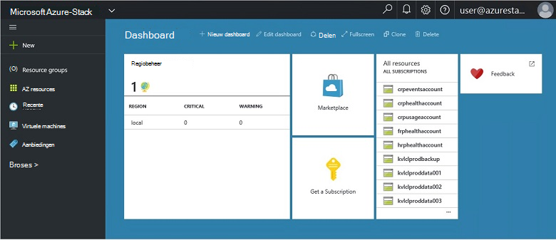
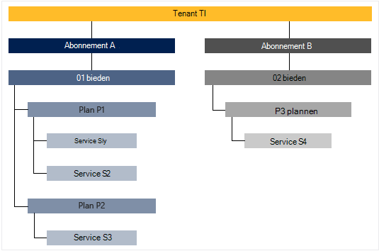

<properties
    pageTitle="Belangrijke functies en concepten Azure gestapelde | Microsoft Azure"
    description="Meer informatie over de belangrijkste functies en concepten in Azure stapel."
    services="azure-stack"
    documentationCenter=""
    authors="Heathl17"
    manager="byronr"
    editor=""/>

<tags
    ms.service="azure-stack"
    ms.workload="na"
    ms.tgt_pltfrm="na"
    ms.devlang="na"
    ms.topic="article"
    ms.date="10/25/2016"
    ms.author="helaw"/>

# Belangrijke functies en concepten in Azure stapel

Als u geen ervaring met Microsoft Azure stapel hebt, kunnen deze voorwaarden en beschrijvingen van functies in kwestie handig zijn.

## Personas

Er zijn twee soorten gebruikers voor Microsoft Azure stapel, de service-beheerder en de tenant (klant).

-  Een **service-beheerder** kunt configureren en beheren van resource providers, tenant aanbiedingen, plannen, services, quota en prijzen.
-  Een **tenant** krijgt (of aankopen) services die de service-beheerder biedt. Tenants kunnen inrichten, controleren en services die ze zich hebt geabonneerd op, zoals Web Apps, opslag en virtuele Machines beheren.

## Portal

De primaire methoden voor het interactief werken met Microsoft Azure stapel is de portal en PowerShell.

De portal van Microsoft Azure stapel is een exemplaar van de Azure-portal op uw-servers. Dit is een website die beschikt u over een selfservice-ervaring voor zowel servicebeheerders en tenants met Rolgebaseerd toegangsbeheer (RBAC) in de cloud capaciteit, zodat snel-toepassing en de serviceontwikkeling en de implementatie en resources.

## Regio's, services, plannen, aanbiedingen en abonnementen

Azure gestapelde, worden services geleverd met tenants met regio's, abonnementen, aanbiedingen en abonnementen. Tenants kunnen u abonneren op meerdere aanbiedingen. Aanbiedingen kunnen beschikken over een of meer plannen en abonnementen kunnen een of meer services hebben.

Voorbeeld van de hiërarchie van een tenant-abonnementen op aanbiedingen, elk met variërende abonnementen en services.

### Regio 's
Azure stapel gebieden zijn een eenvoudige element van de schaal en beheer.  Een organisatie kan meerdere gebieden met bronnen die beschikbaar zijn in elke regio hebben.  Regio's mogelijk ook verschillende serviceaanbiedingen beschikbaar.

### Services

Microsoft Azure stapel kunnen providers voor het leveren van een groot aantal services en toepassingen, zoals virtuele machines, SQL Server-databases, SharePoint, Exchange en meer.

### Abonnementen

Abonnementen zijn groeperingen van een of meer services. Als een provider, moet u plannen om aan te bieden aan uw tenants maken. Uw tenants Abonneer u op zijn beurt op uw aanbiedingen gebruik van de abonnementen en -services omvatten.

Elke service die is toegevoegd aan een abonnement kan worden geconfigureerd met quota-instellingen voor het beheren van de capaciteit van de cloud. Quota beperkingen zoals VM, RAM en CPU limieten kunnen opnemen en worden toegepast per gebruikerabonnement. Quota's kunnen worden onderscheiden door locatie. Een abonnement met berekeningscluster services uit de tweede regio A kan bijvoorbeeld een limiet van twee virtuele machines, 4GB RAM en 10 CPU cores hebben.

Tijdens het opstellen van een aanbod kunt **grondtal abonnementen**opnemen in de service-beheerder. Deze grondtal abonnementen zijn standaard opgenomen wanneer een tenant die aanbieding afsluit. Als u een gebruiker zich abonneert (en het abonnement dat is gemaakt), heeft de gebruiker toegang tot alle resource-providers die worden opgegeven in deze grondtal plannen (met de bijbehorende quota).

De service-beheerder kan ook **invoegtoepassing abonnementen** opnemen in een aanbod. Invoegtoepassing voor abonnementen worden niet opgenomen in het abonnement dat standaard. Invoegtoepassing voor abonnementen zijn extra abonnementen (quota) beschikbaar in een aanbieding die de eigenaar van een abonnement aan hun abonnementen toevoegen kunt.

### Aanbiedingen

Aanbiedingen zijn een of meer-abonnementen die providers met tenants presenteren kopen groepen (zich hebt geabonneerd). Bieden alfa kan bijvoorbeeld bevatten (van regio 1 met een reeks berekeningscluster services)-abonnement A en B plannen (van regio 2 die een set opslag- en -services).

Een aanbieding wordt geleverd met een set grondtal plannen en servicebeheerders invoegtoepassing voor abonnementen die tenants aan hun abonnement toevoegen kunnen kunnen maken.

### Abonnementen

Een abonnement is hoe tenants kopen voor uw aanbiedingen. Een abonnement is een combinatie van een tenant met een aanbod. Een tenant kunt abonnementen op meerdere aanbiedingen hebben. Elk abonnement geldt voor slechts één aanbieding. Van een tenant-abonnementen bepalen welke abonnementen/de services die ze toegang tot.

Abonnementen helpen providers ordenen en gebruiken van cloud resources en -services.

## Azure resourcemanager

Met behulp van Azure resourcemanager, kunt u werken met uw infrastructuur resources in een model op basis van een sjabloon, declaritive.   Deze biedt één interface waarmee u gebruiken kunt om te implementeren, beheren en uw oplossingsonderdelen, zoals virtuele machines, opslag-accounts, WebApps en databases te controleren. Zie [overzicht van de Azure resourcemanager](../azure-resource-manager/resource-group-overview.md)voor volledige informatie en instructies.

### Resourcegroepen

Resourcegroepen zijn verzamelingen van resources, services en toepassingen, en elke resource heeft een type, zoals virtuele machines, virtuele netwerken openbare IP-adressen, opslag-accounts en websites. Elke resource moet worden in een resourcegroep en zodat resourcegroepen help logisch organiseren bronnen, zoals werkbelasting of locatie.

Hier volgen enkele belangrijke overwegingen bij het definiëren van een resourcegroep:

-   Elke resource kan alleen bestaan in één resourcegroep.

-   U wordt implementeren, bijwerken en verwijderen van items in een resourcegroep samen. Als een resource, zoals een databaseserver, bestaan op een andere implementatie-cyclus moet, moet in een andere resourcegroep.

-   U kunt toevoegen of verwijderen van een resource aan een resourcegroep op elk gewenst moment.

-   U kunt een resource uit één resourcegroep verplaatsen naar een andere groep.

-   Een resourcegroep kan bronnen die zich in verschillende regio's bevatten.

-   Een resourcegroep kan worden gebruikt om te bepalen van toegangsbeheer voor beheertaken.

-   Een resource kan worden gekoppeld aan een resource in een andere resourcegroep wanneer de twee resources met elkaar samenwerken moeten, maar de levenscyclus van dezelfde niet meer wordt gedeeld. Bijvoorbeeld, meerdere apps moeten koppelen aan een database, maar die database moet niet worden bijgewerkt of hetzelfde tempo als de apps worden verwijderd.

-   Microsoft Azure gestapelde, worden ook resources zoals abonnementen en aanbiedingen beheerd in resourcegroepen.

-   U kunt een resourcegroep implementeren.  Dit is handig voor testen of ontwikkeling.  

### Azure resourcemanager-sjablonen

Met Azure Resource Manager, kunt u een eenvoudige sjabloon (in de indeling van JSON) waarin u de installatie en configuratie van uw toepassing maken. Deze sjabloon is bekend als een sjabloon Azure resourcemanager en biedt een declaratieve manier definiëren implementatie. Met behulp van een sjabloon, kunt u meerdere keren implementeren van uw toepassing gedurende de levenscyclus van de app en er betrouwbaarheid die uw resources zijn geïmplementeerd in een consistente status.

## Resource-providers (RPs), netwerk RP, berekenen RP opslag RP

Resource-providers zijn WCF-services die de basis van alle op basis van Azure IaaS vormen en PaaS services. Azure resourcemanager, is afhankelijk van andere RPs voor toegang tot services van een hoster.

Er zijn drie belangrijkste RPs: netwerk, opslag- en berekeningscluster. Elk van deze RPs kunt u configureren en beheren van de desbetreffende bronnen. Servicebeheerders kunnen ook nieuwe aangepaste resource providers toevoegen.

### RP berekenen

De berekenen Resource Provider (CAPPL) kunt Azure stapel tenants hun eigen virtuele machines maken. Het biedt ook functionaliteit voor de service-beheerder installeren en configureren van de resource-provider voor tenants. De CAPPL biedt de mogelijkheid om te maken van virtuele machines, evenals VM uitbreidingen. De service van de extensie VM biedt IaaS mogelijkheden voor Windows en Linux virtuele machines.

### Netwerk RP

Het netwerk Resource Provider (NRP) biedt een serie van Software gedefinieerd netwerkproblemen (SDN) en netwerk functie Virtualization (NFV) functies voor de privé cloud. Deze functies zijn consistent is met de Azure openbare cloud zodat Toepassingssjablonen kunnen worden één keer geschreven en zowel in de cloud met Azure openbare of on-premises implementatie Microsoft Azure stapel geïmplementeerd. De RP netwerk kunt u uitgebreider netwerk besturingselement, metagegevens tags sneller configuratie, snelle en herhaald aanpassing en meerdere control-interfaces (inclusief PowerShell, .NET SDK, Node.JS SDK, op basis van een REST API). U kunt de NRP software laden balancers, openbare IP-adressen, netwerk-beveiligingsgroepen, virtuele netwerken, onder andere maken.

### Opslag RP

De RP opslagruimte biedt vier Azure-consistente opslagservices: blob, tabel, wachtrij en accountbeheer. Maar biedt ook een opslagservice voor het beheer van cloud om te vergemakkelijken servicebeheer van provider van Azure-consistente Storage-services. Azure opslagruimte biedt de flexibiliteit opslaan en ophalen van grote hoeveelheden ongestructureerde gegevens, zoals documenten en mediabestanden met Azure BLOB's, en gestructureerde NoSQL op basis van gegevens met Azure tabellen. Zie [Inleiding tot Microsoft Azure Storage](../storage/storage-introduction.md)voor meer informatie over Azure opslag.

#### -Blobopslag

Blobopslag slaat een gegevensverzameling. Een blob mag elk gewenst type tekst of binaire gegevens, zoals een document, mediabestand of installatieprogramma van toepassing zijn. Tabelopslag opgeslagen gestructureerde gegevenssets. Tabelopslag is een NoSQL sleutel-kenmerk gegevensopslag, waarmee voor snelle ontwikkeling en snelle toegang tot grote hoeveelheden gegevens. Wachtrij opslagruimte biedt betrouwbare messaging voor communicatie tussen onderdelen van cloudservices en voor de verwerking van de werkstroom.

Elke blob is gerangschikt op een container. Containers bieden ook een handige manier beveiligingsbeleid voor apparaten toewijzen aan groepen van objecten. Een account opslag bevatten een willekeurig aantal containers en een container een willekeurig aantal BLOB's, tot aan de limiet van de capaciteit 500 TB van het account opslag kan bevatten. BLOB storage aanbiedingen drie soorten BLOB's, BLOB's blokkeren, BLOB's en pagina BLOB's (schijven) toevoegen. Blok BLOB's zijn geoptimaliseerd voor streaming en cloud-objecten op te slaan en zijn een goede keuze voor het opslaan van documenten, media-bestanden, back-ups enzovoort. Toevoegen BLOB's zijn vergelijkbaar met blok BLOB's, maar zijn geoptimaliseerd voor bewerkingen toevoegen. Een toevoegquery blob kan alleen worden bijgewerkt met een nieuw blok toe te voegen aan het einde. Toevoegen BLOB's zijn een goede keuze voor scenario's zoals logboekregistratie, waar nieuwe gegevens moeten worden geschreven alleen naar het einde van de blob. Pagina BLOB's zijn geoptimaliseerd voor het weergeven van IaaS schijven en ondersteunende willekeurig schrijft en mogelijk maximaal 1 TB grootte. Een netwerk Azure virtuele machines gekoppeld IaaS schijf een VHD opgeslagen als een pagina-blob is.

#### -Tabelopslag

Tabelopslag is Microsofts NoSQL sleutel/kenmerk store, maar er een ontwerp zonder schema's maken, zodat u anders uit dan traditionele relationele databases. Aangezien gegevens worden opgeslagen ontbreken schema's maken, is het gemakkelijk kunt aanpassen van uw gegevens als de behoeften van uw toepassing evolve. Tabelopslag is eenvoudig te gebruiken, zodat ontwikkelaars snel toepassingen kunnen maken. Tabelopslag is een toets-kenmerk winkel, wat betekent dat elke waarde in een tabel met de naam van een getypte eigenschap is opgeslagen. De naam van de eigenschap kan worden gebruikt voor het filteren en het opgeven van selectiecriteria. Een verzameling eigenschappen en bijbehorende waarden bestaat uit een entiteit. Twee entiteiten in dezelfde tabel kunnen bevatten verschillende verzamelingen van eigenschappen sinds tabel opslag ontbreken schema's, en deze eigenschappen kunnen worden verschillende typen. U kunt Table storage gebruiken om op te slaan flexibele gegevenssets, zoals gebruikersgegevens voor webtoepassingen, adresboeken, gegevens van een apparaat en een ander type metagegevens die uw service vereist. U kunt een willekeurig aantal entiteiten opslaan in een tabel en een account opslag mogelijk niet het getal van tabellen, tot aan de capaciteitslimiet van de van het account opslagruimte bevatten.

#### Opslag in wachtrij
Azure wachtrij opslagruimte biedt cloud messaging tussen toepassingsonderdelen. Bij het ontwerpen van toepassingen voor schaal, zijn toepassingsonderdelen vaak ontkoppelde, zodat ze onafhankelijk schaal kunnen aanpassen. Wachtrij opslagruimte biedt asynchrone messaging voor communicatie tussen toepassingsonderdelen, ongeacht of ze worden uitgevoerd in de cloud, op het bureaublad, op een on-premises implementatie-server of op een mobiel apparaat. Wachtrij opslag ondersteunt ook asynchroon taken beheren en het bouwen van processen proces.

## Rolgebaseerd toegangsbeheer RBAC)

U kunt RBAC om systeemtoegang te verlenen aan gemachtigde gebruikers, groepen en services door toe te wijzen rollen aan een abonnement, resourcegroep of individuele resource niveau. Elke rol definieert het toegangsniveau die een gebruiker, groep of service via Microsoft Azure stapel resources heeft.

Azure RBAC heeft drie eenvoudige rollen die van toepassing op alle typen: eigenaar, Inzender en Reader. Eigenaar heeft volledige toegang tot alle bronnen, waaronder het recht te Gemachtigdentoegang aan anderen. Inzender kunt maken en beheren van alle typen Azure resources, maar kan geen toegang aan anderen verlenen. Schermlezers kan alleen bekijken voor bestaande Azure resources. De rest van de rollen RBAC in Azure beheer van specifieke Azure resources toestaan. Bijvoorbeeld de rol Inzender VM kunt maken en beheren van virtuele machines maar kan geen beheer van het virtuele netwerk of het subnet waarmee de virtuele machine verbinding maakt.

## Gebruiksgegevens

Microsoft Azure stapel verzamelt en verzamelt gegevens over zoekgebruik voor alle resource-providers beknopte gerapporteerd per gebruiker. Er kunnen gegevens zijn net zo eenvoudig als het aantal verbruikte resources of hele complexe dingen zoals afzonderlijke prestaties en schaal items. De gegevens zijn beschikbaar via de REST API. Er is een Azure-consistente Tenant-API, evenals Provider en API's voor Provider gedelegeerde om gegevens over zoekgebruik in alle tenant-abonnementen. Deze gegevens kan worden gebruikt voor het integreren met een extern hulpmiddel of de service voor facturering of financiële.

## Volgende stappen

[Technische bètaversie van Azure stapel 2 (Haalbaarheidstest) implementeren](azure-stack-deploy.md)
