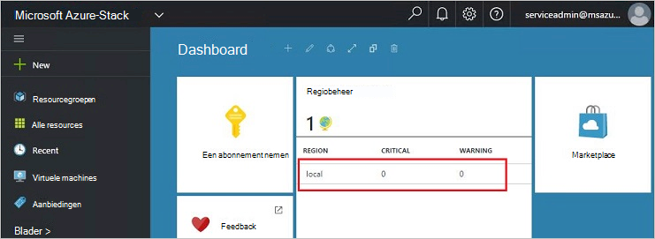
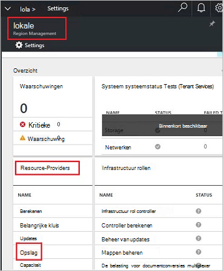
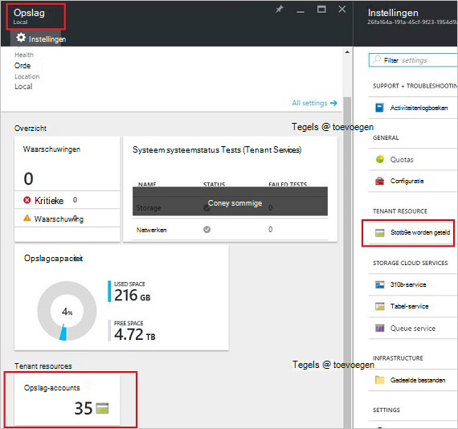
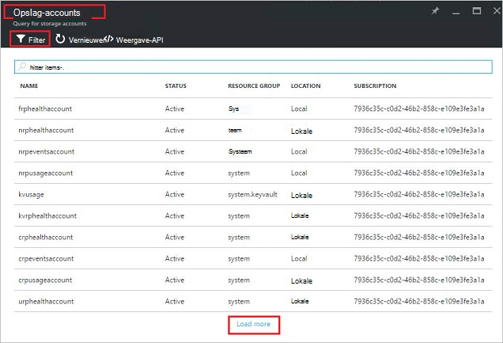
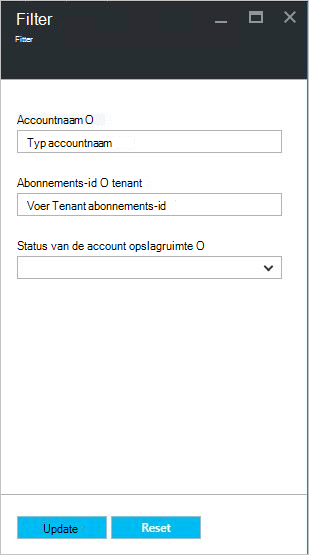
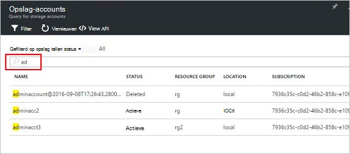
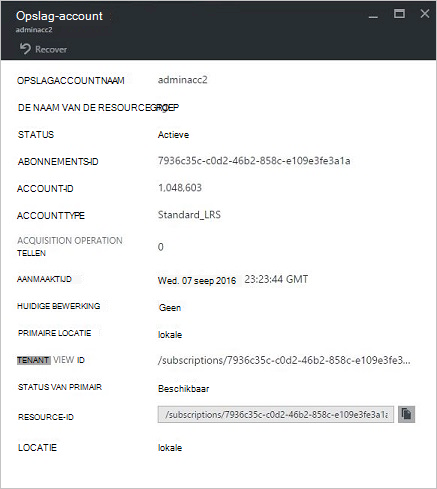
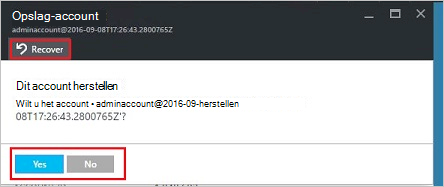
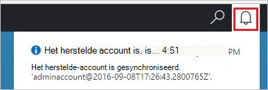
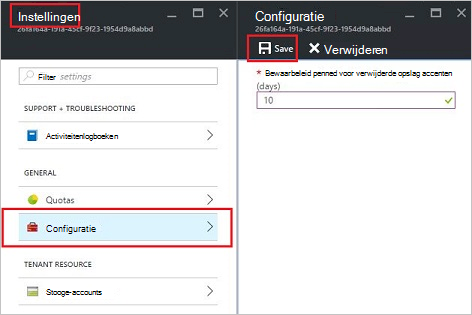

<properties
    pageTitle="Azure stapel opslag accounts beheren | Microsoft Azure"
    description="Meer informatie over het vinden, beheren, herstellen en vrij Azure stapel opslag-accounts"
    services="azure-stack"
    documentationCenter=""
    authors="AniAnirudh"
    manager="darmour"
    editor=""/>

<tags
    ms.service="azure-stack"
    ms.workload="na"
    ms.tgt_pltfrm="na"
    ms.devlang="na"
    ms.topic="get-started-article"
    ms.date="09/26/2016"
    ms.author="anirudha"/>

# <a name="manage-storage-accounts-in-azure-stack"></a>Opslag Accounts Azure gestapelde beheren

Informatie over het beheren van opslag-accounts in Azure stapel wilt zoeken, herstellen en vrij opslagcapaciteit op basis van de zakelijke behoeften.

## <a name="find-a-storage-account"></a>Een account opslag zoeken

De lijst met accounts van opslag in de regio kan worden weergegeven in de stapel Azure door:

1.  In een webbrowser en navigeer naar [https://portal.azurestack.local](https://portal.azurestack.local/).

2.  Meld u aan bij de portal Azure stapel als een beheerder (met de referenties die u tijdens de implementatie opgegeven)

3.  Zoek op het standaarddashboard – **regio management** lijst en klikt u op het gebied dat u verkennen wilt – bijvoorbeeld **(lokale**).

    

4.  Selecteer **opslag** in de lijst **Resource Providers** .

    

5.  Nu op het blad van opslag Resource Provider beheerder – Schuif omlaag naar het tabblad "Opslag accounts" en klik erop.

    
    
    De resulterende pagina is de lijst met accounts van opslag in die regio.

    

Standaard is de eerste 10 accounts worden weergegeven. U kunt kiezen om op te halen meer door te klikken op de koppeling "laden meer" onderaan in de lijst <br>
OF-BEWERKING <br>
Als u geïnteresseerd in een bepaalde opslag-account bent: u kunt **filteren en de bijbehorende rekeningen ophalen** alleen.<br>

U wilt filteren voor accounts:

1. Klik op de filterknop boven aan het blad.

2. Klik op het blad filter kunt dit u opgeven **accountnaam**,  **abonnements-ID** of **de status** om te verfijnen van de lijst met accounts van opslag moet worden weergegeven. Gebruik deze waar nodig.

3. Klik op bijwerken. De lijst moet dienovereenkomstig gewijzigd vernieuwen.

    

4. Als u wilt herstellen van het filter – klikt u op de filterknop, wis de selecties en bijwerken.

Het tekstvak Zoeken boven aan het blad van de lijst in de opslagruimte accounts, kunt u de geselecteerde tekst markeren in de lijst met accounts. Dit is heel handig in de zaak wanneer de volledige naam of id niet gemakkelijk beschikbaar is.<br>
U kunt hier gratis tekst gebruiken om te zoeken naar het account waarin u geïnteresseerd bent.




## <a name="look-at-account-details"></a>Bekijk de details

Nadat u de accounts die u geïnteresseerd bent in de weergave hebt gevonden, kunt u klikken op het bepaalde account om bepaalde berichtdetails te bekijken. Een nieuwe blade wordt geopend met de details van het account zoals het type account, Aanmaaktijd, locatie, enzovoort.




## <a name="recover-a-deleted-account"></a>Een verwijderde account herstellen

Het is mogelijk in een situatie waar u naartoe wilt herstellen van verwijderde account.<br>
Er is een zeer eenvoudige manier kunt doen in AzureStack.

1.  Blader naar de lijst opslag accounts gaan [Zie een account opslag zoeken](#find-a-storage-account)

2.  Zoek dat bepaalde account in de lijst. U wilt filteren.

3.  Controleer de status van het account. Dit moet ik me "' hebt verwijderd.

4.  Klik op het account dat het blad met account details wordt geopend.

5.  Zoek de knop 'herstellen' boven aan deze blade – en klik erop.

6.  Bevestig door te drukken, "Ja"

    

7.  Het herstelproces is nu in proces... wachten op aanduiding dat geslaagd is.
    U kunt ook klikken op het pictogram 'bel' boven aan de portal voortgang aanduidingen weergeven.

    

  Zodra het herstelde account wordt gesynchroniseerd, kan een teruggaan naar deze gebruiken.

### <a name="some-gotchas"></a>Sommige weetjes

- Uw verwijderde account weergeven status als "buiten het bewaarbeleid"

  Dit betekent dat het verwijderde account, de bewaarperiode heeft overschreden en niet hersteld meer worden kan.

- Uw verwijderde account wordt niet weergegeven in de accountlijst.

  Dit kan betekenen dat het verwijderde account al permanent verwijderd is heeft. In dit geval kan niet het worden hersteld meer. Zie "vrij capaciteit" hieronder.

## <a name="set-retention-period"></a>Bewaarperiode instellen

Bewaarbeleid periode instelling kan een beheerder om op te geven van een periode in dagen (tussen 0 en 9999 dagen) waarin mogelijk een verwijderde account kan worden hersteld. De bewaarperiode standaard is ingesteld op 15 dagen. Als de waarde op '0' betekent dat elk verwijderde account bewaarbeleid direct worden en dat is gemarkeerd voor periodieke opschonen.

De bewaarperiode – wijzigen

1.  In een webbrowser en navigeer naar [https://portal.azurestack.local](https://portal.azurestack.local/).

2.  Meld u aan bij de portal Azure stapel als een beheerder (met de referenties die u tijdens de implementatie opgegeven)

3.  Zoek op het standaarddashboard – **regio management** lijst en klikt u op het gebied dat u verkennen wilt – bijvoorbeeld **(lokale**).

4.  Selecteer **opslag** in de lijst **Resource Providers** .

5.  Klik op het pictogram instellingen in de rechterbovenhoek het blad instelling te openen.

6.  Klik op configuratie - bewaarperiode.

7.  U kunt de waarde bewerken en opslaan.

 Deze waarde wordt onmiddellijk van kracht en weerspiegelen over uw hele regio.



## <a name="reclaim-capacity"></a>Vrij capaciteit

Een van de effecten van de kant van een bewaarperiode ondervindt is dat een verwijderde account verbruik van capaciteit blijft totdat u afmelden bij de bewaarperiode gaat. Nu als een beheerder moet u mogelijk verwijderd een manier om dit vrij te maken accounts ruimte Hoewel de bewaarperiode is nog niet verlopen. Momenteel kunt u een opdrachtregel expliciet overschrijven de bewaarperiode en direct vrij capaciteit. Kunt doen:

1.  Voorwaarde dat u hebt Azure-PowerShell geïnstalleerd en geconfigureerd. Als dat niet Volg de instructies hier: als u wilt de nieuwste versie van Azure PowerShell installeren en koppelen aan uw Azure-abonnement, raadpleegt u [het installeren en configureren van Azure PowerShell](http://azure.microsoft.com/documentation/articles/powershell-install-configure/).
    Zie voor meer informatie over cmdlets Azure resourcemanager [Azure PowerShell gebruiken met Azure Resource Manager](http://go.microsoft.com/fwlink/?LinkId=394767)

2.  Deze cmdlet uitvoeren:

    ```
    PS C:\\>; Clear-ACSStorageAccount -ResourceGroupName system
    -FarmName <your farmname>
    ```

> Raadpleeg voor meer informatie [AzureStack powershell documentatie](https://msdn.microsoft.com/library/mt637964.aspx)

> [AZURE.NOTE] Deze cmdlet uitvoeren wordt definitief verwijderd het account en de inhoud ervan. Deze wordt niet meer worden hersteld. Wees voorzichtig met gebruiken.

