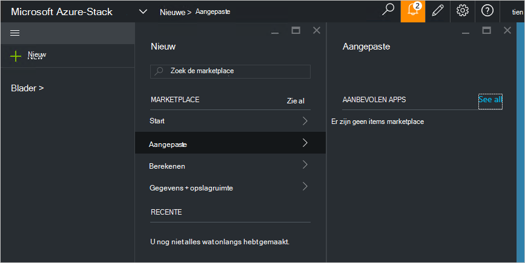

<properties
    pageTitle="Een aangepaste marketplace-item publiceren Azure gestapelde (service-beheerder) | Microsoft Azure"
    description="Informatie over het publiceren van een aangepaste marketplace-item Azure gestapelde als servicebeheerder van een."
    services="azure-stack"
    documentationCenter=""
    authors="rupisure"
    manager="byronr"
    editor=""/>

<tags
    ms.service="azure-stack"
    ms.workload="na"
    ms.tgt_pltfrm="na"
    ms.devlang="na"
    ms.topic="article"
    ms.date="09/26/2016"
    ms.author="rupisure"/>

# De stapel Azure Marketplace

De Marketplace is een verzameling items aangepast voor Azure-Stack, zoals services, toepassingen en resources. Het is de plaats waar tenants komen nieuwe resources maken en implementeren van nieuwe toepassingen. Servicebeheerders kunnen toevoegen aan de aangepaste items voor de Marketplace en tenants ziet deze direct af.

Als u wilt de Marketplace hebt geopend, klikt u op **Nieuw**.

De Marketplace wordt bijgewerkt om de vijf minuten.

## Marketplace-items

Elk item Marketplace heeft:

-   Een resourcemanager Azure-sjabloon voor het inrichten van resource

-   Metagegevens, zoals tekenreeksen, pictogrammen en andere marketingactiviteit activa

-   Opmaak van informatie naar het item in de portal weergeven

Elk item gepubliceerd naar de Marketplace gebruikt een indeling die het Azure-galerie-pakket (azpkg) genoemd. Implementatie of runtime resources (zoals code, zip-bestanden met de software of VM afbeeldingen) moeten worden toegevoegd aan Azure stapel afzonderlijk, niet als onderdeel van het Item Marketplace. 

## Volgende stappen

[Maken en publiceren van een item marketplace](azure-stack-create-and-publish-marketplace-item.md)
