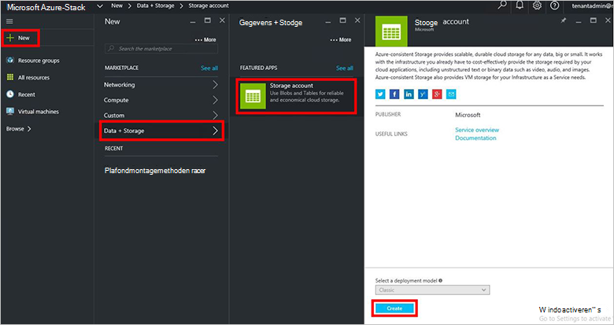
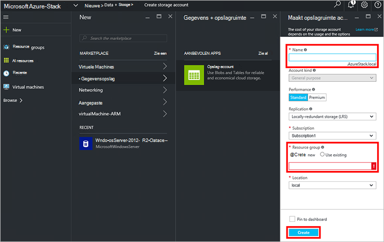
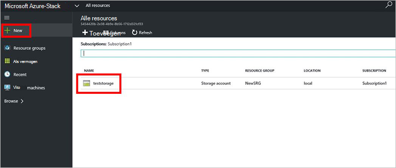

<properties
    pageTitle="Opslag accounts Azure gestapelde | Microsoft Azure"
    description="Informatie over het maken van een Azure stapel opslag-account."
    services="azure-stack"
    documentationCenter=""
    authors="ErikjeMS"
    manager="byronr"
    editor=""/>

<tags
    ms.service="azure-stack"
    ms.workload="na"
    ms.tgt_pltfrm="na"
    ms.devlang="na"
    ms.topic="get-started-article"
    ms.date="09/26/2016"
    ms.author="erikje"/>

# Opslag-accounts in Azure stapel

Opslag-accounts zijn Blob en tabel services en de unieke naamruimte voor uw gegevensobjecten opslag. Standaard is de gegevens in uw account alleen beschikbaar voor u, de accounteigenaar opslag.

1.  Op de computer Azure stapel Haalbaarheidstest, moet u zich aanmelden bij `https://portal.azurestack.local` als [een beheerder](azure-stack-connect-azure-stack.md#log-in-as-a-service-administrator)en klik op **Nieuw** > **gegevens + opslagruimte** > **opslag-account**.

    

2.  Typ een naam voor uw account opslagruimte in het blad **opslag-account maken** . Maak een nieuwe **Resourcegroep**, of Selecteer een bestaande en klik op **maken** om de opslag-account maken.

    

3. Als u wilt zien van uw nieuwe opslag-account, klikt u op **alle resources**, en vervolgens zoeken voor de opslag-account en klik op de naam.

    
    
## Volgende stappen

[Azure resourcemanager sjablonen gebruiken](azure-stack-arm-templates.md)

[Meer informatie over Azure opslag-accounts](../storage/storage-create-storage-account.md)

[De Azure stapel Azure-consistente opslag validatie gids downloaden](http://aka.ms/azurestacktp1doc)
