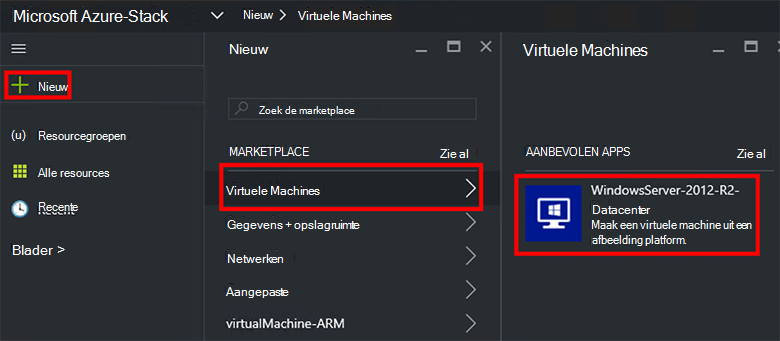
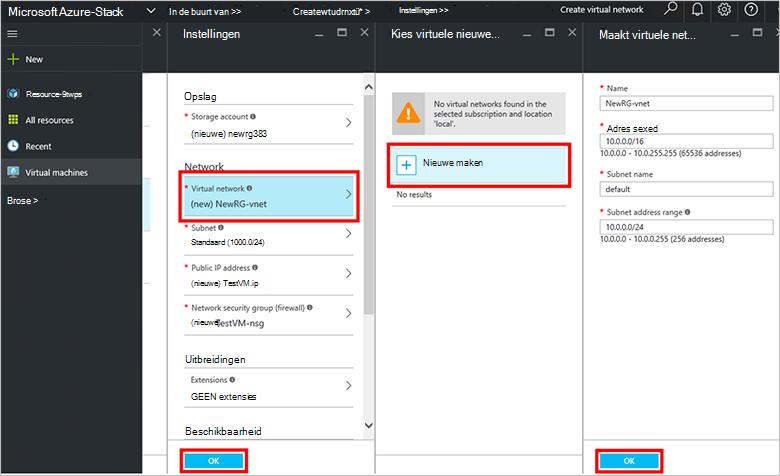
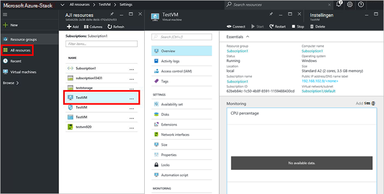

<properties
    pageTitle="Inrichten van een VM Azure gestapelde (tenant) | Microsoft Azure"
    description="Informatie over het inrichten van een VM Azure gestapelde als een tenant."
    services="azure-stack"
    documentationCenter=""
    authors="ErikjeMS"
    manager="byronr"
    editor=""/>

<tags
    ms.service="azure-stack"
    ms.workload="na"
    ms.tgt_pltfrm="na"
    ms.devlang="na"
    ms.topic="get-started-article"
    ms.date="10/12/2016"
    ms.author="erikje"/>

# Een virtuele machine inrichten

Als beheerder kunt u virtuele machines evalueren van resources voordat ze aanbod op abonnementen.

## Een virtuele machine inrichten

1.  Op de computer Azure stapel Haalbaarheidstest, moet u zich aanmelden bij `https://portal.azurestack.local` als [een beheerder](azure-stack-connect-azure-stack.md#log-in-as-a-service-administrator)en klik op **Nieuw** > **virtuele machines** > **WindowsServer-2012-R2-Datacenter**.  

    

2.  Typ een **naam**, **gebruikersnaam**en **wachtwoord**in het blad **Basisbeginselen** . Kies voor **VM schijftype** **harde schijf**. Kies een **abonnement**. Een **resourcegroep**maken of Selecteer een bestaande en klik vervolgens op **OK**.  

3.  Klik in het blad **Kies een grootte** op **Eenvoudige A1**en klik vervolgens op **selecteren**.  

4.  Klik in het blad **Instellingen** op **virtuele netwerk**. Klik in het blad **virtueel netwerk kiezen** , klikt u op **Nieuw**. De standaardinstellingen in het blad **virtueel netwerk maken** en klik op **OK**. Klik op **OK**in het blad **Instellingen** .

    

5.  Klik op **OK** als u wilt maken van de virtuele machine in het blad **Overzicht** .  

6. Als u wilt zien van uw nieuwe virtuele machine, klik op **alle resources**, en vervolgens zoeken voor de virtuele machine en klik op de naam.

    

## Volgende stappen

[Opslag-accounts](azure-stack-provision-storage-account.md)
