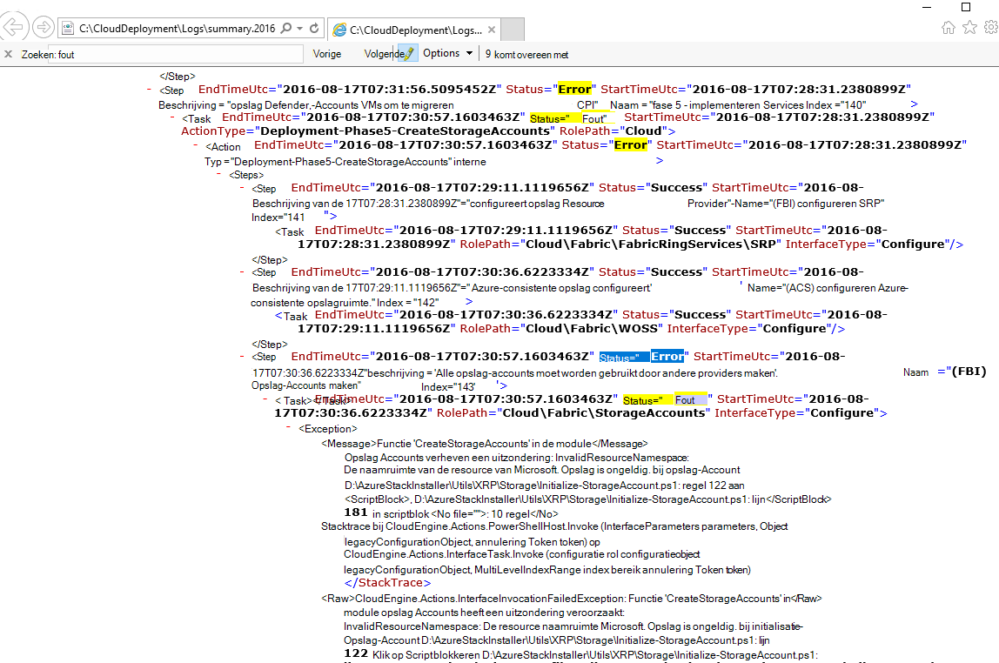
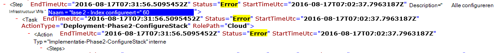

<properties
    pageTitle="Opnieuw een implementatie van een mislukte stap | Microsoft Azure"
    description="Als er een fout tijdens de implementatie optreden, kunt u proberen de volgende stappen uit als u wilt herhalen de implementatie van waar dit is mislukt."
    services="azure-stack"
    documentationCenter=""
    authors="ErikjeMS"
    manager="byronr"
    editor=""/>

<tags
    ms.service="azure-stack"
    ms.workload="na"
    ms.tgt_pltfrm="na"
    ms.devlang="na"
    ms.topic="get-started-article"
    ms.date="09/26/2016"
    ms.author="erikje"/>
    
# Opnieuw een implementatie van een mislukte stap uitvoeren
  
Als er een fout tijdens de implementatie optreden, kunt u proberen de volgende stappen uit als u wilt herhalen de implementatie van waar dit is mislukt.

## De fout zoeken

Breng notitie van de fout, specifiek het deel dat u af op welke stap de aanroep belt is mislukt. Bijvoorbeeld:

**2016-08-17: 00:30:57 fout 1 > 1 > actie: aanroep van de stap 60.140.143 is mislukt. Aanroep van actieplan stoppen.**

Dit is de implementatiestap waar u het opnieuw uitvoeren van de implementatie begint.

## Meer details over de fout zoeken

Als u meer informatie over de fout wilt, zoek het bijbehorende **overzicht. JJJJ-MM-DD.tt.N.log.xml** in de **C:\CloudDeployment\Logs\* * map.
Zoeken naar de tekenreeks "Fout" en volg deze omlaag door de uitvoer totdat er een grote hoeveelheid niet-XML-opgemaakt als tekst met het foutbericht wordt weergegeven (in dit gedeelte vaak valt samen met de laatste versie van de tekenreeks "Fout"). Bijvoorbeeld:

U kunt ook deze informatie gebruiken als u wilt bijhouden van de opnieuw stap, de getallen "Index" opvolgen via deze laatste fout. In de bovenstaande afbeelding, kunt u zien (beginnend vanaf de onderkant): 143, 140 en vervolgens als omhoog schuiven, ziet u 60:

Plaatsen dit allemaal samen (nu van boven naar beneden), krijgt u 60.140.143, net als in de PS console-uitvoer van de fout (zoals weergegeven in het gedeelte "Vinden van de fout" hierboven).

## De implementatie in een specifieke stap opnieuw uit te voeren

Nu dat u de stap die de implementatie is mislukt op hebt, kunt u proberen-opnieuw uitvoeren van de implementatie van deze stap.

> [AZURE.IMPORTANT] De volgende opdrachten moeten worden uitgevoerd door de juiste gebruiker, in de context van de fout die zijn aangebracht. Als de fout is opgetreden voordat de HOST is toegevoegd aan het domein, voert u deze stappen als het lokale beheerdersaccount. Als de fout is opgetreden nadat de HOST is toegevoegd aan het domein, voert u deze stappen als de beheerder van het domein (azurestack\azurestackadmin).

### De opdracht Roep-EceAction uitvoeren

1. Importeren vanuit een verhoogde PS-console, de volgende Modules:

        Import-Module C:\CloudDeployment\CloudDeployment.psd1 -Force
        Import-Module C:\CloudDeployment\ECEngine\EnterpriseCloudEngine.psd1 -Force 

2. Voer vervolgens de volgende opdracht (voorbeeld boven gebruikte hier):

        Invoke-EceAction -RolePath Cloud -ActionType Deployment -Start 60.140.143 -Verbose

3.  Hiermee wordt de implementatie van de stap die zijn geïdentificeerd starten door de - begin-parameter van de opdracht Roep-EceAction

### Resultaten van een - opnieuw uitvoeren/begin

Ongeacht de optie u kiest, de implementatie begint opnieuw starten van de opgegeven - parameter.

1.  Als de fout hersteld is, blijft de implementatie tot aan de voltooiing.

2.  Als de implementatie opnieuw op mislukt...
    
    - dezelfde plaats: de fout is waarschijnlijk niet worden hersteld, en verder onderzoek is vereist.

    - een nieuwe locatie na waar dit is mislukt ditmaal: kunt u deze stappen om de host verbinding opnieuw te proberen.

    - een nieuwe locatie voordat u waar dit is mislukt ditmaal: iets anders is een fout opgetreden met een aanroep idempotency is ingeschakeld, die is vereist verder onderzoek.

## Volgende stappen

[Verbinding maken met Azure stapel](azure-stack-connect-azure-stack.md)

