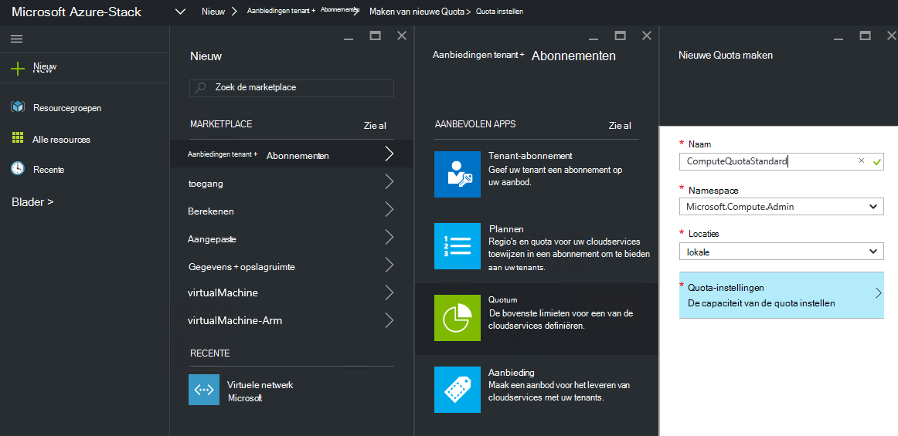
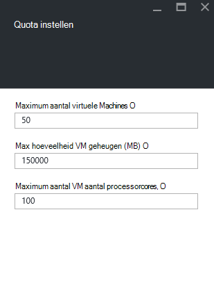
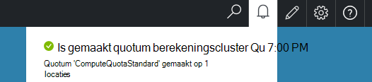

<properties
    pageTitle="Quota's in Azure stapel | Microsoft Azure"
    description="Beheerders van de instellen quota voor het beperken van de maximale hoeveelheid resources die tenants toegang tot hebben."
    services="azure-stack"
    documentationCenter=""
    authors="mattmcg"
    manager="byronr"
    editor=""/>

<tags
    ms.service="azure-stack"
    ms.workload="na"
    ms.tgt_pltfrm="na"
    ms.devlang="na"
    ms.topic="get-started-article"
    ms.date="09/26/2016"
    ms.author="mattmcg"/>

# Quota Azure gestapelde instellen

Quota's definiëren die de grenzen van resources die een tenant-abonnement kunt inrichten of gebruiken. Een quotum kunt bijvoorbeeld een tenant maximaal vijf VMs maken. Als u wilt een service toevoegen aan een abonnement, moet de beheerder de instellingen voor deze service configureren.

Quota's worden geconfigureerd per service en per locatie, om beheerders te leveren gedetailleerde controle over het verbruik van de resource. Beheerders kunnen maken van een of meer quotum voor resources en koppel deze aan abonnementen, hetgeen betekent dat ze kunnen gesplitste aanbiedingen voor hun services bieden. Quota voor een bepaalde dienst kunnen worden gemaakt van het blad voor het beheer van **Resource-Provider** voor deze service.

Een tenant die zich abonneert op een aanbieding met meerdere abonnementen kunt alle resources die beschikbaar in elk plan zijn gebruiken.

## Naar de quota van een IaaS maken

1.  Ga naar [https://portal.azurestack.local](https://portal.azurestack.local/)in een browser.

    Meld u aan bij de portal Azure stapel als een beheerder (via de referenties die u hebt opgegeven tijdens de implementatie).

2.  Selecteer **Nieuw**en selecteer vervolgens **Quotum**.

3.  Selecteer de eerste service waarvoor u wilt een quota maken. Volg deze stappen voor het berekeningscluster-, netwerk- en -services voor een quotum IaaS.
In dit voorbeeld maken we eerst een quota voor de service berekeningscluster. Selecteer in de lijst **Namespace** de naamruimte **Microsoft.Compute.Admin** .

    > 

4.  Kies de locatie waar het quotum is gedefinieerd (bijvoorbeeld 'local').

5.  Klik op het artikel **Quota-instellingen** , wordt er aangegeven dat **de capaciteit van Quota instellen**. Klik op dit item om het Quotuminstellingen te configureren.

6.  Op het blad **Quota instellen** ziet u alle berekeningscluster resources waarvoor u limieten kunt configureren. Elk type heeft een standaardwaarde die is gekoppeld. U kunt deze waarden wijzigen of kunt u de knop **Ok** onderaan in het blad de standaardinstellingen te accepteren.

    > 

7.  Nadat u de waarden geconfigureerd en **Ok**hebt geklikt, wordt het item **Quotuminstellingen** weergegeven als **geconfigureerd**. Klik op **Ok** als u wilt maken van de resource **Quotum** .

    Hier ziet u een melding dat aangeeft dat de quota resource wordt gemaakt.

8.   Nadat de set quotum is gemaakt, ontvangt u een tweede kennisgeving. Het quotum voor de service berekeningscluster is nu klaar voor zijn gekoppeld aan een abonnement. Herhaal deze stap met het netwerk- en -services en u klaar bent voor het maken van een abonnement IaaS!

    >   

## Quotatypen berekenen

|**Type**                    |**Standaardwaarde**| **Beschrijving**|
|--------------------------- | ------------------------------------|------------------------------------------------------------------|
|Maximumaantal virtuele machines   |50|Het maximum aantal virtuele machines die een abonnement op deze locatie kunt maken. |
|Maximumaantal VM cores              |100|Het maximum aantal cores die een abonnement op deze locatie kunt maken (bijvoorbeeld een VM A3 vier cores heeft).|
|Max hoeveelheid VM geheugen (GB)         |150|De maximale hoeveelheid die kan worden ingericht in megabytes (bijvoorbeeld een VM A1 1,75 GB RAM verbruikt).|

> [AZURE.NOTE] Berekent de quota's worden niet in deze technische bètaversie van afgedwongen.

## Opslag quotatypen

|**Item**                           |**Standaardwaarde**   |**Beschrijving**|
|---------------------------------- |------------------- |-----------------------------------------------------------|
|Maximale capaciteit (GB)              |500                 |Totale opslagcapaciteit die kan worden gebruikt door een abonnement op deze locatie.|
|Totaal aantal opslag-accounts   |20                  |Het maximum aantal opslag-accounts die een abonnement op deze locatie kunt maken.|

## Quotatypen

|**Item**                                                   |**Standaardwaarde**   |**Beschrijving**|
|----------------------------------------------------------| ------------------- |--------------------------------------------------------------------------------------------------------------------------------------------------------------------|
| Max openbare IP-adressen                         |50                  |Het maximum aantal openbare IP-adressen die een abonnement op deze locatie kunt maken. |
| Max virtuele netwerken                   |50                  |Het maximum aantal virtuele netwerken die een abonnement op deze locatie kunt maken. |
| Max virtueel netwerkgateways           |1                   |Het maximum aantal virtueel netwerkgateways (VPN Gateways) die een abonnement op deze locatie kunt maken. |
| Max netwerkverbindingen                |2                   |Het maximum aantal netwerkverbindingen (punt of site-naar-site) die een abonnement voor alle virtuele netwerkgateways op deze locatie maken kan. |
| Max netwerktaakverdelers                     |50                  |Het maximum aantal netwerktaakverdelers die een abonnement op deze locatie kunt maken. |
| Max NIC 's                               |100                 |Het maximum aantal netwerkinterfaces die een abonnement op deze locatie kunt maken. |
| Max netwerk beveiligingsgroepen            |50                  |Het maximum aantal netwerk-beveiligingsgroepen die een abonnement op deze locatie kunt maken. |
