<properties
    pageTitle="De resource-provider voor SQL Server op Azure Stack implementeren | Microsoft Azure"
    description="Gedetailleerde stappen voor het implementeren van een SQL Server Resource Provider Adapter op Azure-Stack."
    services="azure-stack"
    documentationCenter=""
    authors="Dumagar"
    manager="byronr"
    editor=""/>

<tags
    ms.service="multiple"
    ms.workload="na"
    ms.tgt_pltfrm="na"
    ms.devlang="na"
    ms.topic="article"
    ms.date="09/26/2016"
    ms.author="dumagar"/>

# De SQL Server Resource Provider Adapter op Azure Stack implementeren

> [AZURE.NOTE] De volgende informatie is alleen van toepassing op Azure stapel TP1 implementaties.

Lees dit artikel als u de gedetailleerde stappen voor het instellen van de SQL Server Resource Provider Adapter op de bewijs van haalbaarheidstest Azure-Stack te volgen. Zie [SQL-databases op Azure Stack gebruiken](azure-stack-sql-rp-deploy-short.md) voor meer informatie over de mogelijkheden van resource-provider en architectuur.

## Stappen hebt ingesteld voordat u implementeren

Voordat u de resource-provider implementeert, moet u naar:

- Hebt u de afbeelding van een standaard-Windows Server met .NET 3.5
- Verbeterde beveiliging van Internet Explorer (IE) uitschakelen
- Installeer de meest recente versie van Azure PowerShell

### Maken van een afbeelding van Windows Server, zoals .NET 3.5

Als u de stapel Azure-bits na 2/23/2016 gedownload, omdat de standaardafbeelding voor de basis Windows Server 2012 R2 .NET 3.5 framework in deze downloaden en hoger bevat, kunt u deze stap overslaan.

Als u vóór 2/23/2016 hebt gedownload, moet u een Windows Server 2012 R2 Datacenter VHD met .NET 3.5-afbeelding maken en instellen als de standaardafbeelding in de bibliotheek Platform afbeelding is.

### Uitschakelen IE enhanced cookies beveiligings- en inschakelen

Als u wilt implementeren een resource-provider, uitvoeren u de filter geïntegreerde uitvoeren van scripts-omgeving (wissen) als een beheerder, dus moet u toestaan dat cookies en JavaScript in het Internet Explorer-profiel dat u gebruikt voor zowel de beheerder als de gebruiker aanmeldingen aanmelden bij Azure Active Directory.

**Als u wilt uitschakelen IE verbeterde beveiliging:**

1. Meld u aan bij de computer Azure stapel bewijs-van-concept (haalbaarheidstest) als een AzureStack/beheerder en open vervolgens Serverbeheer.

2. **Verbeterde beveiliging van IE** voor zowel beheerders en gebruikers uitschakelen.

3. Meld u aan bij de **ClientVM.AzureStack.local** virtuele machine als een beheerder en open vervolgens Serverbeheer.

4. **Verbeterde beveiliging van IE** voor zowel beheerders en gebruikers uitschakelen.

**Cookies inschakelen:**

1. Klik op het startscherm van Windows, klikt u op **alle apps**, Bureau- **accessoires van Windows**, met de rechtermuisknop op **Internet Explorer**, wijs **meer**en klik vervolgens op **Als administrator uitvoeren**.

2. Als u wordt gevraagd, controleren **Gebruik aanbevolen beveiliging**en klik vervolgens op **OK**.

3. Klik in Internet Explorer op de **Extra (tandwielpictogram)** &gt; **Internetopties** &gt; tabblad **Privacy** .

4. Klik op **Geavanceerd**, zorg ervoor dat beide knoppen **accepteren** zijn geselecteerd, klikt u op **OK**en klik vervolgens nogmaals op **OK** .

5. Sluit Internet Explorer en start opnieuw PowerShell ISE als beheerder.

### Een Azure stapel compatibele versie van Azure PowerShell installeren

1. Verwijder eventuele bestaande Azure PowerShell van uw VM-Client.

2. Meld u aan bij de computer Azure stapel Haalbaarheidstest als AzureStack/beheerder.

3. Met extern bureaublad, meld u aan bij de **ClientVM.AzureStack.local** virtuele machine als beheerder.

4. Open het Configuratiescherm, klikt u op **een programma verwijderen** &gt; klikt u op **Azure PowerShell** &gt; Klik op **verwijderen**.

5. [Download de meest recente Azure PowerShell die ondersteuning biedt voor Azure stapel](http://aka.ms/azstackpsh) en installeer deze.

    Nadat u PowerShell hebt geïnstalleerd, kunt u deze controle PowerShell-script om ervoor te zorgen dat u verbinding met uw Azure stapel-exemplaar maken kunt (een webpagina login moet worden weergegeven) kunt uitvoeren.

## De resource provider implementatie PowerShell bootstrap

1. Het externe bureaublad Azure stapel Haalbaarheidstest verbinden met clientVm.AzureStack.Local en meld u aan als azurestack\\azurestackuser.

2. [De binaire SQLRP bestanden downloaden](http://aka.ms/massqlrprfrsh) -bestand. Mogelijk moet u de blokkering van Internet downloaden beveiliging verwijderen via het contextmenu op het bestand, selecteer **Eigenschappen** en naar het tabblad **Algemeen** maatstreepjes **deblokkeren**, **OK**. Hierdoor 'Kan niet worden geladen bestand of constructie' uitzonderingen die betrekking hebben op DeploymentTelemetry.dll en de volgende uitzonderingen voor de Trace-implementatie.

3. Pak de bestanden naar D:\\SQLRP.

4. D: uitvoeren\\SQLRP\\Bootstrap.cmd-bestand als een beheerder (azurestack\\beheerder).

    Hiermee opent het bestand Bootstrap.ps1 in de PowerShell ISE.

5. Wanneer het venster PowerShell ISE is voltooid laden, klikt u op de knop afspelen of druk op F5.

    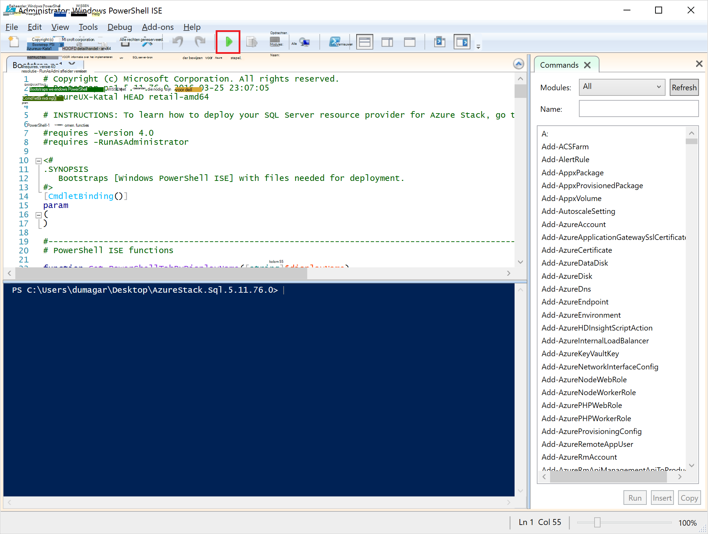

    Twee belangrijkste tabbladen wordt geladen, elk met alle scripts en bestanden die u moet implementeren van de resource-provider.

## Vereisten voor voorbereiden

Klik op het tabblad **Vereisten voorbereiden** om:

- Vereiste certificaten maken
- Onderdelen uploaden naar een opslagruimte op Azure-Stack
- Galerie items publiceren

### De vereiste certificaten maken
Dit script **Nieuw SslCert.ps1** voegt u de \_. AzureStack.local.pfx SSL-certificaat naar de D:\\SQLRP\\vereisten\\BlobStorage\\Container map. Het certificaat beveiligt communicatie tussen de provider van de resource en het lokale exemplaar van de Azure Resource Manager.

1. Klik op het tabblad **Nieuw SslCert.ps1** in het primaire tabblad **Voorbereiden vereisten** en worden uitgevoerd.

2. In het dialoogvenster dat wordt weergegeven, typt u een wachtwoord PFX persoonlijke sleutel en **noteert u dit wachtwoord**te beschermen. U moet deze later.

### Alle onderdelen uploaden naar een opslagruimte op Azure-Stack

1. Klik op het tabblad **Upload-Microsoft.Sql-RP.ps1** en worden uitgevoerd.

2. Typ in het dialoogvenster Windows PowerShell referentie verzoek om de referenties van Azure stapel service-beheerder.

3. Wanneer u hierom wordt gevraagd voor de Azure Active Directory-Tenant-ID, typt u de volledig gekwalificeerde domeinnaam van de Azure Active Directory-tenant: bijvoorbeeld microsoftazurestack.onmicrosoft.com.

    Een pop-upvenster wordt gevraagd om referenties.

    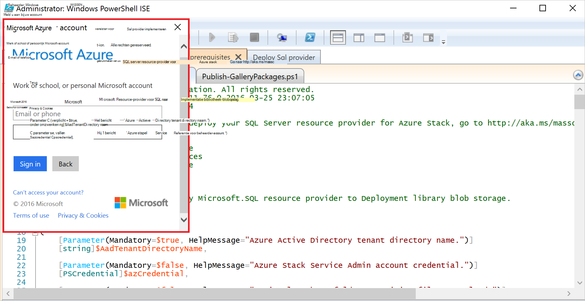

    > [AZURE.TIP] Als het pop-upvenster niet wordt weergegeven, u die dit nog niet hebt hetzij IE uitgeschakeld verbeterde beveiliging JavaScript inschakelen op deze computer- en of u dit nog niet hebt geaccepteerd cookies in Internet Explorer. Zie [stappen voordat u implementeert instellen](#set-up-steps-before-you-deploy).

4. Typ uw beheerdersreferenties Azure stapel Service en klik vervolgens op **Aanmelden**.

### Galerie met items voor het maken van de resource later publiceren

Selecteer het tabblad **Publiceren-GalleryPackages.ps1** en worden uitgevoerd. Dit script worden opgeteld twee marketplace-items van de portal van de stapel Haalbaarheidstest van Azure marketplace die u gebruiken kunt om te implementeren database resources als marketplace-items.

## De Provider voor SQL Server Resource VM implementeren

Nu dat u hebt de haalbaarheidstest Azure stapel met de benodigde certificaten en marketplace items voorbereid, kunt u een Resource Provider voor SQL Server implementeren. Klik op het tabblad **implementeren SQL-provider** om:

   - Verstrek waarden in een JSON-bestand dat de implementatieproces verwijst naar
   - De resource-provider implementeren
   - De lokale DNS-records bijwerken
   - De SQL Server Resource Provider Adapter registreren

### Verstrek waarden in de JSON-bestand

Klik op **Microsoft.Sqlprovider.Parameters.JSON**. Dit bestand heeft parameters dat de sjabloon Azure resourcemanager moet behoren implementeren naar Azure stapel.

1. Vul de **lege** parameters in de JSON-bestand:

    - Controleer of dat u de **adminusername** en **beheerderswachtwoord** bieden voor de SQL Resource Provider VM:

        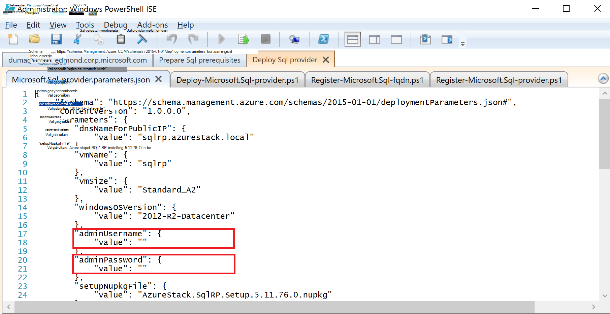

    - Controleer of dat u het wachtwoord voor de parameter weer **SetupPfxPassword** die u een genoteerd in de stap [voorbereiden prequisites hebt](#prepare-prerequisites) opgeven:

    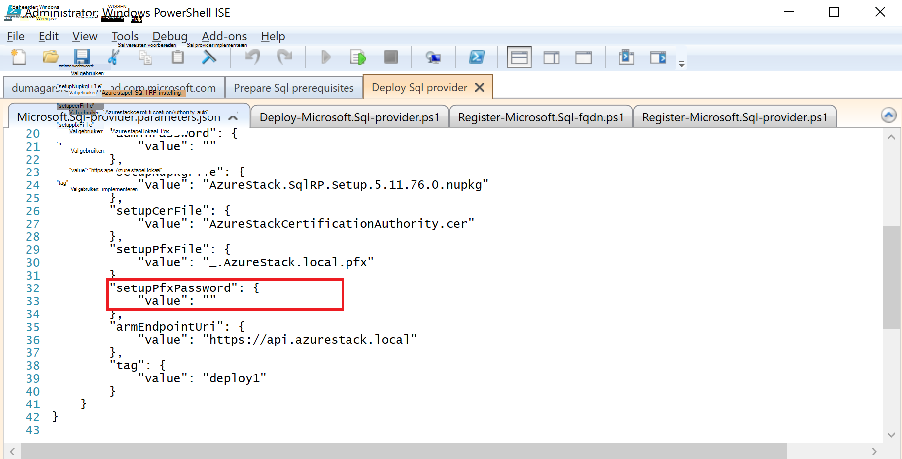

2. Klik op **Opslaan** als de parameterbestand wilt opslaan.

### De resource-provider implementeren

1. Klik op het tabblad **Deploy-Microsoft.sql-provider.PS1** en het script uitvoeren.
2. Typ de naam van de tenant in Azure Active Directory wanneer u wordt gevraagd.
3. In het pop-upvenster indienen uw beheerdersreferenties voor stapel Azure-service.

De volledige implementatie duurt tussen 25 en 55 minuten op sommige ten zeerste gebruikte Azure stapel POCs. De langste stappen zijn de extensie gewenst staat configuratie (DSC) en de PowerShell-uitvoering, dat wil de laatste stap zeggen. Elk kan 10-25 minuten duren.

### De lokale DNS-records bijwerken

1. Klik op het tabblad van de **Register-Microsoft.SQL-fqdn.ps1** en het script uitvoeren.
2. Wanneer u wordt gevraagd voor Azure Active Directory-Tenant-ID, de volledig gekwalificeerde domeinnaam van de Azure Active Directory-tenant input: bijvoorbeeld **microsoftazurestack.onmicrosoft.com**.

### De Resource-Provider voor SQL-RP registreren##

1. Klik op het tabblad van de **Register-Microsoft.SQL-provider.ps1** en het script uitvoeren.

2. Wanneer u hierom wordt gevraagd om referenties, gebruikt u de volgende waarden voor de gebruikersnaam en wachtwoord:

   - **sqlRpUsername**
   - **sqlRpPassw0rd**

   > [AZURE.IMPORTANT] Dit zijn de *letterlijke* waarden die u nodig hebt om te typen wanneer u wordt gevraagd om referenties. Hierna ziet u geen tijdelijke aanduidingen. * *Kan *niet* type ** de username\password die u hebt opgeslagen in de parameterbestand voordat de VM wordt geïmplementeerd.

## Controleer of de implementatie met behulp van de Azure stapel-Portal

1. Meld u af bij de ClientVM en opnieuw aanmelden als **AzureStack\AzureStackUser**.

2. Klik op het bureaublad, op **Azure stapel Haalbaarheidstest Portal** en meld u aan bij de portal als de service-beheerder.

3. Controleer of dat de implementatie is voltooid. Klik op **Bladeren** &gt; **Resourcegroepen** &gt; klikt u op de resourcegroep die u hebt gebruikt (standaard is **SQLRP**), en zorg ervoor dat het essentials deel van het blad (bovenste helft) **implementatie is voltooid lezen**.

      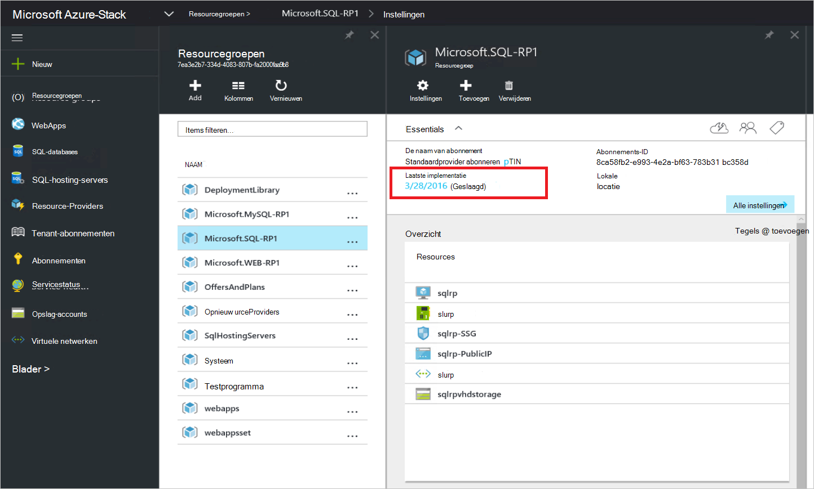

4. Controleer of dat de registratie is voltooid. Klik op **Bladeren** &gt; **Resource providers**en zoek naar een **Lokale SQL**:

      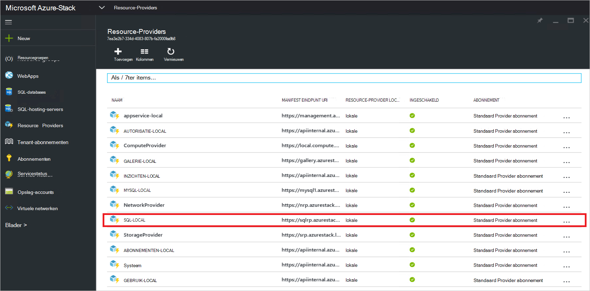

## Een hebben met uw Provider van de Resource SQL door deze verbinding te maken met een hostingprovider SQL server

1. Meld u aan bij de portal Azure stapel Haalbaarheidstest als een servicebeheerder

2. Klik op **Resource Providers** &gt; **SQL lokaal** &gt; **gaat u naar Provider resourcebeheer** &gt; **Servers** &gt; **toevoegen**.

    Het blad **Hostingprovider SQL-Servers** is waar u de Provider voor SQL Server Resource kunt koppelen aan de werkelijke exemplaren van SQL Server die als de backend van de resource-provider fungeren.

    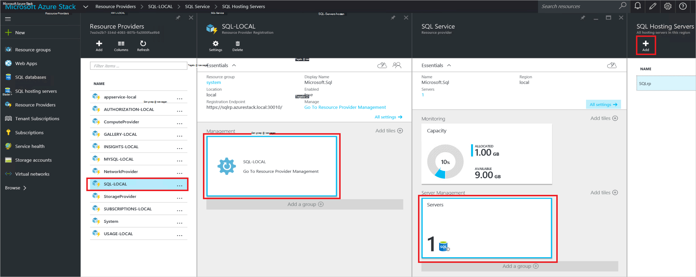

3. Vul het formulier met de details van de verbinding van uw SQL Server-instantie. Standaard een vooraf geconfigureerde SQL Server genoemd 'SQLRP' met de beheerdersgebruikersnaam 'sa' en het wachtwoord die u in de parameter 'beheerderswachtwoord' in de parameters die JSON wordt uitgevoerd op de VM wordt genoemd.

## Uw eerste SQL-Database als u wilt testen, uw implementatie maken

1. Meld u aan bij de portal Azure stapel Haalbaarheidstest als service-beheerder.

2. Klik op **Bladeren** &gt; **SQL-Databases** &gt; **toevoegen**
  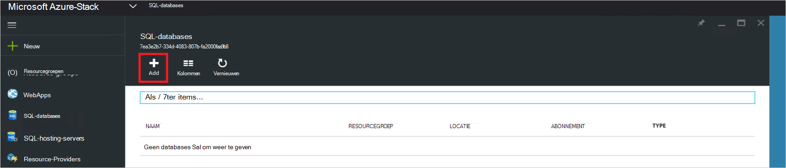

3. Vul het formulier met informatie over de database, inclusief een **Servernaam**, **Aanmelden bij Server-beheerder**en **wachtwoord** voor een nieuwe *virtuele server* in het blad **Nieuwe Server** in.

    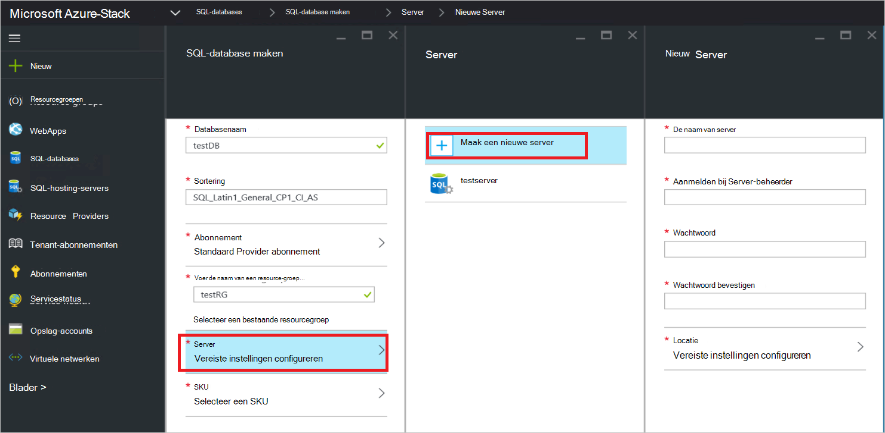

    Het virtuele server is een kunstmatige constructie. Deze niet wordt toegewezen aan de SQL-Server zelf, maar in plaats daarvan manifesten tot en met de gebruikersnaam in de verbindingsreeks, die de provider van de resource wordt gegenereerd aan het einde van dit proces. **Opmerking het wachtwoord die u voor de virtuele server afzonderlijk invoert**. Het wachtwoord wordt nooit weergeven met de portal.

4. U wordt gevraagd of kies een prijzen laag voor de database.

    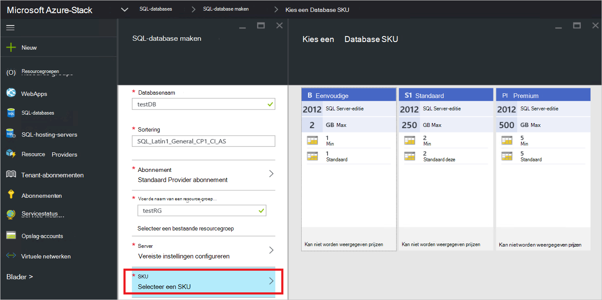

    Lagen zijn niet geïmplementeerd in deze versie, maar hun verbruik door de Azure Resource Manager wordt bijgehouden als een manier om te laten van de indeling die u in het afdwingen van quota enzovoort maken kunt.

5. Het formulier verzenden en wacht totdat de implementatie om te voltooien.

6. In het resulterende blad, ziet u het veld "Verbindingsreeks". In de stapel Azure kunt u die tekenreeks in een toepassing die moeten worden SQL Server-toegang (bijvoorbeeld een WebApp).

    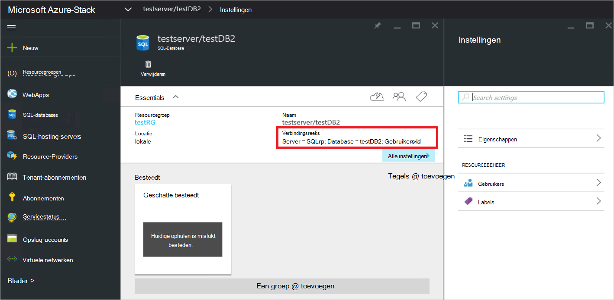

## Volgende stappen

Probeer andere [PaaS services](azure-stack-tools-paas-services.md) , zoals de [provider van de resource MySQL-Server](azure-stack-mysql-rp-deploy-short.md) en de [Web Apps resource provider](azure-stack-webapps-deploy.md).
