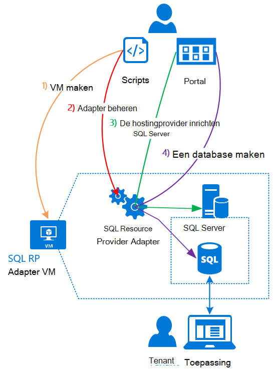

<properties
    pageTitle="Met SQL-databases op Azure stapel | Microsoft Azure"
    description="Leer hoe u SQL-databases kunt implementeren als een service op Azure stapel en de snelle stappen om de SQL Server resource provider adapter implementeren."
    services="azure-stack"
    documentationCenter=""
    authors="Dumagar"
    manager="byronr"
    editor=""/>

<tags
    ms.service="multiple"
    ms.workload="na"
    ms.tgt_pltfrm="na"
    ms.devlang="na"
    ms.topic="article"
    ms.date="09/26/2016"
    ms.author="dumagar"/>

# SQL-databases op Azure stapel gebruiken

> [AZURE.NOTE] De volgende informatie is alleen van toepassing op Azure stapel TP1 implementaties.

Gebruik de SQL Server resource provider adapter SQL-databases weergegeven als een service van Azure stapel. Nadat u de resource-provider, kunnen u en uw gebruikers databases maken voor cloud-eigen apps, website die zijn gebaseerd op SQL en werkbelasting die zijn gebaseerd op SQL zonder voor het inrichten van een virtuele machine (VM) die als host fungeert voor SQL Server telkens wanneer.

Omdat de resource-provider geen alle mogelijkheden van Azure SQL-Database tijdens het bewijs van haalbaarheidstest, wordt in dit artikel begint met een overzicht van de architectuur van de provider resource. Vervolgens krijgt u een beknopt overzicht van de stappen voor het instellen van de resource-provider, met koppelingen naar de meer gedetailleerde stappen in [de SQL-Database resource provider adapter op Azure stapel Haalbaarheidstest Deploy](azure-stack-sql-rp-deploy-long.md).

## SQL Server resource provider adapter architectuur
De resource-provider niet alle de database mogelijk beheermogelijkheden van Azure SQL-Database. Bijvoorbeeld elastische database pools en de mogelijkheid om te bellen van de prestaties van de database omhoog en omlaag in de browser zijn niet beschikbaar. De resource-provider ondersteunt echter de dezelfde maken, lezen, bijwerken en verwijderd (CRUD) bewerkingen dat beschikbaar is in Azure SQL-Database.

De resource-provider bestaat uit drie componenten:

- **De SQL resource provider adapter VM**, wat overeenkomt met het proces van resource-provider en de servers die als host van SQL Server.
- **De resource-provider zelf**, die inrichten verzoeken verwerkt en beschrijft database resources.
- **Servers die SQL Server hosten**, die capaciteit voor databases bieden.

De volgende conceptueel diagram ziet u deze onderdelen en de stappen die u gaat doorlopen wanneer u de resource-provider implementeren, van een server die als host fungeert voor SQL Server instellen en klikt u vervolgens een database maken.

## Snelle stappen om te implementeren van de resource-provider
Gebruik deze stappen als u al bekend met Azure stapel bent. Als u meer informatie wilt, volgt u de koppelingen in elke sectie of Ga rechtstreeks naar [de SQL-Database resource provider adapter op Azure stapel Haalbaarheidstest Deploy](azure-stack-sql-rp-deploy-long.md).

1.  Controleer of dat u alle [stappen voordat u implementeert instellen](azure-stack-sql-rp-deploy-long.md#set-up-steps-before-you-deploy) de resource-provider hebt voltooid:

  - .NET 3.5 framework is al in de Windows Server afbeelding ingesteld. (Als u de stapel Azure-bits gedownload na 23 februari 2016, kunt u deze stap overslaan.)
  - [Een versie van Azure PowerShell die compatibel is met Azure stapel is geïnstalleerd](http://aka.ms/azStackPsh).
  - In Internet Explorer beveiligingsinstellingen op de ClientVM, [Internet Explorer Verbeterde beveiliging is uitgeschakeld en cookies zijn ingeschakeld](azure-stack-sql-rp-deploy-long.md#Turn-off-IE-enhanced-security-and-enable-cookies).

2. [Download het bestand van SQL Server RP binaire bestanden](http://aka.ms/massqlrprfrsh) en pak het de ClientVM in uw Azure stapel Haalbaarheidstest.

3. [Bootstrap.cmd en scripts worden uitgevoerd](azure-stack-sql-rp-deploy-long.md#Bootstrap-the-resource-provider-deployment-PowerShell-and-Prepare-for-deployment).

    Een set van scripts is gegroepeerd op de twee belangrijkste tabbladen openen in het filter geïntegreerde uitvoeren van scripts omgeving (wissen). Alle geladen scripts uitvoeren in de volgorde van links naar rechts op elk tabblad.

    1. Een script uitvoeren op het tabblad **voorbereiden** van links naar rechts naar:

        - Een certificaat jokertekens als u wilt beveiligen van de communicatie tussen de provider van de resource en Azure resourcemanager maken.
        - Upload de certificaten en alle andere onderdelen aan een account opslag voor Azure-Stack.
        - Galerie-pakketten publiceren zodat u SQL versus bronnen via de galerie implementeren kunt.

        > [AZURE.IMPORTANT] Als een van de scripts vastloopt om geen zichtbare reden dan ook na het versturen van de Azure Active Directory-tenant, is het mogelijk dat uw beveiligingsinstellingen voor een DLL die nodig is voor de implementatie om uit te voeren blokkeert. U lost dit probleem, zoekt u de Microsoft.AzureStack.Deployment.Telemetry.Dll in de map provider resource, met de rechtermuisknop klikt u op **Eigenschappen**en klik vervolgens in het tabblad **Algemeen** inchecken **deblokkeren** .

    1. Een script uitvoeren op het tabblad **Deploy** van links naar rechts naar:

        - [Deploy een VM](azure-stack-sql-rp-deploy-long.md#Deploy-the-SQL-Server-Resource-Provider-VM) waarop uw provider van de resource en de SQL Server. Dit script verwijst naar een bestand van de parameter JSON, die u bijwerken met enkele waarden wilt voordat u het script uitvoeren.
        - [Een lokale DNS-record hebt geregistreerd](azure-stack-sql-rp-deploy-long.md#Update-the-local-DNS) die is toegewezen aan uw provider resource VM.
        - [Provider van de resource hebt geregistreerd](azure-stack-sql-rp-deploy-long.md#Register-the-SQL-RP-Resource-Provider) met de lokale Azure Resource Manager.

        > [AZURE.IMPORTANT] Alle scripts wordt ervan uitgegaan dat de afbeelding basis-besturingssysteem voldoet aan de vereisten (.NET 3.5 geïnstalleerd, JavaScript en cookies ingeschakeld op de ClientVM en een compatibele versie van Azure PowerShell geïnstalleerd). Als u fouten krijgt wanneer het uitvoeren van scripts, controleert u dat u de voorwaarden hebt voldaan.

6. [Verbinding maken met de resource-provider op een server die host voor SQL Server fungeert](#Provide-capacity-to-your-SQL-Resource-Provider-by-connecting-it-to-a-hosting-SQL-server) in de portal Azure stapel. Klik op **Bladeren** &gt; **Resource Providers** &gt; **SQLRP** &gt; **gaat u naar Provider resourcebeheer** &gt; **Servers** &gt; **toevoegen**.

    Gebruik "sa" voor de gebruikersnaam en het wachtwoord dat u gebruikt wanneer u de resource-provider VM geïmplementeerd.

7. [Test uw nieuwe resource provider voor SQL Server](/azure-stack-sql-rp-deploy-long.md#create-your-first-sql-database-to-test-your-deployment)implementeren een SQL-database in de portal Azure stapel. Klik op **maken** &gt; **aangepaste** &gt; **SQL Server-Database**.

Dit moet de SQL Server resource provider en uit te voeren in ongeveer 45 minuten (afhankelijk van de hardware) krijgen.
