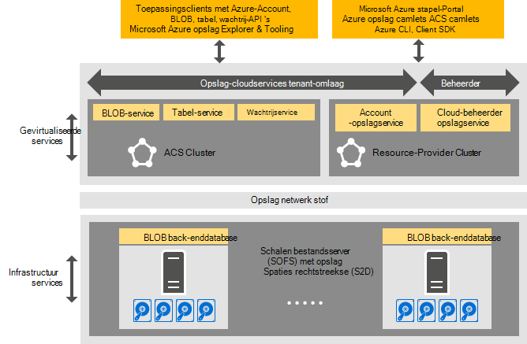

<properties
    pageTitle="Inleiding tot Azure-consistente opslag | Microsoft Azure"
    description="Meer informatie over Azure-consistente opslag"
    services="azure-stack"
    documentationCenter=""
    authors="AniAnirudh"
    manager="darmour"
    editor=""/>

<tags
    ms.service="azure-stack"
    ms.workload="na"
    ms.tgt_pltfrm="na"
    ms.devlang="na"
    ms.topic="get-started-article"
    ms.date="09/26/2016"
    ms.author="anirudha"/>

# Inleiding tot Azure-consistente opslag
Azure-consistente opslag is de set van opslag cloudservices in Microsoft Azure stapel. Azure-consistente opslagruimte biedt blob, tabel, wachtrij en functionaliteit voor het beheer van account met Azure-consistente semantiek. Het biedt ook een functie waarmee de beheerder van een cloud opslagservices beheren. In dit artikel maakt u kennis met Azure-consistente opslag en wordt uitgelegd hoe de cloudservices opslag Azure gestapelde aangepast aanvulling op de uitgebreide [opslagmogelijkheden voor software gedefinieerde in Windows Server 2016](https://blogs.technet.microsoft.com/windowsserver/2016/04/14/ten-reasons-youll-love-windows-server-2016-5-software-defined-storage/).

Azure-consistente opslagruimte biedt de volgende soorten functionaliteit:

- **BLOB's**: pagina BLOB's BLOB's blokkeren en toevoegen van BLOB's met   [Azure-consistente blob](https://msdn.microsoft.com/library/azure/dd179355.aspx#Anchor_1) 
   gedrag

- **Tabellen**: entiteiten, partities en andere eigenschappen van de tabel met   [Azure-consistente tabel](https://msdn.microsoft.com/library/azure/dd179355.aspx#Anchor_3) 
   gedrag

- **Wachtrijen**: betrouwbare en permanente berichten en wachtrijen met   [Azure-consistente wachtrij](https://msdn.microsoft.com/library/azure/dd179355.aspx#Anchor_2) 
   gedrag

- **Accounts**: account resource opslagbeheer met   [Azure-consistente account](https://azure.microsoft.com/documentation/articles/storage-create-storage-account/) 
   gedrag voor algemene opslag-accounts deze is ingericht via het [implementatiemodel van resourcemanager Azure-](https://azure.microsoft.com/documentation/articles/resource-manager-deployment-model/)

- **Beheer van de**: beheer van de tenant-omlaag en Azure-consistente opslag van interne opslagservices (besproken in andere artikelen)

## Azure-consistente opslagarchitectuur

Afbeelding 1. Azure-consistente opslag: oplossing weergeven

## Azure-consistente opslag gevirtualiseerde services en clusters

In de Azure-consistente opslagarchitectuur, worden alle tenant of beheerder toegankelijke opslagservices gevirtualiseerde. Dat wil zeggen ze uitgevoerd in de service provider worden beheerd, maximaal beschikbare die VMS op basis van [Hyper-V](https://technet.microsoft.com/library/dn765471.aspx) -functionaliteit in [Windows Server 2016](http://www.microsoft.com/server-cloud/products/windows-server-2016/).
Hoewel de VMs ten zeerste beschikbaar op basis van [Windows Server-Failoverclustering](https://technet.microsoft.com/library/dn765474.aspx) technologie zijn, zijn de Azure-consistente opslag gevirtualiseerde-services zelf Gast gegroepeerd, maximaal beschikbare services op basis van [Azure Service stof technologie](http://azure.microsoft.com/campaigns/service-fabric/).

Azure-consistente opslag maakt gebruik van twee Service stof clusters in een stapel Azure-implementatie.
De opslagruimte Resource Provider-service wordt geïmplementeerd op een Service stof cluster ("RP") cluster die ook wordt gedeeld door andere services moeten beschikken over resource-provider. De rest van de opslag gevirtualiseerde pad gegevensservices--inclusief de Blob, tabel en wachtrij services--worden gehost op een tweede Service stof cluster ("Azure-consistente opslag cluster").

## BLOB service en software gedefinieerde opslag

De service terug beëindigen, aan de andere kant Blob rechtstreeks op [Schalen bestandsserver](https://technet.microsoft.com/library/hh831349.aspx) knooppunten wordt uitgevoerd. In de oplossingsarchitectuur Azure stapel schalen bestandsserver is gebaseerd op de [Opslag spaties directe](https://technet.microsoft.com/library/mt126109.aspx)-gebaseerd, gedeeld failovercluster. Afbeelding 1 ziet u de belangrijkste Azure-consistente opslag-Onderdeelservices en hun gedistribueerde implementatie-model. Zoals u in het diagram ziet, sluit Azure-consistente opslagruimte aan bestaande software gedefinieerde opslag-functies in Windows Server 2016. Er is geen speciale hardware is vereist voor Azure-consistente opslag voorbij deze Windows-platform serververeisten.

## Opslag-Farm

Opslag-Farm is de verzameling opslaginfrastructuur, resources en back-enddatabase-services die samen tenant-omlaag en beheerder-omlaag Azure-consistente opslagservices in een stapel Azure-implementatie bieden. Opslag-Farm bevat de volgende gegevens op:

- Opslaghardware (bijvoorbeeld schalen bestandsserver knooppunten, schijven)

- Opslag stof resources (bijvoorbeeld SMB aandelen)

- Opslag-gerelateerde Service configuratieservices (bijvoorbeeld Blob eindpunt service uit het Azure-consistente opslag cluster)

- Opslag-gerelateerde services die worden uitgevoerd op een bestandsserver schalen knooppunten (bijvoorbeeld de Blob-service)

## IaaS en PaaS opslag-scenario's voor gebruik

Azure-consistente opslag pagina BLOB's, zoals in Azure, bieden de virtuele schijven in alle infrastructuur als een (IaaS) servicegebruik scenario's:

- Een VM maken met behulp van de aangepaste OS schijf in een blob pagina

- Een VM maken met behulp van de aangepaste OS afbeelding in een blob pagina

- Een VM maken met behulp van een Azure Marketplace-afbeelding in een nieuwe pagina blob

- Een VM maken met behulp van een lege schijf in een nieuwe pagina blob

Op dezelfde manier voor platform als een service (PaaS)-scenario's, te BLOB's Azure-consistente opslag blokkeren, BLOB's, wachtrijen, toevoegen en tabellen werken als in Azure wordt aangegeven.

## Gebruikersrollen

Azure-consistente opslag is waardevol voor twee gebruikersrollen:

- Eigenaren van toepassing, zoals ontwikkelaars en enterprise IT. Ze hebben niet langer behouden en het implementeren van twee versies van een toepassing en scripts die dezelfde taak via een openbare cloud en een wolk die worden gehost/privé in een datacenter uitvoeren. Azure-consistente opslag kunt u opslagruimte services aan via REST API, SDK cmdlet en Azure stapel-portal.

- Serviceproviders, met inbegrip van enterprise IT, die implementeren en cloudservices van Microsoft Azure Stack gebaseerde, multitenant opslag beheren.

## Volgende stappen

- [Azure-consistente opslag: verschillen en overwegingen] (azure-stack-acs-verschillen-tp2.md)
