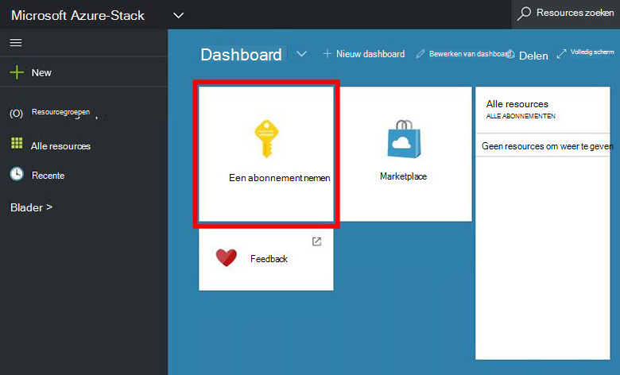
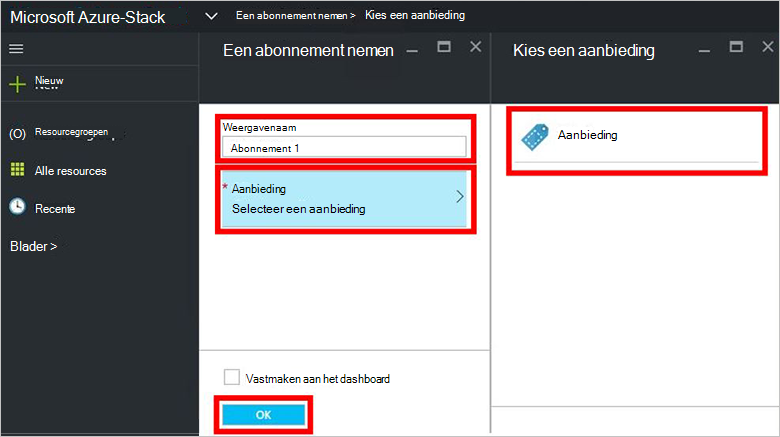
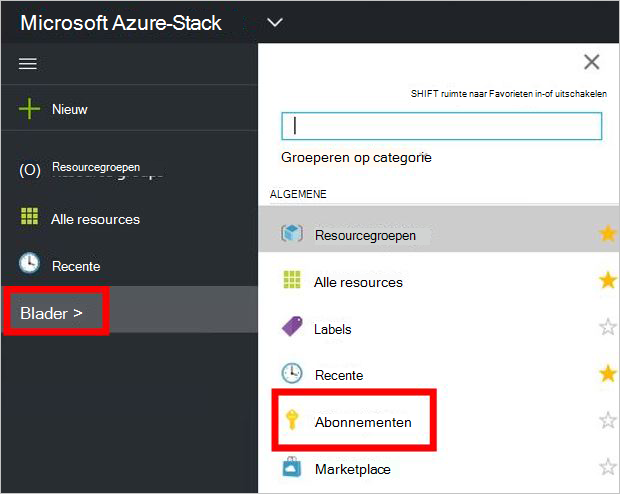

<properties
    pageTitle="Abonneren op een aanbod en klikt u vervolgens het inrichten van een VM Azure gestapelde (tenant) | Microsoft Azure"
    description="Als een tenant, Leer hoe u zich hebt geabonneerd een aanbod en klikt u vervolgens een VM Azure gestapelde inrichten."
    services="azure-stack"
    documentationCenter=""
    authors="ErikjeMS"
    manager="byronr"
    editor=""/>

<tags
    ms.service="azure-stack"
    ms.workload="na"
    ms.tgt_pltfrm="na"
    ms.devlang="na"
    ms.topic="get-started-article"
    ms.date="09/26/2016"
    ms.author="erikje"/>

# Abonneren op een aanbieding

Nu dat u [gemaakt van een aanbod hebt](azure-stack-create-offer.md), test u dat uw tenants kunnen worden gebruikt voor het maken van een abonnement.

1.  Op de computer Azure stapel Haalbaarheidstest, moet u zich aanmelden bij `https://portal.azurestack.local` als [een tenant](azure-stack-connect-azure-stack.md#log-in-as-a-tenant) en klik op **een abonnement nemen**.

    

2.  Typ een naam voor uw abonnement in het veld **Naam weer te geven** , klikt u op **bieden**, klikt u op een van de aanbiedingen in het blad **kiezen een aanbod** en klik vervolgens op **maken**.

    

4.  Als u wilt bekijken van het abonnement dat u hebt gemaakt, klikt u op **Bladeren**, **abonnementen**, klik op het nieuwe abonnement.  

    

Nadat u zich hebt geabonneerd op een voorstel, vernieuwt u de portal om te zien welke services deel uitmaken van het nieuwe abonnement.

## Volgende stappen

[Een virtuele machine inrichten](azure-stack-provision-vm.md)
