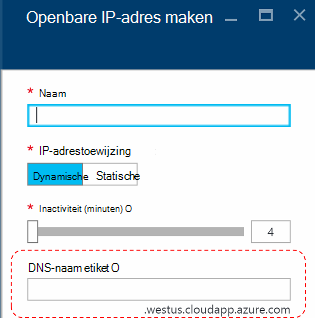
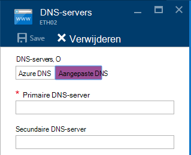
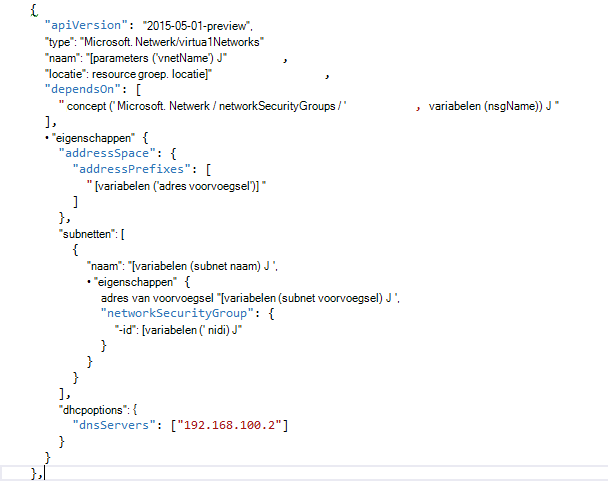

<properties
    pageTitle="Wat is DNS in Azure stapel TP2 | Microsoft Azure"
    description="Informatie over nieuwe DNS-functies en mogelijkheden in Azure stapel TP2"
    services="azure-stack"
    documentationCenter=""
    authors="ScottNapolitan"
    manager="darmour"
    editor=""/>

<tags
    ms.service="azure-stack"
    ms.workload="na"
    ms.tgt_pltfrm="na"
    ms.devlang="na"
    ms.topic="get-started-article"
    ms.date="09/26/2016"
    ms.author="scottnap"/>

# Inleiding tot IDN voor Azure-Stack
================================

IDN is een nieuwe functie in technologie Preview 2 voor Azure-Stack waarmee u voor het oplossen van externe DNS-namen (zoals http://www.bing.com).
Bovendien kunt u interne virtuele netwerknamen te registreren. Als u dit doet, kunt u VMs op hetzelfde virtuele netwerk door de naam in plaats van IP-adres, oplossen zonder op te geven van aangepaste DNS-server-vermeldingen.

Dit is iets dat er in Azure wordt aangegeven is, maar deze is nu beschikbaar in Windows Server 2016 en Azure-Stack, ook.

Wat doet IDN?
------------------

Met IDN Azure gestapelde krijgt u de volgende mogelijkheden, zonder te geven van aangepaste DNS-server-vermeldingen.

-   DNS-naam resolutie services voor tenant werkbelasting gedeeld.

-   Gezaghebbende DNS service voor naamresolutie en DNS-registratie binnen het virtuele netwerk tenant.

-   Recursive DNS-service voor resolutie van Internet de namen van tenant VMs. Tenants is niet meer nodig hebt om op te geven van aangepaste DNS-vermeldingen om op te lossen Internet namen (bijvoorbeeld www.bing.com).

U kunt nog steeds doen om uw eigen DNS- en aangepaste DNS-servers gebruiken als u wilt. Maar nu als u slechts wilt kunnen Internet DNS-gebruikersnamen en kunnen verbinding maken met andere virtuele machines in hetzelfde virtuele netwerk, moet u niet alles opgeven en werkt alleen op te lossen.

Wat is IDN niet?
---------------------

Welke IDN mag u niet moet doen, is een DNS-record voor een naam die opgelost van buiten het virtuele netwerk worden kan maken.

In Azure moet u de optie voor het opgeven van een DNS-naam-label die gekoppeld aan een openbare IP-adres worden kan. U kunt ervoor kiezen het label (voorvoegsel), maar Azure kiest het achtervoegsel, die is gebaseerd op het gebied waarin u het openbare IP-adres maken.

In de bovenstaande afbeelding maakt Azure een 'Een' record in DNS voor het label van DNS-naam opgegeven onder de zone **westus.cloudapp.azure.com**. De voor- en het achtervoegsel samen opstellen van een volledig gekwalificeerde domein naam (Fully Qualified) die vanuit een willekeurige plaats op de openbare Internet kan worden omgezet.

In TP2 ondersteunt Azure stapel alleen IDN voor interne registratie, zodat deze het volgende niet doen.

-   Maak een DNS-record onder een bestaande gehoste DNS-zone (bijvoorbeeld azurestack.local).

-   Maak een DNS-zone (zoals Contoso.com).

-   Maak een record onder uw eigen aangepaste DNS-zone.

-   Ondersteuning voor de aankoop van domeinnamen.

Wijzigingen in DNS van Azure stapel TP1
-----------------------------------

In de technologie Preview 1 (TP1)-versie van Azure stapel moest u aangepaste DNS-servers bieden als u kunnen wilt worden omgezet hosts per naam in plaats van IP-adres. Dit betekent dat als u een virtueel netwerk of een VM maakt, moest u ten minste één kolom van de DNS-server opgeven. Voor de omgeving TP1 Haalbaarheidstest bedoeld dit de IP Haalbaarheidstest stof DNS-server, namelijk 192.168.200.2 invoeren.

Als u een VM via de portal hebt gemaakt, moest u **Aangepaste DNS** selecteren in de virtuele netwerk of Ethernet-Adapterinstellingen.

In TP2, u kunt Selecteer Azure DNS en hoeft niet te posten voor aangepaste DNS-server opgeven.

Als u een VM via een sjabloon met uw eigen afbeelding gemaakt, moest u de eigenschap **DHCPOptions** toevoegen en de DNS-server om te krijgen van de DNS-records omzetten van namen om te werken. De volgende afbeelding ziet u wat dit vroeger.

In TP2 moet niet langer u deze wijzigingen aanbrengen in uw sjablonen VM toe te staan dat uw VMs voor het oplossen van Internet namen. Alleen te werken.