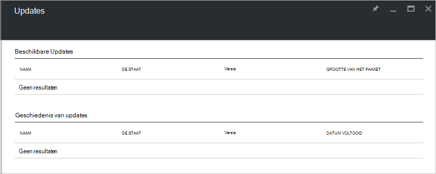

<properties
    pageTitle="Updates Azure gestapelde | Microsoft Azure"
    description="Meer informatie over updates Azure gestapelde"
    services="azure-stack"
    documentationCenter=""
    authors="HeathL17"
    manager="byronr"
    editor=""/>

<tags
    ms.service="azure-stack"
    ms.workload="na"
    ms.tgt_pltfrm="na"
    ms.devlang="na"
    ms.topic="article"
    ms.date="09/26/2016"
    ms.author="Helaw"/>

# Updates management Azure gestapelde
Technical Preview 2 maakt u kennis met een voorbeeld van de gebruikerservaring voor het beheren van Azure stapel updates.  In dit onderwerp, gaat u naar het knooppunt updates navigeren.  

## Updates blade
1.  Voor toegang tot het blad Updates, klik op **Bladeren** en klik vervolgens op **Updates**.

2.  Klik op de **lokale** locatie.

3.  U ziet een scherm vermelding van de beschikbare updates en geschiedenis van updates.  In Technical Preview 2 zijn geen updates beschikbaar voor de installatie.  

    

## Volgende stappen
- [Meer informatie over Azure-Stack Haalbaarheidstest architectuur](azure-stack-architecture.md)      
- [Meer informatie over vereisten voor implementatie](azure-stack-deploy.md)
- [Azure stapel implementeren](azure-stack-run-powershell-script.md)
 
    
  

  

