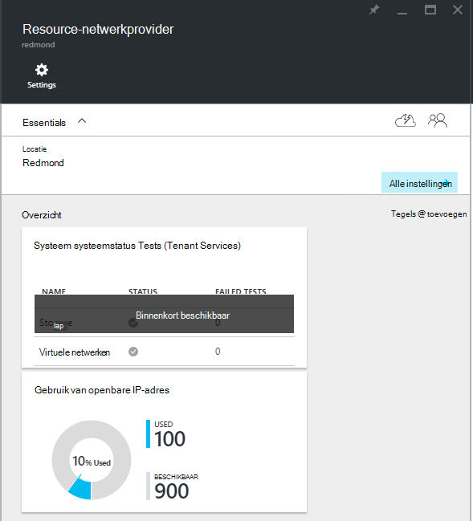
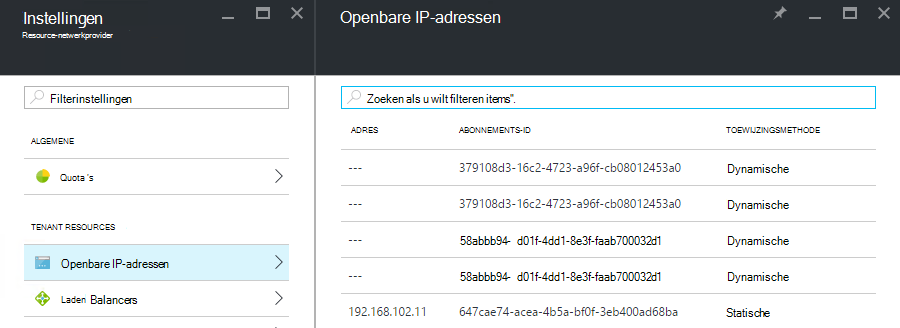

<properties
    pageTitle="Openbare IP-adres verbruik weergeven in een TP2 | Microsoft Azure"
    description="Beheerders kunnen het verbruik van openbare IP-adressen weergeven in een gebied"
    services="azure-stack"
    documentationCenter=""
    authors="ScottNapolitan"
    manager="darmour"
    editor=""/>

<tags
    ms.service="azure-stack"
    ms.workload="na"
    ms.tgt_pltfrm="na"
    ms.devlang="na"
    ms.topic="get-started-article"
    ms.date="09/26/2016"
    ms.author="scottnap"/>

# Openbare IP-adres verbruik in Azure stapel TP2 bekijken

Als de servicebeheerder van een, kunt u het aantal openbare IP-adressen die zijn toegewezen aan tenants, het aantal openbare IP-adressen die zijn nog steeds beschikbaar is voor de toewijzing en het percentage van openbare IP-adressen die zijn toegewezen op die locatie weergeven.

De tegel **Openbare IP-adres gebruik** ziet u het totale aantal openbare IP-adressen die zijn verbruikt over alle openbare IP-adres van toepassingen op de stof, ongeacht of ze zijn gebruikt voor tenant IaaS VM exemplaren, infrastructuur configuratieservices of openbare IP-adres resources die expliciet tenants zijn gemaakt.

Het doel van deze tegel is te geven Azure stapel beheerders een beeld van het totale aantal openbare IP-adressen zijn verbruikt op deze locatie. Hiermee kunt beheerders bepalen of ze weinig van deze resource.

Klik op het blad **Instellingen** bevat het **Openbare IP-adressen** menu-item onder **Tenant resources** alleen die openbare IP-adressen die *gemaakt expliciet tenants zijn*. Het aantal **gebruikt** openbare IP-adressen in het **Openbare IP-adres gebruik** tegel gemarkeerd is als zodanig altijd anders uit dan (groter dan) het nummer op de tegel **Openbare IP-adressen** onder **Tenant resources**.

## Het openbare IP-adres gebruiksinformatie weergeven

Het totale aantal openbare IP-adressen zijn verbruikt in de regio weergeven:

1.  Klik in de portal Azure stapel op **Bladeren**en selecteer vervolgens **Resource Providers**.

2.  Selecteer in de lijst met **Providers van de Resource**, **Netwerkbeheerder Resource-Provider**.

3.  U kunt ook kunt u **Bladeren | Locaties** en selecteer de locatie die u wilt weergeven in de lijst. Selecteer vervolgens op de tegel **Resource Providers** **Netwerkbeheerder Resource Provider**.

4.  Het blad van de aantekening **Netwerkprovider Resource** wordt de tegel **Openbare IP-adres gebruik** weergegeven in de sectie **Overzicht** .

Houd er rekening mee dat de **gebruikt** getal geeft het aantal openbare IP-van alle openbare IP adressen-adres van de toepassingen op die locatie die zijn toegewezen. De **beschikbaar** getal geeft het aantal openbare IP-van alle openbare-IP adressen-adres van toepassingen die niet zijn toegewezen en zijn nog steeds beschikbaar. De **% gebruikt** getal geeft het aantal gebruikte of toegewezen adressen als een percentage van het totale aantal openbare IP-in alle openbare IP adressen-adres van toepassingen op die locatie.

## Het openbare IP-adressen die zijn gemaakt door tenant abonnementen weergeven

Een overzicht van openbare IP-adressen die expliciet zijn gemaakt door tenant abonnementen in een bepaalde regio, gaat u naar het blad **Instellingen** van de **Netwerkbeheerder Resource-Provider**en selecteer **Openbare IP-adressen**.

U ervaart mogelijk dat sommige openbare IP-adressen die dynamisch zijn toegewezen in de lijst weergegeven, maar een adres dat is gekoppeld aan deze nog geen hebt. Dit is omdat de adres-resource is gemaakt in de netwerkprovider voor de Resource, maar niet in de Controller-netwerk nog.

De netwerkcontroller geen een adres toe aan deze resource totdat deze daadwerkelijk is gekoppeld aan een interface, een netwerkadapter (NIC), een taakverdeling of een virtueel netwerkgateway. Wanneer het openbare IP-adres is gekoppeld aan een interface, de Controller netwerk toegewezen een IP-adres toe en deze wordt weergegeven in het veld **adres** .

## Het openbare IP-adres informatie samenvattingstabel weergeven

Er zijn een aantal verschillende gevallen waarin het openbare IP-adressen zijn toegewezen die bepalen of het adres wordt weergegeven in één lijst of een ander.

| **Openbare IP-adres toewijzing hoofdletters/kleine letters** | **Wordt weergegeven in Gebruiksoverzicht** | **Wordt weergegeven in de lijst van tenant openbare IP-adressen** |
| ------------------------------------- | ----------------------------| ---------------------------------------------- |
| Dynamische openbare IP-adres nog niet zijn toegewezen aan een NIC of laden verdeling (tijdelijke) | Nee | Ja |
| Dynamische openbare IP-adres toegewezen aan de verdeling van een NIC of laden. | Ja | Ja |
| Statische openbare IP-adres toegewezen aan de verdeling van een tenant NIC of laden. | Ja | Ja |
| Statische openbare IP-adres toegewezen aan een stof infrastructuur service-eindpunt. | Ja | Nee |
| Openbare IP-adres wordt impliciet gemaakt naar IaaS VM exemplaren en gebruikt voor uitgaande NAT voor het virtuele netwerk. Deze worden gemaakt achter de schermen wanneer een tenant maakt u een exemplaar VM zodat VMs informatie met Internet verstuurt. | Ja | Nee |
