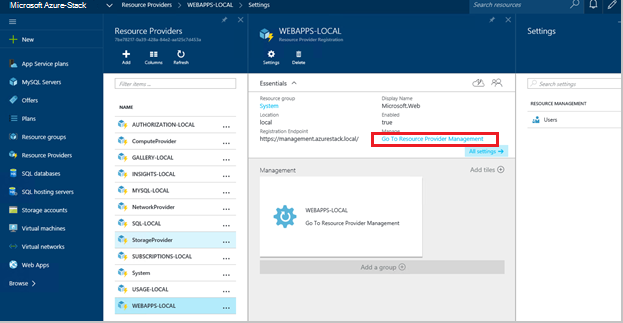
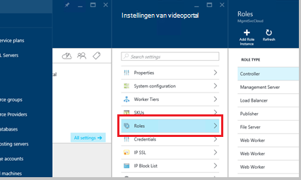
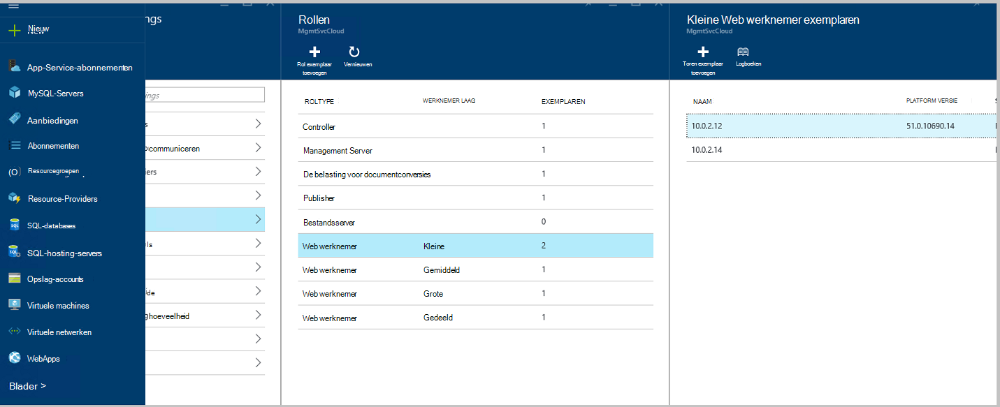
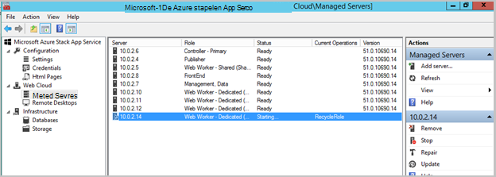
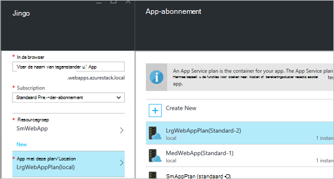
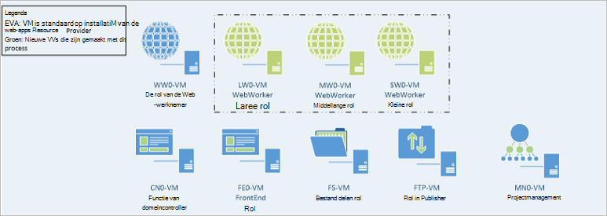

<properties
    pageTitle="Web-Apps toe te voegen op meer webonderdelen werknemer rollen | Microsoft Azure"
    description="Gedetailleerde richtlijnen voor schaalbaarheid van Azure stapel Web App"
    services="azure-stack"
    documentationCenter=""
    authors="kathm"
    manager="slinehan"
    editor=""/>

<tags
    ms.service="azure-stack"
    ms.workload="app-service"
    ms.tgt_pltfrm="na"
    ms.devlang="na"
    ms.topic="article"
    ms.date="09/26/2016"
    ms.author="kathm"/>

#   <a name="web-apps-adding-more-web-worker-roles"></a>Web Apps: Meer functies voor web-werknemer toevoegen

> [AZURE.NOTE] De volgende informatie is alleen van toepassing op Azure stapel TP1 implementaties.

Dit document bevat instructies voor het Web Apps web werknemer rollen schaal. De presentatie bevat stappen voor het maken van aanvullende web werknemer rollen ter ondersteuning van web apps aanbiedingen van elke grootte.

Azure stapel ondersteunt gratis en gedeelde web app-implementaties. Als u wilt toevoegen op andere typen, moet u meer web werknemer rollen toevoegen.

Als u niet zeker weet wat er met de installatie van de Web Apps standaard is geïmplementeerd, kunt u aanvullende informatie bekijken [hier](azure-stack-webapps-overview.md).

De volgende stappen zijn vereist om te schaal web werknemer rollen:

1.  [Een nieuwe virtuele machine maken](#step-1-create-a-new-vm-to-support-the-new-instance-size)

2.  [Configureer de virtuele machine](#step-2-configure-the-virtual-machine)

3.  [De rol van de werknemer web configureren in de stapel Azure-portal](#step-3-configure-the-web-worker-role-in-the-azure-stack-portal)

4.  [App-service-abonnementen configureren](#step-4-configure-app-service-plans)

##<a name="step-1-create-a-new-vm-to-support-the-new-instance-size"></a>Stap 1: Maak een nieuwe VM ter ondersteuning van de nieuwe exemplaar grootte

Maak een virtuele machine zoals beschreven in [dit artikel](azure-stack-provision-vm.md), ervoor te zorgen dat de volgende selecties worden aangebracht:

 - Gebruikersnaam en wachtwoord: Geef de gebruikersnaam en wachtwoord die u hebt opgegeven toen u Web-Apps hebt geïnstalleerd.

 - Abonnement: Gebruik de standaard-provider-abonnement.

 - Resourcegroep: kies **AppService-Local**.

> [AZURE.NOTE]Sla de virtuele machines voor werknemer rollen in dezelfde resourcegroep als de toepassing wordt geïmplementeerd op Web-Apps. (Dit wordt aanbevolen voor deze release.)

##<a name="step-2-configure-the-virtual-machine"></a>Stap 2: Configureer de virtuele Machine

Wanneer de implementatie is voltooid, worden de volgende configuratie is vereist voor het ondersteunen van de rol van de werknemer web:

1.  Open Serverbeheer op de hostcomputer en klik op **Extra** &gt; **HyperV Manager**.

2.  Verbinding maken met behulp van Remote Desktop Protocol (RDP) naar de nieuwe virtuele machine die u in stap 1 hebt gemaakt. De naam van de server bevindt zich in het deelvenster Overzicht als elke VM is geselecteerd.

3.  Open PowerShell door te klikken op de knop **Start** en PowerShell typen. Met de rechtermuisknop op **PowerShell.exe**en selecteer **Als administrator uitvoeren** PowerShell openen in de administrator-modus.

4.  Kopiëren en plakken elk van de volgende opdrachten (één tegelijk) naar de PowerShell-venster en druk op enter:

    ```netsh advfirewall firewall set rule group="File and Printer Sharing" new enable=Yes```
    ```netsh advfirewall firewall set rule group="Windows Management Instrumentation (WMI)" new enable=yes```
    ```reg add HKLM\\SOFTWARE\\Microsoft\\Windows\\CurrentVersion\\Policies\\system /v LocalAccountTokenFilterPolicy /t REG\_DWORD /d 1 /f```

5.  Start opnieuw op de virtuele machine.

> [AZURE.NOTE]Opmerking: Dit zijn minimale vereisten voor de Web Apps. De standaardinstellingen van de Windows 2012 R2 afbeelding wordt geleverd bij Azure stapel zijn. De instructies er zijn opgegeven voor toekomstig gebruik, en voor iedereen met een andere afbeelding.

##<a name="step-3-configure-the-web-worker-role-in-the-azure-stack-portal"></a>Stap 3: De rol van de werknemer web configureren in de stapel Azure-portal

1.  Open de portal als de service-beheerder op **ClientVM**.

2.  Navigeer naar de **Resource Providers** &gt; **WEBAPPS-LOCAL**.

    
 
3.  Klik op **Ga naar de Provider resourcebeheer**.

4.  Klik op **rollen**.

    
 
5.  Klik op **rol exemplaar toevoegen**.

6.  Klik op de **laag** die u wilt implementeren van het nieuwe exemplaar aan (klein, Gemiddeld, groot of gedeelde).

    
 
7.  Configureer het volgende:
 - Servernaam: Geef het IP-adres van de server die u eerder (in de sectie 1) gemaakt.
 - Roltype: Web werknemer.
 - Werknemer fase: Overeenkomsten trapsgewijs grootte geselecteerd.

8. Klik op **OK.**

9. Meld u aan bij CN0-VM en open de **Web Cloud Management MMC**.

10. Navigeer naar **de Cloud Web** &gt; **beheerde Servers**.

11. Klik op de naam van de server die u zojuist hebt geïmplementeerd. Bekijk de statuskolom en wacht verplaatsen naar de volgende stap totdat de status ervan is 'Gereed'.

    

##<a name="step-4-configure-app-service-plans"></a>Stap 4: De service-abonnementen app configureren

> [AZURE.NOTE]In de huidige versie van Web Apps, moeten de app-service-abonnementen in afzonderlijke resourcegroepen worden opgeslagen. Een resourcegroep voor elke grootte van de WebApp maken en de abonnementen toepassing in de juiste resourcegroepen plaatsen.

1.  Meld u aan bij de portal op de ClientVM.

2.  Navigeer naar de **nieuwe** &gt; **Web en Mobile**.

3.  Selecteer de WebApp die u wilt implementeren.

4.  Geef de gegevens voor de web-app en selecteer vervolgens **AppService abonnement / locatie**.

-   Klik op **nieuwe maken**.

-   Maak uw nieuwe abonnement, de bijbehorende prijzen laag voor het abonnement te selecteren.

> [AZURE.NOTE]U kunt meerdere abonnementen terwijl u op deze blade maken. Voordat u, echter implementeert zorgen dat u het juiste abonnement hebt geselecteerd.

Hier volgt een voorbeeld van de beschikbare meerdere abonnementen:    

##<a name="final-web-app-service-vm-configuration"></a>Definitief Web App service VM te configureren

De onderstaande afbeelding beschikt u over een weergave van de omgeving nadat u de schaal van de rollen van web werknemer hebt aangepast. De groene items zijn de nieuwe rol toevoegingen.
    
