<properties
     pageTitle="Het maken van een aanvraag Azure ondersteuning | Microsoft Azure"
     description="Het maken van een aanvraag Azure ondersteuning."
     services="Azure Supportability"
     documentationCenter=""
     authors="ganganarayanan"
     manager="scotthit"
     editor=""/>

<tags
     ms.service="azure-supportability"
     ms.workload="na"
     ms.tgt_pltfrm="na"
     ms.devlang="na"
     ms.topic="article"
     ms.date="10/25/2016"
     ms.author="gangan"/>

# Het maken van een aanvraag Azure ondersteuning

## Overzicht
Azure klanten kunnen maken en beheren van aanvragen voor ondersteuning in de Azure [https://portal.azure.com](https://portal.azure.com)-portal.
>[AZURE.NOTE] De Azure-portal voor Duitsland is [https://portal.microsoftazure.de](https://portal.microsoftazure.de) en voor Azure overheid portal [https://portal.azure.us](https://portal.azure.us).

We hebben op basis van feedback van klanten, de ervaring van de aanvraag ondersteuning bijgewerkt naar de focus op de drie belangrijkste doelstellingen:

- **Streamlined**: muisklikken en bladen om het proces voor het verzenden van een verzoek voor ondersteuning van eenvoudige te verkleinen.
- **Geïntegreerde**: als u een probleem met een Azure resource wilt oplossen bent, deze gemakkelijk kunnen worden open een verzoek voor ondersteuning voor de desbetreffende resource zonder context.
- **Efficiënt**: de informatie verzamelen waarmee belangrijke uw engineeren ondersteuning worden efficiënt uw probleem op te lossen.

## Aan de slag
U kunt een verzoek voor ondersteuning van maken van het bovenste navigatiemenu of rechtstreeks van een resource blade.

**De bovenste navigatiebalk**

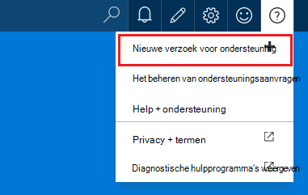

**Van een resource blade**

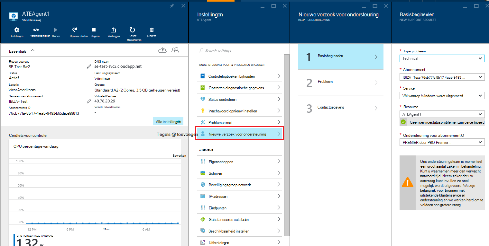

## Basisbeginselen
De eerste stap van het proces van de aanvraag ondersteuning verzamelt informatie over het probleem en uw abonnement voor ondersteuning.

Laten we een voorbeeld: U bent die tegenover elkaar liggen technische problemen met uw VM en problemen met de netwerkverbinding vermoedt.
Selecteer de service ('virtuele computer waarop Windows wordt uitgevoerd') en de resource (de naam van uw virtuele machine) in de eerste stap van de wizard het proces van het Help-informatie opvragen voor dit probleem te starten.

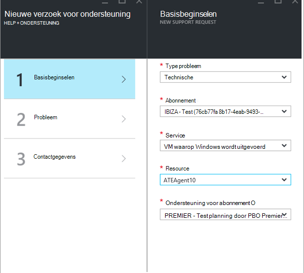

>[AZURE.NOTE] Azure biedt onbeperkte ondersteuning om uw abonnement te beheren (items, zoals facturering, quotum aanpassingen en account overdrachten). Voor technische ondersteuning moet u een ondersteuningsplan. [Meer informatie over het ondersteuningsplannen](https://azure.microsoft.com/support/plans).

## Probleem
De tweede stap van de wizard worden verzameld voor meer informatie over het probleem. Leveren nauwkeurige details in deze stap kunt ons bij het doorsturen van de zaak naar het beste engineeren ondersteuning voor het probleem en moeten beginnen diagnose van het probleem zo snel mogelijk.

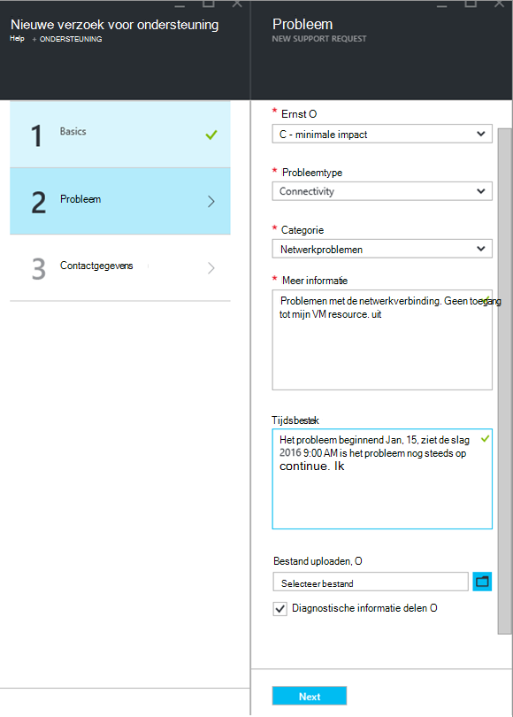

Doorgaat met het voorbeeld VM connectivity dan hierboven hebt ingevuld dit formulier om aan te geven van een probleem met de netwerkverbindingen en wilt u meer informatie over het probleem, inclusief de niet-geheel exacte tijd wanneer u het probleem optreedt opgeeft.

## Verwante Help
Voor sommige problemen bieden we verwante help-koppelingen voor het probleem op te lossen. Als u de aanbevolen documenten niet helpen, kunt u Ga verder met het proces voor het maken van een verzoek voor ondersteuning.
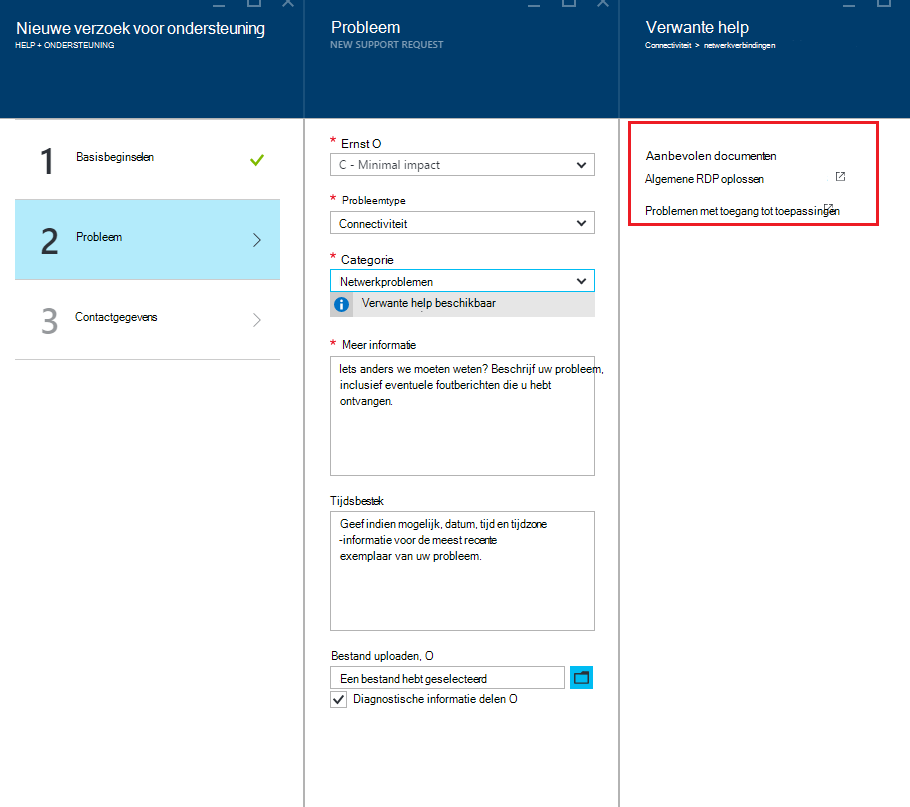

## Contactgegevens
De laatste stap van de wizard bevestigt uw contactgegevens, zodat we weten hoe u hebt bereikt.
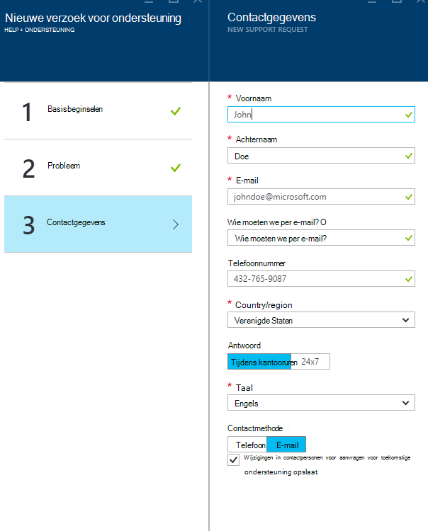

Afhankelijk van de ernst van het probleem, wordt u mogelijk gevraagd om aan te geven als u contact met u tijdens kantooruren of wilt als u liever een reactie 24 x 7, wat betekent dat we u op elk gewenst moment kunt contact met.
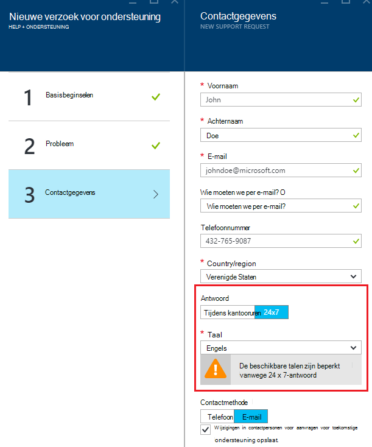

## Het beheren van ondersteuningsaanvragen
Nadat u het verzoek voor ondersteuning hebt gemaakt, kunt u de details van de pagina **Ondersteuning aanvragen beheren** bekijken.

**De bovenste navigatiebalk**

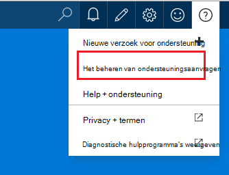

U kunt alle ondersteuningsaanvragen en hun status weergeven op de pagina **Manage ondersteuningsaanvragen** .
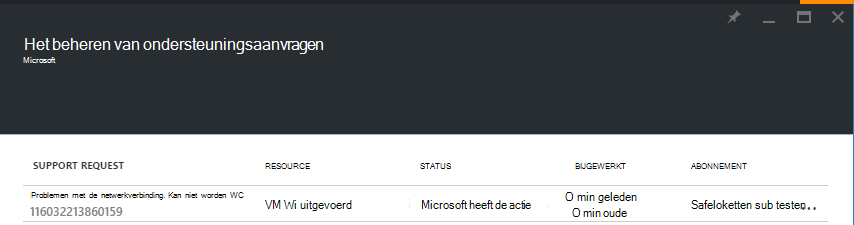

Selecteer het verzoek voor ondersteuning om weer te geven van de gegevens, inclusief ernst en de verwachte tijd die het duurt voor een engineeren ondersteuning om te reageren.
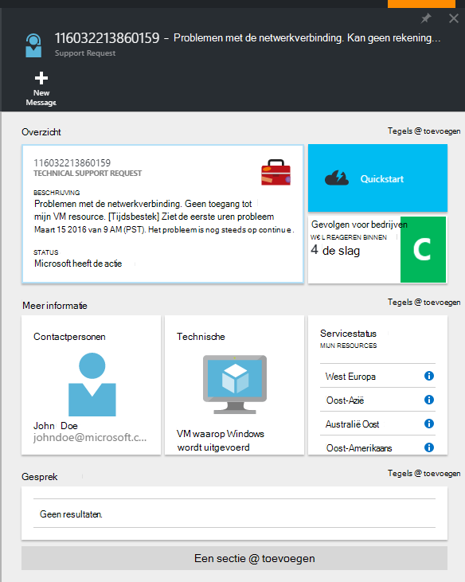

Als u wijzigen van de ernst van de aanvraag kunt invullen wilt, klikt u op de tegel **bedrijfsresultaten** . In het voorgaande voorbeeld wordt is de aanvraag ingesteld op ernst C.

Te klikken op de tegel ziet u de lijst met severities die u aan een aanvraag openen ondersteuning toewijzen kunt.

>[AZURE.NOTE] Het niveau van de maximale prioriteit, is afhankelijk van uw abonnement voor ondersteuning. [Meer informatie over het ondersteuningsplannen](https://azure.microsoft.com/support/plans).

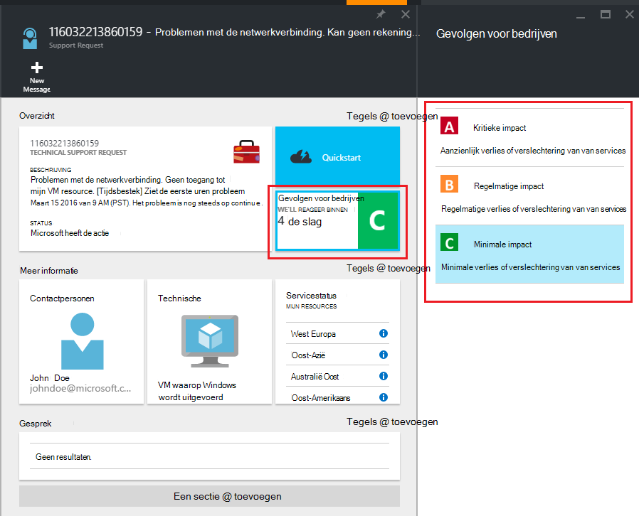

## Feedback
We hebben altijd een geopende feedback en suggesties! Stuur ons uw [suggesties](https://feedback.azure.com/forums/266794-support-feedback). Bovendien kunt u met ons deelnemen via een [Twitter-](https://twitter.com/azuresupport) of de [MSDN-forums](https://social.msdn.microsoft.com/Forums/azure).

## Meer informatie
[Veelgestelde vragen over Azure ondersteuning](https://azure.microsoft.com/support/faq)
