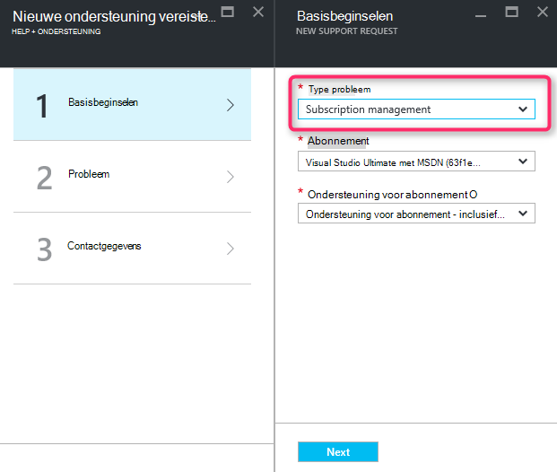
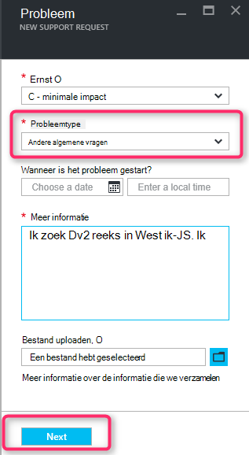
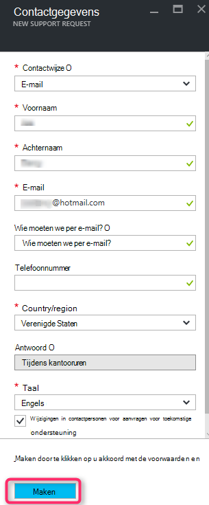

<properties
     pageTitle="SKU reeks niet beschikbaar | Microsoft Azure"
     description="Sommige SKU reeks zijn niet beschikbaar voor het geselecteerde abonnement voor dit gebied."
     services="Azure Supportability"
     documentationCenter=""
     authors="ganganarayanan"
     manager="scotthit"
     editor=""/>

<tags
     ms.service="azure-supportability"
     ms.workload="na"
     ms.tgt_pltfrm="na"
     ms.devlang="na"
     ms.topic="article"
     ms.date="08/12/2016"
     ms.author="gangan"/>

# SKU reeks niet beschikbaar

In sommige regio's, zijn bepaalde SKU's zijn niet automatisch beschikbaar zijn op de nieuwe abonnementen.  Dit kan gebeuren als [krachtiger SKU's zijn geïntroduceerd in een gebied](https://azure.microsoft.com/updates/announcing-new-dv2-series-virtual-machine-size/) en de populariteit van de verouderd SKU logboekrecords.
Het bericht "*Sommige SKU reeks zijn niet beschikbaar voor het geselecteerde abonnement voor dit gebied*" wordt weergegeven bij het maken van een verzoek voor ondersteuning om uit te breiden berekeningscluster core quotum.

U kunt raadplegen SKU beschikbaarheid op de pagina [Azure services per regio](https://azure.microsoft.com/regions/#services) . 

Om aan te vragen van toegang tot een SKU die uit uw abonnement is beperkt, maak een verzoek voor ondersteuning van "Abonnementen beheren".

- Klik op de pagina basisbeginselen probleem type als "Abonnementen beheren" selecteren en klikt u op 'Volgende'.

- Selecteer het type probleem als "Andere algemene vragen" en voer het exacte regio en de SKU u worden niet ziet op de pagina probleem.
Hiermee kunt de ondersteuning te vergemakkelijken.

- Klik op de pagina informatie Neem contact op met uw contactgegevens en klik op 'Maken'.

## Feedback
We hebben altijd een geopende feedback en suggesties! Stuur ons uw [suggesties](https://feedback.azure.com/forums/266794-support-feedback). Bovendien kunt u met ons deelnemen via een [Twitter-](https://twitter.com/azuresupport) of de [MSDN-forums](https://social.msdn.microsoft.com/Forums/azure).

## Meer informatie
[Veelgestelde vragen over Azure ondersteuning](https://azure.microsoft.com/support/faq)
