<properties
    pageTitle="Herstellen van gegevens in een andere DPM server in de back-kluis | Microsoft Azure"
    description="De gegevens die u hebt beveiligde naar een kluis Azure back-up maken vanaf een willekeurige DPM server geregistreerd voor die kluis herstellen."
    services="backup"
    documentationCenter=""
    authors="nkolli1"
    manager="shreeshd"
    editor=""/>

<tags
    ms.service="backup"
    ms.workload="storage-backup-recovery"
    ms.tgt_pltfrm="na"
    ms.devlang="na"
    ms.topic="article"
    ms.date="08/08/2016"
    ms.author="giridham;jimpark;trinadhk;markgal"/>

# Herstellen van gegevens in een andere DPM server in de back-kluis
U kunt nu de gegevens die u hebt beveiligde naar een kluis Azure back-up maken vanaf een willekeurige DPM server geregistreerd voor die kluis herstellen. Het proces voor het doen dus volledig geïntegreerd is in de beheerconsole DPM en is vergelijkbaar met de andere herstel werkstromen.

Als u wilt gegevens terughalen uit een andere DPM server in de back-kluis moet u [System Center Data Protection Manager UR7](https://support.microsoft.com/en-us/kb/3065246) en de [meest recente Azure back-agent](http://aka.ms/azurebackup_agent).

## Gegevens terughalen uit een andere DPM-Server
Gegevens herstellen uit een andere DPM server:

1. Klik op **Externe DPM toevoegen** op het tabblad **herstel** van de beheerconsole DPM (aan de bovenkant van het scherm naar links).

    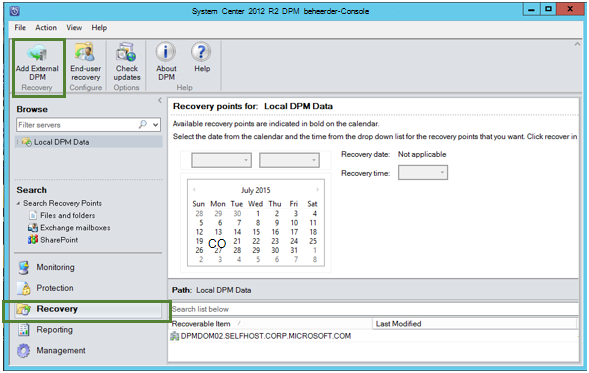

2. Nieuwe **kluis referenties** downloaden uit de kluis die is gekoppeld aan de **DPM server** waar de gegevens worden hersteld, de server DPM kiezen uit de lijst met DPM servers geregistreerd bij de back-kluis en geef de **versleuteling wachtwoordzin** die is gekoppeld aan de DPM server waarvan de gegevens worden hersteld.

    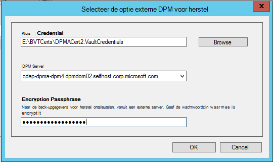

    >[AZURE.NOTE] Alleen DPM servers die is gekoppeld aan de dezelfde registratie kluis kunnen elkaars gegevens herstellen.

    Wanneer de externe DPM-server is toegevoegd, kunt u de gegevens uit externe DPM server en lokale DPM vanaf het tabblad **herstel** bladeren.

3. Bladeren in de lijst beschikbare van productieservers die zijn beveiligd met de externe DPM-server en selecteer de gewenste gegevensbron.

    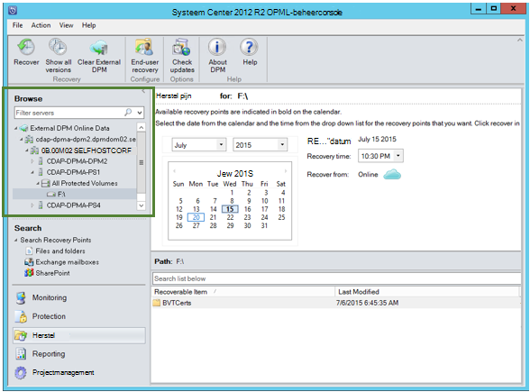

4. Selecteer **de maand en het jaar** van de **herstel punten** vervolgmenu, selecteert u de vereiste **herstel datum** voor waarop de komma herstel is gemaakt en selecteer de **hersteltijd**.

    Een lijst met bestanden en mappen die wordt weergegeven in het onderste deelvenster die kan worden bekeken en hersteld naar de gewenste locatie.

    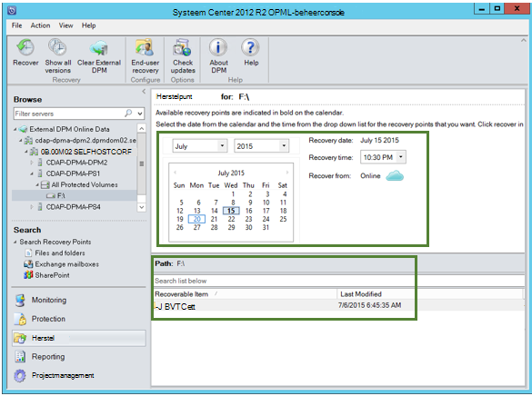

5. Klik met de rechtermuisknop op het gewenste item en klikt u op **herstellen**.

    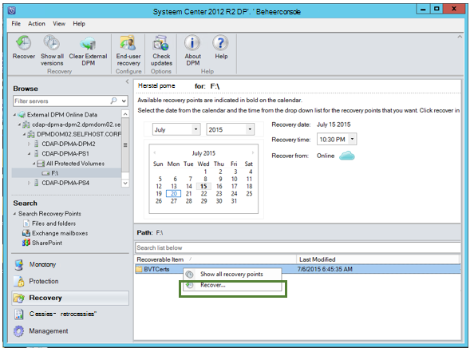

6. Bekijk de **selectie herstellen**. Controleer of de gegevens en tijd van de back-up wordt hersteld, evenals de bron van waaruit u de back-up is gemaakt. Als de selectie een onjuist wachtwoord, klikt u op **Annuleren** om te navigeren terug naar het tabblad herstel om te selecteren, passende herstelpunt. Als de selectie klopt, klikt u op **volgende**.

    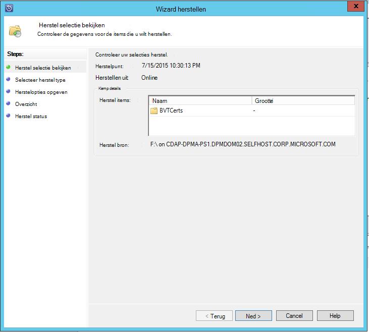

7. Selecteer **herstellen naar een andere locatie**. **Blader** naar de juiste locatie voor het herstelproces is.

    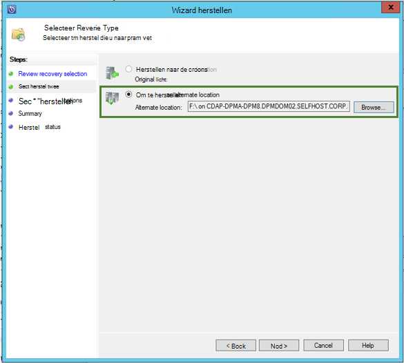

8. Kies de optie die betrekking hebben op de **kopie maken**, **overslaan**of **overschrijven**.
    - **Maken kopie** maakt een kopie van het bestand in het geval er een conflict naam is.
    - **Overslaan** slaat het bestand herstellen in het geval er een conflict naam is.
    - **Overschrijven** overschrijft de bestaande kopiëren in de opgegeven in het geval van een conflict naam locatie.

    Kies de gewenste optie **beveiliging**herstellen. U kunt toepassen op de beveiligingsinstellingen van de computer van de bestemming waar de gegevens worden hersteld of de beveiligingsinstellingen die van toepassing op product waren toen die het herstelpunt is gemaakt.

    Vaststellen of een **melding** ontvangt zodra het herstelproces voltooid is.

    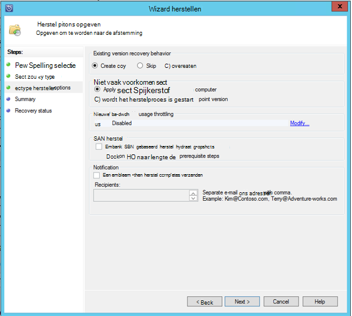

9. Het scherm **Summary** toont de opties die dusverre gekozen. Nadat u op **'Herstellen'**, worden de gegevens naar de juiste on-premises locatie worden hersteld.

    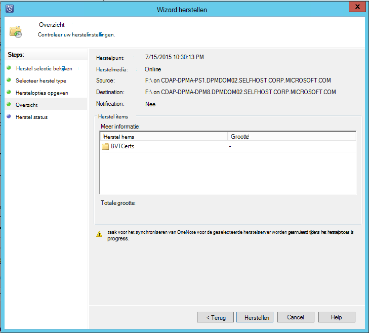

    >[AZURE.NOTE] De taak herstel kan worden gecontroleerd op het tabblad **controle** van de server DPM.

    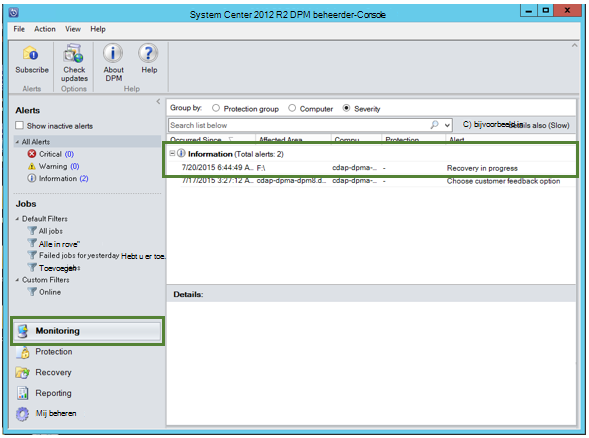

10. U kunt **Wissen externe DPM** klikken op het tabblad **herstel** van de server DPM verwijderen van de weergave van de externe DPM-server.

    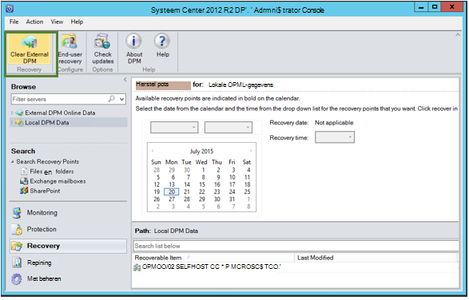

## Foutberichten oplossen
|Nee. |  Foutbericht | Stappen voor probleemoplossing |
| :-------------: |:-------------| :-----|
|1.|        Deze server is niet geregistreerd om de opgegeven door de referentie kluis.|  **Oorzaak:** Deze fout wordt weergegeven wanneer het geselecteerde kluis referentie-bestand geen deel uitmaakt van de back-kluis die is gekoppeld aan DPM server waarop het herstelproces wordt uitgevoerd.   **Resolutie:** Het kluis referentie-bestand downloaden uit de back-kluis waarnaar de server DPM is geregistreerd.|
|2.|        Op de herstelbare gegevens is niet beschikbaar of de geselecteerde server is niet een DPM-server.|   **Oorzaak:** Er zijn dat geen andere DPM-servers met DPM 2012 R2 UR7 geregistreerd om de back-ups, of de geselecteerde server is niet DPM server (of Windows Server of Windows-Client) de servers DPM met DPM 2012 R2 UR7 nog niet de metagegevens hebt geüpload.   **Resolutie:** Als er andere DPM-servers om de back-up is geregistreerd, zorgen SCDPM 2012 R2 UR7 en nieuwste Azure back-agent zijn geïnstalleerd.  Als er andere DPM-servers om de back-up met DPM 2012 R2 UR7 geregistreerd, wacht u voor een dag na de installatie van UR7 het herstelproces te starten. De elke taak wordt de metagegevens voor alle de eerder beveiligde back-ups naar cloud uploaden. De gegevens zijn beschikbaar voor herstel.|
|3.|        Geen andere DPM-server is geregistreerd bij deze kluis.|   **Oorzaak:** Er zijn geen andere DPM servers met DPM 2012 R2 UR7 of hoger om de waaruit het herstelproces is wordt geprobeerd zijn geregistreerd. **Resolutie:** Als er andere DPM-servers om de back-up is geregistreerd, zorgen SCDPM 2012 R2 UR7 en nieuwste Azure back-agent zijn geïnstalleerd. Als er andere DPM-servers om de back-up met DPM 2012 R2 UR7 geregistreerd, wacht u voor een dag na de installatie van UR7 het herstelproces te starten. De elke taak wordt de metagegevens voor alle de eerder beveiligde back-ups naar cloud uploaden. De gegevens zijn beschikbaar voor herstel.|
|4.|        De versleuteling wachtwoordzin opgegeven overeenkomt niet met wachtwoordzin die is gekoppeld aan de volgende server:**<server name>**|  **Oorzaak:** De versleuteling wachtwoordzin gebruikt bij het proces voor het coderen van de gegevens uit de DPM-server-gegevens die worden hersteld niet overeenkomen met de versleuteling wachtwoordzin opgegeven. De agent is niet mogelijk om de gegevens te decoderen. Vandaar mislukt het herstelproces is. **Resolutie:** Geef de exacte dezelfde versleuteling wachtwoordzin die is gekoppeld aan de DPM server waarvan de gegevens worden hersteld.|

## Veelgestelde vragen:
1. **Waarom kan niet ik een externe DPM-server toevoegen vanuit een andere DPM server na de installatie van de UR7 en de meest recente back-up van Azure-agent?**

    A) voor de bestaande DPM servers met gegevensbronnen die zijn beveiligd met de cloud (via een update rollup eerder dan bijwerken Rollup 7), moet u wacht ten minste één dag na de installatie van de UR7 en de meest recente back-up van Azure-agent om *externe DPM toevoegen-server*te starten. Dit is nodig om de metagegevens van de groepen DPM-beveiliging te uploaden naar Azure. Dit doet zich voor de eerste keer via een elke taak.

2. **Wat is de minimale versie van Azure back-up-agent nodig?**

    A) de minimale Azure back-up-agent-versie voor deze functie is 2.0.8719.0.  Versie van Azure back-up-agent kan worden gecontroleerd door te schuiven naar het Configuratiescherm **>** alle Configuratiescherm items **>** programma's en onderdelen **>** Microsoft Azure herstel Services Agent. Als de versie minder dan 2.0.8719.0 is, de [meest recente back-up van Azure-agent](https://go.microsoft.com/fwLink/?LinkID=288905) downloaden en installeren.

    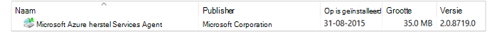

## Volgende stappen:
• [Azure back-Veelgestelde vragen](backup-azure-backup-faq.md)
