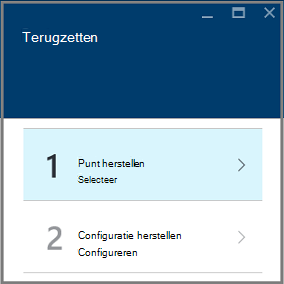

<properties
    pageTitle="Virtuele machines herstellen uit back-up met behulp van Azure portal | Microsoft Azure"
    description="Een Azure virtuele machines terugzetten uit een herstelpunt met behulp van Azure portal"
    services="backup"
    documentationCenter=""
    authors="markgalioto"
    manager="cfreeman"
    editor=""
    keywords="back-up van herstellen. hoe u herstelt; herstelpunt;"/>

<tags
    ms.service="backup"
    ms.workload="storage-backup-recovery"
    ms.tgt_pltfrm="na"
    ms.devlang="na"
    ms.topic="article"
    ms.date="08/10/2016"
    ms.author="trinadhk; jimpark;"/>

# Azure-portal gebruiken om terug te zetten virtuele machines

> [AZURE.SELECTOR]
- [VMs herstellen in klassieke-portal](backup-azure-restore-vms.md)
- [VMs herstellen in Azure-portal](backup-azure-arm-restore-vms.md)

Uw gegevens beschermen door te ondernemen momentopnamen van uw gegevens met bepaalde intervallen. Deze momentopnamen herstel punten worden genoemd en ze zijn opgeslagen in herstel services kluizen. Als of wanneer dit nodig is om te herstellen of bouw die tabellen opnieuw een VM is, kunt u de VM terugzetten uit een van de opgeslagen herstel wordt verwezen. Wanneer u een herstelpunt terugzet, kunt u teruggaan of herstel de VM naar de status wanneer de komma herstel is die u hebt gemaakt. In dit artikel wordt uitgelegd hoe u een VM herstelt.

> [AZURE.NOTE] Azure heeft twee implementatiemodellen voor het maken en werken met resources: [resourcemanager en klassiek](../resource-manager-deployment-model.md). In dit artikel vindt u de informatie en procedures voor het herstellen van VMs met behulp van het model resourcemanager geïmplementeerd.

## Een herstelpunt herstellen

1. Meld u aan bij de [portal van Azure](http://portal.azure.com/)

2. Klik in het menu Azure klikt u op **Bladeren** en typ in de lijst met services, **Herstel Services**. De lijst met services wordt aangepast aan wat u typt. Wanneer u **herstel Services kluizen**ziet, selecteert u deze.

    

    De lijst met kluizen in het abonnement dat wordt weergegeven.

    

3. Selecteer in de lijst de kluis die is gekoppeld aan de VM die u wilt herstellen. Wanneer u op de kluis klikt, wordt de dashboard geopend.

    

4. Nu dat u in het dashboard kluis bent. Klik op de **Back-up Items** tegel, klikt u op **Azure virtuele Machines** om weer te geven van de VMs die is gekoppeld aan de kluis.

    

    Het **Back-up Items** blad geopend en de lijst met Azure virtuele machines weergegeven.

    

5. Selecteer in de lijst een VM openen van het dashboard. Het dashboard VM wordt geopend naar het gebied Monitoring, waarin de tegel van de punten herstellen.

    

6. Klik in het menu VM dashboard op **herstellen**

    

    Hiermee opent u het blad herstellen.

    

7. Klik op het blad **herstellen** op **herstellen punt** om te openen van het blad **punt Selecteer herstellen** .

    

    Standaard worden in het dialoogvenster alle herstellen punten uit de afgelopen 30 dagen weergegeven. Gebruik het **Filter** voor het wijzigen van het tijdsbereik van de punten herstellen weergegeven. Standaard worden herstellen punten van alle consistentie weergegeven. **Alle herstellen punten** filter om te selecteren een specifieke consistentie van herstellen punten wijzigen. Wijs voor meer informatie over elk type herstel, raadpleegt u de uitleg van de [consistentie van de gegevens](./backup-azure-vms-introduction.md#data-consistency).  
    - **Herstellen punt consistentie** uit deze lijst kiezen:
        - Vastlopen consistente herstellen punten opgeven
        - Toepassing consistente herstellen punten opgeven
        - Bestand systeem consistente herstellen wordt verwezen
        - Alle herstellen punten.  

8. Kies een punt herstellen en klik op **OK**.

    

    Het blad **herstellen** ziet u dat de komma herstellen is ingesteld.

    

9. Klik op het blad **herstellen** **configuratie herstellen** wordt automatisch geopend nadat herstellen punt is ingesteld.

    

## Een VM herstellen configuratie kiezen

Nu dat u de komma herstellen hebt geselecteerd, kiest u een configuratie voor uw herstellen VM. Uw keuzes voor het configureren van de herstelde VM zijn om te gebruiken: Azure portal of PowerShell.

> [AZURE.NOTE] Portal vindt u een optie Snelle maken voor herstelde VM. Als u aanpassen van de configuratie VM van to-be herstelde VM wilt, PowerShell gebruiken om te zetten back-up schijven gemaakt en koppel deze aan de keuze van VM configuratie. Zie [een VM met speciale netwerkconfiguraties terugzetten](#restoring-vms-with-special-network-configurations).

1. Als u nog niet er, gaat u naar het blad **herstellen** . Controleer of u een **punt herstellen** is geselecteerd en klik op **configuratie herstellen** als u wilt openen van het blad **herstel configuratie** .

    

2. Typ of Selecteer waarden voor elk van de volgende velden op het blad **configuratie herstellen** :
    - **De naam van de VM** - Geef een naam voor de VM. De naam moet uniek zijn voor de resourcegroep (voor een VM resourcemanager geïmplementeerd) of cloudservice (voor een klassiek VM). U kunt de virtuele machine niet vervangen, als deze al in het abonnement bestaat.
    - **Resourcegroep** - gebruik van een bestaande resourcegroep of een nieuw account te maken. Als u een klassieke VM herstelt, moet u dit veld gebruiken om op te geven van de naam van een nieuwe cloudservice. Als u een nieuwe resource-groep/cloudservice zijn maakt, is de naam moet uniek. Meestal de naam van de cloud-service is gekoppeld aan een openbare URL - bijvoorbeeld: [cloudservice]. cloudapp.net. Als u probeert te gebruiken van een naam voor de resource groep/cloud cloudservice die wordt al gebruikt, wijst Azure dezelfde naam als de VM aan de resource groep/cloud-service. Azure worden resource groepen/cloudservices en VMs die niet zijn gekoppeld aan de groepen die affiniteit weergegeven. Lees [hoe u het migreren van affiniteit groepen met een regionale virtuele netwerk (VNet)](../virtual-network/virtual-networks-migrate-to-regional-vnet.md)voor meer informatie.
    - **Virtual Network** - Selecteer het virtuele netwerk (VNET) bij het maken van de VM. Het veld bevat alle VNETs die is gekoppeld aan het abonnement. Resourcegroep van VM wordt tussen haakjes weergegeven.
    - **Subnet** - als de VNET subnetten heeft, het eerste subnet al dan niet standaard is geselecteerd. Als er extra subnetten, selecteert u het gewenste subnet.
    - **Opslag account** - dit menu bevat de opslag-accounts op dezelfde locatie als het herstelproces is Services kluis. Bij het kiezen van een opslag-account, selecteert u een account dat dezelfde locatie als het herstelproces is Services kluis deelt. Opslag-accounts die Zone overtollige zijn worden niet ondersteund. Als er geen opslag-accounts met dezelfde locatie als de kluis herstel Services, moet u een voordat u begint met het terugzetten. Het accounttype herhaling van opslag wordt in haakjes vermeld.

    > [AZURE.NOTE] Als u een VM resourcemanager geïmplementeerd herstelt, moet u een virtueel netwerk (VNET) identificeren. Een virtueel netwerk (VNET) is optioneel voor een klassiek VM.

3. Klik op het blad **configuratie herstellen** op **OK** om te voltooien van de configuratie herstellen.

4. Klik op het blad **herstellen** op **herstellen** om de bewerking voor terugzetten activeren.

    

## De bewerking voor terugzetten bijhouden

Nadat u de bewerking voor terugzetten activeren, de back-up-service Hiermee maakt u een taak voor het bijhouden van de bewerking voor terugzetten. De back-up-service ook gemaakt en weergegeven tijdelijk de melding in het systeemvak van de portal. Als u de melding niet ziet, kunt u altijd Klik op het pictogram meldingen om uw berichten weer te geven.

Wilt u de bewerking bekijken tijdens het verwerken van, of om weer te geven wanneer deze voltooid, opent u de lijst met back-up.

1. Klik in het menu Azure klikt u op **Bladeren** en typ in de lijst met services, **Herstel Services**. De lijst met services wordt aangepast aan wat u typt. Wanneer u **herstel Services kluizen**ziet, selecteert u deze.

    

    De lijst met kluizen in het abonnement dat wordt weergegeven.

    

2. Selecteer in de lijst de kluis die is gekoppeld aan de VM u hersteld. Wanneer u op de kluis klikt, wordt de dashboard geopend.

3. In het dashboard kluis voor de **Taken van de back-up-** tegel gemarkeerd, klikt u op **Azure virtuele Machines** om weer te geven van de taken die zijn gekoppeld aan de kluis.

    

    Het **Back-up taken** blad geopend en de lijst met taken weergegeven.

    

## VMs herstellen met speciale netwerkconfiguraties
Het is mogelijk back-up maken en terugzetten, VMs met de volgende speciale netwerkconfiguraties. Deze configuraties is echter enkele speciale aandacht terwijl u door het herstelproces vereist.

- VMs onder taakverdeling (interne en externe)
- VMs met meerdere gereserveerde IP-adressen
- VMs met meerdere NIC 's

>[AZURE.IMPORTANT] Wanneer u de speciale netwerkconfiguratie voor VMs maakt, moet u PowerShell VMs maken van de schijven hersteld.

Als u wilt de virtuele machines volledig na terugzetten naar schijf opnieuw te maken, als volgt te werk:

1. De schijven terugzetten uit een herstel services kluis via [PowerShell](../backup-azure-vms-automation.md#restore-an-azure-vm)

2. Maken van de VM configuratie vereist voor taakverdeling / meerdere NIC/veelvoud gereserveerde IP bij gebruik van de PowerShell-cmdlets en gebruiken om te maken van de VM van gewenste configuratie.
    - VM in cloudservice met [interne taakverdeling](https://azure.microsoft.com/documentation/articles/load-balancer-internal-getstarted/) maken
    - VM verbinding maken met [Internet die tegenover elkaar liggen taakverdeling] maken (https://azure.microsoft.com/en-us/documentation/articles/load-balancer-internet-getstarted/)
    - VM met [meerdere NIC's](https://azure.microsoft.com/documentation/articles/virtual-networks-multiple-nics/) maken
    - VM met [meerdere gereserveerde IP-adressen](https://azure.microsoft.com/documentation/articles/virtual-networks-reserved-public-ip/) maken

## Volgende stappen
Nu waarmee u uw VMs herstellen kunt, raadpleegt u het artikel voor informatie op veelvoorkomende fouten met VMs. Ook, raadpleegt u het artikel over het beheren van taken met uw VMs.

- [Fouten corrigeren](backup-azure-vms-troubleshoot.md#restore)
- [Virtuele machines beheren](backup-azure-manage-vms.md)
