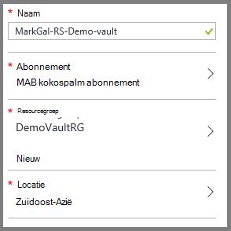
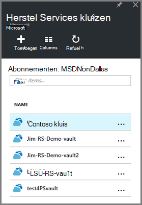
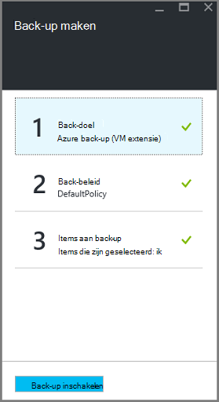
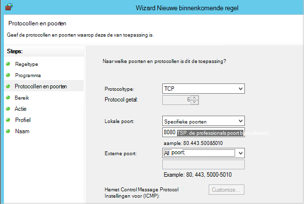

<properties
    pageTitle="Voorbereiden van uw omgeving back-up resourcemanager geïmplementeerd virtuele machines | Microsoft Azure"
    description="Controleer of dat uw omgeving is voorbereid voor een back-up virtuele machines in Azure wordt aangegeven"
    services="backup"
    documentationCenter=""
    authors="markgalioto"
    manager="cfreeman"
    editor=""
    keywords="back-ups; een back-up;"/>

<tags
    ms.service="backup"
    ms.workload="storage-backup-recovery"
    ms.tgt_pltfrm="na"
    ms.devlang="na"
    ms.topic="article"
    ms.date="08/21/2016"
    ms.author="trinadhk; jimpark; markgal;"/>


# <a name="prepare-your-environment-to-back-up-resource-manager-deployed-virtual-machines"></a>Voorbereiden van uw omgeving back-up resourcemanager geïmplementeerd virtuele machines

> [AZURE.SELECTOR]
- [Resourcemanager model](backup-azure-arm-vms-prepare.md)
- [Klassieke model](backup-azure-vms-prepare.md)

In dit artikel beschrijft de stappen voor het voorbereiden van uw omgeving back-up een resourcemanager geïmplementeerd virtuele machine (VM). De stappen die worden weergegeven in de procedures de Azure-portal gebruiken.  

De back-up van Azure-service heeft twee soorten kluizen (back-up kluizen en herstel services kluizen) voor het beschermen van uw VMs. Een back-kluis beschermen VMs met behulp van het model Klassiek implementatie geïmplementeerd. Een herstel services kluis beschermen **zowel klassieke geïmplementeerd of resourcemanager geïmplementeerd VMs** . U moet een kluis herstel Services gebruiken om te beveiligen een VM resourcemanager geïmplementeerd.

>[AZURE.NOTE] Azure heeft twee implementatiemodellen voor het maken en werken met resources: [resourcemanager en klassiek](../resource-manager-deployment-model.md). Raadpleeg [voorbereiden uw omgeving back-up Azure virtuele machines](backup-azure-vms-prepare.md) voor meer informatie over het werken met model van de implementatie klassiek VMs.

Voordat u kunt beveiligen of back-up van een Resource Manager geïmplementeerd virtuele machine (VM), zorg er dan voor dat deze vereisten bestaat:

- Maak een herstel services kluis (of een bestaande herstel services kluis identificeren) *op dezelfde locatie als uw VM*.
- Selecteer een scenario, het back-beleid definiëren en items te beveiligen definiëren.
- Controleer de installatie van VM Agent op virtuele machine.
- Netwerkconnectiviteit controleren

Als u weet dat deze voorwaarden wordt voldaan al in uw omgeving gaat u verder met de [Back-up van uw artikel VMs](backup-azure-vms.md). Als u wilt instellen, of controleren, een van deze vereisten, helpt in dit artikel u bij de stappen voor het voorbereiden van die vereiste op te geven.


## <a name="limitations-when-backing-up-and-restoring-a-vm"></a>Beperkingen als een back-up en herstellen van een VM

Voordat u bij het voorbereiden van uw omgeving moet u de beperkingen te begrijpen.

- Een back-up virtuele machines met meer dan 16 gegevensschijven wordt niet ondersteund.
- Een back-up virtuele machines met een gereserveerde IP-adres en geen gedefinieerde eindpunt wordt niet ondersteund.
- Back-up van Linux virtuele machines met de extensie Docker wordt niet ondersteund. 
- Back-upgegevens niet zijn opgenomen in gekoppeld netwerkstations die zijn bijgevoegd bij VM. 
- Een bestaande VM vervangen tijdens herstellen wordt niet ondersteund. Als u probeert de VM herstellen wanneer de VM bestaat, mislukt het terugzetten.
- Cross-regio back-up en herstellen wordt niet ondersteund.
- U kunt een back-up virtuele machines in alle openbare regio's van Azure (Zie de [Controlelijst](https://azure.microsoft.com/regions/#services) met ondersteunde regio's). Als het gebied dat u zoekt niet-ondersteunde vandaag, wordt deze niet weergegeven in de vervolgkeuzelijst tijdens het maken van kluis.
- U kunt een back-up virtuele machines alleen voor select besturingssystemen:
  - **Linux**: Azure back-up-ondersteuning biedt voor [een lijst met onderzoeken die worden goedgekeurd door Azure](../virtual-machines/virtual-machines-linux-endorsed-distros.md) behalve Core OS Linux.  Andere voren-uw-eigenaar bent van-Linux onderzoeken kunnen ook werken, zolang de VM-agent beschikbaar op de virtuele machine is en ondersteuning voor Python bestaat.
  - **Windows Server**: versies die ouder zijn dan Windows Server 2008 R2 worden niet ondersteund.
- Een domeincontroller herstellen wordt (domeincontroller) VM die deel uitmaakt van een configuratie multi-domeincontroller alleen via PowerShell ondersteund. Meer informatie over het [herstellen van een domeincontroller multi-domeincontroller](backup-azure-restore-vms.md#restoring-domain-controller-vms).
- Virtuele machines die u de volgende speciale netwerkconfiguraties hebt herstellen wordt alleen via PowerShell ondersteund. VMs die zijn gemaakt met behulp van de werkstroom terugzetten in de gebruikersinterface, hebben geen van deze netwerkconfiguraties nadat de bewerking herstellen voltooid is. Meer informatie raadpleegt u [VMs met speciale netwerkconfiguraties herstellen](backup-azure-restore-vms.md#restoring-vms-with-special-netwrok-configurations).
  - Virtuele machines onder configuratie van de verdeling voor laden (interne en externe)
  - Virtuele machines met meerdere gereserveerde IP-adressen
  - Virtuele machines met meerdere netwerkadapters

## <a name="create-a-recovery-services-vault-for-a-vm"></a>Een herstel services kluis maken voor een VM

Een herstel services kluis is een entiteit waarmee de back-ups en herstel punten die zijn gemaakt na verloop van tijd opgeslagen. De herstel services kluis bevat ook het back-beleid dat is gekoppeld aan de beveiligde virtuele machines.

Een herstel services kluis maken:

1. Meld u aan bij de [portal van Azure](https://portal.azure.com/).

2. Klik in het menu Hub klikt u op **Bladeren** en typ in de lijst met resources, **Herstel Services**. Als u te typen begint, de lijst worden gefilterd op basis van uw invoer. Klik op **Services herstel kluis**.

     <br/>

    De lijst met Services herstel kluizen wordt weergegeven.

3. Klik in het menu **kluizen herstel Services** op **toevoegen**.

    

    Het herstelproces is Services kluis blad wordt geopend, waarin u een **naam**, het **abonnement**, de **resourcegroep**en de **locatie**op te geven.

    

4. Voer een beschrijvende naam voor de kluis voor de **naam**. De naam moet uniek zijn voor het Azure abonnement. Typ een naam die tussen 2 en 50 tekens bevat. Er moet beginnen met een letter en mogen alleen letters, cijfers en afbreekstreepjes.

5. Klik op **abonnement** als u wilt zien van de lijst beschikbare van abonnementen. Als u niet zeker weet welk abonnement te gebruiken, gebruik de standaardwaarde (of voorgesteld) abonnement. Er zijn meerdere keuzemogelijkheden alleen als uw organisatie-account gekoppeld aan meerdere Azure abonnementen is.

6. **Resourcegroep** als u wilt zien van de lijst beschikbare van resourcegroepen op of klik op **Nieuw** om een nieuwe resourcegroep te maken. Zie [overzicht van de Azure resourcemanager](../azure-resource-manager/resource-group-overview.md) voor volledige informatie over Resource-groepen

7. Klik op **locatie** als het geografische gebied voor de kluis wilt selecteren. De kluis **moet** worden in hetzelfde gebied, als de virtuele machines die u wilt beveiligen.

    >[AZURE.IMPORTANT] Als u van de locatie waarin uw VM bestaat weet, sluit u afmelden bij het dialoogvenster voor het maken van kluis en Ga naar de lijst van virtuele Machines in de portal. Als u virtuele machines in meerdere regio's hebt, moet u een kluis herstel Services maken in elke regio. Maak de kluis in de eerste locatie voordat u overschakelt naar de volgende locatie. Er is niet nodig om op te geven opslag accounts om op te slaan van de back-upgegevens--de kluis herstel Services en de back-Azure-service automatisch dit afhandelen.

8. Klik op **maken**. Het kan even duren voordat de kluis herstel Services moet worden gemaakt. Controleer de statusmeldingen in het bovenste rechter gebied in de portal. Nadat uw kluis is gemaakt, wordt deze weergegeven in de lijst met Services herstel kluizen.

    

    U kunt uw kluis hebt gemaakt, lees nu het instellen van de replicatie opslag.

## <a name="set-storage-replication"></a>Instellen opslag replicatie

De opslagruimte replicatie-optie kunt u kiezen tussen geografische-redundante opslag en lokaal redundante opslag. Standaard is uw kluis geografische-redundante opslag. Laat de optie die is ingesteld op geografische-redundante opslag als dit de primaire back-up is. Kies lokaal redundante opslag als u wilt een goedkoper optie die niet helemaal als duurzame. Meer informatie over [geografische-redundante](../storage/storage-redundancy.md#geo-redundant-storage) en [lokaal overtollige](../storage/storage-redundancy.md#locally-redundant-storage) opslagopties voor in de [opslag van Azure replicatie-overzicht](../storage/storage-redundancy.md).

De instelling van de herhaling opslag bewerken:

1. Selecteer uw kluis om het dashboard kluis en het blad instellingen te openen. Als het blad **Instellingen** niet wordt geopend, klikt u op **alle instellingen** in het dashboard kluis.

2. Klik op het blad **Instellingen** op **Back-up-infrastructuur** > **Configuratie van de back-up** openen van het blad **Back-up-configuratie** . Klik op het blad **Back-up-configuratie** , kies de optie voor het herhaling van opslagruimte voor uw kluis.

    

    Kies de optie opslagruimte voor uw kluis en bent u klaar voor de VM koppelen aan de kluis. U moet eerst de koppeling, ontdekken en registreren van de Azure virtuele machines.


## <a name="select-a-backup-goal-set-policy-and-define-items-to-protect"></a>Selecteer een back-doel, beleid instellen en items te beveiligen definiëren

Voordat u een VM registreert met een kluis, moet u het discovery-proces om ervoor te zorgen dat elke nieuwe virtuele machines die zijn toegevoegd aan het abonnement zijn aangewezen uitvoeren. De query's proces Azure voor de lijst met virtuele machines in het abonnement, samen met aanvullende informatie, zoals de naam van de cloud-service en de regio. Klik in de portal Azure wordt scenario verwijst naar wat u wilt de herstel services kluis besteedt. Beleid is het schema voor hoe vaak en wanneer herstel punten zijn die u hebt gemaakt. Beleid bevat ook het bewaarbeleid bereik voor de herstel wordt verwezen.

1. Als u al een herstel Services kluis geopend, gaat u verder met stap 2. Als u een herstel Services kluis openen niet heb, maar in de portal Azure worden in het menu Hub klikt u op **Bladeren**.

  - Typ in de lijst met resources, **Herstel Services**.
  - Als u te typen begint, de lijst worden gefilterd op basis van uw invoer. Wanneer u **herstel Services kluizen**ziet, klikt u erop.

     <br/>

    De lijst met Services herstel kluizen wordt weergegeven.
  - Selecteer in de lijst met Services herstel kluizen, een kluis.

    Het geselecteerde kluis dashboard wordt geopend.

    

2. Klik op **back-up maken** als u wilt openen van het blad back-up in het menu van de dashboard kluis.

    

    Wanneer het blad wordt geopend, zoekt u de back-up-service naar een nieuwe VMs in het abonnement.

    

3. Klik op het blad back-up op **back-up doel** als u wilt openen van het doel van de back-up-blad.

    

4. Stel op het blad back-doel **waar uw werkzaamheden actief is** op Azure en **Wat wilt u wilt back-up** met virtuele machine, klik vervolgens op **OK**.

    Het doel van de back-up-blad wordt gesloten en het back-up beleid blad wordt geopend.

    

5. Selecteer op het blad back-up-beleid, de back-beleid dat u wilt toepassen op de kluis en klik op **OK**.

    

    De details van het standaardbeleid worden weergegeven in de details. Als u maken van nieuw beleid wilt, selecteert u **Nieuw** in de vervolgkeuzelijst. Het vervolgkeuzemenu bevat ook een optie waarmee u de tijd waarop de momentopname is, 7 PM. Zie [een back-beleid definieert](backup-azure-vms-first-look-arm.md#defining-a-backup-policy)voor instructies over het definiëren van een back-beleid. Nadat u op **OK**hebt geklikt, is het back-beleid gekoppeld aan de kluis.

    Kies naast de VMs koppelen aan de kluis.

6. Kies de virtuele machines om te koppelen aan het opgegeven beleid en klik op **selecteren**.

    

    Als u de gewenste VM niet ziet, Controleer of het bestaat in dezelfde Azure locatie als het herstelproces is Services kluis.

7. Nu u hebt gedefinieerd alle instellingen voor de kluis, in het blad back-up klikt u op **Back-up inschakelen** onder aan de pagina. Dit implementeert het beleid naar de kluis en de VMs.

    

De volgende fase in voorbereiding van de VM-Agent is installeren of ervoor te zorgen dat de VM-Agent is geïnstalleerd.


## <a name="install-the-vm-agent-on-the-virtual-machine"></a>De VM-Agent installeren op de virtuele machine

De Azure VM-Agent moet zijn geïnstalleerd op de Azure virtuele machine voor de back-up-extensie om te werken. Als uw VM vanuit de galerie met Azure is gemaakt, klikt u vervolgens is de VM-Agent al aanwezig op de virtuele machine. Deze informatie wordt geleverd voor de situaties waarin u *niet* met een VM vanuit de galerie met Azure - bijvoorbeeld gemaakt dat u een VM gemigreerd van een on-premises implementatie-datacenter. In dat geval moet de VM-Agent zijn geïnstalleerd om te beveiligen van de virtuele machine.

Meer informatie over de [VM-Agent](https://go.microsoft.com/fwLink/?LinkID=390493&clcid=0x409) en [het installeren van de VM-Agent](../virtual-machines/virtual-machines-windows-classic-manage-extensions.md).

Als u een back-up van de Azure VM problemen ondervindt, controleert u dat de Azure VM-Agent juist is geïnstalleerd op de virtuele machine (Zie de onderstaande tabel). Als u een aangepaste VM hebt gemaakt, is [Zorg ervoor dat het selectievakje voor het **installeren van de VM-Agent** is ingeschakeld](../virtual-machines/virtual-machines-windows-classic-agents-and-extensions.md) voordat de virtuele machine ingericht.

De volgende tabel vindt meer informatie over de VM Agent voor Windows en Linux VMs.

| **Bewerking** | **Windows** | **Linux** |
| --- | --- | --- |
| Installatie van de VM-Agent | <li>Download en installeer de [agent MSI](http://go.microsoft.com/fwlink/?LinkID=394789&clcid=0x409). Moet u beheerdersrechten om de installatie te voltooien. <li>[De eigenschap VM bijwerken](http://blogs.msdn.com/b/mast/archive/2014/04/08/install-the-vm-agent-on-an-existing-azure-vm.aspx) om aan te geven dat de-agent is geïnstalleerd. | <li> Installeer de meest recente [Linux-agent](https://github.com/Azure/WALinuxAgent) vanaf GitHub. Moet u beheerdersrechten om de installatie te voltooien. <li> [De eigenschap VM bijwerken](http://blogs.msdn.com/b/mast/archive/2014/04/08/install-the-vm-agent-on-an-existing-azure-vm.aspx) om aan te geven dat de-agent is geïnstalleerd. |
| De VM-Agent bijwerken | Bijwerken van de VM-Agent is net zo eenvoudig als het [VM Agent binaire bestanden](http://go.microsoft.com/fwlink/?LinkID=394789&clcid=0x409)opnieuw te installeren. <br>Zorg ervoor dat er geen back-up wordt uitgevoerd, terwijl de VM-agent wordt bijgewerkt. | Volg de instructies over het [bijwerken van de Linux VM-Agent ](../virtual-machines-linux-update-agent.md). <br>Zorg ervoor dat er geen back-up wordt uitgevoerd, terwijl de VM-Agent wordt bijgewerkt. |
| De installatie VM Agent valideren | <li>Navigeer naar de map *C:\WindowsAzure\Packages* in de VM Azure. <li>U moet de huidige WaAppAgent.exe-bestand hebt gevonden.<li> Met de rechtermuisknop op het bestand, gaat u naar **Eigenschappen**en selecteer vervolgens het tabblad **Details** . Het veld productversie moet 2.6.1198.718 of hoger. | N/B |


### <a name="backup-extension"></a>Back-extensie

Wanneer de VM-Agent is geïnstalleerd op de virtuele machine, installeert u de back-extensie met de back-Azure-service in de VM-Agent. De back-Azure-service naadloos upgrades en patches van de back-extensie.

De back-extensie is geïnstalleerd door de back-up-service al dan niet de VM wordt uitgevoerd. Een actieve VM biedt de grootste kans een toepassing consistente herstelpunt. De back-up van Azure-service blijft echter back-up van de VM zelfs als dit is uitgeschakeld en de extensie kan niet worden geïnstalleerd. Dit is Offline VM genoemd. In dit geval worden de komma herstel *vastlopen consistente*.


## <a name="network-connectivity"></a>Netwerkconnectiviteit

Om te kunnen beheren de momentopnamen VM, moet de back-extensie connectiviteit met de Azure openbare IP-adressen. Time-out van de VM HTTP-aanvragen en het back-up mislukt zonder de juiste Internet connectivity. Als uw implementatie heeft toegangsbeperkingen op hun plaats staan (via een netwerk beveiligingsgroep (NSG), bijvoorbeeld), kies een van de volgende opties voor het leveren van een wissen pad voor back-verkeer:

- ["Witte" lijst de Azure datacenter IP-bereiken](http://www.microsoft.com/en-us/download/details.aspx?id=41653) - Zie het artikel voor instructies over hoe naar "witte" lijst de IP-adressen.
- Een HTTP-proxy-server voor het routeren van verkeer implementeren.

Bij het kiezen welke optie u moet gebruiken, zijn de voor-en nadelen tussen beheerbaarheid, detail te beheren en kosten.

|Optie|Voordelen|Nadelen|
|------|----------|-------------|
|Whitelist IP-adresbereiken| Geen extra kosten.<br><br>Voor het openen van access in een NSG, gebruikt u de cmdlet <i>Set-AzureNetworkSecurityRule</i> . | Complexe beheren als het risico IP-bereiken stadium worden gewijzigd.<br><br>Biedt toegang tot het geheel van Azure en niet alleen opslag.|
|HTTP-proxy| Gedetailleerde controle in de proxy over de opslag toegestaan voor URL's.<br>Één punt van om toegang tot Internet VMs.<br>Niet onderworpen aan Azure IP-adres wijzigingen.| Extra kosten voor het uitvoeren van een VM met de proxysoftware.|

### <a name="whitelist-the-azure-datacenter-ip-ranges"></a>IP-bereiken gebruikt "witte" lijst het Azure datacenter

Naar "witte" lijst Lees de Azure datacenter IP-bereiken, de [Azure website](http://www.microsoft.com/en-us/download/details.aspx?id=41653) voor meer informatie over de IP-bereiken, en instructies.

### <a name="using-an-http-proxy-for-vm-backups"></a>Met behulp van een HTTP-proxy voor VM back-ups
Wanneer u een back-up een VM, verzendt de back-extensie op de VM de opdrachten voor het beheer van momentopname met Azure Storage een HTTPS-API gebruiken. De back-extensie het verkeer via het HTTP-proxy routeert gezien het feit het enige onderdeel dat is geconfigureerd voor toegang tot openbare Internet is.

>[AZURE.NOTE] Er is geen aanbeveling voor de proxysoftware die moet worden gebruikt. Zorg ervoor dat u een proxy die compatibel is met de volgende configuratiestappen uit onderstaande kiezen.

Het onderstaande voorbeeldafbeelding ziet u de drie configuratiestappen nodig een HTTP-proxy gebruikt:

- App VM routeert alle HTTP-verkeer afhankelijke waarden voor de openbare Internet via Proxy VM.
- Proxy VM kunt binnenkomende verkeer bij VMs in het virtuele netwerk.
- Het netwerk beveiliging groep (NSG) met de naam Geweigerde-vergrendelde vereisten voor een waardepapier regel toestaan uitgaande internetverkeer naar Proxy VM.


Als u wilt gebruiken een HTTP-proxy om te communiceren met de openbare Internet, als volgt te werk:

#### <a name="step-1-configure-outgoing-network-connections"></a>Stap 1. Uitgaande netwerkverbindingen configureren

###### <a name="for-windows-machines"></a>Voor Windows-computers
Hiermee wordt setup-configuratie voor lokale systeemaccount proxyserver.

1. [Gg.bat](https://technet.microsoft.com/sysinternals/bb897553) downloaden
2. Voer de volgende opdracht uit met verhoogde bevoegdheid om

     ```
     psexec -i -s "c:\Program Files\Internet Explorer\iexplore.exe"
     ```
     Internet explorer-venster wordt geopend.
3. Ga naar Extra -> Internet-opties -> verbindingen -> LAN-instellingen.
4. Controleer of proxy-instellingen voor systeemaccount. IP-Proxy en poort instellen.
5. Sluit Internet Explorer.

Dit wordt ook wel een alle computers proxyconfiguratie instellen en worden gebruikt voor alle uitgaande HTTP-/ HTTPS-verkeer is toegestaan.

Als u hebt een proxyserver ingesteld voor een huidige gebruikersaccount (niet een lokale systeemaccount), gebruikt u het volgende script SYSTEMACCOUNT toepassen:

```
   $obj = Get-ItemProperty -Path Registry::”HKEY_CURRENT_USER\Software\Microsoft\Windows\CurrentVersion\Internet Settings\Connections"
   Set-ItemProperty -Path Registry::”HKEY_USERS\S-1-5-18\Software\Microsoft\Windows\CurrentVersion\Internet Settings\Connections" -Name DefaultConnectionSettings -Value $obj.DefaultConnectionSettings
   Set-ItemProperty -Path Registry::”HKEY_USERS\S-1-5-18\Software\Microsoft\Windows\CurrentVersion\Internet Settings\Connections" -Name SavedLegacySettings -Value $obj.SavedLegacySettings
   $obj = Get-ItemProperty -Path Registry::”HKEY_CURRENT_USER\Software\Microsoft\Windows\CurrentVersion\Internet Settings"
   Set-ItemProperty -Path Registry::”HKEY_USERS\S-1-5-18\Software\Microsoft\Windows\CurrentVersion\Internet Settings" -Name ProxyEnable -Value $obj.ProxyEnable
   Set-ItemProperty -Path Registry::”HKEY_USERS\S-1-5-18\Software\Microsoft\Windows\CurrentVersion\Internet Settings" -Name Proxyserver -Value $obj.Proxyserver
```

>[AZURE.NOTE] Als u '(407) proxyverificatie vereist' in het logboek proxy-server constateert, controleert u dat uw authenticatie juist is geconfigureerd.

######<a name="for-linux-machines"></a>Voor Linux machines

Voeg de volgende regel aan de ```/etc/environment``` bestand:

```
http_proxy=http://<proxy IP>:<proxy port>
```

Voeg de volgende regels aan de ```/etc/waagent.conf``` bestand:

```
HttpProxy.Host=<proxy IP>
HttpProxy.Port=<proxy port>
```

#### <a name="step-2-allow-incoming-connections-on-the-proxy-server"></a>Stap 2. Binnenkomende verbindingen toestaan op de proxyserver:

1. Open Windows Firewall op de proxyserver. De eenvoudigste manier om toegang tot de firewall is om te zoeken naar Windows Firewall met geavanceerde beveiliging.

    

2. Klik in het dialoogvenster Windows Firewall met de rechtermuisknop op **Regels voor binnenkomende verbindingen** en klik op **Nieuwe regel...**.

    

3. In de **Inkomende Wizard nieuwe regel**, kiest u de optie **aangepast** voor het **Type regel** en klik op **volgende**.
4. Klik op de pagina om het **programma**te selecteren, kiest u **Alle programma's** en klik op **volgende**.

5. Voer de volgende gegevens op de pagina **protocollen en poorten** en klik op **volgende**:

    

    - Kies bij *protocoltype* *TCP*
    - voor *lokale poort* kiest u *Specifieke poorten*, Geef in het onderstaande veld de ```<Proxy Port>``` die is geconfigureerd.
    - Selecteer *Alle poorten* voor *externe poort*

    Voor de rest van de wizard, klikt u op helemaal naar het einde en geef een naam op voor deze regel.

#### <a name="step-3-add-an-exception-rule-to-the-nsg"></a>Stap 3. Een uitzonderingsregel voor het toevoegen aan de NSG:

Voer de volgende opdracht in een opdrachtprompt Azure PowerShell:

De volgende opdracht wordt een uitzondering aan de NSG. Deze uitzondering staat TCP-verkeer van elke poort op 10.0.0.5 naar een internetadres op poort 80 (HTTP) of 443 (HTTPS). Als u een specifieke poort in het openbare Internet vereist, zorg ervoor dat u om toe te voegen die poort naar de ```-DestinationPortRange``` ook.

```
Get-AzureNetworkSecurityGroup -Name "NSG-lockdown" |
Set-AzureNetworkSecurityRule -Name "allow-proxy " -Action Allow -Protocol TCP -Type Outbound -Priority 200 -SourceAddressPrefix "10.0.0.5/32" -SourcePortRange "*" -DestinationAddressPrefix Internet -DestinationPortRange "80-443"
```


*Deze stappen worden specifieke namen en waarden voor dit voorbeeld gebruiken. Gebruik de namen en waarden voor uw implementatie wanneer u invoert, of knippen en plakken van gegevens in uw code.*


Nu u weet dat u hebt verbinding met het netwerk, bent u gereed voor het back-up van uw VM. Zie [een Back-up VMs resourcemanager geïmplementeerd](backup-azure-arm-vms.md).

## <a name="questions"></a>Vragen?
Als u vragen hebt of als er is een functie die u wilt zien opgenomen, [Stuur ons feedback](http://aka.ms/azurebackup_feedback).

## <a name="next-steps"></a>Volgende stappen
Nu dat u hebt uw omgeving voor een back-up uw VM voorbereid, is uw volgende logische stap een back-up maken. De planning artikel vindt meer gedetailleerde informatie over een back-up VMs.

- [Een back-up virtuele machines](backup-azure-vms.md)
- [De infrastructuur van uw VM back-ups plannen](backup-azure-vms-introduction.md)
- [VM back-ups beheren](backup-azure-manage-vms.md)
