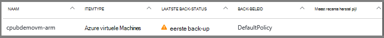
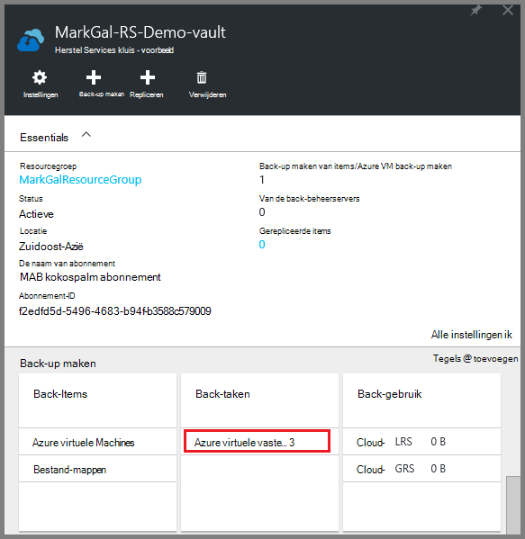
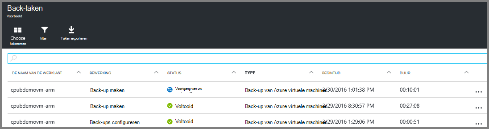

<properties
    pageTitle="Maak een back-up van Azure VMs naar een kluis herstel Services | Microsoft Azure"
    description="Ontdekken, registreren en back-up van Azure virtuele machines naar een kluis herstel services met deze procedures voor back-up van Azure virtuele machines."
    services="backup"
    documentationCenter=""
    authors="markgalioto"
    manager="cfreeman"
    editor=""
    keywords="VM back-up. een back-up VM; back-up en noodgevallen herstel; op arm vm back-up maken"/>

<tags
    ms.service="backup"
    ms.workload="storage-backup-recovery"
    ms.tgt_pltfrm="na"
    ms.devlang="na"
    ms.topic="article"
    ms.date="07/29/2016"
    ms.author="trinadhk; jimpark; markgal;"/>

# Back-up van Azure VMs naar een kluis herstel Services

> [AZURE.SELECTOR]
- [Een back-up VMs naar herstel Services kluis](backup-azure-arm-vms.md)
- [Back-up VMs op back-up kluis](backup-azure-vms.md)

Dit artikel bevat de procedure voor het back-ups van Azure VMs (resourcemanager geïmplementeerd en klassieke geïmplementeerd) naar een kluis herstel Services. De meeste werk voor een back-up VMs gaan in de voorbereiding. Voordat u kunt een back-up of een VM beveiligen, moet u de [vereisten](backup-azure-arm-vms-prepare.md) om het voorbereiden van uw omgeving voor het beschermen van uw VMs uitvoeren. Als u de vereisten hebt voltooid, kunt u de back-up bewerking om momentopnamen van uw VM te starten.

>[AZURE.NOTE] Azure heeft twee implementatiemodellen voor het maken en werken met resources: [resourcemanager en klassiek](../resource-manager-deployment-model.md). U kunt VMs resourcemanager geïmplementeerd en klassieke VMs beveiligen met herstel Services kluizen. [Maak een Back-up van Azure virtuele machines](backup-azure-vms.md) Zie voor meer informatie over het werken met model van de implementatie klassiek VMs.

Zie de artikelen over het [plannen van de back-infrastructuur van uw VM in Azure wordt aangegeven](backup-azure-vms-introduction.md) en [Azure virtuele machines](https://azure.microsoft.com/documentation/services/virtual-machines/)voor aanvullende informatie.

## De back-up taak activeert

De back-up beleid dat is gekoppeld aan de kluis herstel Services wordt gedefinieerd hoe vaak en wanneer de back-up wordt uitgevoerd. De eerste geplande back-up is standaard de eerste back-up. Totdat de eerste back-up plaatsvindt, geeft de laatste back-Status op het blad **Back-taken** als een **waarschuwing (eerste back-up in behandeling)**.

Tenzij uw eerste back-up verschuldigd niet snel begint is, wordt het wordt aanbevolen dat u **nu een Back-up**uitvoeren. De volgende procedure wordt gestart vanuit het dashboard kluis. Deze procedure fungeert voor het uitvoeren van de eerste back-uptaak als u klaar bent met alle vereisten voldoet. Als de eerste back-uptaak al is uitgevoerd, is deze procedure niet beschikbaar. Het bijbehorende back-beleid bepaalt de volgende back-uptaak.  

De eerste back-uptaak uitvoeren:

1. Klik op het dashboard kluis, klikt u op de tegel **back-up** op **Azure virtuele Machines**.  
    

    Hiermee opent u het blad **Back-up-Items** .

2. Klik op het blad **Back-up Items** met de rechtermuisknop op de kluis die u een back wilt-up en **back-up-nu**op.

    

    De back-uptaak wordt geactiveerd.  

    

3. Klik op **Azure virtuele machines**om weer te geven dat uw eerste back-up is voltooid, klikt u op het dashboard kluis, klikt u op de tegel **Back-taken** .

    

    Hiermee opent u het blad back-up-taken.

4. In het blad **back-up taken** ziet u de status van alle taken.

    

    >[AZURE.NOTE] Als onderdeel van de back-up serviceproblemen de back-Azure een opdracht naar de back-extensie in elke virtuele machine leegmaken van alle schrijft en een consistente momentopname.

    Wanneer de back-uptaak is voltooid, is de status ervan is *voltooid*.

## Fouten corrigeren
Als u problemen tijdens back-ups van uw virtuele computer, raadpleegt u het [artikel VM](backup-azure-vms-troubleshoot.md) voor hulp.

## Volgende stappen

Nu dat u hebt uw VM beveiligd, raadpleegt u de volgende artikelen voor aanvullende u beheertaken kunt doen met uw VMs, en hoe u VMs herstelt.

- [Beheren en controleren van uw virtuele machines](backup-azure-manage-vms.md)
- [Virtuele machines herstellen](backup-azure-arm-restore-vms.md)
