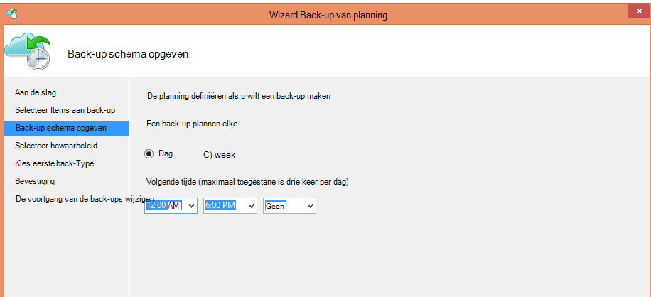
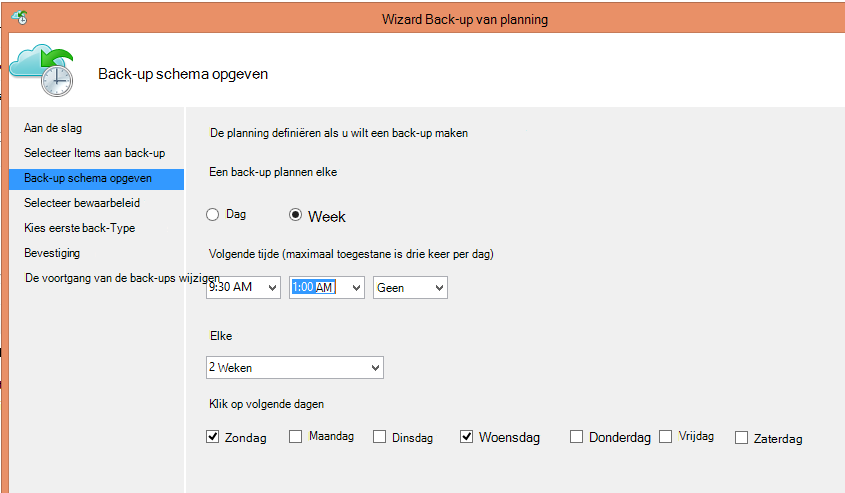
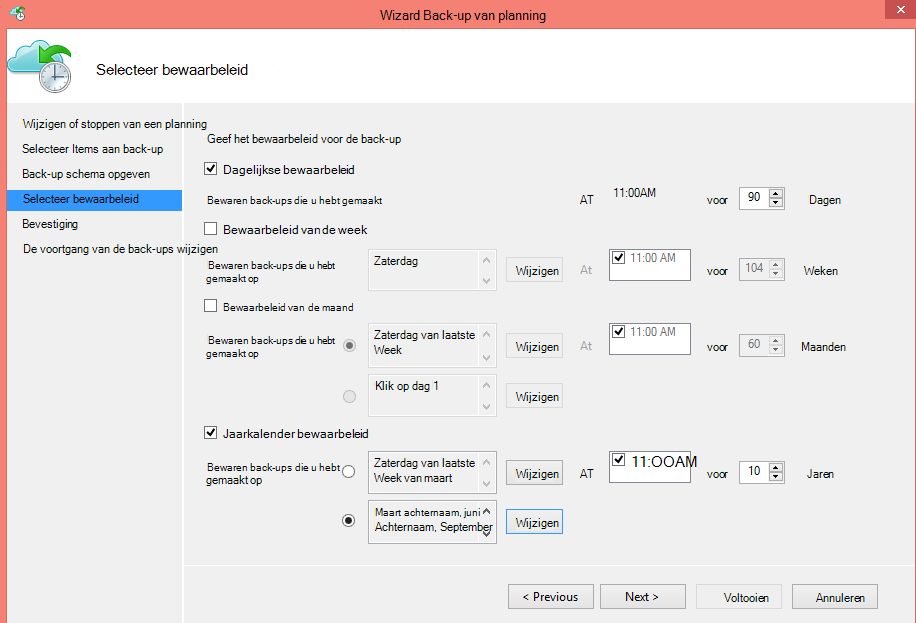
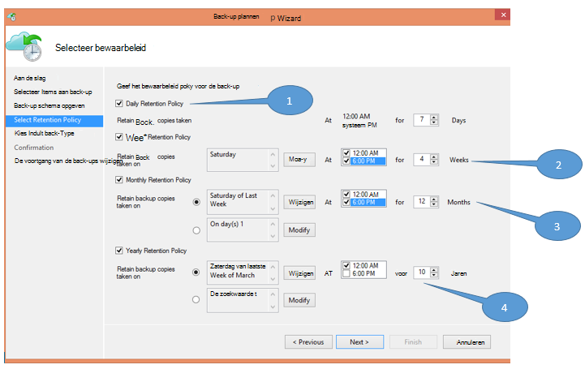
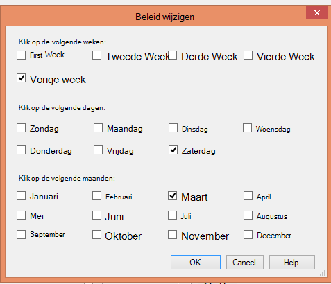

<properties
   pageTitle="Azure back-up gebruiken voor het vervangen van de infrastructuur van uw tape | Microsoft Azure"
   description="Leer hoe Azure back-ups biedt tape-achtige semantiek waarmee u een back-up en herstellen van gegevens in Azure"
   services="backup"
   documentationCenter=""
   authors="trinadhk"
   manager="vijayts"
   editor=""/>
<tags
   ms.service="backup"
   ms.devlang="na"
   ms.topic="article"
   ms.tgt_pltfrm="na"
   ms.workload="storage-backup-recovery"
   ms.date="09/27/2016"
   ms.author="jimpark;trinadhk;markgal"/>

# Azure back-up gebruiken voor het vervangen van de infrastructuur van uw tape

Azure back-up en System Center Data Protection Manager klanten kunt doen:

- Back-up van gegevens in planningen die het beste aansluiten op de behoeften van de organisatie.
- De back-upgegevens langer behouden
- Controleer Azure een deel van de lange termijn bewaarbeleid nodig (in plaats van tape heeft).

In dit artikel wordt uitgelegd hoe klanten back-up-en bewaarbeleid kunnen inschakelen. Klanten die hun lange-termijn-bewaarbeleid adres met banden moeten beschikken nu over een krachtige en haalbaar alternatief met de beschikbaarheid van deze functie. De functie is ingeschakeld in de meest recente versie van de Azure back-up (die beschikbaar is [hier](http://aka.ms/azurebackup_agent)). System Center DPM klanten moeten bijwerken aan ten minste DPM 2012 R2 UR5 vóór het gebruik van DPM met de back-up van Azure-service.

## Wat is de back-up-planning?
De back-planning geeft de frequentie van de back-bewerking. De instellingen in het volgende scherm bijvoorbeeld aangeven dat de back-ups worden genomen dagelijks om 6 uur en middernacht.

Klanten kunnen ook plannen voor een wekelijkse back-up. De instellingen in het volgende scherm geven, bijvoorbeeld dat back-ups elke alternatieve zondag & woensdag zijn gehouden aan 9:30 AM en 1:00 AM.

## Wat is het bewaarbeleid definiëren?
Het bewaarbeleid Hiermee geeft u de duur waarvoor de back-up moet worden opgeslagen. In plaats van alleen een 'platte beleid' voor alle back-punten op te geven, kunnen klanten opgeven van verschillende bewaarbeleid op basis van wanneer de back-up wordt gemaakt. Bijvoorbeeld blijft de back-komma die u hebt gemaakt dagelijks, die als een herstelpunt operationele fungeert, behouden voor 90 dagen duurt. De back-komma die u aan het einde van elk kwartaal ter controle hebt gemaakt blijft voor de duur van een langere behouden.

Het totale aantal "bewaarbeleid punten' is opgegeven in dit beleid is 90 (dagelijkse punten) + 40 (telkens één kwartaal voor tien jaar) = 130.

## Voorbeeld: het samenstellen van beide

1. **Dagelijkse bewaarbeleid**: back-ups die u hebt gemaakt dagelijks gedurende zeven dagen worden opgeslagen.
2. **Wekelijkse bewaarbeleid**: back-ups die u elke dag op middernacht en 6 uur zaterdag hebt gemaakt voor vier weken blijven behouden
3. **Maandelijkse bewaarbeleid**: back-ups die u hebt gemaakt op middernacht en 6 uur op de laatste zaterdag van elke maand blijven behouden voor twaalf maanden
4. **Jaarkalender bewaarbeleid**: back-ups die u hebt gemaakt op de laatste zaterdag van elke maart om middernacht 10 jaar worden bewaard

Het totale aantal "bewaarbeleid punten" (punten waaruit een klant gegevens kunt herstellen) in het diagram als volgt berekend:

- twee gegevenspunten per dag voor zeven dagen = 14 herstel wordt verwezen
- twee gegevenspunten per week voor vier weken = 8 herstel wordt verwezen
- twee gegevenspunten per maand voor 12 maanden = 24 herstel wordt verwezen
- een punt per jaar per 10 jaar = 10 herstel verwijst

Het totale aantal punten herstel is 56.

> [AZURE.NOTE] Azure back-up heeft een beperking geen op aantal herstel punten.

## Geavanceerde configuratie
Door te klikken op **wijzigen** in het vorige scherm, hebben klanten verdere flexibiliteit bij het opgeven van bewaarschema's.

## Volgende stappen
Zie voor meer informatie over Azure back-up is:

- [Inleiding tot Azure back-up maken](backup-introduction-to-azure-backup.md)
- [Probeer Azure back-up maken](backup-try-azure-backup-in-10-mins.md)
