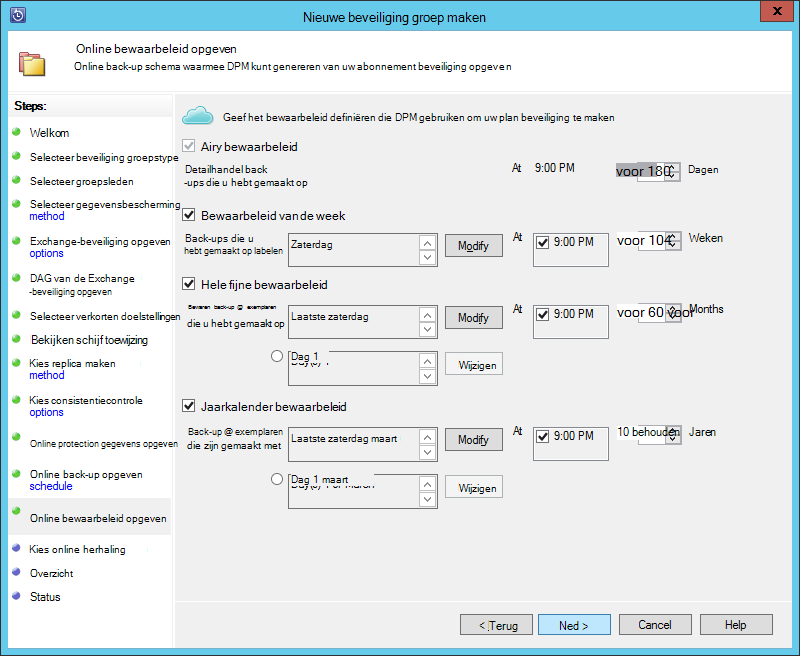

<properties
    pageTitle="Maak een back-up van een Exchange-server Azure back-up met System Center 2012 R2 DPM | Microsoft Azure"
    description="Meer informatie over het back-up van een Exchange-server naar Azure back-up System Center 2012 R2 DPM gebruiken"
    services="backup"
    documentationCenter=""
    authors="MaanasSaran"
    manager="NKolli1"
    editor=""/>

<tags
    ms.service="backup"
    ms.workload="storage-backup-recovery"
    ms.tgt_pltfrm="na"
    ms.devlang="na"
    ms.topic="article"
    ms.date="08/15/2016"
    ms.author="anuragm;jimpark;delhan;trinadhk;markgal"/>

# Back-up van een Exchange-server naar Azure back-up met System Center 2012 R2 DPM
In dit artikel wordt beschreven hoe een server systeem Center 2012 R2 Data Protection Manager (DPM) naar de back-up van een Microsoft Exchange-server Azure back-up wilt configureren.  

## Updates
Als u wilt de server DPM succes met Azure back-up hebt geregistreerd, moet u de meest recente update rollup voor System Center 2012 R2 DPM en de nieuwste versie van de Azure back-up-Agent installeren. De meest recente update rollup krijgen van de [Microsoft-catalogus](http://catalog.update.microsoft.com/v7/site/Search.aspx?q=System%20Center%202012%20R2%20Data%20protection%20manager).

>[AZURE.NOTE] Voor de voorbeelden in dit artikel, versie 2.0.8719.0 van de Azure back-up-Agent is geïnstalleerd en Update Rollup 6 op System Center 2012 R2 DPM is geïnstalleerd.

## Vereisten voor
Controleer voordat u verder gaat, of dat aan alle [vereisten](backup-azure-dpm-introduction.md#prerequisites) voor het gebruik van Microsoft Azure back-up te beveiligen werkbelasting is voldaan. Deze vereisten zijn:

- Een back-kluis op de Azure-site is gemaakt.
- Agent en kluis referenties zijn gedownload naar de server DPM.
- De-agent is geïnstalleerd op de server DPM.
- De referenties kluis zijn gebruikt de server DPM registreren.
- Als u de beveiliging van Exchange-2016, voer een upgrade uit naar DPM 2012 R2 UR9 of hoger

## DPM protection-agent  
Als u wilt de DPM protection-agent installeren op de Exchange-server, als volgt te werk:

1. Zorg ervoor dat de firewalls correct zijn geconfigureerd. Zie [configureren firewalluitzonderingen voor de agent](https://technet.microsoft.com/library/Hh758204.aspx).

2. De agent installeren op de Exchange-server door te klikken op **Management > agenten > installeren** console DPM-beheerder. Zie [de DPM protection-agent installeren](https://technet.microsoft.com/library/hh758186.aspx?f=255&MSPPError=-2147217396) voor gedetailleerde stappen.

## Maken van een groep beveiliging voor de Exchange-server

1. In de beheerconsole van DPM op **beveiliging**en klik vervolgens op **Nieuw** op het lint hulpmiddel om de wizard **Nieuwe beveiliging-groep maken** te openen.

2. Klik op **het welkomstscherm van de wizard** op **volgende**.

3. Klik op het scherm **selecteren beveiliging groepstype** **Servers** en klik op **volgende**.

4. Selecteer de Exchange server-database die u wilt beveiligen en klik op **volgende**.

    >[AZURE.NOTE] Als u de beveiliging van Exchange 2013, controleert u de [vereisten van Exchange 2013](https://technet.microsoft.com/library/dn751029.aspx).

    In het volgende voorbeeld wordt is de database Exchange 2010 ingeschakeld.

    

5. Selecteer de methode voor beveiliging.

    Naam van de groep beveiliging, en selecteer beide van de volgende opties:

    - Ik wil de korte termijn beveiliging Schijfopruiming gebruiken.
    - Ik wil online protection.

6. Klik op **volgende**.

7. Selecteer de optie **Eseutil uitvoeren om te controleren van gegevensintegriteit** als u wilt controleren van de integriteit van de Exchange Server-databases.

    Nadat u deze optie, back-consistentiecontrole wordt uitgevoerd op de server DPM om te voorkomen dat de i/o-verkeer is toegestaan, die wordt gegenereerd door de opdracht **eseutil** uit te voeren op de Exchange-server hebt geselecteerd.

    >[AZURE.NOTE]Als u deze optie gebruikt, moet u de oorspronkelijke en Eseutil.exe-bestanden naar de map C:\Program Files\Microsoft systeem Center 2012 R2\DPM\DPM\bin op de server DPM kopiëren. Anders wordt wordt de volgende fout geactiveerd:  
    

8. Klik op **volgende**.

9. Selecteer de database voor **Back-upkopie**en klik vervolgens op **volgende**.

    >[AZURE.NOTE] Als u 'volledige back-up"voor ten minste één DAG-up van een database niet inschakelt, worden niet logboeken afgekapt.

10. De doelstellingen configureren voor de **korte termijn back-up maken**en klik vervolgens op **volgende**.

11. De beschikbare schijfruimte controleren en klik vervolgens op **volgende**.

12. Selecteer het tijdstip waarop de DPM-server de eerste replicatie maken en klik op **volgende**.

13. Selecteer de opties voor consistentiecontrole en klik vervolgens op **volgende**.

14. Kies de database die u een back wilt-up naar Azure en klik vervolgens op **volgende**. Bijvoorbeeld:

    

15. De planning voor **Back-up van Azure**definiëren en klik vervolgens op **volgende**. Bijvoorbeeld:

    

    >[AZURE.NOTE] Houd er rekening mee Online herstel punten zijn gebaseerd op express volledig herstel wordt verwezen. Daarom moet u de komma online herstel plannen nadat de tijd die opgegeven voor de volledige herstel wijst.

16. Het bewaarbeleid configureren voor **Azure back-up maken**en klik vervolgens op **volgende**.

17. Kies een optie online herhaling en klik op **volgende**.

    Als u een grote database hebt, kan dit erg lang voor de eerste back-up wilt maken via het netwerk duren. Als u wilt voorkomen dat dit probleem, kunt u een offline back-up maken.  

    

18. Bevestig de instellingen en klik vervolgens op **Groep maken**.

19. Klik op **sluiten**.

## De Exchange-database herstellen

1. Als u wilt een Exchange-database herstellen, klikt u op **herstel** van de DPM-beheerconsole.

2. Zoek de Exchange-database die u wilt herstellen.

3. Selecteer een online herstelpunt in de vervolgkeuzelijst *hersteltijd* .

4. Klik op **herstellen** om de **Wizard herstellen**te starten.

Online herstel wordt verwezen, zijn er zijn vijf herstel typen:

- **Herstellen naar de oorspronkelijke locatie van de Exchange-Server:** De gegevens worden naar de oorspronkelijke Exchange-server worden hersteld.
- **Herstellen naar een andere database op een Exchange-Server:** De gegevens worden naar een andere database op een ander Exchange-server worden hersteld.
- **Herstellen met een Database herstel:** De gegevens worden naar een Exchange herstel Database (RDB) worden hersteld.
- **Kopiëren naar een netwerkmap:** De gegevens worden in een netwerkmap worden hersteld.
- **Kopiëren naar tape:** Als u een band-bibliotheek of een zelfstandige tape-station toegevoegd en geconfigureerd op de server DPM hebt, wordt de komma herstel naar een gratis band worden gekopieerd.

    

## Volgende stappen

- [Azure back-Veelgestelde vragen](backup-azure-backup-faq.md)
