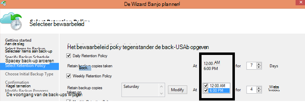

<properties
   pageTitle="Azure back-Veelgestelde vragen over | Microsoft Azure"
   description="Antwoorden op veelgestelde vragen over de back-service, back-agent, back-up en het bewaarbeleid, herstel, beveiliging en andere veelgestelde vragen over het herstellen van back-up en noodgevallen."
   services="backup"
   documentationCenter=""
   authors="markgalioto"
   manager="jwhit"
   editor=""
   keywords="back-up en noodgevallen herstel; back-service"/>

<tags
   ms.service="backup"
   ms.workload="storage-backup-recovery"
     ms.tgt_pltfrm="na"
     ms.devlang="na"
     ms.topic="get-started-article"
     ms.date="10/21/2016"
     ms.author="trinadhk; giridham; arunak; markgal; jimpark;"/>

# <a name="azure-backup-service--faq"></a>Azure back-up-service-Veelgestelde vragen


In dit artikel is een lijst met veelgestelde vragen (en de bijbehorende antwoorden) over de back-up van Azure-service. Snel antwoorden in onze community en als u een vraag is vaak wordt gevraagd, we toe te voegen aan dit artikel. De antwoorden op vragen bieden verwijzing meestal of ondersteuningsinformatie. U kunt vragen over Azure back-up in het gedeelte Disqus van dit artikel of een gerelateerde artikel. U kunt ook vragen over de back-up van Azure-service plaatsen in het [discussieforum](https://social.msdn.microsoft.com/forums/azure/home?forum=windowsazureonlinebackup).


## <a name="what-is-the-list-of-supported-operating-systems-from-which-i-can-back-up-to-azure-using-azure-backup-br"></a>Wat is de lijst met ondersteunde besturingssystemen waaruit ik kan een back-up naar Azure met Azure back-up? <br/>
Azure back-up ondersteunt de volgende lijst met besturingssystemen voor back-up-bestand-map, toepassing back-up met Azure back-Server en SCDPM.

| Besturingssysteem        | Platform           | SKU  |
| :------------- |-------------| :-----|
| Windows 8 en de meest recente SP 's      | 64-bits | Enterprise, Pro |
| Windows 7 en de meest recente SP 's      | 64-bits | Ultimate, Enterprise, Professional, voor thuisgebruik Premium, Home Basic, Starter |
| Windows 8.1 en de meest recente SP 's | 64-bits      |    Enterprise, Pro |
| Windows 10      | 64-bits | Enterprise, Pro, thuis |
|Windows Server 2012 R2 en de meest recente SP 's| 64-bits| Standaard, Datacenter, Foundation|
|Windows Server 2012 en de meest recente SP 's|    64-bits| Datacenter, Foundation, standaard|
|Windows Storage Server 2012 R2 en de meest recente SP 's  |64-bits|    Standaard, werkgroep|
|Windows-opslag Server 2012 en de meest recente SP 's |64-bits |Standaard, werkgroep
|Windows Server 2012 R2 en de meest recente SP 's  |64-bits|    Essentiële|
|Windows Server 2008 R2 SP1 |64-bits|    Standaard, Enterprise, Datacenter, Foundation|
|Windows Server 2008 SP2    |64-bits|    Standaard, Enterprise, Datacenter, Foundation|

Voor back-up van Azure VM,

- **Linux**: Azure back-up-ondersteuning biedt voor [een lijst met onderzoeken die worden goedgekeurd door Azure](../virtual-machines/virtual-machines-linux-endorsed-distros.md) behalve Core OS Linux.  Andere voren-uw-eigenaar bent van-Linux onderzoeken kunnen ook werken, zolang de VM-agent beschikbaar op de virtuele machine is en ondersteuning voor Python bestaat.
- **Windows Server**: versies die ouder zijn dan Windows Server 2008 R2 worden niet ondersteund.

## <a name="where-can-i-download-the-latest-azure-backup-agent-br"></a>Waar kan ik de meest recente back-up van Azure-agent downloaden? <br/>
Voor het back-ups van Windows Server, System Center DPM of Windows-client, vanaf [hier](http://aka.ms/azurebackup_agent)kunt u de meest recente agent downloaden. Als u back-up van een virtuele machine wilt, gebruikt u de VM-Agent (die automatisch worden geïnstalleerd de juiste extensie). De VM-Agent is al aanwezig op virtuele machines gemaakt op basis van de galerie met Azure.

## <a name="which-version-of-scdpm-server-is-supported-br"></a>Welke versie van SCDPM server wordt ondersteund? <br/>
Het is raadzaam dat u de [meest recente](http://aka.ms/azurebackup_agent) back-up van Azure-agent op de meest recente update rollup van SCDPM installeren (UR11 vanaf augustus 2016)

## <a name="when-configuring-the-azure-backup-agent-i-am-prompted-to-enter-the-vault-credentials-do-vault-credentials-expire"></a>Tijdens het configureren van de back-up van Azure-agent, ben ik gevraagd om in te voeren van de referenties kluis. Kluis referenties verlopen?
Ja, de referenties kluis verloopt na 48 uur. Als het bestand is verlopen, meld u aan bij de portal van Azure en de kluis referenties bestanden downloaden uit uw kluis.

## <a name="is-there-any-limit-on-the-number-of-vaults-that-can-be-created-in-each-azure-subscription-br"></a>Geldt er een beperking van het aantal kluizen die in elk Azure abonnement kan worden gemaakt? <br/>
Ja. Vanaf September 2016, kunt u 25 back-up kluizen per abonnement. U kunt maximaal 25 herstel Services kluizen per elke ondersteunde regio van Azure back-up per abonnement maken. Als u meer kluizen nodig hebt, maakt u een nieuw abonnement.

## <a name="are-there-any-limits-on-the-number-of-serversmachines-that-can-be-registered-against-each-vault-br"></a>Zijn er een beperkingen ten aanzien van het aantal servers/machines die kunnen worden geregistreerd ten opzichte van elke kluis? <br/>
Ja, kunt u maximaal 50 machines per kluis registreren. Voor IaaS Azure virtuele machines is de limiet 200 VMs per kluis. Als u meer machines registreren wilt, maakt u een nieuwe kluis.

## <a name="how-do-i-register-my-server-to-another-datacenterbr"></a>Hoe kan ik mijn server met een ander datacenter registreren?<br/>
Back-upgegevens wordt verzonden naar het datacenter van de kluis waaraan deze is geregistreerd. De eenvoudigste manier om te wijzigen van het datacenter is de agent verwijderen en opnieuw installeren van de agent en registreert naar een nieuwe kluis die bij de gewenste datacenter hoort.

## <a name="what-happens-if-i-rename-a-windows-server-that-is-backing-up-data-to-azurebr"></a>Wat gebeurt er als ik de naam van een Windows-server die is back-ups van gegevens naar Azure?<br/>
Wanneer u de naam van een server hebt gewijzigd, worden alle momenteel geconfigureerde back-ups gestopt.
Moet u de nieuwe naam van de server met de back-up-kluis registreren. Wanneer u een nieuwe registratie maakt, wordt de eerste back-bewerking is een volledige back-up en niet een incrementele back-up. Als u herstellen van gegevens die eerder back wilt-up is om de met de naam van de oude server, kunt u die gegevens met de optie [**een andere server**](backup-azure-restore-windows-server.md#recover-to-an-alternate-machine) in de wizard **Herstellen** terugzetten.

## <a name="what-types-of-drives-can-i-backup-files-and-folders-from-br"></a>Wat voor soort stations kan ik back-up maken bestanden en mappen uit? <br/>
De volgende set van stations/hoeveelheden is niet gevonden back-up:

- Verwisselbare Media: Het station moet rapporteren zoals een vaste moeten een back-item bron gebruikt.
- Alleen-lezen Volumes: het volume moet schrijfbare voor de volume schaduw copy service (VSS)-functie.
- Offline Volumes: Het volume moet online zijn voor VSS-functie zijn.
- Netwerkshare: het volume moet lokaal op de server worden back-up moet met online back-up.
- BitLocker beveiligde volumes: het volume moet worden ontgrendeld voordat de back-up kan zich voordoen.
- Bestand Systeemidentificatie: NTFS is het enige bestandssysteem ondersteund voor deze versie van de online-back-service.

## <a name="what-file-and-folder-types-can-i-back-up-from-my-serverbr"></a>Welke typen bestanden en mappen kan ik een back-up van mijn server?<br/>
De volgende typen voorwaarden wordt voldaan:

- Versleuteld
- Gecomprimeerd
- Verspreid
- Gecomprimeerde + verspreid
- Vaste koppelingen: Niet ondersteund, overgeslagen
- Reparsepunt: Niet ondersteund, overgeslagen
- Gecodeerd + gecomprimeerd: Niet worden ondersteund, wordt overgeslagen
- Versleutelde + verspreid: Niet worden ondersteund, wordt overgeslagen
- Gecomprimeerde Stream: Niet worden ondersteund, overgeslagen
- Verspreid Stream: Niet ondersteund, overgeslagen

## <a name="whats-the-minimum-size-requirement-for-the-cache-folder-br"></a>Wat is de vereiste minimale grootte voor de cachemap? <br/>
De grootte van de cachemap bepaalt de hoeveelheid gegevens die u een back-up. Uw map moet 5% van de ruimte die is vereist voor gegevensopslag.

## <a name="if-my-organization-has-one-vault-how-can-i-isolate-one-servers-data-from-another-server-when-restoring-databr"></a>Als mijn organisatie een kluis heeft, hoe kan ik isoleren van een server-gegevens uit een andere server wanneer upgegevens terugzetten?<br/>
Op alle servers die zijn geregistreerd om de dezelfde kunnen de back-up gemaakt door andere servers *die gebruikmaken van dezelfde wachtwoordzin*gegevens herstellen. Als u servers waarvan back-gegevens die u wilt isoleren van andere servers in uw organisatie hebt, gebruikt u een aangewezen wachtwoordzin voor deze servers. HRM servers kunnen bijvoorbeeld één versleuteling wachtwoordzin, accounting servers andere en opslagservers een derde gebruiken.

## <a name="can-i-migrate-my-backup-data-or-vault-between-subscriptions-br"></a>Kan ik 'migreren' Mijn back-upgegevens of kluis tussen abonnementen? <br/>
Nee. De kluis wordt gemaakt in een abonnement en kan niet worden toegewezen aan een ander abonnement nadat deze gemaakt.

## <a name="does-the-azure-backup-agent-work-on-a-server-that-uses-windows-server-2012-deduplication-br"></a>Werkt de back-up-Agent van Azure op een server die gebruikmaakt van Windows Server 2012 deduplication? <br/>
Ja. Wanneer dit zorgt ervoor dat de back-up, de agent-service de deduplicated gegevens converteert naar de normale gegevens. Deze vervolgens optimaliseert de gegevens voor back-up, worden de gegevens worden gecodeerd en stuurt de versleutelde gegevens naar de online-back-service.

## <a name="if-i-cancel-a-backup-job-once-it-has-started-is-the-transferred-backup-data-deleted-br"></a>Als ik een back-uptaak annuleren wanneer het is gestart, de overgedragen back-upgegevens verwijderd? <br/>
Nee. De back-kluis slaat de back-ups van gegevens die snel aan de komma van de annulering had overgedragen. Azure back-up wordt een samenvatting om af en toe controlepunten toevoegen naar de back-upgegevens tijdens de back-up gebruikt. Omdat er controlepunten in de back-upgegevens, kan het volgende back-proces de integriteit van de bestanden kunt valideren. De volgende back-up geactiveerd zou incrementele via de gegevens die u eerder een back-up had is gemaakt. Een incrementele back-up biedt betere gebruik van de bandbreedte, zodat u niet hoeft dezelfde gegevens meerdere keren overbrengen.

Voor het geval de back-up van Azure VM, nadat de taak wordt geannuleerd, overgedragen gegevens genegeerd en vers back-up incrementele gegevens van eerder succesvolle back-uptaak overzet.

## <a name="why-am-i-seeing-the-warning-azure-backups-have-not-been-configured-for-this-server-even-though-i-had-scheduled-regular-backups-previously-br"></a>Waarom zie ik de waarschuwing "Azure back-ups niet zijn geconfigureerd voor deze server" Hoewel ik regelmatige back-ups eerder had gepland? <br/>
Deze waarschuwing weergegeven wanneer de back-schema-instellingen die zijn opgeslagen op de lokale server niet hetzelfde als de instellingen die zijn opgeslagen in de back-kluis zijn. Wanneer de server of de instellingen zijn hersteld naar een bekende goede staat, kunnen de back-planningen synchronisatie in gaan verloren. Als u ontvangt deze waarschuwing, [het back-beleid configureren](backup-azure-manage-windows-server.md) en vervolgens **Weer omhoog nu uitvoeren** als u wilt synchroniseren van de lokale server met Azure.

## <a name="what-firewall-rules-should-be-configured-for-azure-backup-br"></a>Welke regels moeten worden geconfigureerd voor back-up van Azure firewall? <br/>
Het wordt aanbevolen dat u uw firewall om te communiceren met de volgende URL's toestaan voor een naadloze bescherming van gegevens op-premises-naar-Azure en werkbelasting-naar-Azure:

- www.msftncsi.com
- \*. Microsoft.com
- \*. WindowsAzure.com
- \*. microsoftonline.com
- \*. windows.net

##<a name="can-i-install-the-azure-backup-agent-on-an-azure-vm-already-backed-by-the-azure-backup-service-using-the-vm-extension-br"></a>Kan ik de back-up van Azure-agent op een Azure VM al wordt ondersteund door de back-up van Azure-service met de extensie VM installeren? <br/>
Absoluut. Azure back-up biedt VM niveau back-up voor Azure VMs met de extensie VM. U kunt de back-up van Azure-agent installeren op een Windows-besturingssysteem Gast te beveiligen van bestanden en mappen op deze Gast OS.

## <a name="can-i-install-the-azure-backup-agent-on-an-azure-vm-to-back-up-files-and-folders-present-on-temporary-storage-provided-by-the-azure-vm-br"></a>Kan ik de back-up van Azure-agent op een VM Azure back-up bestanden en mappen aanwezig op tijdelijke verstrekt door de VM Azure installeren? <br/>
U kunt de back-up van Azure-agent installeren op de Windows-besturingssysteem Gast en back-up van bestanden en mappen naar tijdelijke opslag. Echter, houd er rekening mee dat de back-ups mislukken zodra tijdelijke gegevens worden gewist af. Ook als de gegevens van de tijdelijke opslag is verwijderd, kunt u alleen terugzetten naar niet-vluchtige opslag.

## <a name="i-have-installed-azure-backup-agent-to-protect-my-files-and-folders-can-i-now-install-scdpm-to-work-with-azure-backup-agent-to-protect-on-premises-applicationvm-workloads-to-azure-br"></a>Ik heb geïnstalleerd Azure back-up-agent als u wilt beveiligen mijn bestanden en mappen. Kan ik SCDPM voor gebruik met Azure back-up-agent beveiligen met een lokale toepassing/VM werkbelasting naar Azure nu installeren? <br/>
Als u wilt gebruiken Azure back-up met SCDPM, is het aanbevolen SCDPM eerst en alleen Klik om te kunnen installeren Azure back-up-agent installeren. Dit zorgt ervoor dat naadloze integratie van de back-up van Azure-agent met SCDPM en staat beveiligen van bestanden/mappen, toepassing werkbelasting en VMs naar Azure, rechtstreeks vanuit de beheerconsole van SCDPM. Installatie van SCDPM na de installatie van Azure back-up-is agent ter hierboven genoemde niet op de hoogte of ondersteund.

## <a name="what-is-the-length-of-file-path-that-can-be-specified-as-part-of-azure-backup-policy-using-azure-backup-agent-br"></a>Wat is de lengte van bestandspad die kan worden opgegeven als onderdeel van Azure back-up-beleid Azure back-up-agent gebruiken? <br/>  
Azure back-up-agent is afhankelijk van NTFS. De die wordt [bestandspad lengtespecificatie wordt beperkt door Windows-API](https://msdn.microsoft.com/library/aa365247.aspx#fully_qualified_vs._relative_paths). Klanten kunnen voor het geval een back-up bestanden met bestand padlengte groter is dan de kleuren die hoort bij de Windows-API opgegeven, kiezen voor het back-up maken van de bovenliggende map of de harde schijf van de back-upbestanden.  

## <a name="what-characters-are-allowed-in-file-path-of-azure-backup-policy-using-azure-backup-agent-br"></a>Welke tekens zijn toegestaan in bestandspad van Azure back-up-beleid Azure back-up-agent gebruiken? <br>  
 Azure back-up-agent is afhankelijk van NTFS. Kunt [NTFS tekens ondersteund](https://msdn.microsoft.com/library/aa365247.aspx#naming_conventions) als onderdeel van de bestandsspecificatie van het.  

## <a name="can-i-use-azure-backup-server-to-create-a-bare-metal-recovery-bmr-backup-for-a-physical-server-br"></a>Kan ik de back-Server Azure gebruiken om te maken van een absoluut metalen herstel (BMR) back-up voor een fysieke server? <br/>
Ja.

## <a name="can-i-configure-the-backup-service-to-send-mail-if-a-backup-job-fails-br"></a>Kan ik de back-up-service voor het verzenden van e-mail als een back-uptaak mislukt configureren? <br/>
Ja, de back-up-service bevat verschillende gebeurtenis gebaseerde waarschuwingen die kunnen worden gebruikt met een PowerShell-script. Zie voor een volledige beschrijving, [waarschuwingen](backup-azure-manage-vms.md#alert-notifications)

## <a name="is-there-a-limit-on-the-size-of-each-data-source-being-backed-up-br"></a>Geldt er een beperking van de grootte van elke gegevensbron back-up wordt gemaakt? <br/>
Terwijl u op het niveau van de kluis er is geen limiet voor de hoeveelheid gegevens die u kunt back-up, Azure back-up opleggen een beperking (praktische overwegingen, deze limieten zeer hoog zijn) op maximale grootte van de gegevensbron. Vanaf augustus 2015 verlengt is de maximale grootte-gegevensbron voor de ondersteunde besturingssystemen:

|S.No | Besturingssysteem |  Maximale grootte van gegevensbron |
| :-------------: |:-------------| :-----|
|1| Windows Server 2012 of hoger| 54400 GB|
|2| Windows 8 of hoger| 54400 GB|
|3| Windows Server 2008, Windows Server 2008 R2 | 1700 GB|
|4| Windows 7 | 1700 GB|

De volgende tabel wordt uitgelegd hoe de grootte van elke gegevensbron wordt bepaald.

|   Gegevensbron  |   Meer informatie |
| :-------------: |:-------------|
|Volume |De hoeveelheid gegevens die worden back-up van één volume van een machine server of -client|
|VM Hyper-V | Som van de gegevens van alle VHD's van de virtuele machine back-up wordt gemaakt|
|Microsoft SQL Server-database | Grootte van één SQL-databasegrootte back-up wordt gemaakt |
|Microsoft SharePoint |Som van de inhouds- en configuratiedatabases vanuit een SharePoint-farm back-up wordt gemaakt|
|Microsoft Exchange |Som van de Exchange-databases in een Exchange-server back-up wordt gemaakt|
|BMR/systeemstatus |Elke afzonderlijke kopie van BMR of systeem status van de servicetoepassing voor automatische back-up wordt gemaakt|

## <a name="are-there-limits-on-the-number-of-times-a-backup-job-can-be-scheduled-per-daybr"></a>Gelden er beperkingen op hoe vaak die een back-uptaak kan worden gepland per dag?<br/>
Ja, u kunt uitvoeren back-taken op Windows Server of Windows-client maximaal drie keer per dag. U kunt back-taken uitvoeren op System Center DPM maximaal twee keer per dag. U kunt een back-uptaak één keer per dag voor IaaS VMs uitvoeren.

## <a name="is-there-a-difference-between-the-scheduling-policy-for-dpm-and-windows-server-ie-on-windows-server-without-dpm-br"></a>Is er een verschil tussen de planning beleid voor DPM en Windows Server (dat wil zeggen op Windows Server zonder DPM)? <br/>
Ja. DPM gebruikt, kunt u dagelijks, wekelijks, maandelijks en jaarkalender planningen opgeven. Windows Server (zonder DPM) kunt u alleen dagelijkse en wekelijkse planningen opgeven.

## <a name="is-there-a-difference-between-the-retention-policy-for-dpm-and-windows-serverclient-ie-on-windows-server-without-dpmbr"></a>Is er een verschil tussen het bewaarbeleid voor DPM en Windows Server-client (dat wil zeggen op Windows Server zonder DPM)?<br/>
Nee, beide DPM en Windows Server/client hebben dagelijks, wekelijks, maandelijks en jaarkalender bewaarbeleid.

## <a name="can-i-configure-my-retention-policies-selectively--ie-configure-weekly-and-daily-but-not-yearly-and-monthlybr"></a>Kan ik mijn bewaarbeleid beleidsregels selectief – dat wil zeggen wekelijkse configureren en dagelijks, maar niet jaarlijks en configureren maandelijks?<br/>
De structuur van de back-up van Azure bewaarbeleid Ja, kunt u volledige flexibiliteit bij het definiëren van het bewaarbeleid aan de hand van uw vereisten hebben.

## <a name="can-i-schedule-a-backup-at-6pm-and-specify-retention-policies-at-a-different-timebr"></a>Kan ik "een back-up plannen" om 6 uur en "bewaarbeleid" verschillende tegelijk opgeven?<br/>
Nee. Bewaarbeleid kunnen alleen worden toegepast op back-up wordt verwezen. In de volgende afbeelding is voor back-ups die u hebt gemaakt op 12 uur en 6 uur het bewaarbeleid opgegeven. <br/>


<br/>

## <a name="is-an-incremental-copy-transferred-for-the-retention-policies-scheduled-br"></a>Een incrementele kopie overgebracht voor het bewaarbeleid gepland? <br/>
Nee, de incrementele kopie verzonden op basis van de tijd waarop die worden genoemd in de pagina back-ups plannen. De punten die kunnen worden bewaard, worden bepaald op basis van het bewaarbeleid definiëren.

## <a name="if-a-backup-is-retained-for-a-long-duration-does-it-take-more-time-to-recover-an-older-data-point-br"></a>Als u een back-up blijft behouden voor de duur van een lang, duurt langer om te herstellen van een oudere gegevenspunt? <br/>
 Nee – de tijd herstellen van het oudste of de nieuwste komma is dezelfde. Er wordt een bepaald moment herstel behandeld als een volledige punt.

## <a name="if-each-recovery-point-is-like-a-full-point-does-it-impact-the-total-billable-backup-storagebr"></a>Als elk opsommingsteken herstel lijkt op een volledige punt, heeft dit invloed op de totale factureerbare back-up opslaan?<br/>
Normale langdurige bewaarbeleid punt producten opslaan back-gegevens als volledige punten. De volledige punten zijn *niet efficiënt* opslag maar eenvoudiger en sneller om herstellen. Incrementele kopieën opslag *efficiënt* zijn, maar moet u een reeks gegevens, die van invloed op uw hersteltijd herstellen. Azure back-up-opslagarchitectuur, kunt u het beste van beide wereld door optimaal opslaan van gegevens voor snelle Hiermee herstelt en dat weinig opslagruimte kosten. Deze gegevens opslag methode zorgt ervoor dat uw bandbreedte ingress- en egress efficiënt wordt gebruikt. Zowel de hoeveelheid opslagruimte van gegevens en de tijd die nodig is voor het herstellen van de gegevens, wordt tot een minimum beperkt. Lees meer informatie over hoe [incrementele back-ups](https://azure.microsoft.com/blog/microsoft-azure-backup-save-on-long-term-storage/) opslaan efficiënt zijn.

## <a name="is-there-a-limit-on-the-number-of-recovery-points-that-can-be-createdbr"></a>Is er een limiet voor het aantal herstel punten die kunnen worden gemaakt?<br/>
Nee. We hebt beperkingen ten aanzien van herstel punten verwijderd. U kunt zo veel herstel wordt verwezen als u wilt maken.

## <a name="why-is-the-amount-of-data-transferred-in-backup-not-equal-to-the-amount-of-data-i-backed-upbr"></a>Waarom wordt de hoeveelheid gegevens overgebracht in back-up niet gelijk is aan de hoeveelheid gegevens die ik back-up gemaakt?<br/>
 Alle gegevens die is back-up van Azure back-up-Agent of SCDPM of Azure back-up-Server, is gecomprimeerd en vóór de overdracht versleuteld. Nadat het comprimeren en versleuteling is toegepast, worden de gegevens in de back-kluis 30-40% kleiner.

## <a name="is-there-a-way-to-adjust-the-amount-of-bandwidth-used-by-the-backup-servicebr"></a>Is er een manier om aan te passen van de hoeveelheid bandbreedte die wordt gebruikt door de back-up-service?<br/>
 Ja, gebruikt u de optie **Eigenschappen wijzigen** in de back-up-Agent om aan te passen bandbreedte. Pas de bandbreedte en tijdstippen wanneer u dat er bandbreedte gebruiken. Zie [Netwerk beperken](../backup-configure-vault.md#enable-network-throttling), voor meer informatie.

## <a name="my-internet-bandwidth-is-limited-for-the-amount-of-data-i-need-to-back-up-is-there-a-way-i-can-move-data-to-a-certain-location-with-a-large-network-pipe-and-push-that-data-into-azure-br"></a>Mijn bandbreedte internet is beperkt voor de hoeveelheid gegevens die ik wil een back-up. Is er een manier kan ik gegevens naar een bepaalde locatie met een groot netwerk pipe en die gegevens in Azure push verplaatsen? <br/>
U kunt een back-up gegevens in Azure via het standaard online back-proces of u kunt de service Azure importeren/exporteren gebruiken om gegevens als u wilt opslagruimte in Azure blob te brengen. Er zijn geen aanvullende manieren van het ophalen van back-datum in Azure opslag. Voor informatie over het gebruik van de service Azure importeren/exporteren met Azure back-up maken, raadpleegt u het artikel [Offline back-up-werkstroom](backup-azure-backup-import-export.md) .

## <a name="how-many-recoveries-can-i-perform-on-the-data-that-is-backed-up-to-azurebr"></a>Hoeveel herstel kan ik uitvoeren op de gegevens die back-up in Azure?<br/>
Er is geen limiet van het aantal herstel van Azure back-up.

## <a name="do-i-have-to-pay-for-the-egress-traffic-from-azure-data-center-during-recoveriesbr"></a>Moet ik betalen voor het verkeer egress van Azure Datacenter tijdens herstellen?<br/>
 Nee. Uw gegevens zijn gratis en u geen btw geheven voor het verkeer egress.

## <a name="is-the-data-sent-to-azure-encrypted-br"></a>De gegevens verzonden naar Azure versleuteld? <br/>
Ja. Gegevens worden gecodeerd op de lokale server/client/SCDPM computer met AES256 en de gegevens worden verzonden via een beveiligde HTTPS-koppeling.

## <a name="is-the-backup-data-on-azure-encrypted-as-wellbr"></a>Is de back-upgegevens op Azure ook versleuteld?<br/>
 Ja. De gegevens die zijn verzonden naar Azure blijft versleutelde (bij rest). Microsoft biedt de back-upgegevens op elk gewenst moment niet ontsleutelen. Voor back-up van Azure VM, Azure back-up is afhankelijk van het coderen van de virtuele machine dat wil zeggen als uw VM is versleuteld met Azure schijfversleuteling of enkele andere versleutelingstechnologie, Azure back-versleuteling wordt gebruikt dat uw gegevens te beveiligen.

## <a name="what-is-the-minimum-length-of-encryption-key-used-to-encrypt-backup-data-br"></a>Wat is de minimumlengte van versleutelingssleutel gebruikt voor het coderen van back-upgegevens? <br/>
 De sleutel moet ten minste 16 tekens.

## <a name="what-happens-if-i-misplace-the-encryption-key-can-i-recover-the-data-or-can-microsoft-recover-the-data-br"></a>Wat gebeurt er als ik de sleutel misplace? Kan ik de gegevens herstellen (of) kunt Microsoft de gegevens herstellen? <br/>
De sleutel die wordt gebruikt voor het coderen van de back-upgegevens is alleen op de lokale klant aanwezig. Microsoft niet meer in een kopie in Azure wordt aangegeven en heeft geen geen toegang hebben tot de sleutel. Als de klant misplaces de toets, herstellen niet Microsoft de back-upgegevens.

## <a name="how-do-i-change-the-cache-location-specified-for-the-azure-backup-agentbr"></a>Hoe wijzig ik de locatie van de cache voor de back-up van Azure-agent opgegeven?<br/>
 Ga opeenvolging tot en met de lijst met opsommingstekens hieronder om te wijzigen van de locatie van de cache.
- De back-up-engine stoppen door de volgende opdracht in een opdrachtprompt met verhoogde bevoegdheid uit te voeren:

  ```PS C:\> Net stop obengine```

- De bestanden niet verplaatsen. In plaats daarvan de cache ruimte map kopiëren naar een ander station met voldoende ruimte is. De oorspronkelijke ruimte in de cache kan worden verwijderd na de acceptatie van dat de back-ups met de nieuwe cache-ruimte werkt.

- Werk de volgende registervermeldingen door het pad naar de nieuwe map van de cache-ruimte.<br/>

|Register-pad | Registersleutel | Waarde |
| ------ | ------- | ------|
| `HKEY_LOCAL_MACHINE\SOFTWARE\Microsoft\Windows Azure Backup\Config` | ScratchLocation | *Nieuwe cache voor de locatie van map* |
| `HKEY_LOCAL_MACHINE\SOFTWARE\Microsoft\Windows Azure Backup\Config\CloudBackupProvider` | ScratchLocation | *Nieuwe cache voor de locatie van map* |

- Start de back-up-engine opnieuw door de volgende opdracht in een opdrachtprompt met verhoogde bevoegdheid uit te voeren:

  ```PS C:\> Net start obengine```

  Zodra het back-up maken in de nieuwe cachelocatie is voltooid, kunt u de oorspronkelijke cachemap verwijderen.

## <a name="where-can-i-put-the-cache-folder-for-the-azure-backup-agent-to-work-as-expectedbr"></a>Waar kan ik de cache-map voor de back-up-Agent van de Azure werkt zoals verwacht opgeslagen?<br/>
De volgende locaties voor de cache-map worden niet aanbevolen:

- Netwerk delen of verwisselbare Media: de cache-map moet lokaal op de server waarvoor u een back-up met online back-up. Netwerklocaties of verwisselbare media zoals USB-station worden niet ondersteund.
- Offline Volumes: De cache-map moet online voor verwachte back-up met Azure back-Agent zijn.

## <a name="are-there-any-attributes-of-the-cache-folder-that-are-not-supportedbr"></a>Zijn er een kenmerken van de cache-map die niet worden ondersteund?<br/>
 De volgende kenmerken of combinaties daarvan worden niet ondersteund voor de cache-map:

- Versleuteld
- Maak gedupliceerd
- Gecomprimeerd
- Verspreid
- Reparsepunt

Het wordt aanbevolen dat de cache-map noch de metagegevens VHD de kenmerken hierboven voor verwachte werking van de back-up van Azure-agent heeft.
