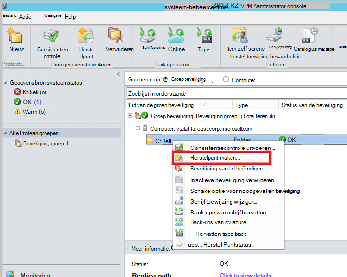
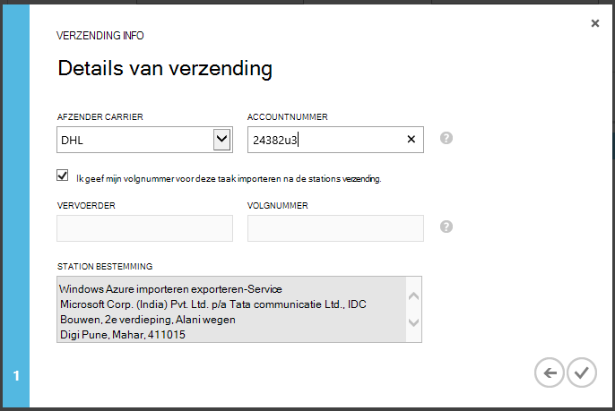

<properties
   pageTitle="Azure back-up - Offline back-up of de eerste seeding met de service Azure importeren/exporteren | Microsoft Azure"
   description="Leer hoe Azure back-up kunt u gegevens uit het netwerk met behulp van de Azure importeren/exporteren-service te verzenden. In dit artikel wordt uitgelegd het offline overenten van de eerste back-upgegevens met behulp van de service Azure importeren exporteren."
   services="backup"
   documentationCenter=""
   authors="saurabhsensharma"
   manager="shivamg"
   editor=""/>
<tags
   ms.service="backup"
   ms.devlang="na"
   ms.topic="article"
   ms.tgt_pltfrm="na"
   ms.workload="storage-backup-recovery"
   ms.date="08/16/2016"
   ms.author="jimpark;saurabhsensharma;nkolli;trinadhk"/>

# De werkstroom offline back-up in Azure back-up
Azure back-up bevat verschillende ingebouwde efficiency die netwerk- en opslag kosten tijdens de eerste volledige back-ups van gegevens naar Azure opslaan. Eerste volledige back-ups meestal overbrengen van grote hoeveelheden gegevens en meer netwerkbandbreedte in vergelijking met de volgende back-ups die alleen de delta/incrementals overbrengen. Azure back-up wordt de eerste back-ups gecomprimeerd. In het proces van het offline seeding, kunt Azure back-up schijven gebruiken om de gecomprimeerde eerste back-upgegevens offline te uploaden naar Azure.  

Het proces offline-seeding van Azure back-up is geïntegreerd met de [service Azure importeren/exporteren](../storage/storage-import-export-service.md) waarmee u kunt gegevens overbrengen naar Azure schijven. Als u TB (TBs) van de eerste back-gegevens die moeten worden overgedragen naar een netwerk met een hoge latentie en lage bandbreedte hebt, kunt u de werkstroom offline-seeding de eerste back-up op een of meer vaste schijven met een Azure datacenter levert. Dit artikel bevat een overzicht van de stappen die deze werkstroom voltooien.

## Overzicht

Met de voorziening voor offline-seeding van Azure back-up en Azure importeren/exporteren is het eenvoudig om de gegevens offline te uploaden naar Azure schijven. In plaats van de eerste volledige kopie overdragen via het netwerk, is de back-gegevens naar een *locatie tijdelijke*geschreven. Nadat het kopiëren naar de locatie van het tijdelijk opslaan met behulp van het hulpprogramma Azure importeren/exporteren is voltooid, worden deze gegevens naar een of meer SATA schijven, afhankelijk van de hoeveelheid gegevens worden geschreven. Deze stations worden uiteindelijk naar het dichtstbijzijnde datacenter van de Azure verzonden.

De [augustus 2016 bijwerken van Azure back-up (en later)](http://go.microsoft.com/fwlink/?LinkID=229525) bevat het *hulpprogramma voor het voorbereiden van Azure-schijf*, AzureOfflineBackupDiskPrep, met de naam die:

   - Helpt u voorbereiden op uw stations Azure importeren met het hulpprogramma Azure importeren/exporteren.
   - Automatisch een taak Azure importeren voor de service Azure importeren/exporteren op de [portal van Azure klassieke](https://manage.windowsazure.com) in plaats van dezelfde handmatig te maken met oudere versies van Azure back-up gemaakt.

Nadat het uploaden van de doos Azure is voltooid, Azure back-up kopieert de back-gegevens naar de back-kluis en de incrementele back-ups zijn gepland.

  > [AZURE.NOTE] Zorg ervoor dat u de update augustus 2016 van Azure back-up (of hoger) hebt geïnstalleerd en uitvoeren van alle stappen van de werkstroom met het gebruik van het hulpprogramma Azure schijf voorbereiden. Als u een oudere versie van Azure back-up gebruikt, kunt u de SATA harde schijf opstellen met behulp van het hulpprogramma Azure importeren/exporteren als gedetailleerde in later secties van dit artikel.

## Vereisten voor

- [Vertrouwd raken met de werkstroom Azure importeren/exporteren](../storage/storage-import-export-service.md).
- Voordat u de werkstroom is gestart, controleert u of:
    - Een kluis Azure back-up is gemaakt.
    - Kluis referenties zijn gedownload.
    - De back-up van Azure-agent is geïnstalleerd op Windows Server/Windows client- of System Center Data Protection Manager en de computer is geregistreerd bij de back-up van Azure-kluis.
- [De instellingen van het publiceren van Azure-bestand downloaden](https://manage.windowsazure.com/publishsettings) op de computer van waaruit u wilt een back-up van uw gegevens.
- Bereid een tijdelijk opslaan locatie, die mogelijk een netwerkshare of extra station op de computer. De locatie van het tijdelijk opslaan is tijdelijke opslag en tijdelijk tijdens deze werkstroom wordt gebruikt. Zorg ervoor dat het tijdelijk opslaan locatie voldoende schijfruimte voor het opslaan van uw eerste exemplaar. Als u probeert om ervoor te zorgen dat maakt u een back-up van een bestandsserver 500-GB, is het opslaggebied bijvoorbeeld ten minste 500 GB. (Minder wordt gebruikt door compressie.)
- Zorg ervoor dat u een ondersteunde station gebruikt. Alleen 3,5-inch SATA II/III vaste schijven worden ondersteund voor gebruik met de service importeren/exporteren. Vaste schijven groter zijn dan 8 TB worden niet ondersteund. U kunt een schijf SATA II/III extern koppelen op de meeste computers met behulp van een SATA II/III USB-adapter. Raadpleeg de documentatie Azure importeren/exporteren voor de meest recente set stations die ondersteuning biedt voor de service.
- BitLocker inschakelt op de computer waarop de SATA station schrijver is aangesloten.
- [Download het hulpprogramma Azure importeren/exporteren](http://go.microsoft.com/fwlink/?LinkID=301900&clcid=0x409) naar de computer waarop de SATA schrijver station is verbonden. Deze stap is niet vereist als u hebt gedownload en geïnstalleerd van de update augustus 2016 van Azure back-up (of hoger).

## Werkstroom
De informatie in deze sectie kunt u de werkstroom offline back-up uitvoeren, zodat uw gegevens kunnen worden bezorgd bij een Azure datacenter en geüpload naar de opslag van Azure. Als u vragen over de importservice of aspecten van het proces hebt, raadpleegt u de [service-overzicht importeren](../storage/storage-import-export-service.md) documentatie waarnaar wordt verwezen eerder.

### Offline back-up starten

1. Wanneer u een back-up plant, ziet u het volgende scherm (in Windows Server, Windows-client of System Center Data Protection Manager).

    

    Dit is het bijbehorende scherm in System Center Data Protection Manager:  
    

    De beschrijving van de invoer wordt als volgt:

    - **Tijdelijke locatie**: de tijdelijke opslaglocatie waarnaar de eerste back-up is geschreven. Dit kan zijn op een netwerkshare of een lokale computer. Als de computer van de kopie en broncomputer verschillen, is het raadzaam dat u het volledige netwerkpad van het tijdelijk opslaan locatie opgeven.
    - **Taaknaam van Azure importeren**: de unieke naam door welke importeren Azure-service en back-up van Azure de overdracht van gegevens die zijn verzonden op schijven naar Azure bijhouden.
    - **Azure Publish Settings**: een XML-bestand met informatie over het profiel van uw abonnement. De presentatie bevat ook veilige referenties die zijn gekoppeld aan uw abonnement. U kunt [het bestand downloaden](https://manage.windowsazure.com/publishsettings). Geef het lokale pad naar het bestand publiceren-instellingen.
    - **Azure abonnements-ID**: het Azure abonnements-ID voor het abonnement waarop u van plan bent om te starten van de taak Azure importeren. Als u meerdere Azure abonnementen hebt, gebruikt u de ID van het abonnement waaraan u wilt koppelen aan de taak importeren.
    - **Azure opslag-Account**: het account klassieke type opslag in de meegeleverde Azure abonnement die wordt gekoppeld aan de taak Azure importeren.
    - **Azure opslag Container**: de naam van de bestemming opslag label in de opslag van Azure-account waar van deze taak gegevens zijn geïmporteerd.

    > [AZURE.NOTE] Als u hebt uw server vanuit de [Azure-portal](https://portal.azure.com) naar een kluis Azure herstel Services geregistreerd voor uw back-ups en niet op een Cloud oplossing (CSP) van abonnement zijn, kunt u nog steeds een klassieke type opslag-account maken van de Azure-portal en deze gebruiken voor de werkstroom offline back-up.

    Sla al deze informatie omdat u voert u het opnieuw moet in stappen uit te voeren. Alleen de die *locatie tijdelijke* is vereist als u het hulpprogramma voor het voorbereiden van Azure-schijf hebt gebruikt voor het voorbereiden van de schijven.    

2. De werkstroom voltooien en selecteer vervolgens **Nu een Back-Up maken** in de back-Azure beheerconsole om te starten de kopie offline back-up. De eerste back-up is naar het opslaggebied als onderdeel van deze stap geschreven.

    

    U voltooit de bijbehorende werkstroom in System Center Data Protection Manager, met de rechtermuisknop op de **Groep beveiliging**en kies vervolgens de optie **maken herstel wijst** . U kiest de optie **Online Protection** .

    

    Nadat de bewerking is voltooid, kan het tijdelijk opslaan locatie worden gebruikt voor schijfvoorbereiding van de.

    

### Een SATA schijf voorbereiden en maken van een taak Azure importeren met behulp van het hulpprogramma Azure schijf voorbereiden
Het hulpprogramma voor het voorbereiden van Azure-schijf is beschikbaar in installatiemap van de herstel Services-agent (augustus 2016 bijwerken en hoger) in het volgende pad.

   *\Microsoft* *Azure* *Herstel* *Services* * Agent\Utils\*

1. Ga naar de map en de adreslijst **AzureOfflineBackupDiskPrep** kopiëren naar een kopie computer waarop de stations worden voorbereid zijn gekoppeld. Controleer of het volgende met betrekking tot de kopie-computer:

      - De computer kopiëren toegang het tijdelijk opslaan locatie voor de werkstroom offline-seeding met behulp van hetzelfde netwerkpad dat is opgegeven in de werkstroom **offline back-up starten** .

      - BitLocker is ingeschakeld op de computer.

      - De computer toegang de Azure-portal.

      Zo nodig is de computer kopiëren hetzelfde als de broncomputer.

2. Open een opdrachtprompt met verhoogde bevoegdheid op de computer kopiëren met de voorbereiding van Azure schijf hulpprogramma directory als de huidige map en voer de volgende opdracht:

      *.\AzureOfflineBackupDiskPrep.exe* s: <*Pad naar de locatie van de tijdelijke*> [ñ = <*pad naar PublishSettingsFile*>]

| Parameter | Beschrijving
|-------------|-------------|
|s: <*Pad naar de locatie van de tijdelijke*> | Verplicht invoer die wordt gebruikt om het pad naar het tijdelijk opslaan locatie die u hebt ingevoerd in de werkstroom **offline back-up starten** . |
|ñ = <*pad naar PublishSettingsFile*> | Optionele invoer die wordt gebruikt om het pad naar het **Azure Publish Settings** -bestand dat u hebt ingevoerd in de werkstroom **offline back-up starten** . |

> [AZURE.NOTE] De &lt;pad naar PublishSettingFile&gt; waarde is verplicht wanneer de computer van de kopie en broncomputer verschillen.

Wanneer u de opdracht uitvoert, vraagt het hulpmiddel de selectie van de taak Azure importeren die overeenkomt met de stations die moeten worden opgesteld. Als er slechts een taak één importeren gekoppeld aan de opgegeven locatie voor het tijdelijk opslaan is, ziet u een scherm zoals degene die volgt op.

     
3. Voer de letter zonder de afsluitende dubbele punt voor de gekoppelde schijf die u wilt doorverbinden met Azure voorbereiden. Geef ter bevestiging voor de opmaak van het station wanneer hierom wordt gevraagd.

Het hulpmiddel begint vervolgens voor het voorbereiden van de schijf met de back-upgegevens. Mogelijk moet u extra schijven wanneer hierom wordt gevraagd door het hulpprogramma geval de meegeleverde schijf geen voldoende ruimte is voor de back-upgegevens heeft als bijlage toevoegen.  

Aan het einde van het hulpmiddel is uitgevoerd, worden een of meer schijven die u hebt opgegeven voor verzending naar Azure bereid. Daarnaast wordt een project importeren met de naam die u tijdens de werkstroom **starten offline back-up** gemaakt van de Azure klassieke portal. Het hulpmiddel worden ten slotte het verzendadres met het Azure datacenter waar de schijven moeten worden verzonden en de koppeling om te zoeken van de taak importeren op de Azure klassieke portal weergegeven.

    
4. De schijven naar het adres dat het hulpprogramma verzenden en houd de volgnummer voor toekomstig gebruik. 
5. Wanneer u gaat u naar de koppeling die het hulpmiddel weergegeven, ziet u het Azure opslag-account dat u hebt opgegeven in de werkstroom **offline back-up starten** . Hier ziet u de zojuist gemaakte importeren taak op het tabblad **Importeren/EXPORTEREN** van het account opslag.

    
6. Klik op **INFO verzending** onder aan de pagina als u wilt bijwerken van uw contactgegevens, zoals wordt weergegeven in het volgende scherm. Microsoft gebruikt deze informatie om uw schijven terug naar u verzenden nadat de taak importeren is voltooid.

    
7. Geef de details verzending in het volgende scherm. Geef de **Vervoerder** en **Volgnummer** details die overeenkomen met de schijven die u hebt verzonden naar het Azure datacenter.

    

### De werkstroom
Nadat de taak importeren is voltooid, is eerste back-upgegevens beschikbaar in uw account opslag. Het herstelproces Services-agent en vervolgens kopieert de inhoud van de gegevens uit dit account naar de back-up kluis of herstel Services vault, afhankelijk is van toepassing. De Azure back-up-agent uitvoeren in de volgende keer geplande back-ups, de incrementele back-up op de eerste back-up.

> [AZURE.NOTE] In de volgende secties gelden voor gebruikers van eerdere versies van Azure back-up maken die geen toegang tot het hulpprogramma Azure schijf voorbereiden.

### Een SATA schijf voorbereiden

1. Download het [Hulpprogramma Microsoft Azure-importeren/exporteren](http://go.microsoft.com/fwlink/?linkid=301900&clcid=0x409) naar de computer kopiëren. Zorg ervoor dat het tijdelijk opslaan locatie is toegankelijk zijn vanuit de computer waarop u van plan bent om uit te voeren van de volgende set opdrachten. Zo nodig is de computer kopiëren hetzelfde als de broncomputer.

2. Pak de WAImportExport.zip-bestand. Het hulpprogramma WAImportExport indelingen de SATA harde schijf, schrijft de back-gegevens naar de SATA harde schijf en versleutelt uitvoeren. Voordat u de volgende opdracht uitvoert, moet u ervoor zorgen dat BitLocker is ingeschakeld op de computer.  

    *.\WAImportExport.exe PrepImport /j: <* JournalFile*> .jrn /id: <*sessie-id*> /sk: <*StorageAccountKey*> /BlobType:**PageBlob* * /t: <*TargetDriveLetter*>/opmaken / /srcdir versleutelen: <*tijdelijke locatie*> /dstdir: <*DestinationBlobVirtualDirectory*>/*

    > [AZURE.NOTE] Als u de update augustus 2016 van Azure back-up (of hoger) hebt geïnstalleerd, controleert u de locatie van het tijdelijk opslaan die u hebt ingevoerd is hetzelfde als de afbeelding op het scherm **Nu een Back-Up maken** en AIB en Base Blob bestanden bevat.

| Parameter | Beschrijving
|-------------|-------------|
| /j: <*JournalFile*>| Het pad naar het bestand logboek. Elke station moet exact één logboek-bestand. Het logboek-bestand mag geen op het doelstation. De bestandsextensie logboek .jrn is en als onderdeel van de uitvoering van deze opdracht is gemaakt.|
|/ID: <*sessie-id*> | De sessie-ID identificeert een sessie kopiëren. Deze worden gebruikt om ervoor te zorgen nauwkeurige herstel van een sessie onderbroken kopiëren. Bestanden die worden gekopieerd in een kopieersessie worden opgeslagen in een map die de naam van de sessie-ID in de doelstation.|
| /SK: <*StorageAccountKey*> | De accountsleutel voor de opslag-account waaraan u de gegevens zijn geïmporteerd. De sleutel moet hetzelfde tijdens het maken van back-beleid/beveiliging groepen die is ingevoerd.|
| / BlobType | Het type blob. Deze werkstroom werkt alleen als **PageBlob** is opgegeven. Dit is niet de standaardoptie en moet worden vermeld in deze opdracht. |
|/ t: <*TargetDriveLetter*> | De letter zonder de afsluitende dubbele punt van de harde schijf van doel voor de huidige sessie van kopiëren.|
|/ Format | De optie voor het opmaken van het station. Deze parameter opgeven wanneer het station worden opgemaakt moet; anders weglaat. Voordat het hulpmiddel het station opgemaakt, wordt deze vraagt om een bevestiging van de console. Als u wilt de bevestiging onderdrukken, geeft u de parameter /silentmode.|
|/ versleutelen | De optie voor het coderen van het station. Deze parameter opgeven wanneer het station nog niet zijn versleuteld met BitLocker en moet worden gecodeerd door het hulpprogramma. Als het station al zijn versleuteld met BitLocker, deze parameter weglaat, geeft u de parameter /bk en geef de bestaande BitLocker-sleutel. Als u de parameter/Format opgeeft, moet u ook opgeven de / parameter versleutelen. |
|/srcdir: <*SourceDirectory*> | De bronmap waarin bestanden worden gekopieerd naar het doelstation. Zorg ervoor dat de naam van de opgegeven map een volledig in plaats van relatieve pad heeft.|
|/dstdir: <*DestinationBlobVirtualDirectory*> | Het pad naar de bestemming virtuele map in uw account Azure opslag. Zorg ervoor dat de namen van de geldige container gebruikt wanneer u de bestemming virtuele mappen of BLOB's opgeven. Houd er rekening mee dat de namen van de container kleine letters moeten.  De containernaam van deze moet u tijdens het maken van back-beleid/beveiliging groepen hebt ingevoerd.|

  > [AZURE.NOTE] Een logboek-bestand is gemaakt in de map WAImportExport waarmee de volledige gegevens van de werkstroom worden vastgelegd. Wanneer u een project importeren in de portal van Azure maakt, hebt u nodig met dit bestand.

  

### Maken van een project importeren in de portal van Azure
1. Ga naar uw account opslag in de [klassieke Azure-portal](https://manage.windowsazure.com/), klikt u op **Importeren/exporteren**en **Importeren taak maken** in het taakvenster.

    

2. In stap 1 van de wizard aangeven dat u uw harde schijf hebt gemaakt en dat u het station logboek-bestand beschikbaar hebt.
3. Geef in stap 2 van de wizard, contactgegevens voor de persoon die verantwoordelijk voor deze taak importeren is.
4. Klik in stap 3 upload de station logboek-bestanden die u in de vorige sectie hebt gekregen.
5. Voer een beschrijvende naam voor de taak importeren die u tijdens het maken van back-beleid/beveiliging groepen hebt ingevoerd in stap 4. De naam die u invoert mogen alleen kleine letters, cijfers, streepjes en onderstrepingstekens, moet beginnen met een letter en mogen geen spaties bevatten. De naam die u kiest, wordt gebruikt voor het bijhouden van uw taken terwijl ze in voortgang en nadat ze zijn voltooid.
6. Selecteer vervolgens uw datacenter regio in de lijst. Het gebied van het datacenter geeft aan de datacenter en het adres waarnaar u uw pakket moet verzenden.

    

7. In stap 5, selecteer uw afzender carrier in de lijst en voer uw accountnummer carrier. Microsoft gebruikt deze account om uw schijven terug naar u verzenden nadat u uw taak importeren is voltooid.

8. Verzend de schijf en voer de volgnummer om bij te houden van de status van de verzending. Nadat de schijf in het datacenter binnenkomt, deze wordt gekopieerd naar het opslag-account en de status wordt bijgewerkt.

    

### De werkstroom
Nadat de eerste back-upgegevens is beschikbaar in uw account opslag, de Microsoft Azure herstel Services-agent kunt u de inhoud van de gegevens via dit account gekopieerd naar de back-up-kluis of herstel Services kluis, afhankelijk is van toepassing. De Azure back-up-agent uitvoeren in de volgende planning back-up keer, de incrementele back-up op de eerste back-up.

## Volgende stappen
- Raadpleeg voor vragen over de werkstroom Azure importeren/exporteren, [Gebruik de service Microsoft Azure importeren/exporteren om gegevens met Blob storage te brengen](../storage/storage-import-export-service.md).
- Raadpleeg de sectie offline back-up van de Azure back- [Veelgestelde vragen over](backup-azure-backup-faq.md) vragen hebt over de werkstroom.
