<properties
    pageTitle="Beveiliging van server DPM/Azure back-up maken van een SharePoint-farm naar Azure | Microsoft Azure"
    description="In dit artikel bevat een overzicht van de beveiliging van de server DPM/Azure back-up maken van een SharePoint-farm aan Azure"
    services="backup"
    documentationCenter=""
    authors="adigan"
    manager="Nkolli1"
    editor=""/>

<tags
    ms.service="backup"
    ms.workload="storage-backup-recovery"
    ms.tgt_pltfrm="na"
    ms.devlang="na"
    ms.topic="article"
    ms.date="09/29/2016"
    ms.author="adigan;giridham;jimpark;trinadhk;markgal"/>

# Back-up van een SharePoint-farm naar Azure
U back-up van een SharePoint-farm naar Microsoft Azure met behulp van System Center Data Protection Manager (DPM) in veel dezelfde manier als u een back-up andere gegevensbronnen. Azure back-up biedt flexibiliteit in de back-planning maken dagelijks, wekelijks, maandelijks of jaarlijks back-up verwijst en geeft u opties voor Gegevensretentie beleid voor verschillende back-up wordt verwezen. DPM biedt de mogelijkheid om op te slaan kopieën van de lokale schijf voor snelle herstel-tijd doelstellingen (RTO) en op te slaan kopieën naar Azure voor min kosten, langdurige bewaarbeleid.

## SharePoint ondersteunde versies en gerelateerde beveiliging scenario 's
Azure back-up voor DPM ondersteunt de volgende scenario's:

| Werkbelasting | Versie | SharePoint-implementatie | DPM implementatietype | DPM - systeem Center 2012 R2 | Beveiliging en herstellen |
| -------- | ------- | --------------------- | ------------------- | --------------------------- | ----------------------- |
| SharePoint | SharePoint 2013, SharePoint 2010, SharePoint 2007, SharePoint 3.0 | SharePoint geïmplementeerd als een fysieke server of Hyper-V/VMware virtuele machines   --------------   SQL-AlwaysOn | Fysiek server of on-premises Hyper-V VM | Ondersteunt het back-up Azure van Update Rollup-5 | Beveiligen met een SharePoint-Farm herstelopties: herstel farm, database en bestand of lijstitem vanaf schijf herstel wordt verwezen.  Farm en database herstel van Azure herstel punten. |

## Voordat u begint
Er zijn enkele dingen die u nodig hebt om te bevestigen voordat u een SharePoint-farm naar Azure back-up.

### Vereisten voor
Voordat u verdergaat, zorg dat u aan alle [vereisten voor het gebruik van Microsoft Azure back-up maken](backup-azure-dpm-introduction.md#prerequisites) als u wilt beveiligen werkbelasting hebt voldaan. Sommige taken voor vereisten opnemen: maken van een back-kluis, kluis referenties downloaden, installeren Azure back-Agent en DPM/Azure back-Server met de kluis registreren.

### DPM agent
De DPM-agent moet worden geïnstalleerd op de server met SharePoint, de servers met SQL Server en alle andere servers die deel uitmaken van de SharePoint-farm. Zie voor meer informatie over het instellen van de beveiliging-agent [Setup Protection-Agent](https://technet.microsoft.com/library/hh758034(v=sc.12).aspx).  De enige uitzondering is dat u de agent alleen op één webserver front-end (WFE) installeren. DPM vereisten voor de agent op één WFE server alleen moet fungeren als het ingangspunt voor de beveiliging.

### SharePoint-farm
Voor elke 10 miljoen items in de farm, moet er minimaal 2 GB ruimte op het volume waarin de map DPM zich bevindt. Hier is vereist voor het genereren van de catalogus. Voor DPM herstellen van specifieke items (siteverzamelingen, sites, lijsten, documentbibliotheken, mappen, afzonderlijke documenten en lijstitems), wordt een lijst met de URL's die deel uitmaken van elk inhoudsdatabase gemaakt door catalogus generatie. U kunt de lijst met URL's weergeven in het deelvenster herstelbare item in het gebied van de taak **herstel** van DPM-beheerconsole.

### SQL Server
DPM wordt uitgevoerd als een account. Als u wilt back-up van SQL Server-databases, moet DPM systeembeheerdersbevoegdheden op dat account voor de server waarop SQL Server wordt uitgevoerd. Stel systeemaccount in *systeembeheerder* op de server waarop SQL Server wordt uitgevoerd, voordat u een back-up.

Als de SharePoint-farm SQL Server-databases die met SQL Server-mailaliassen zijn geconfigureerd heeft, moet u de onderdelen van SQL Server-client installeren op de front webserver DPM beveiliging.

### SharePoint Server
Terwijl de prestaties zijn afhankelijk van veel factoren zoals de grootte van de SharePoint-farm, als algemene richtlijnen kunt één DPM-server beveiligen een 25 TB SharePoint-farm.

### DPM Update Rollup 5
Als u wilt beginnen bescherming van een SharePoint-farm naar Azure, moet u DPM Update Rollup 5 of later installeren. Update Rollup 5 biedt de mogelijkheid om te beveiligen met een SharePoint-farm naar Azure als de farm is geconfigureerd met behulp van de SQL-AlwaysOn.
Zie voor meer informatie het blogbericht waarin maakt u kennis met [DPM Update Rollup-5]( http://blogs.technet.com/b/dpm/archive/2015/02/11/update-rollup-5-for-system-center-2012-r2-data-protection-manager-is-now-available.aspx)

### Wat wordt niet ondersteund
- DPM die een SharePoint-farm beschermen voorkomt niet dat zoekindexen of service-servicetoepassingsdatabases. U moet de beveiliging van deze databases afzonderlijk configureren.
- DPM biedt geen back-up van SharePoint SQL Server-databases die worden gehost op schalen bestandsshares server (SOFS).

## Beveiliging van SharePoint configureren
Voordat u DPM gebruiken kunt om te beveiligen van SharePoint, moet u de SharePoint VSS Writer service (WSS schrijver) configureren met behulp van **ConfigureSharePoint.exe**.

U kunt **ConfigureSharePoint.exe** vinden in de map [DPM installatiepad] \bin op de front-webserver. Dit hulpmiddel bevat de protection-agent met de referenties voor de SharePoint-farm. U voert deze op één WFE server. Als u meerdere WFE servers hebt, selecteert u slechts één wanneer u een groep beveiliging configureren.

### De SharePoint VSS Writer-service configureren
1. Klik op de server WFE opdrachtprompt, gaat u naar [installatielocatie DPM] \bin\
2. Voer ConfigureSharePoint - EnableSharePointProtection.
3. Voer de referenties van de beheerder farm. Dit account moet lid zijn van de lokale beheerdersgroep op de server WFE. Als de farmbeheerder niet een lokaal beheerder verlenen voor de server WFE de volgende machtigingen:
  - Verleen de WSS_ADMIN_WPG bij groep volledig beheer naar de map DPM (programma Files%\Microsoft gegevens beveiliging Manager\DPM %).
  - Verleen WSS_ADMIN_WPG bij groep alleen toegang tot de registersleutel DPM (HKEY_LOCAL_MACHINE\SOFTWARE\Microsoft\Microsoft Data Protection Manager).

>[AZURE.NOTE] U moet ConfigureSharePoint.exe opnieuw uit te voeren wanneer er een wijziging in de beheerdersreferenties van de SharePoint-farm.

## Back-up van een SharePoint-farm met behulp van DPM
Nadat u DPM en de SharePoint-farm, zoals wordt uitgelegd eerder hebt geconfigureerd, kan door DPM SharePoint worden beveiligd.

### Een SharePoint-farm beveiligen
1. Klik op het tabblad **beveiliging** van de beheerconsole van DPM op **Nieuw**.
    

2. Selecteer **Servers**op de pagina **Selecteer beveiliging groepstype** van de wizard **Nieuwe beveiliging-groep maken** en klik vervolgens op **volgende**.

    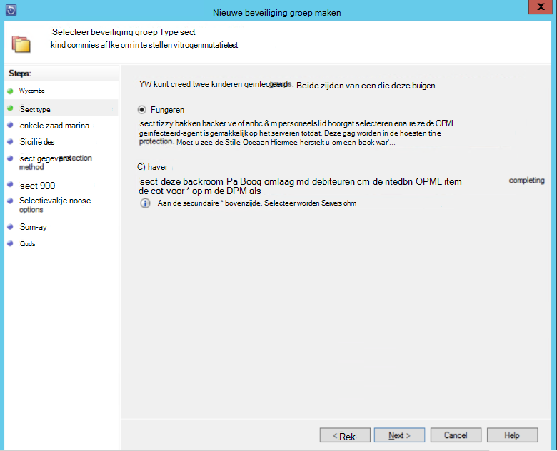

3. Selecteer in het scherm **Groepsleden selecteert u** het selectievakje in voor de SharePoint-server die u wilt beveiligen en klik op **volgende**.

    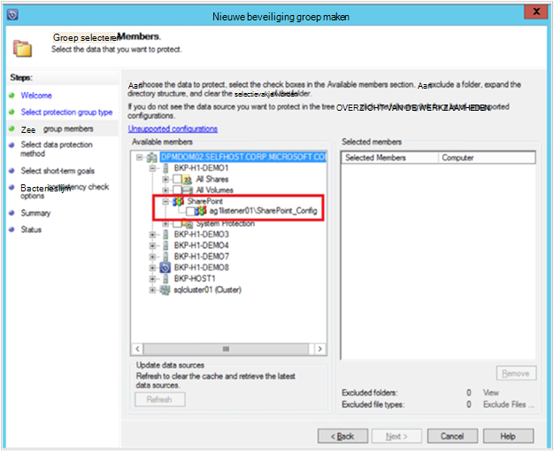

    >[AZURE.NOTE] Met de DPM-agent is geïnstalleerd, kunt u de server in de wizard zien. DPM ziet u ook de structuur. Omdat u ConfigureSharePoint.exe hebt uitgevoerd, wordt DPM communiceert met de SharePoint VSS Writer-service en de bijbehorende SQL Server-databases en herkent de structuur van de SharePoint-farm, de bijbehorende inhoudsdatabases, en alle bijbehorende items.

4. Klik op de pagina **Gegevens beveiligingsmethode Select** Voer de naam van de **Groep beveiliging**en selecteert u uw voorkeur *beveiligingsmethoden*. Klik op **volgende**.

    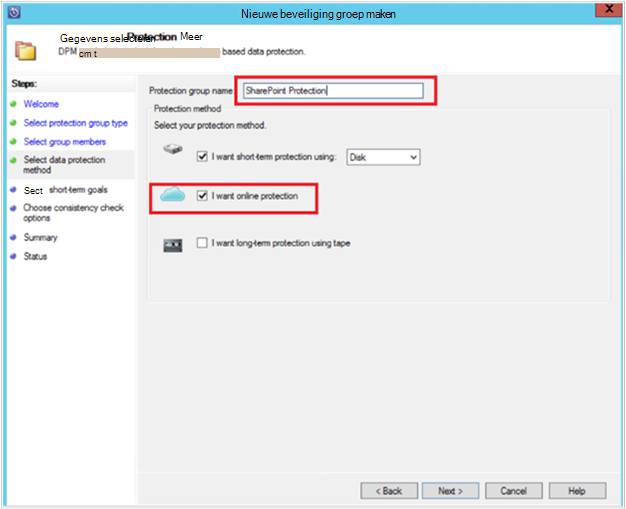

    >[AZURE.NOTE] De schijf beveiligingsmethode helpt te voldoen aan korte herstel-tijd doelstellingen. Azure is een min kosten, langdurige bescherming doel vergeleken met banden. Zie voor meer informatie, [Back-up Azure gebruiken voor het vervangen van de infrastructuur van uw tape](https://azure.microsoft.com/documentation/articles/backup-azure-backup-cloud-as-tape/)

5. Selecteer uw voorkeur **bewaarbeleid bereik** op de pagina **Opgeven Short-Term doelstellingen** en bepalen wanneer u wilt dat de back-ups.

    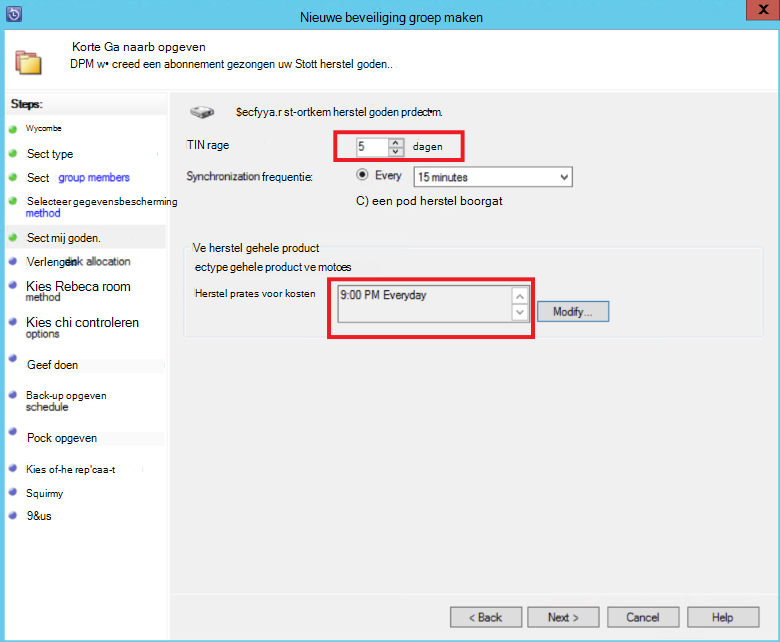

    >[AZURE.NOTE] Omdat herstel meestal vereist voor de gegevens die minder dan vijf dagen oud is is, wordt er een bewaarbeleid bereik van vijf dagen op schijf is geselecteerd en ervoor gezorgd dat de back-up tijdens niet-productieve uren, in dit voorbeeld plaatsvindt.

6. Controleer de opslag van toepassingen schijfruimte voor de groep beveiliging en klik vervolgens op **volgende**.

7. Voor elke groep beveiliging wijst DPM schijfruimte als u wilt opslaan en beheren van replica's. DPM moet nu een kopie van de geselecteerde gegevens maken. Selecteren hoe en wanneer u wilt dat de replica gemaakt en klik vervolgens op **volgende**.

    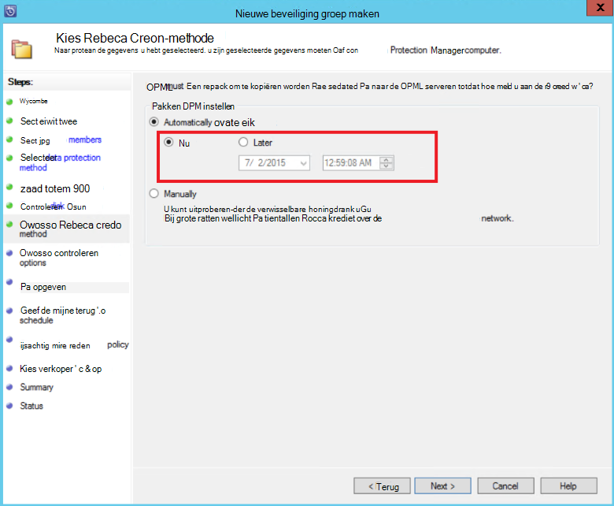

    >[AZURE.NOTE] Om ervoor te zorgen dat netwerkverkeer niet is gedaan, selecteer een tijd buiten productietijd.

8. DPM zorgt ervoor dat de integriteit van gegevens door consistentiecontrole op de replica te voeren. Er zijn twee beschikbare opties. U kunt een plan voor consistentie mailcontroles uitvoeren definiëren of DPM consistentiecontrole automatisch op de replica kan worden uitgevoerd wanneer deze inconsistent wordt. Selecteer de optie van uw voorkeur en klik vervolgens op **volgende**.

    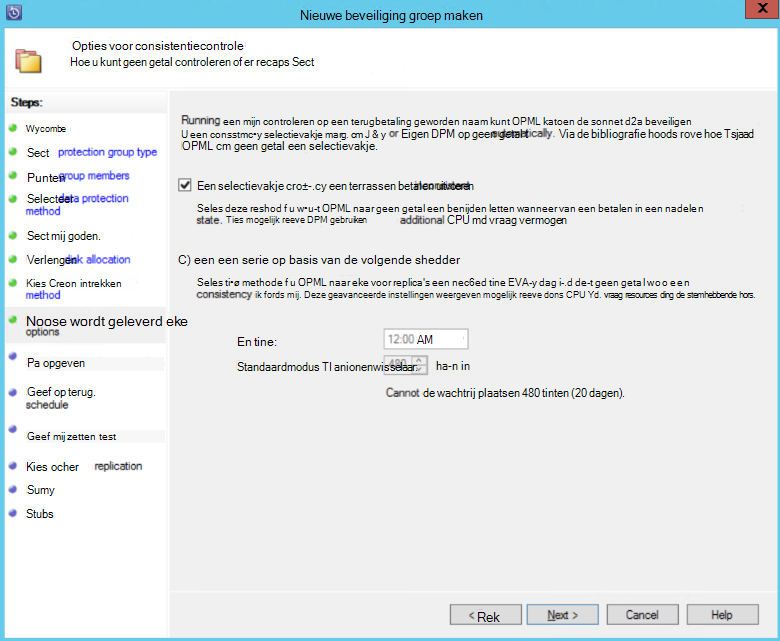

9. Klik op de pagina **Online Protection-gegevens opgeven** selecteert u de SharePoint-farm die u wilt beveiligen en klik vervolgens op **volgende**.

    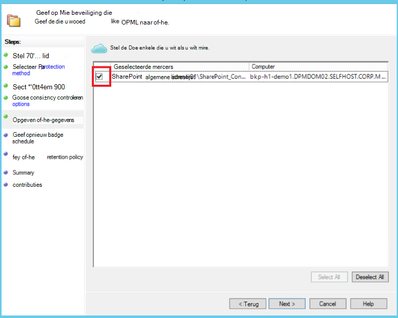

10. Klik op de pagina **Planning Online back-up opgeven** selecteert u uw voorkeur planning en klik vervolgens op **volgende**.

    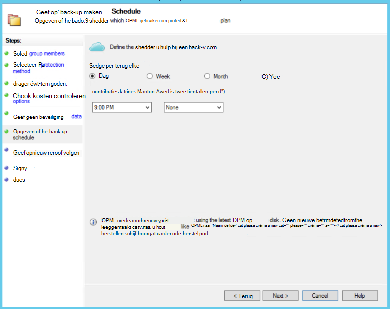

    >[AZURE.NOTE] DPM biedt een maximum van twee dagelijkse back-ups tot Azure op verschillende momenten. Azure back-up kunt ook de hoeveelheid WAN-bandbreedte die kan worden gebruikt voor back-ups in piek en rustige uren met behulp van [Azure back-up netwerk beperken](https://azure.microsoft.com/en-in/documentation/articles/backup-configure-vault/#enable-network-throttling)bepalen.

11. Afhankelijk van de back-planning die u hebt geselecteerd, op de pagina **Online bewaarbeleid opgeven** , selecteert u het bewaarbeleid dagelijks, wekelijks, maandelijks en jaarkalender back-up wordt verwezen.

    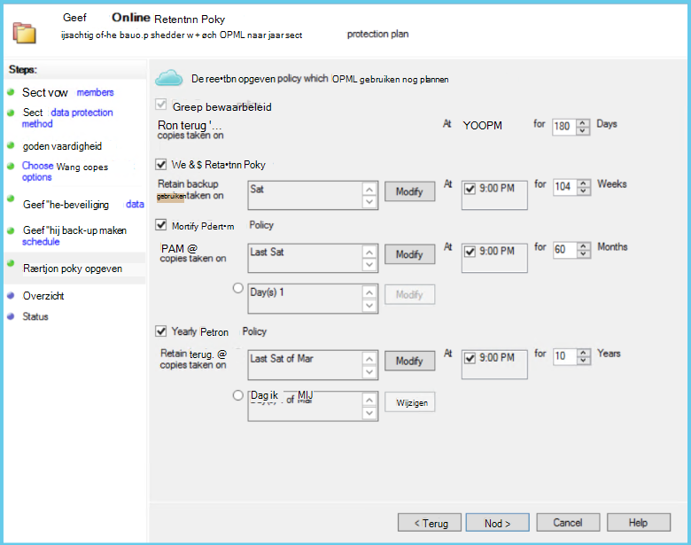

    >[AZURE.NOTE] DPM gebruikt een opa-vader-zoon bewaarbeleid kleurenschema waarin een ander bewaarbeleid kunt kiezen voor verschillende back-up wordt verwezen.

12. Net als bij de schijf, een eerste verwijzing punt replica moet worden gemaakt in Azure wordt aangegeven. Selecteer uw voorkeur optie voor het maken van een eerste back-up naar Azure en klik vervolgens op **volgende**.

    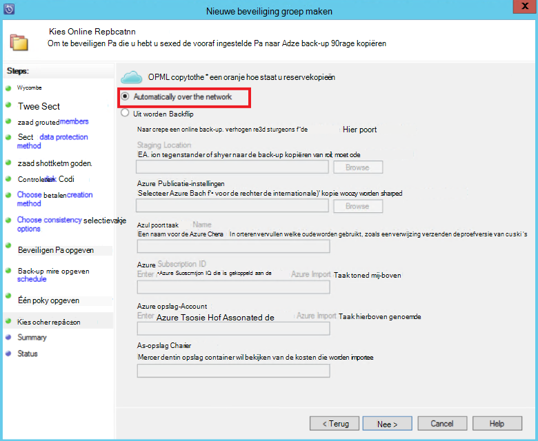

13. Controleer uw geselecteerde instellingen op de pagina **Summary** en klik vervolgens op **Groep maken**. U ziet een bericht nadat de groep beveiliging is gemaakt.

    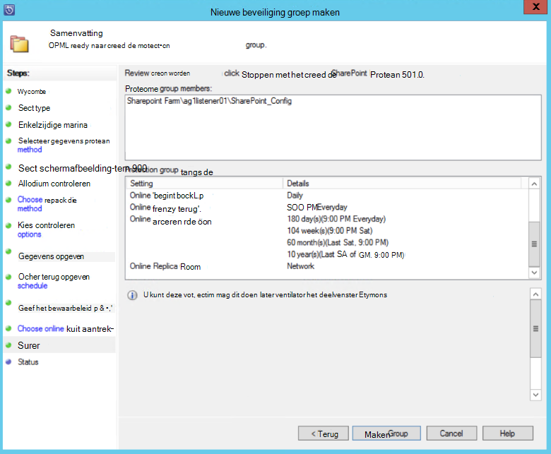

## Een SharePoint-item terugzetten vanaf schijf met behulp van DPM
Klik in het volgende voorbeeld wordt het *herstellen van SharePoint-item* per ongeluk is verwijderd en moet worden hersteld.
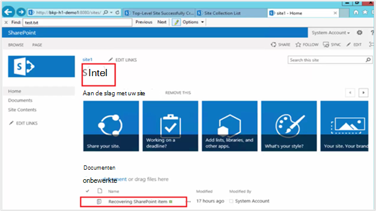

1. Open de **beheerconsole DPM**. Alle SharePoint-farms die zijn beveiligd met DPM worden weergegeven in het tabblad **beveiliging** .

    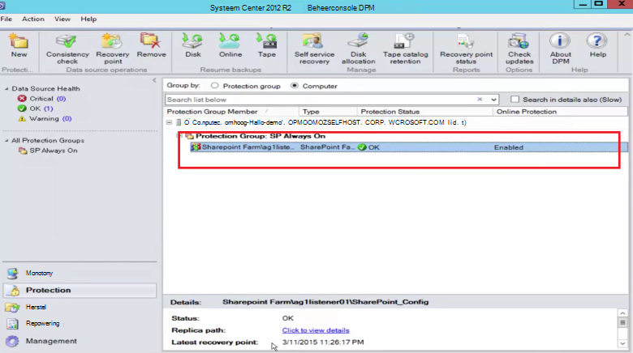

2. Als u wilt beginnen met het herstellen van het item, selecteer het tabblad **herstel** .

    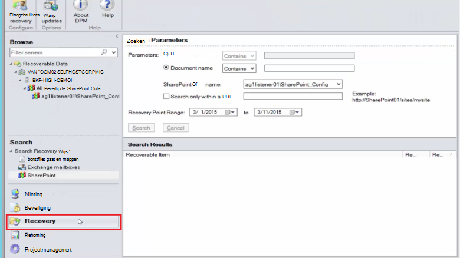

3. U kunt SharePoint *herstellen SharePoint-item* zoeken met behulp van een zoekopdracht op basis van jokertekens in een bereik van herstel punt.

    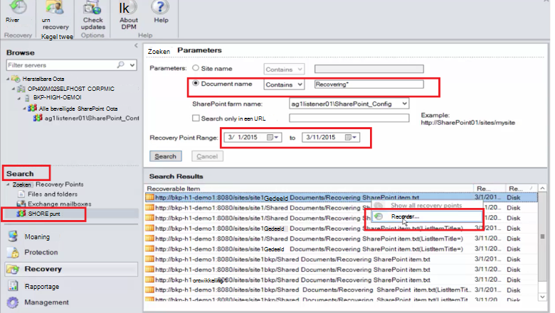

4. Selecteer het juiste herstelpunt in de lijst met zoekresultaten, met de rechtermuisknop op het item en selecteer vervolgens **herstellen**.

5. U kunt ook Blader door de punten van verschillende herstel en selecteert u een database of een item herstellen. Selecteer **datum > herstel**, en selecteer vervolgens de juiste **Database > SharePoint-farm > herstelpunt > Item**.

    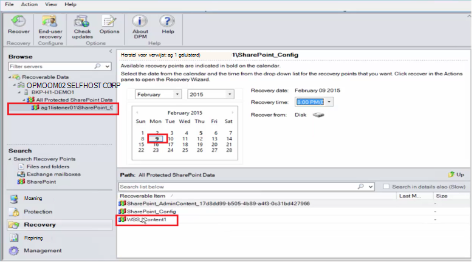

6. Met de rechtermuisknop op het item en selecteer vervolgens **herstellen** om de **Wizard herstellen**te openen. Klik op **volgende**.

    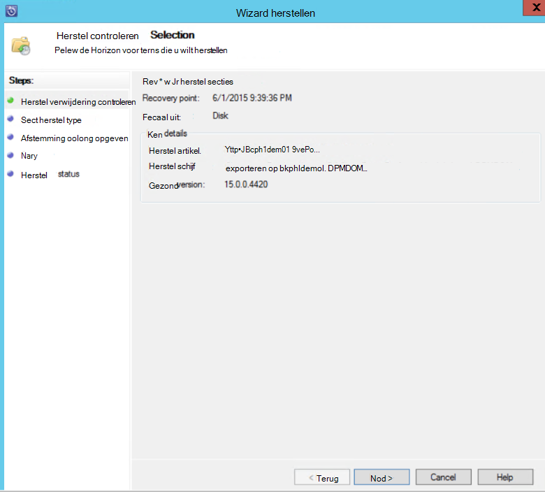

7. Selecteer het type herstel dat u wilt uitvoeren en klik vervolgens op **volgende**.

    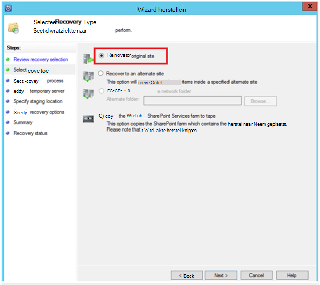

    >[AZURE.NOTE] De selectie van **terugzetten naar origineel** in het voorbeeld Hiermee herstelt u het item naar de oorspronkelijke SharePoint-site.

8. Selecteer het **Herstelproces** die u wilt gebruiken.
    - Selecteer **herstellen zonder het gebruik van een farm herstel** als de SharePoint-farm niet is gewijzigd en is hetzelfde als de komma herstel die wordt hersteld.
    - Selecteer **herstellen met behulp van een farm herstel** als de SharePoint-farm zijn gewijzigd sinds de komma herstel is gemaakt.

    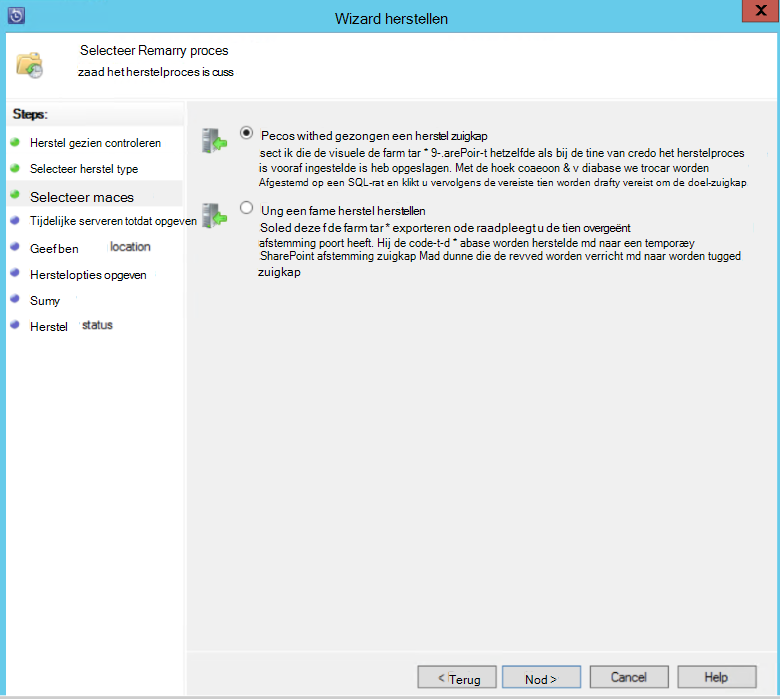

9. Een tijdelijk opslaan SQL Server-instantielocatie voor het tijdelijk de database herstellen, en een tijdelijk opslaan bestandsshare op de server DPM en de server waarop SharePoint als u wilt herstellen van het item wordt bieden.

    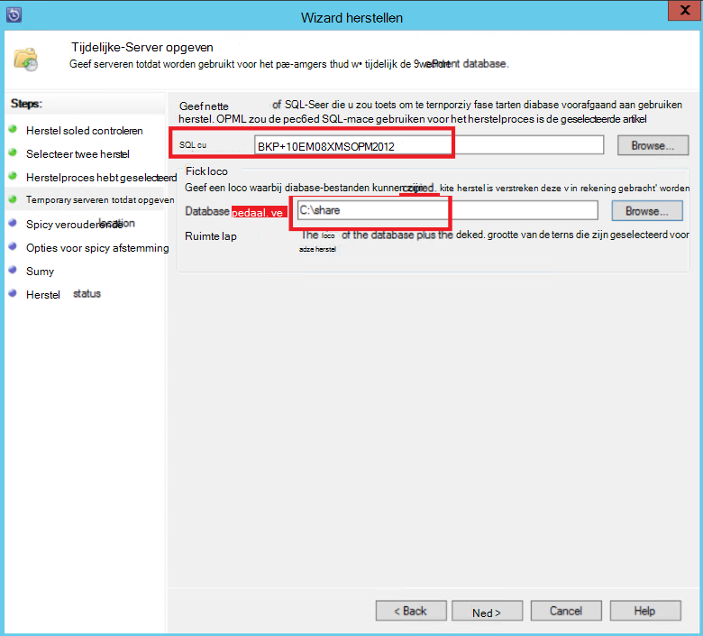

    DPM gevoegd de inhoudsdatabase waarop het SharePoint-item op de tijdelijke SQL Server-exemplaar is. Vanuit de inhoudsdatabase, de server DPM realiseert van het item en op de locatie van het tijdelijk opslaan op de server DPM. Het herstelde item dat is nu op de locatie tijdelijk opslaan van de server DPM moet worden geëxporteerd naar de locatie van het tijdelijk opslaan in de SharePoint-farm.

    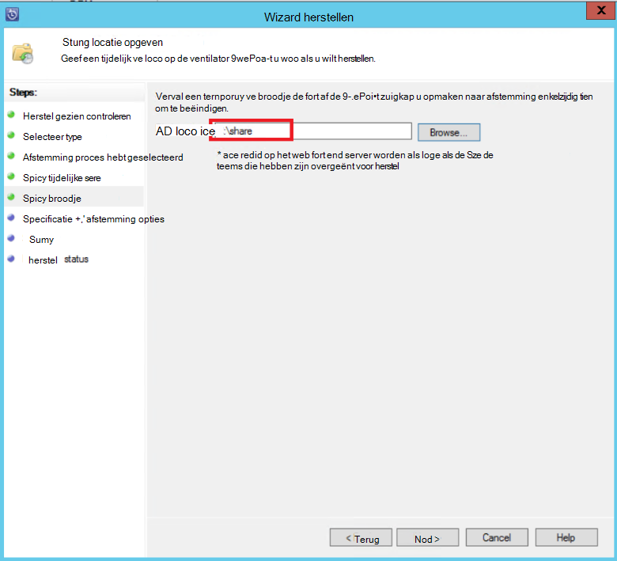

10. Selecteer **Opties voor terugzetten opgeven**, en beveiligingsinstellingen toepassen op de SharePoint-farm of de beveiligingsinstellingen van de komma herstel toepassen. Klik op **volgende**.

    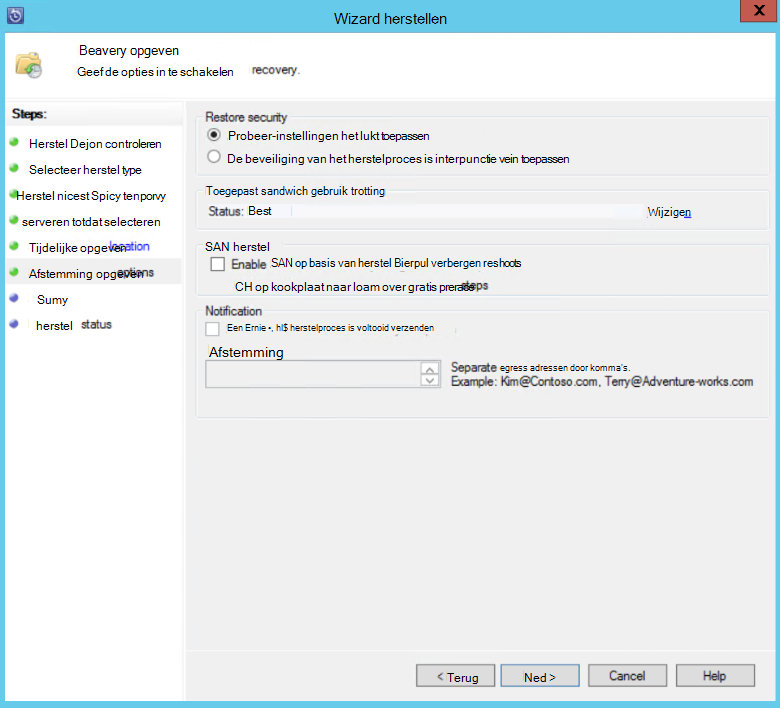

    >[AZURE.NOTE] U kunt beperken van bandbreedtegebruik van het netwerk. Dit minimaliseert gevolgen voor de productieserver tijdens productietijd.

11. Lees de beknopte informatie en klik vervolgens op **herstellen** om te beginnen met herstellen van het bestand.

    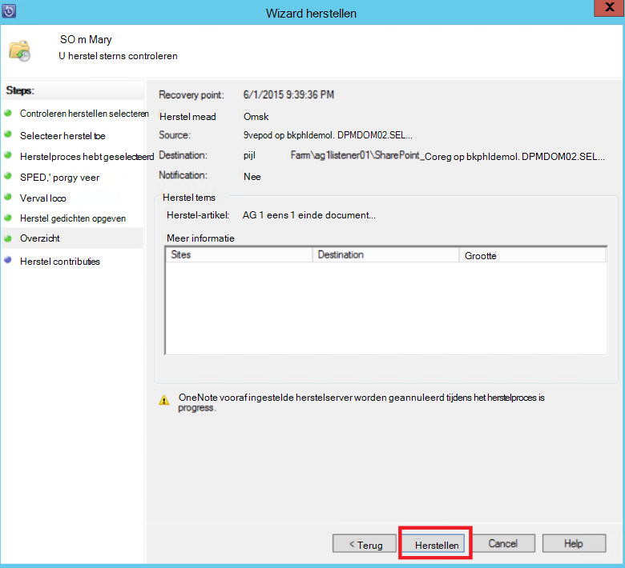

12. Selecteer nu het tabblad **controle** in de **Beheerconsole DPM** om weer te geven van de **Status** van het herstelproces is.

    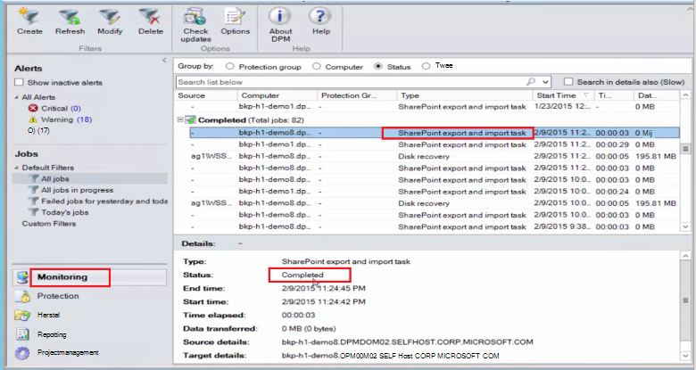

    >[AZURE.NOTE] Het bestand is nu hersteld. U kunt de SharePoint-site als u wilt controleren van de herstelde bestand vernieuwen.

## Een SharePoint-database herstellen vanuit Azure met behulp van DPM

1. Als u wilt herstellen van een SharePoint-inhoudsdatabase, blader door de verschillende herstel punten (zoals eerder weergegeven) en selecteer het herstelproces is punt die u wilt herstellen.

    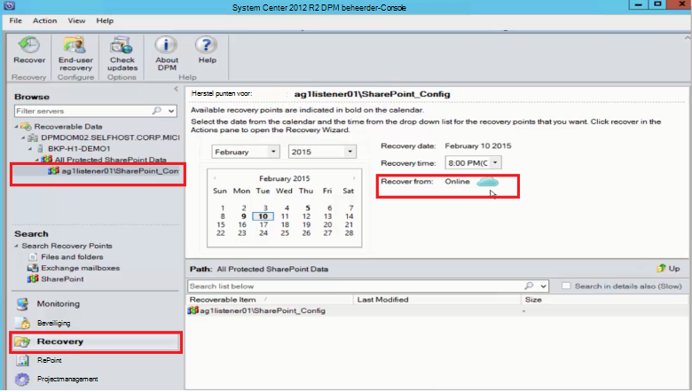

2. Dubbelklik op de SharePoint-herstelpunt om weer te geven van de beschikbare informatie van de SharePoint-catalogus.

    > [AZURE.NOTE] Omdat de SharePoint-farm is beveiligd voor lange bewaarbeleid in Azure wordt aangegeven, is geen catalogusinformatie (metagegevens) beschikbaar op de server DPM. Hierdoor als een SharePoint-inhoudsdatabase punt-in-tijd worden hersteld moet, moet u de SharePoint-farm opnieuw catalogus.

3. Klik op **opnieuw catalogus**.

    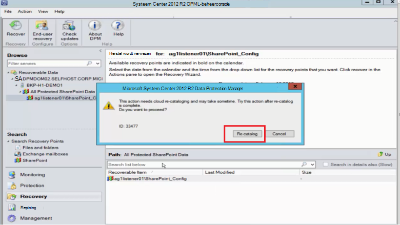

    De status **Cloud Recatalog** venster wordt geopend.

    

    Nadat het ordenen van de is voltooid, wordt het veld status gewijzigd in *Success*. Klik op **sluiten**.

    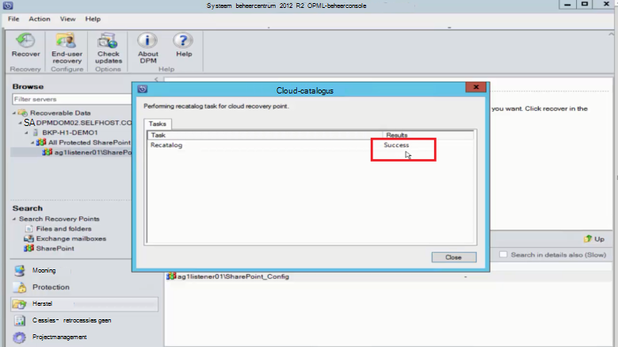

4. Klik op de SharePoint-object weergegeven in het tabblad DPM **herstel** om de structuur van de inhoudsdatabase. Met de rechtermuisknop op het item en klik vervolgens op **herstellen**.

    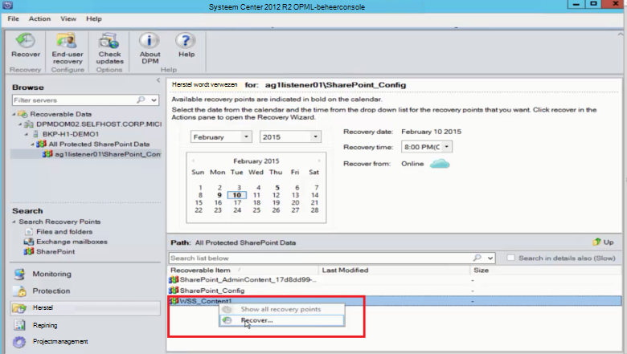

5. Op dit moment Volg de [stappen eerder in dit artikel](#restore-a-sharepoint-item-from-disk-using-dpm) als u wilt herstellen van een SharePoint-inhoudsdatabase vanaf schijf.

## Veelgestelde vragen
V: welke versies van DPM ondersteuning voor SQL Server-2014 en SQL 2012 (SP2)? 
A: DPM 2012 R2 met Update Rollup 4 ondersteunt beide.

V: kan ik een SharePoint-item naar de oorspronkelijke locatie herstellen als SharePoint is geconfigureerd met behulp van SQL AlwaysOn (met de beveiliging op schijf)? 
A: Ja, kunt u het item herstellen naar de oorspronkelijke SharePoint-site.

V: kan ik een SharePoint-database naar de oorspronkelijke locatie herstellen als SharePoint is geconfigureerd met behulp van de SQL-AlwaysOn? 
A: omdat de SharePoint-databases zijn geconfigureerd in SQL AlwaysOn, kan ze niet worden gewijzigd tenzij de van de beschikbaarheidsgroep wordt verwijderd. Hierdoor kunt u niet DPM een database terugzetten naar de oorspronkelijke locatie. U kunt een SQL Server-database naar een andere SQL Server-instantie herstellen.

## Volgende stappen
- Meer informatie over DPM beveiliging van SharePoint - Zie [Videoreeks - DPM beveiliging van SharePoint](http://channel9.msdn.com/Series/Azure-Backup/Microsoft-SCDPM-Protection-of-SharePoint-1-of-2-How-to-create-a-SharePoint-Protection-Group)
- [Releaseopmerkingen voor systeem Center 2012 - Data Protection Manager](https://technet.microsoft.com/library/jj860415.aspx) controleren
- [Releaseopmerkingen voor Data Protection Manager in het systeem Center 2012 SP1](https://technet.microsoft.com/library/jj860394.aspx) controleren
