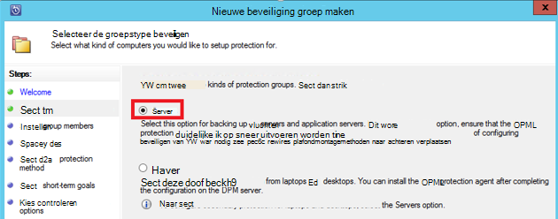

<properties
    pageTitle="Azure back-up maken voor SQL Server-werkbelasting met DPM | Microsoft Azure"
    description="Een inleiding over het back-ups van SQL Server-databases met de back-up van Azure-service"
    services="backup"
    documentationCenter=""
    authors="adigan"
    manager="Nkolli1"
    editor=""/>

<tags
    ms.service="backup"
    ms.workload="storage-backup-recovery"
    ms.tgt_pltfrm="na"
    ms.devlang="na"
    ms.topic="article"
    ms.date="09/27/2016"
    ms.author="adigan;giridham; jimpark;markgal;trinadhk"/>

# Azure back-up maken voor SQL Server-werkbelastingen DPM gebruiken

In dit artikel helpt u bij de volgende configuratiestappen uit voor de back-up van SQL Server-databases met Azure back-up.

Als u wilt back-up van SQL Server-databases aan Azure, moet u een Azure-account. Als u geen account hebt, kunt u een gratis proefaccount maken in alleen enkele minuten. Zie [Azure gratis proefversie](https://azure.microsoft.com/pricing/free-trial/)voor meer informatie.

Het beheer van SQL Server-database back-up Azure en herstel van Azure omvat drie stappen:

1. Maak een back-beleid als u wilt beveiligen met een SQL Server-databases aan Azure.
2. Back-ups op aanvraag naar Azure maken.
3. De database herstellen vanuit Azure.

## Voordat u begint
Voordat u begint, moet u ervoor zorgen dat alle [vereisten](../backup-azure-dpm-introduction.md#prerequisites) voor het gebruik van Microsoft Azure back-up te beveiligen werkbelasting is voldaan. De vereisten voor de taken, zoals besproken: maken van een back-kluis, kluis referenties downloaden, de back-up Azure-Agent installeren en registreren van de server met de kluis.

## Als u wilt beveiligen met een SQL Server-databases aan Azure-back-beleid maken

1. Op de server DPM, klikt u op de werkruimte **beveiliging** .

2. Klik op het lint hulpmiddel klikt u op **Nieuw** om te maken van een nieuwe groep voor de beveiliging.

    

3. DPM ziet u het startscherm met de richtlijnen voor het maken van een **Groep beveiliging**. Klik op **volgende**.

4. Selecteer **Servers**.

    

5. Vouw de SQL Server-computer waar de databases worden back-up moet aanwezig zijn. DPM toont verschillende gegevensbronnen die kunnen worden back-up van die server. Vouw de **Waarden voor aandelen alle SQL** en selecteert u de geselecteerde-databases (in dit geval we ReportServer$ MSDPM2012 en ReportServer$ MSDPM2012TempDB) naar de back-up worden gemaakt. Klik op **volgende**.

    

6. Geef een naam voor de groep beveiliging en schakel het selectievakje **opgezocht online Protection** .

    

7. In het scherm **Opgeven Short-Term doelstellingen** bevat de benodigde invoer als u wilt maken van back-schijf wordt verwezen.

    Hier zien we dat **bewaarbeleid bereik** is ingesteld op *5 dagen*, **frequentie van de synchronisatie** is ingesteld op elke *15 minuten* dat wil zeggen de frequentie waarop back-up is die u hebt gemaakt. **Express volledige back-up** is ingesteld op *8:00 uur*.

    

    >[AZURE.NOTE] AT 8:00 PM (afhankelijk van de invoer van het scherm) is een back-punt elke dag gemaakt door over te brengen van de gegevens die is gewijzigd van de vorige dag 8:00 PM back-punt. Dit proces wordt **Express volledige back-up**genoemd. Terwijl de logboeken worden gesynchroniseerd transactie express elke 15 minuten, als er een nodig de database herstellen at 9:00 PM – wordt de komma gemaakt door de logboekbestanden van de laatste volledige back-punt (8 pm in dit geval).

8. Klik op **volgende**

    DPM ziet u de totale beschikbare opslagruimte en de mogelijke gebruik van de schijfruimte.

    

    DPM maakt standaard één volume per gegevensbron (SQL Server-database) die wordt gebruikt voor de eerste back-up. Met deze methode, bestandsgrootten de logische schijf Manager (LDM) DPM beveiliging tot 300 gegevensbronnen (SQL Server-databases). U omzeilt deze beperking, selecteert u de **gegevens in de groep DPM samen te zoeken**, optie. Als u deze optie gebruikt, DPM gebruikt één volume voor meerdere gegevensbronnen waarmee DPM te beveiligen van maximaal 2000 SQL-databases.

    Als de optie **automatisch vergroten de hoeveelheden** is geselecteerd, kunt DPM voor het volume van het verbeterde back-account als de productiegegevens in omvang groeit. Als de optie **automatisch de hoeveelheden vergroten** niet is ingeschakeld, beperkt DPM de back-opslag kon u de gegevensbronnen in de groep beveiliging.

9. Beheerders van de keuze van het overbrengen van deze eerste back-up handmatig (uitschakelen netwerk) om bandbreedte overbelasting te voorkomen of via een netwerk krijgt. Ze kunnen ook de tijd waarop de eerste overdracht kan gebeuren configureren. Klik op **volgende**.

    

    De eerste back-up is de overdracht van de volledige gegevensbron (SQL Server-database) van productieserver (SQL Server-computer) naar de server DPM vereist. Het is mogelijk dat deze gegevens groot en overbrengen van de gegevens via het netwerk, kan bandbreedte overschrijden. Beheerders kunnen daarom kiezen om over te brengen van de eerste back-up: **handmatig** (via verwisselbare media) om te voorkomen bandbreedte overbelasting of **automatisch via het netwerk** (op een opgegeven tijd).

    Zodra de eerste back-up is voltooid, zijn de rest van de back-ups incrementele back-ups op de eerste back-up. Incrementele back-ups meestal klein en eenvoudig worden overgebracht via het netwerk.

10. Kies deze optie als u wilt dat de consistentiecontrole uitvoeren en klik op **volgende**.

    

    DPM kunt uitvoeren een consistentie uit de integriteit van de back-komma. De controlesom van de back-upbestand van de productieserver (SQL Server-computer in dit scenario) en de back-ups van gegevens voor het bestand op DPM wordt berekend. In het geval van een conflict, wordt uitgegaan dat de back-upbestand bij DPM beschadigd is. DPM herstelt de back-ups van gegevens door te sturen van de bouwstenen die overeenkomt met de checksum komt niet overeen. Terwijl de consistentiecontrole een bewerking vraagt is, hebben beheerders van de optie van de consistentiecontrole plannen of automatisch uitgevoerd.

11. Als u online beveiliging van de gegevensbronnen, schakelt u de databases Azure beveiligen en klik op **volgende**.

    

12. Beheerders kunnen kiezen back-planningen en bewaarbeleid die aansluiten op de beleidsregels van hun organisatie.

    

    In dit voorbeeld worden back-ups één keer per dag genomen op 12:00 uur en 20: 00 (het onderste gedeelte van het scherm)

    >[AZURE.NOTE] Het is een goede gewoonte om enkele korte herstel punten op schijf, snel herstel. Deze punten herstel worden gebruikt voor "operationele herstel". Azure fungeert als een goede plek met hogere serviceovereenkomsten en beschikbaarheid gegarandeerd.

    **Aanbevolen procedure**: Zorg ervoor dat de back-ups van Azure na de voltooiing van lokale schijf back-ups DPM zijn gepland. Hiermee worden de meest recente back naar Azure moet worden gekopieerd.

13. Kies het beleid bewaarschema. De informatie over de werking van het bewaarbeleid worden gegeven aan [Back-up Azure gebruiken voor het vervangen van uw tape infrastructuur artikel](backup-azure-backup-cloud-as-tape.md).

    

    In dit voorbeeld is:

    - Back-ups zijn die u hebt gemaakt één keer per dag aan 12:00 uur en 8 PM (het onderste gedeelte van het scherm) en gedurende 180 dagen worden bewaard.
    - De back-up op zaterdag om 12:00 104 weken blijft behouden
    - De back-up op laatste zaterdag om 12:00 blijft behouden voor 60 maanden
    - De back-up op laatste zaterdag maart om 12:00 blijft behouden voor tien jaar

14. Klik op **volgende** en selecteer de gewenste optie voor het overbrengen van de eerste back-up naar Azure. U kunt **automatisch via het netwerk** of **Offline back-up**.

    - **Automatisch via het netwerk** brengt de back-upgegevens naar Azure aan de hand van de planning gekozen voor back-up.
    - De werking van **Offline back-up** wordt uitgelegd op [Offline back-up-werkstroom in Azure back-up](backup-azure-backup-import-export.md).

    Kies de relevante doorverbinden om de eerste back-up naar Azure verzenden en klik op **volgende**.

15. Nadat u de beleidsdetails van het in het scherm **Summary** bekijkt, kunt u klikken op de knop **groep maken** om de werkstroom te voltooien. U kunt klikt u op de knop **sluiten** en de voortgang van taak in de werkruimte controle.

    

## Bellen op back-up van een SQL Server-database
Terwijl de vorige stappen een back-beleid hebt gemaakt, wordt een 'herstelpunt"alleen wanneer de eerste back-up gemaakt. In plaats van de planner om wachten, wordt de stappen onder trigger het maken van een herstel handmatig wijst.

1. Wacht totdat de status van de groep beveiliging ziet u **OK** voor de database voordat u de komma herstel maakt.

    

2. Met de rechtermuisknop op de database en selecteer **Maken herstel punt**.

    

3. Kies **Online Protection** in de vervolgkeuzelijst en klik op **OK**. Hiermee start u het maken van een herstelpunt in Azure wordt aangegeven.

    

4. U kunt de voortgang van het project weergeven in de **controle** -werkruimte daar vindt u de voortgang van een in project zoals weergegeven in de volgende afbeelding.

    

## Een SQL Server-database herstellen van Azure
De volgende stappen zijn vereist voor het herstellen van een beveiligde entiteit (SQL Server-database) uit Azure.

1. Open de DPM server Management Console. Navigeer naar **herstel** werkruimte waar u de back-up gemaakt door DPM servers kunt zien. Blader in de database vereist (in dit geval ReportServer$ MSDPM2012). Selecteer een **herstel van** tijd die op **Online eindigt**.

    

2. Met de rechtermuisknop op de naam van de database en klik op **herstellen**.

    

3. DPM ziet u de details van het herstelpunt. Klik op **volgende**. Als u wilt overschrijven de database, selecteer het herstelproces is type **herstellen naar de oorspronkelijke exemplaar van SQL Server**. Klik op **volgende**.

    

    In dit voorbeeld maakt DPM het herstellen van de database naar een ander exemplaar van SQL Server of naar een netwerkmap zelfstandige.

4. Klik in het scherm **opgeven herstelopties** kunt u de herstelopties zoals netwerk bandbreedte gebruik beperken de bandbreedte die wordt gebruikt door herstel beperken. Klik op **volgende**.

5. In het scherm **Samenvatting** ziet u alle herstel configuraties dusverre is opgegeven. Klik op **herstellen**.

    De status van het herstelproces is ziet u de database wordt hersteld. U kunt klikken op **sluiten** om de wizard te sluiten en de voortgang in de **controle** -werkruimte weergeven.

    

    Nadat het herstelproces is voltooid, worden de herstelde database consistente toepassing.

### Volgende stappen:

• [Azure back-Veelgestelde vragen](backup-azure-backup-faq.md)
