<properties
   pageTitle="Een back-up van Azure-kluis verwijderen | Microsoft Azure"
   description="Klik hier voor meer informatie over het verwijderen van een back-up van Azure-kluis. Voor probleemoplossing waarom u een back-kluis niet verwijderen. "
   services="service-name"
   documentationCenter="dev-center-name"
   authors="markgalioto"
   manager="cfreeman"
   editor=""/>

<tags
   ms.service="backup"
   ms.devlang="na"
   ms.topic="article"
   ms.tgt_pltfrm="na"
   ms.workload="storage-backup-recovery"
   ms.date="08/29/2016"
   ms.author="markgal;trinadhk"/>

# Een back-up van Azure-kluis verwijderen

De back-up van Azure-service heeft twee soorten kluizen - de back-up-kluis en de kluis herstel Services. De back-up-kluis kwam eerste. De kluis herstel Services is vervolgens langs geleverd ter ondersteuning van de uitgevouwen resourcemanager-implementaties. Vanwege de uitgebreide mogelijkheden en de informatie afhankelijkheden die moeten worden opgeslagen in de kluis, kan een kluis herstel Services verwijderen lijken moeilijker dan deze is.

|**Implementatietype**|**Portal**|**De naam van de kluis**|
|--------------|----------|---------|
|Klassieke|Klassieke|Back-kluis|
|Resourcemanager|Azure|Herstel Services kluis|

> [AZURE.NOTE] Back-up kluizen beveiligen niet resourcemanager geïmplementeerd oplossingen. U kunt echter een kluis herstel Services classically geïmplementeerd servers en VMs te beschermen.  

In dit artikel, gebruiken we de term, kluis, om te verwijzen naar de algemene vorm van de back-up kluis of herstel Services kluis. We gebruiken de formele naam, back-up kluis of herstel Services kluis, als het onderscheid maken tussen de kluizen nodig is.

## Verwijderen van een kluis herstel Services

Verwijderen van een kluis herstel Services is een proces één stap - *verstrekt dat de kluis bevat niet alle bronnen*. Voordat u een kluis herstel Services verwijderen kunt, moet u verwijdert of alle resources in de kluis. Als u probeert te verwijderen van een kluis die resources bevat, krijgt u een foutbericht zoals de volgende afbeelding.

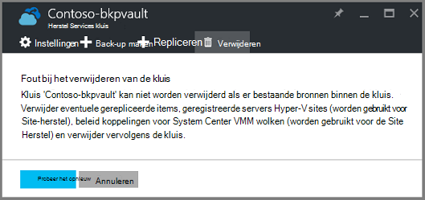  

Totdat u de resources uit de kluis hebt uitgeschakeld, oplevert klikt u op **opnieuw** dezelfde fout. Als u bij dit foutbericht wordt weergegeven hangen bent, klikt u op **Annuleren** en volg de onderstaande stappen voor het verwijderen van de resources in de kluis herstel Services.

### De items verwijderen uit een kluis een VM beveiligen

Als u de herstel Services kluis openen al hebt, gaat u verder met de tweede stap.

1.  Open de Azure-portal en openen vanuit het Dashboard de kluis die u wilt verwijderen.

    Als u niet over de Services herstel kluis vastgemaakt aan het Dashboard, in het menu Hub Klik op **Meer Services** en typ in de lijst met resources, **Herstel Services**. Als u te typen begint, de lijstfilters op basis van uw invoer. Klik op **Services herstel kluizen**.

    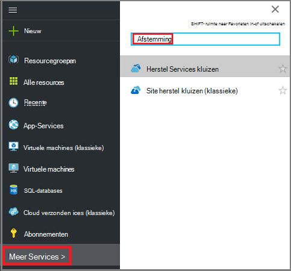  

    De lijst met Services herstel kluizen wordt weergegeven. Selecteer de kluis die u wilt verwijderen uit de lijst.

    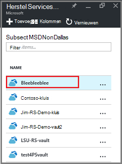

2. Klik in de weergave kluis kijkt u naar het deelvenster **Essentials** . Als u wilt verwijderen van een kluis, mogen niet beveiligde items. Als er een ander nummer dan nul, onder **Back-up-Items** of **servers voor het beheer van back-up maken**, moet u deze items verwijderen voordat u de kluis kunt verwijderen.

    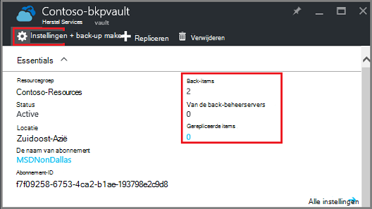

    VMs bestanden/mappen worden beschouwd als back-up-Items en worden vermeld in het gebied van de **Back-up-Items** van het deelvenster Essentials. Een server DPM wordt vermeld in het gebied **Beheerserver back-up** van het deelvenster Essentials. **Items gerepliceerd** heeft betrekking op de Site herstel van Azure-service.

3. Als u wilt verwijderen van de beveiligde items in de kluis, de items in de kluis te zoeken. Klik op **Instellingen**en klik vervolgens op **back-up items** als u wilt openen die blade in het dashboard kluis.

    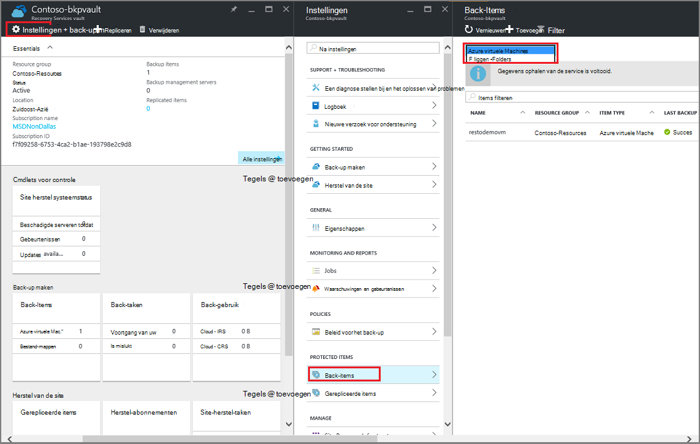

    Het blad **Back-up Items** heeft afzonderlijke lijsten, op basis van het Type Item: Azure virtuele Machines of bestandsmappen (Zie afbeelding). De lijst van de standaard-itemtype weergegeven is Azure virtuele Machines. Als u wilt de lijst met bestandsmappen items in de kluis bekijkt, selecteert u **Bestandsmappen** uit de vervolgkeuzelijst.

4. Voordat u een item uit het beveiligen van een VM kluis verwijderen kunt, moet u de back-uptaak van het item stoppen en verwijderen van de gegevens van de punt herstel. Voor elk item in de kluis, als volgt te werk:

    een. Klik op het blad **Back-Items** met de rechtermuisknop op het item en selecteer in het contextmenu **back-up stoppen**.

    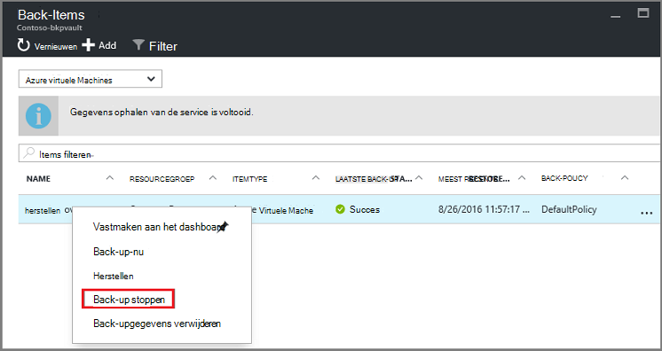

    Hiermee opent u het blad niet meer back-up.

    b. Selecteer op het **Back-ups stoppen** blad, in het menu **Kies een optie** **Back-upgegevens verwijderen** > Typ de naam van het item > en klikt u op **Stoppen met back-up**.

      Typ de naam van het item om te controleren of dat u wilt verwijderen. De knop **Stoppen back-up** wordt niet geactiveerd totdat u controleren of het item om te stoppen. Als u het dialoogvenster de naam van het back-item niet ziet, kunt u de optie **Back-upgegevens behouden** hebt gekozen.

    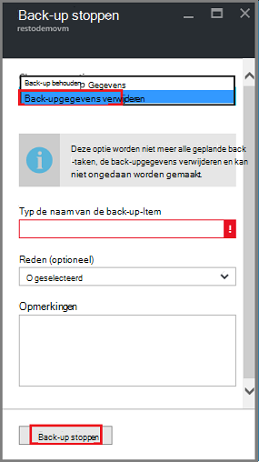

      Desgewenst kunt u een reden waarom u de gegevens wilt verwijderen en toevoegen van opmerkingen voorzien. Nadat u op **Stoppen met back-up maken**, kunt u de taak verwijderen om te voltooien voordat u probeert te verwijderen van de kluis. Om te bevestigen dat de taak is voltooid, schakelt u de berichten Azure .  
   Zodra de taak voltooid is, ontvangt u een bericht van de back-proces is gestopt en de back-upgegevens voor dat item is verwijderd.

    c. Klik op **vernieuwen** als u wilt zien van de resterende items in de kluis na het verwijderen van een item in de lijst in het menu **Back-up-Items** .

      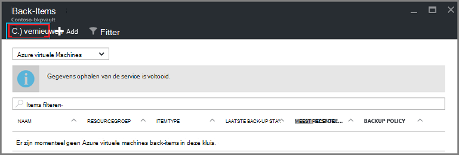

      Wanneer er geen items in de lijst, schuif naar het deelvenster **Essentials** in het blad met back-up kluis. Niet mag worden er een **back-up-items**, **servers voor het beheer van back-up**of **gerepliceerde items** vermeld. Als de items is nog steeds worden weergegeven in de kluis, Ga terug naar stap drie bovenstaande en kies een ander item type lijst.  

5. Als er geen meer items op de werkbalk kluis, klikt u op **verwijderen**.

    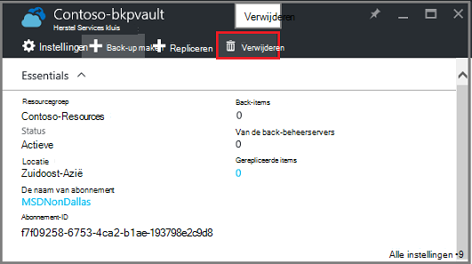

6. Wanneer u wordt gevraagd om te bevestigen dat u wilt de kluis verwijderen, klikt u op **Ja**.

    De kluis wordt verwijderd en de portal keert terug naar het menu **Nieuw** service.

## Wat gebeurt er als ik de back-up gestopt, maar blijven de gegevens behouden?

Als u de back-up gestopt, maar per ongeluk *behouden* de gegevens, moet u de back-upgegevens voordat u de kluis kunt verwijderen. De back-upgegevens verwijderen:

1. Klik op het blad **Back-Items** met de rechtermuisknop op het item en klik op **back-upgegevens verwijderen**in het snelmenu.

    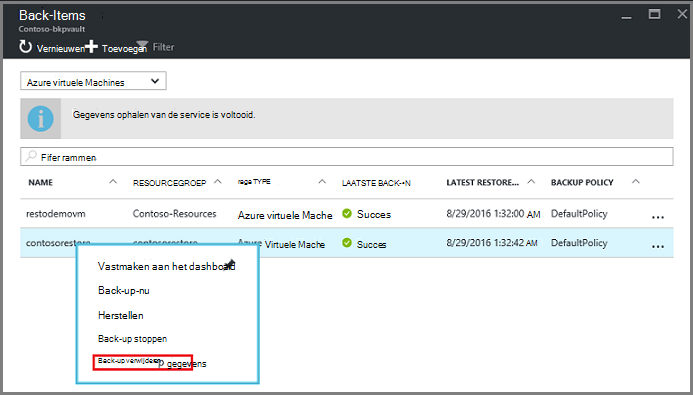

    Hiermee opent u het blad **Back-up-gegevens verwijderen** .

2. Klik op het blad **Back-up-gegevens verwijderen** , typ de naam van het item en klikt u op **verwijderen**.

    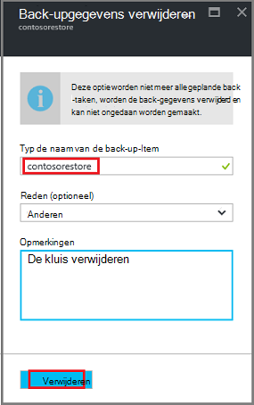

    Wanneer u de gegevens hebt verwijderd, gaat u naar stap 4c, boven, en gaat u verder met het proces.

## Verwijderen van een kluis gebruikt om een DPM-server te beveiligen

Voordat u een kluis gebruikt om te beveiligen met een server DPM verwijderen kunt, moet u Schakel herstel points die zijn gemaakt en vervolgens de registratie van de server uit de kluis.

De gegevens die zijn gekoppeld aan een groep beveiliging verwijderen:

1. In de beheerconsole van DPM op **beveiliging**, selecteer een groep beveiliging, selecteer het lid van de groep beveiliging en klik op **verwijderen**op het lint van het hulpmiddel. U kunt het onderdeel van de knop **verwijderen** wordt weergegeven in het lint hulpmiddel moet selecteren. In het voorbeeld is het lid **dummyvm9**. Als er meerdere leden in de groep beveiliging, houdt u Ctrl ingedrukt om meerdere leden te selecteren.

    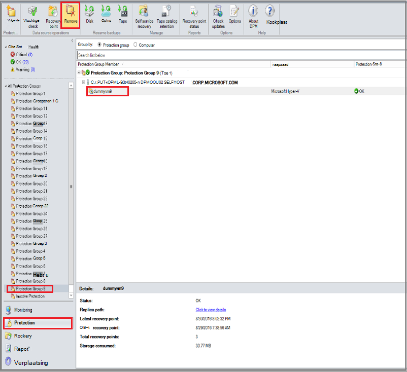

    Het dialoogvenster **Beveiliging stoppen** wordt geopend.

2. Klik in het dialoogvenster **Beveiliging stoppen** **verwijderen beveiligde gegevens**selecteren en klik op **Beveiliging stoppen**.

    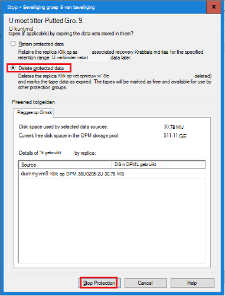

    U wilt niet bewaren van beveiligde gegevens omdat u moet de kluis wissen om u te verwijderen. Afhankelijk van hoeveel herstel wordt verwezen en hoeveel gegevens die zich in de groep beveiliging, kan duren voordat een willekeurige plaats in een paar seconden een paar minuten om de gegevens te verwijderen. Het dialoogvenster **Beveiliging stoppen** ziet u de status wanneer de taak is voltooid.

    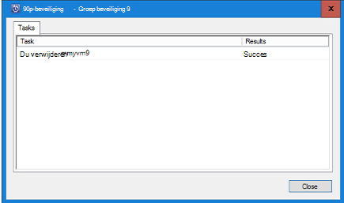

3. Herhaal deze procedure voor alle leden in alle groepen van beveiliging.

    U moet alle beveiligde gegevens en de beveiliging groep(en) waaraan verwijderen.

4. Na het verwijderen van alle leden van de groep beveiliging, schakel over naar de Azure-portal. Open het dashboard kluis en zorg ervoor dat er geen **Back-up-Items**, **servers voor het beheer van back-up**of **gerepliceerde items**. Klik op de werkbalk kluis klikt u op **verwijderen**.

    

    Als er een back-up management servers geregistreerd om de, niet mogelijk om te verwijderen van de kluis, zelfs als er geen gegevens in de kluis. Als u denkt dat u de servers voor het beheer van back-up maken die is gekoppeld aan de kluis eerder verwijderd, maar er zijn nog steeds servers met in het deelvenster **Essentials** , raadpleegt u [Zoeken naar de servers voor het beheer van back-up om de geregistreerd](backup-azure-delete-vault.md#find-the-backup-management-servers-registered-to-the-vault).

5. Wanneer u wordt gevraagd om te bevestigen dat u wilt de kluis verwijderen, klikt u op **Ja**.

    De kluis wordt verwijderd en de portal keert terug naar het menu **Nieuw** service.

## Een kluis gebruikt om te beveiligen met een productieserver verwijderen

Voordat u een kluis gebruikt om te beveiligen met een productieserver verwijderen kunt, moet u verwijderen of de server uit de kluis ongedaan te maken.

De productieserver die is gekoppeld aan de kluis verwijderen:

1. Klik in de portal Azure het dashboard kluis openen en klik op **Instellingen** > **Back-up-infrastructuur** > **Productieservers**.

    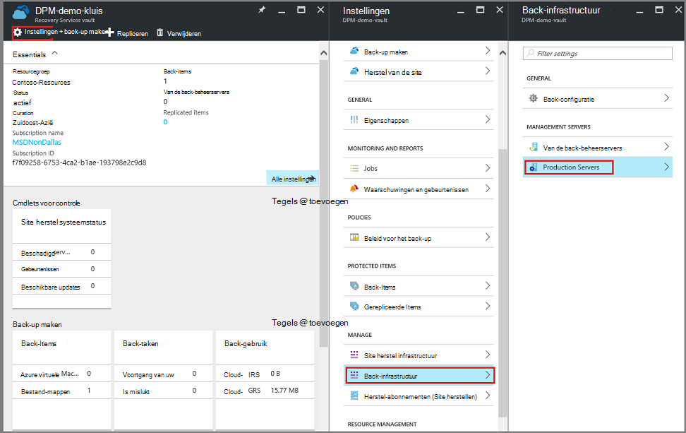

    Het blad **Productieservers** wordt geopend en alle productieservers in de kluis lijsten.

    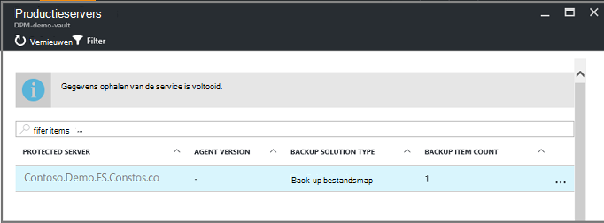

2. Klik op het blad **Productieservers** met de rechtermuisknop op de server en klik op **verwijderen**.

    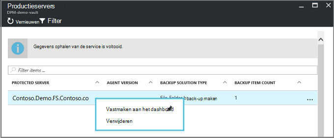

    Hiermee opent u het blad **verwijderen** .

    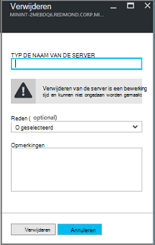

3. Controleer op het blad **verwijderen** of de naam van de server wilt verwijderen en klik op **verwijderen**. Correct moet u de naam van de server te activeren van de knop **verwijderen** .

    Zodra de kluis is verwijderd, ontvangt u een bericht dat de kluis is verwijderd. Ga terug naar het deelvenster Essentials in het dashboard kluis na het verwijderen van alle servers in de kluis.

4. Controleer of dat er zijn geen **Back-up-Items**, **servers voor het beheer van back-up**of **gerepliceerde items**in het dashboard kluis. Klik op de werkbalk kluis klikt u op **verwijderen**.

5. Wanneer u wordt gevraagd om te bevestigen dat u wilt de kluis verwijderen, klikt u op **Ja**.

    De kluis wordt verwijderd en de portal keert terug naar het menu **Nieuw** service.

## Een back-up-kluis verwijderen

Er zijn de volgende instructies voor het verwijderen van een back-up-kluis in de klassieke portal. Een back-up kluis en herstel Services kluis zijn hetzelfde: voordat u de kluis verwijdert kunt, verwijdert u de items en de gegevens behouden.

1. Open de portal klassieke.

2. Selecteer in de lijst met back-up kluizen, de kluis die u wilt verwijderen.

    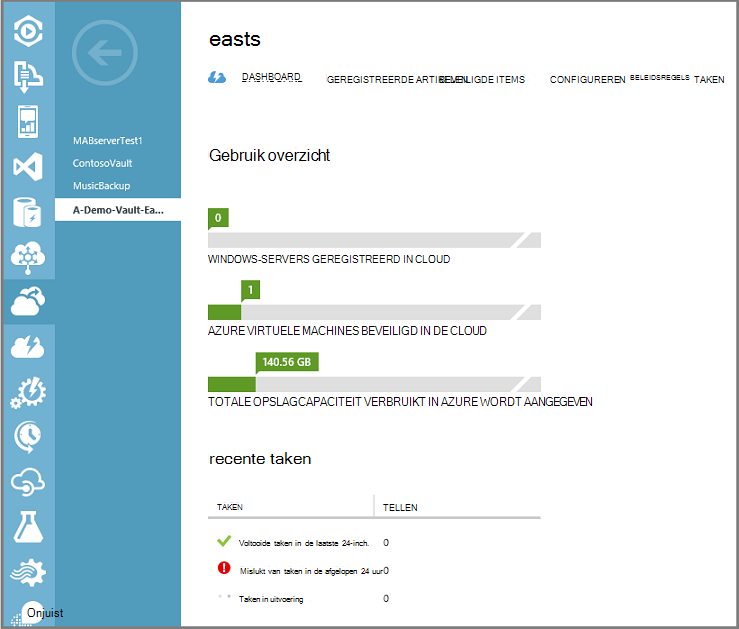

    Hiermee opent u het dashboard kluis. Bekijk het aantal Windows-Servers en/of Azure virtuele machines die is gekoppeld aan de kluis. Ook, kijkt u naar de totale opslagcapaciteit verbruikt in Azure wordt aangegeven. U moet een back-taken stoppen en verwijderen van bestaande gegevens voordat u de kluis verwijdert.

3. Klik op het tabblad **Beveiligde Items** en klik op **Beveiliging stoppen**

    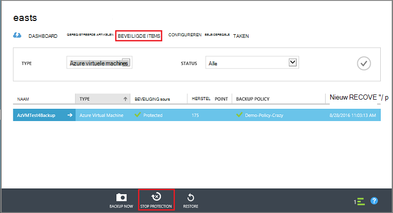

    Het dialoogvenster **stoppen bescherming van uw kluis'** wordt weergegeven.

4. In het dialoogvenster **beveiliging van uw kluis' stoppen** **gekoppeld back-upgegevens verwijderen** en klik op .  
   U kunt (optioneel) Kies een reden voor het stoppen van beveiliging en geef een opmerking.

    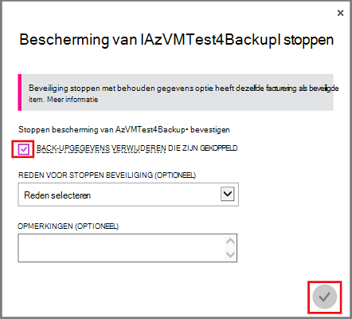

    Als de items in de kluis zijn verwijderd, wordt de kluis leeg zijn.

    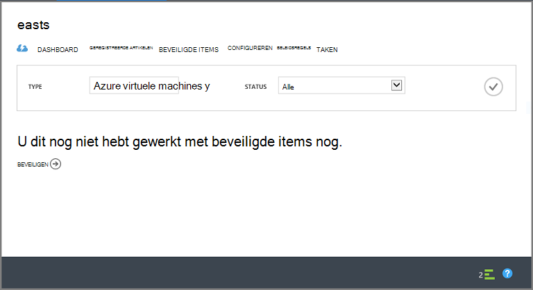

5. In de lijst met tabbladen, klikt u op **Items geregistreerd**. Voor elk item in de kluis geregistreerd, selecteert u het item en klikt u op **Unregister**.

    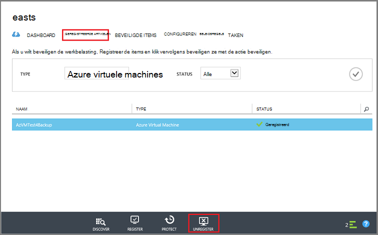

6. Klik in de lijst met tabbladen, op **Dashboard** om te openen dat tabblad. Controleer of er zijn geen geregistreerde servers of Azure virtuele machines beveiligd in de cloud. Controleer ook of dat er zijn geen gegevens in de opslagruimte. Klik op **verwijderen** als u wilt verwijderen van de kluis.

    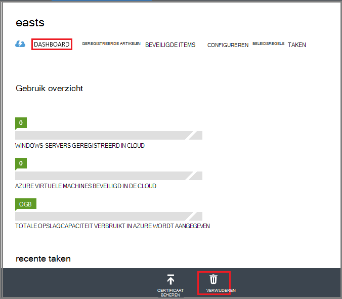

    Het bevestigingsvenster voor back-up verwijderen kluis wordt geopend. Selecteer een optie waarom u de kluis wilt verwijderen en klikt u op .  

    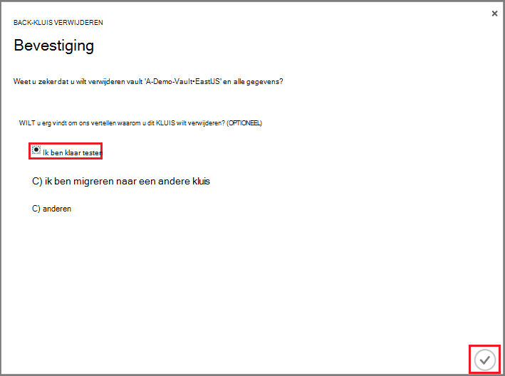

    De kluis wordt verwijderd en u terug naar het klassieke portal dashboard.

### Het beheer van de back-up-servers geregistreerd om de vinden

Als er meerdere servers geregistreerd voor een kluis, kan het lastig zijn om te onthouden zijn. Zie de servers die zijn geregistreerd om de en verwijdert u deze:

1. Open het dashboard kluis.

2. Klik op **Instellingen** als u wilt openen die blade in het deelvenster **Essentials** .

    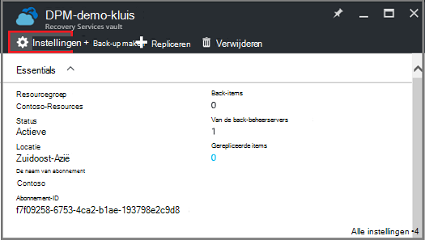

3. Klik op de **Instellingen blade**, op **Back-up-infrastructuur**.

4. Klik op het blad **Back-up-infrastructuur** op **Servers voor het beheer van back-up**. Hiermee opent u het blad Servers voor het beheer van back-up.

    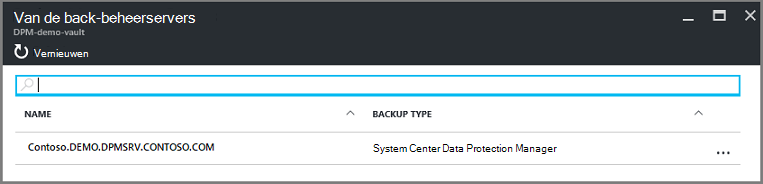

5. Een server verwijderen uit de lijst, met de rechtermuisknop op de naam van de server en klik vervolgens op **verwijderen**.
    Hiermee opent u het blad **verwijderen** .

6. Geef de naam van de server op het blad **verwijderen** . Als dit de naam van een lang is, kunt u deze kunt kopiëren en plak deze in de lijst met de Servers voor het beheer van back-up. Klik vervolgens op **verwijderen**.  
