<properties
    pageTitle="Inleiding tot Azure DPM back-up | Microsoft Azure"
    description="Een inleiding tot een back-up DPM servers met de back-up van Azure-service"
    services="backup"
    documentationCenter=""
    authors="Nkolli1"
    manager="shreeshd"
    editor=""
    keywords="Systeem Center Data Protection Manager, gegevens beveiliging manager, dpm back-up maken"/>

<tags
    ms.service="backup"
    ms.workload="storage-backup-recovery"
    ms.tgt_pltfrm="na"
    ms.devlang="na"
    ms.topic="article"
    ms.date="08/08/2016"
    ms.author="trinadhk;giridham;jimpark;markgal;adigan"/>

# Back-up werkbelasting naar Azure met DPM voorbereiden

> [AZURE.SELECTOR]
- [Azure back-Server](backup-azure-microsoft-azure-backup.md)
- [SCDPM](backup-azure-dpm-introduction.md)
- [Azure back-Server (klassieke)](backup-azure-microsoft-azure-backup-classic.md)
- [SCDPM (klassieke)](backup-azure-dpm-introduction-classic.md)

In dit artikel bevat een inleiding over het gebruik van Microsoft Azure back-up maken om uw systeem Center Data Protection Manager (DPM)-servers en werkbelasting te beschermen. Deze leest, moet u kennen:

- De werking van Azure DPM server back-up maken
- De vereisten voor een soepele back-ervaring bereiken
- De normale fouten en hoe u omgaan met hen
- Ondersteunde scenario 's

> [AZURE.NOTE] Azure heeft twee implementatiemodellen voor het maken en werken met resources: [resourcemanager en klassiek](../resource-manager-deployment-model.md). In dit artikel vindt u de informatie en procedures voor het herstellen van VMs met behulp van het model resourcemanager geïmplementeerd.

System Center DPM een back-up van bestands-en-toepassing. Gegevens back-up gemaakt naar DPM kan worden opgeslagen op tape, op schijf of back-up gemaakt naar Azure met Microsoft Azure back-up. DPM interactie tussen en met Azure back-up als volgt:

- **DPM geïmplementeerd als een fysieke server of on-premises virtuele machine** , als DPM wordt geïmplementeerd als een fysieke server of als een on-premises implementatie Hyper-V-VM die u kunt back-up van gegevens naar een kluis herstel Services naast de schijf en tape back-up.
- **DPM geïmplementeerd als een Azure virtuele machines** , uit systeem Center 2012 R2 met Update 3, DPM kan worden geïmplementeerd als een Azure virtuele machines. Als DPM wordt geïmplementeerd als een Azure virtuele machines die u kunt back-up van gegevens naar Azure schijven toegevoegd aan de DPM Azure virtuele machine, of u de gegevensopslag staat een back-up naar een kluis herstel Services.

## Waarom back-up maken van DPM naar Azure?

De zakelijke voordelen van het gebruik van Azure back-up maken voor een back-up DPM servers opnemen:

- Voor on-premises DPM implementatie, kunt u Azure als alternatief voor lange implementatie op tape.
- Voor DPM implementaties in Azure kunt Azure back-up u laten opslag van de Azure schijf worden verwijderd, zodat u om uit te breiden door oudere gegevens in herstel Services kluis en nieuwe gegevens op schijf opslaan.

## Vereisten voor
Back-up van Azure als volgt een back-up DPM gegevens voorbereiden:

1. **Een kluis herstel Services maken** , een kluis in Azure-portal maken.
2. **Download kluis referenties** , downloaden van de referenties waarmee u kunt de server DPM naar herstel Services kluis registreren.
3. **Installeren van de back-up-Agent van Azure** -uit Azure back-up, installeert u de agent op elke DPM-server.
4. **De server registreren** , de server DPM naar herstel Services kluis registreren.

### 1. een herstel services kluis maken
Een herstel services kluis maken:

1. Meld u aan bij de [portal van Azure](https://portal.azure.com/).

2. Klik in het menu Hub klikt u op **Bladeren** en typ in de lijst met resources, **Herstel Services**. Als u te typen begint, de lijst worden gefilterd op basis van uw invoer. Klik op **Services herstel kluis**.

    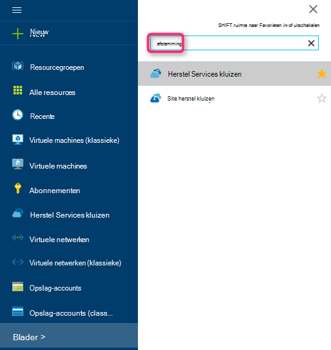

    De lijst met Services herstel kluizen wordt weergegeven.

3. Klik in het menu **kluizen herstel Services** op **toevoegen**.

    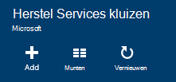

    Het herstelproces is Services kluis blad wordt geopend, waarin u een **naam**, het **abonnement**, de **resourcegroep**en de **locatie**op te geven.

    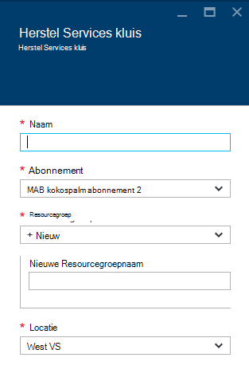

4. Voer een beschrijvende naam voor de kluis voor de **naam**. De naam moet uniek zijn voor het Azure abonnement. Typ een naam die tussen 2 en 50 tekens bevat. Er moet beginnen met een letter en mogen alleen letters, cijfers en afbreekstreepjes.

5. Klik op **abonnement** als u wilt zien van de lijst beschikbare van abonnementen. Als u niet zeker weet welk abonnement te gebruiken, gebruik de standaardwaarde (of voorgesteld) abonnement. Er zijn meerdere keuzemogelijkheden alleen als uw organisatie-account gekoppeld aan meerdere Azure abonnementen is.

6. **Resourcegroep** als u wilt zien van de lijst beschikbare van resourcegroepen op of klik op **Nieuw** om een nieuwe resourcegroep te maken. Zie [overzicht van de Azure resourcemanager](../azure-resource-manager/resource-group-overview.md) voor volledige informatie over Resource-groepen

7. Klik op **locatie** als het geografische gebied voor de kluis wilt selecteren.

8. Klik op **maken**. Het kan even duren voordat de kluis herstel Services moet worden gemaakt. Controleer de statusmeldingen in het bovenste rechter gebied in de portal.
Nadat uw kluis is gemaakt, wordt het geopend in de portal.

### Instellen opslag replicatie

De opslagruimte replicatie-optie kunt u kiezen tussen geografische-redundante opslag en lokaal redundante opslag. Standaard is uw kluis geografische-redundante opslag. Laat de optie die is ingesteld op geografische-redundante opslag als dit de primaire back-up is. Kies lokaal redundante opslag als u wilt een goedkoper optie die niet helemaal als duurzame. Meer informatie over [geografische-redundante](../storage/storage-redundancy.md#geo-redundant-storage) en [lokaal overtollige](../storage/storage-redundancy.md#locally-redundant-storage) opslagopties voor in de [opslag van Azure replicatie-overzicht](../storage/storage-redundancy.md).

De instelling van de herhaling opslag bewerken:

1. Selecteer uw kluis om het dashboard kluis en het blad instellingen te openen. Als het blad **Instellingen** niet wordt geopend, klikt u op **alle instellingen** in het dashboard kluis.

2. Klik op het blad **Instellingen** op **Back-up-infrastructuur** > **Configuratie van de back-up** openen van het blad **Back-up-configuratie** . Klik op het blad **Back-up-configuratie** , kies de optie voor het herhaling van opslagruimte voor uw kluis.

    

    Kies de optie opslagruimte voor uw kluis en bent u klaar voor de VM koppelen aan de kluis. U moet eerst de koppeling, ontdekken en registreren van de Azure virtuele machines.

### 2. kluis referenties downloaden

Het bestand van de referenties kluis is een certificaat dat is gegenereerd door de portal voor elke back-kluis. De portal uploadt u de openbare sleutel vervolgens naar de Access Control Service (ACS). De persoonlijke sleutel van het certificaat is beschikbaar gemaakt voor de gebruiker als onderdeel van de werkstroom die is ingevoerd in de machine registratie-werkstroom. Hiermee wordt de machine voor het back-upgegevens verzenden naar een geïdentificeerd kluis in de back-Azure-service geverifieerd.

De referentie kluis wordt alleen gebruikt tijdens de registratie-werkstroom. Het is van de gebruiker verantwoordelijkheid om ervoor te zorgen dat het bestand dat kluis referenties niet wordt belemmerd. Als deze in de handen van elke rogue-gebruiker valt, kan het bestand van de referenties kluis worden gebruikt voor het registreren van andere computers ten opzichte van de dezelfde kluis. Terwijl de back-gegevens worden versleuteld met een wachtwoordzin die deel uitmaakt van de klant, kunnen bestaande back-ups echter niet kan worden geknoeid. Kluis referenties zijn om te beperken dit te voorkomen, ingesteld in 48hrs verloopt. U kunt downloaden de kluis referenties van een herstel-services op een willekeurig aantal malen – maar alleen de meest recente kluis referentie-bestand is van toepassing tijdens de registratie-werkstroom.

Het kluis referentie-bestand is gedownload via een beveiligd kanaal van de Azure-portal. De back-up van Azure-service is niet op de hoogte van de persoonlijke sleutel van het certificaat en de persoonlijke sleutel is niet in de portal of de service. Gebruik de volgende stappen uit de kluis referentie-bestand te downloaden naar een lokale computer.

1. Meld u aan bij de [portal van Azure](https://portal.azure.com/).

2. Open herstel Services kluis waaraan waarop u wilt DPM registreren van de computer.

3. Instellingen blade wordt standaard zijn geopend. Als deze is gesloten, klik op **Instellingen** op kluis dashboard voor het openen van het blad instellingen. Blade instellingen, klik op **Eigenschappen**.

    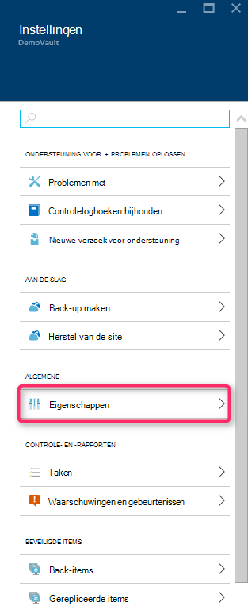

4. Klik op de pagina eigenschappen op **downloaden** onder **Back-up-referenties**. De portal genereert het kluis referentie-bestand, dat bestaat uit de downloaden.

    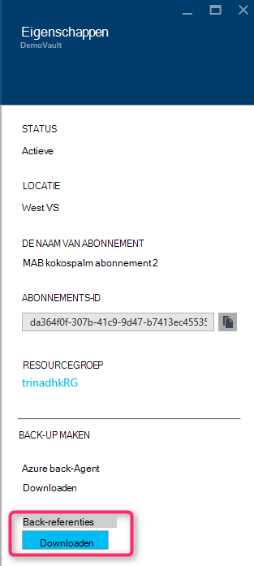

De portal genereert een kluis referentie met een combinatie van de naam van de kluis en de huidige datum. Klik op **Opslaan** om het downloaden van de referenties kluis naar de map downloads van de lokale account of selecteer OpslaanAls in het menu opslaan om op te geven van een locatie voor de referenties kluis. Het duurt omhoog minuten voor het bestand moet worden gegenereerd.

### Opmerking
- Zorg ervoor dat het kluis referenties-bestand is opgeslagen op een locatie die zijn toegankelijk vanaf uw computer. Als dit is opgeslagen in een bestand delen/SMB, controleert u de toegangsmachtigingen wilt.
- Het bestand van de referenties kluis wordt alleen gebruikt tijdens de registratie-werkstroom.
- Het bestand van de referenties kluis verloopt na 48hrs en kan worden gedownload van de portal.

### 3. back-Agent installeren

Nadat de kluis Azure back-up is gemaakt, moet een agent op elk van uw Windows-computers (Windows Server, Windows client, System Center Data Protection Manager server of Azure back-up-servercomputer) waarmee een back-up van gegevens en Azure-toepassingen zijn geïnstalleerd.

1. Open herstel Services kluis waaraan waarop u wilt DPM registreren van de computer.

2. Instellingen blade wordt standaard zijn geopend. Als deze is gesloten, klik op **Instellingen** te openen van het blad instellingen. Blade instellingen, klik op **Eigenschappen**.

    

3. Klik op de pagina instellingen op **downloaden** onder **Azure back-up-Agent**.

    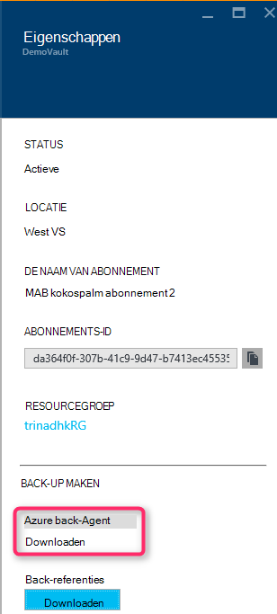

   Zodra de-agent is gedownload, dubbelklikt u op MARSAgentInstaller.exe om de installatie van de back-up van Azure-agent starten. Kies de installatiemap en tijdelijke map die zijn vereist voor de agent. De locatie van de cache opgegeven moet beschikbare ruimte waarin ten minste 5% van de back-upgegevens hebben.

4.  Als u een proxyserver gebruikt verbinding maken met internet, klikt u in de **configuratie van Proxy** -scherm, geef de details van de server proxy. Als u een geverifieerde proxy bevindt gebruikt, voert u de gegevens van de gebruiker gebruikersnaam en wachtwoord in dit venster.

5.  De back-up van Azure-agent installeert .NET Framework 4.5 en Windows PowerShell (als deze nog niet beschikbaar) om de installatie te voltooien.

6.  Wanneer de-agent is geïnstalleerd, **sluiten** het venster.

    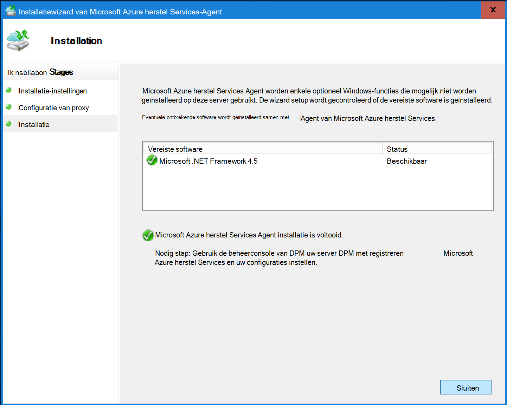

7. Klik op **Online**van **de Server DPM registreren** om de, in het tabblad **rollenbeheer** . Selecteer vervolgens **registreren**. De Wizard Setup hebt geregistreerd, wordt geopend.

8. Als u een proxyserver gebruikt verbinding maken met internet, klikt u in de **configuratie van Proxy** -scherm, geef de details van de server proxy. Als u een geverifieerde proxy bevindt gebruikt, voert u de gegevens van de gebruiker gebruikersnaam en wachtwoord in dit venster.

    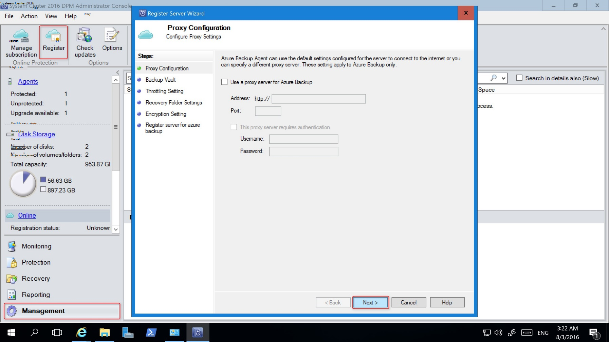

9. Blader naar in het scherm kluis referenties en selecteer het bestand dat kluis referenties die eerder is gedownload.

    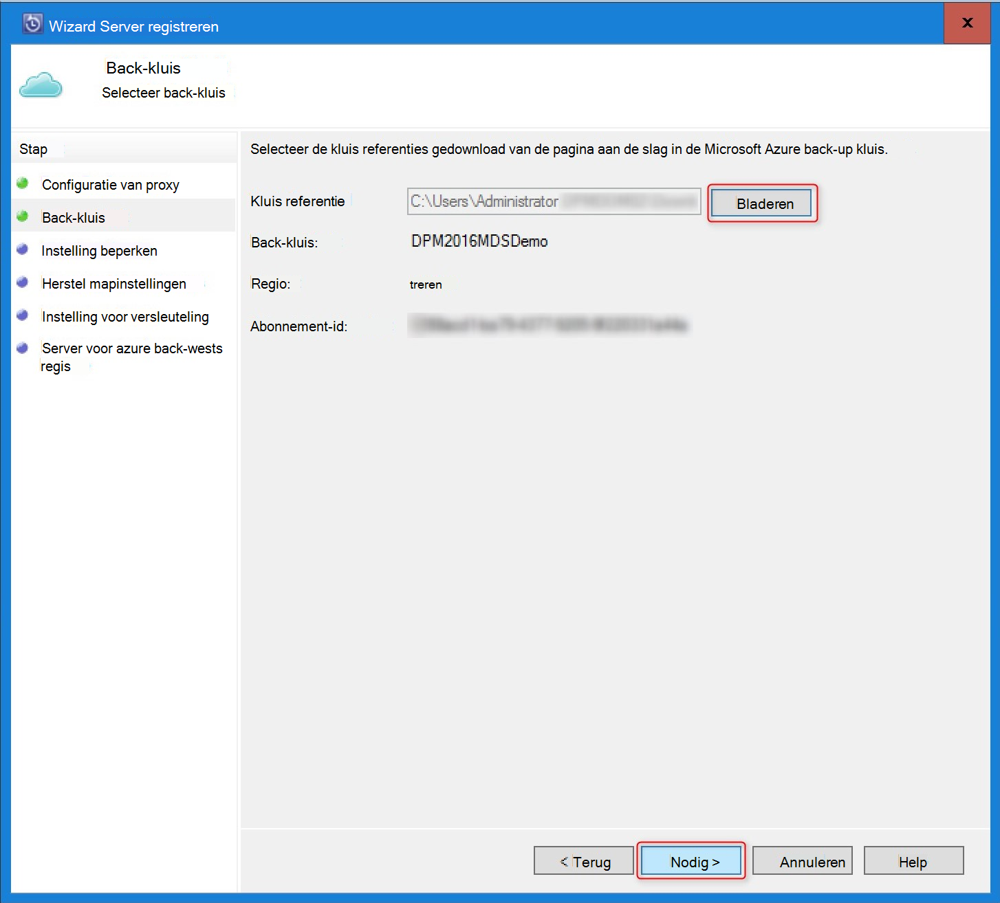

    Het bestand van de referenties kluis geldt alleen voor 48 uur (na het downloaden van de portal). Als u een fout in dit venster (bijvoorbeeld "kluis referenties bestand is verlopen"), meld u aan bij de Azure-portal en de referenties kluis bestand opnieuw downloaden.

    Zorg ervoor dat het bestand van de referenties kluis beschikbaar is op een locatie die toegankelijk is voor het installatieprogramma. Als u toegang tot gerelateerde fouten, de kluis referenties-bestand kopiëren naar een tijdelijke locatie op deze computer en probeer het opnieuw.

    Als u een ongeldige kluis referentie-foutbericht krijgt (bijvoorbeeld ' Ongeldige kluis referenties voorwaarde") het bestand is beschadigd of bevat niet hebt de meest recente referenties die is gekoppeld aan de herstel-service. Probeer opnieuw na een nieuw kluis referentie-bestand downloaden uit de portal. Deze fout wordt meestal weergegeven als de gebruiker de optie **downloaden kluis referentie** in de portal Azure snel achter elkaar op. In dit geval alleen het tweede kluis referentie bestand is geldig.

10. Om te bepalen van het gebruik van netwerkbandbreedte tijdens het werk, en niet-werkuren, in het scherm **Instellingen beperken** , kunt u de limieten voor de bandbreedte gebruik instellen en definiëren het werk en niet-werk uren.

    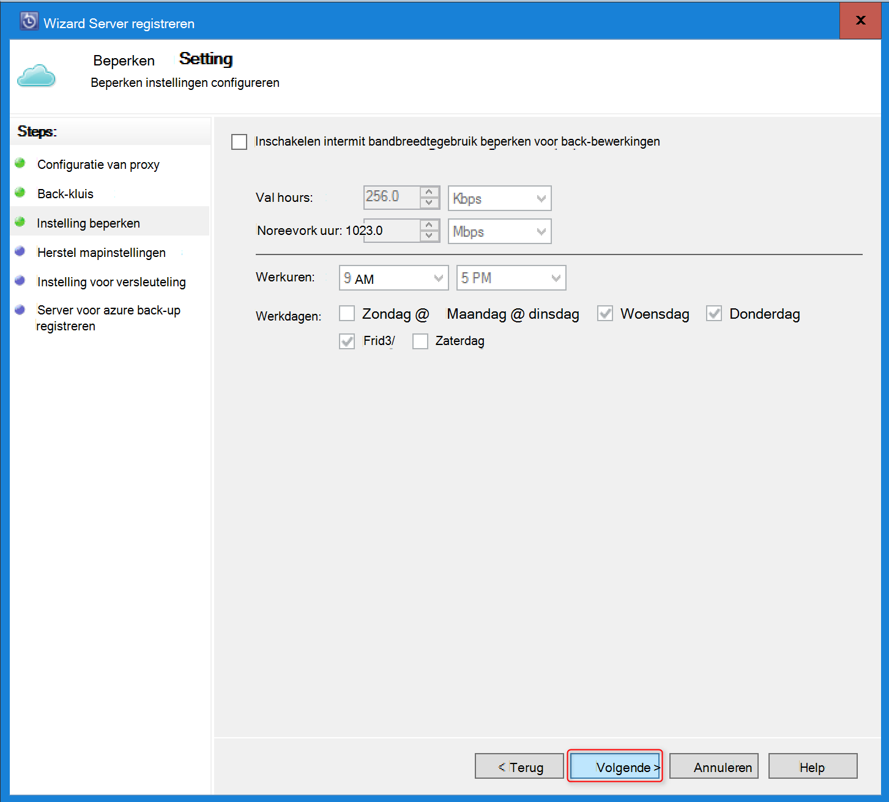

11. Blader in het scherm **Herstel mapinstelling** voor de map die de bestanden die zijn gedownload van Azure waar tijdelijk gefaseerde.

    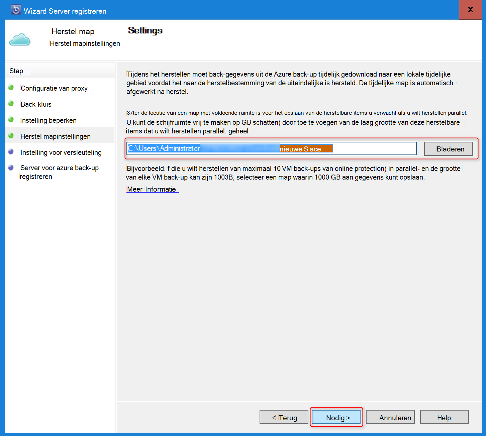

12. In het scherm **versleuteling instelling** kunt u een wachtwoordzin genereren of een coderingssleutel (minimaal van 16 tekens) opgeven. Moet de wachtwoordzin opslaan op een veilige locatie.

    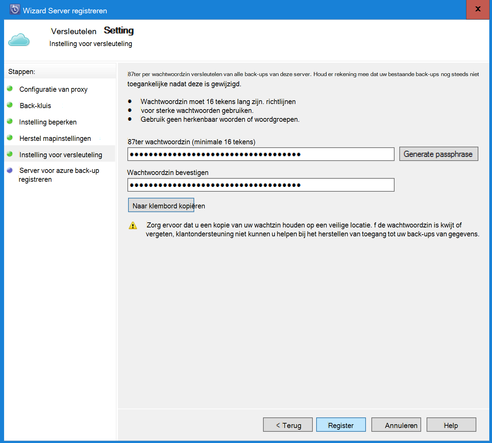

    > [AZURE.WARNING] Als de wachtwoordzin is kwijt of vergeten; De help van Microsoft kan niet in de back-upgegevens terugzetten. De eindgebruiker eigenaar is van de wachtwoordzin versleuteling en Microsoft geen inzicht in de wachtwoordzin die worden gebruikt door de gebruiker. Sla het bestand op een veilige locatie als dit nodig tijdens een herstelbewerking is.

13. Nadat u op de knop **registreren** , de computer is geregistreerd om de en u bent nu klaar om een reservekopie op Microsoft Azure.

14. Wanneer u een Data Protection Manager gebruikt, kunt u de instellingen die is opgegeven tijdens de registratie-werkstroom door te klikken op de optie **configureren** door in te schakelen **Online** onder het tabblad **rollenbeheer** kunt wijzigen.

## Vereisten (en beperkingen)

- DPM kan worden uitgevoerd als een fysieke server of een Hyper-V virtuele machine op systeem Center 2012 SP1 of systeem Center 2012 R2 is geïnstalleerd. Dit kan ook worden uitgevoerd als een Azure virtuele machines systeem Center 2012 R2 met ten minste waarop DPM 2012 R2 Update Rollup 3 of een virtuele Windows-computer in VMWare systeem Center 2012 R2 met ten minste waarop Update Rollup 5.
- Als u werkt met het DPM met systeem Center 2012 SP1 installeer Update implementeren van 2 voor System Center Data Protection Manager SP1. Dit is vereist voordat u de back-up-Agent van Azure kunt installeren.
- De server DPM moet hebben Windows PowerShell en .net Framework 4.5 is geïnstalleerd.
- DPM kunt back-up van de meeste werkbelasting aan Azure back-up. Voor een volledige lijst met wat Zie heeft ondersteund ondersteuning voor de back-up van Azure onderstaande items.
- Gegevens die zijn opgeslagen in de back-up van Azure kan niet worden hersteld met de optie 'kopiëren naar tape'.
- U hebt een Azure-account nodig met de functie Azure back-up is ingeschakeld. Als u geen account hebt, kunt u een gratis proefabonnement-account maken in een paar minuten. Lees meer over het [back-up van Azure prijzen](https://azure.microsoft.com/pricing/details/backup/).
- Back-up van Azure gebruikt, is de back-up-Agent van de Azure zijn geïnstalleerd op de servers die u een back wilt-up vereist. Elke server moet ten minste 5% van de grootte van de gegevens die back-up, beschikbaar zijn als gratis opslagruimte op lokale gemaakt is hebben. Een back-up 100 GB van gegevens is bijvoorbeeld minimaal van 5 GB beschikbare ruimte in het kladgebied locatie.
- Gegevens worden opgeslagen in de opslagruimte van Azure kluis. Er is geen limiet voor de hoeveelheid gegevens die u kunt back-up een back-up van Azure vault maar de grootte van een gegevensbron (bijvoorbeeld een virtuele machine of een database) 54400 GB niet mag overschrijden.

Dit soort bestanden worden ondersteund voor back-up Azure:

- Versleutelde (volledige back-ups alleen)
- Gecomprimeerd (incrementele back-ups ondersteund)
- Sparse (incrementele back-ups ondersteund)
- Gecomprimeerd en verspreid (behandeld als Sparse)

En deze niet worden ondersteund:

- Servers op hoofdlettergevoelig bestandssystemen worden niet ondersteund.
- Vaste koppelingen (overgeslagen)
- Reparsepunten (overgeslagen)
- Versleutelde en gecomprimeerd (overgeslagen)
- Versleutelde en verspreid (overgeslagen)
- Gecomprimeerde stream
- Verspreid stream

>[AZURE.NOTE] Uit in System Center 2012 DPM met SP1 hoger u kunt back-up maken van werkbelasting die zijn beveiligd met DPM naar Azure met Microsoft Azure Backup.
