<properties
    pageTitle="Beheren en controleren van back-ups van Azure virtuele machines | Microsoft Azure"
    description="Meer informatie over het beheren en controleren van een back-ups van Azure virtuele machines"
    services="backup"
    documentationCenter=""
    authors="trinadhk"
    manager="shreeshd"
    editor=""/>

<tags
    ms.service="backup"
    ms.workload="storage-backup-recovery"
    ms.tgt_pltfrm="na"
    ms.devlang="na"
    ms.topic="article"
    ms.date="08/31/2016"
    ms.author="trinadhk; jimpark; markgal;"/>

# <a name="manage-and-monitor-azure-virtual-machine-backups"></a>Beheren en back-ups van Azure virtuele machines controleren

> [AZURE.SELECTOR]
- [Back-ups van Azure VM beheren](backup-azure-manage-vms.md)
- [Klassieke VM back-ups beheren](backup-azure-manage-vms-classic.md)

In dit artikel vindt u informatie over algemene management en controle taken voor model Klassiek virtuele machines beveiligde in Azure wordt aangegeven.  

>[AZURE.NOTE] Azure heeft twee implementatiemodellen voor het maken en werken met resources: [resourcemanager en klassiek](../resource-manager-deployment-model.md). Raadpleeg [voorbereiden uw omgeving back-up Azure virtuele machines](backup-azure-vms-prepare.md) voor meer informatie over het werken met model van de implementatie klassiek VMs.

## <a name="manage-protected-virtual-machines"></a>Beveiligde virtuele machines beheren

Beveiligde virtuele machines beheren:

1. Als u wilt weergeven en beheren van instellingen voor een virtuele machine back-ups klikt u op het tabblad **Items beveiligd** .

2. Klik op de naam van een beveiligde item om te zien van het tabblad **Back-Details** , waarin u informatie over de laatste back-up.

    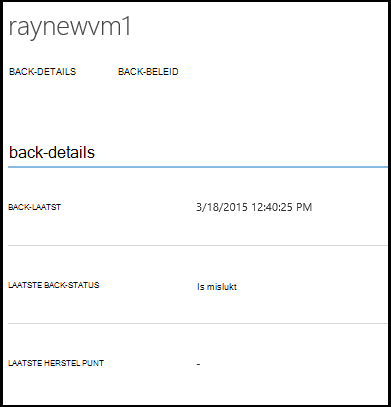

3. Als u wilt weergeven en beheren van back-beleid voor een virtuele machine klikt u op het tabblad **beleid** .

    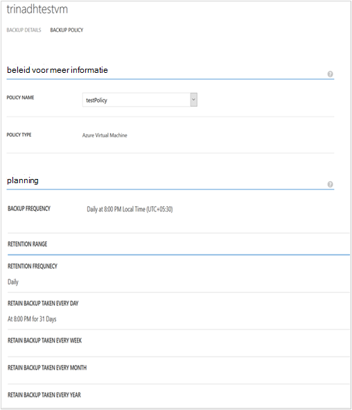

    Het **Beleid voor het back-up** -tabblad ziet u het bestaande beleid. U kunt desgewenst wijzigen. U moet maken een nieuw beleid Klik op **maken** als op de pagina **beleid** . Houd er rekening mee dat deze een virtuele machines gekoppeld niet mag hebben als u wilt verwijderen van een beleid.

    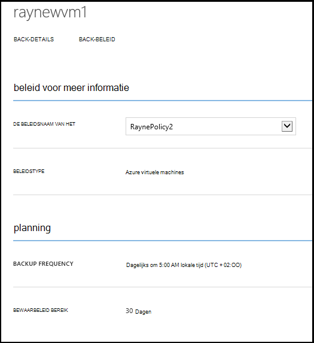

4. U kunt meer informatie over acties of status krijgen voor een virtuele machine op de pagina **taken** . Klik op een taak in de lijst voor meer informatie en taken voor een specifieke virtuele machine filteren.

    

## <a name="on-demand-backup-of-a-virtual-machine"></a>Bellen op back-up van een virtuele machine
U kunt een op aanvraag back-up van een virtuele machine uitvoeren wanneer deze is geconfigureerd voor de beveiliging. Als de eerste back-up in behandeling is voor de virtuele machine, back-up bellen op een volledige kopie van de virtuele machine tijdens Azure back-kluis wilt maken. Als eerste back-up is voltooid, is op aanvraag back-up is alleen verzenden wijzigingen uit de vorige back-up Azure back-up dat wil zeggen het Vault altijd incrementele.

>[AZURE.NOTE] Bewaarbeleid bereik van een back-up van op aanvraag is ingesteld op bewaarbeleid waarde die is opgegeven voor dagelijkse bewaarbeleid in back-beleid overeenkomt met de VM.  

Een aanvraag op back-up van een virtuele machine uitvoeren:

1. Navigeer naar de pagina **Beveiligde Items** en **Azure virtuele machines** selecteert als **Type** (als nog niet is gebeurd) en klik op de knop **selecteren** .

    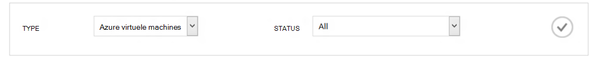

2. Selecteer de virtuele machine waarop u wilt uitvoeren op aanvraag back-up en klikt u op de knop **Nu back-up** onder aan de pagina.

    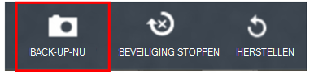

    Hiermee maakt u een back-uptaak op de geselecteerde virtuele machine. Bewaarbeleid bereik van herstel komma gemaakt via deze taak zijn dezelfde dat is opgegeven in het beleid dat is gekoppeld aan de virtuele machine.

    

    >[AZURE.NOTE] Als u wilt bekijken van het beleid dat is gekoppeld aan een virtuele machine, Inzoomen op VM op de pagina **Beveiligde Items** en Ga naar tabblad back-beleid.

3. Nadat de taak is gemaakt, kunt u klikken op de knop **taak weergeven** in de balk mailpop om het bijbehorende project op de pagina taken weer te geven.

    

4. Na de taak is voltooid, wordt er een herstelpunt gemaakt waarin u kunt de virtuele machine herstellen. Dit wordt ook de waarde van de herstel punt verhogen met 1 in de **Beveiligde Items** pagina.

## <a name="stop-protecting-virtual-machines"></a>Stoppen met het beveiligen van virtuele machines
U kunt kiezen om te stoppen de toekomstige back-ups van een virtuele machine met de volgende opties:

- Back-upgegevens die is gekoppeld aan virtuele machine in Azure back-up kluis behouden
- Back-upgegevens die is gekoppeld aan VM verwijderen

Als u hebt geselecteerd om te bewaren back-upgegevens die is gekoppeld aan VM, kunt u de back-upgegevens terugzetten van de virtuele machine. Voor meer informatie voor deze virtuele machines prijzen, klikt u op [hier](https://azure.microsoft.com/pricing/details/backup/).

Beveiliging voor een virtuele machine beëindigen:

1. Navigeer naar de pagina **Beveiligde Items** en **Azure virtuele machines** selecteert als het filtertype (als nog niet is gebeurd) en klik op de knop **selecteren** .

    

2. Selecteer de virtuele machine en klik op **Beveiliging stoppen** onder aan de pagina.

    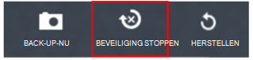

3. Standaard Azure back-up niet de back-gegevens verwijderen die zijn gekoppeld aan de virtuele machine.

    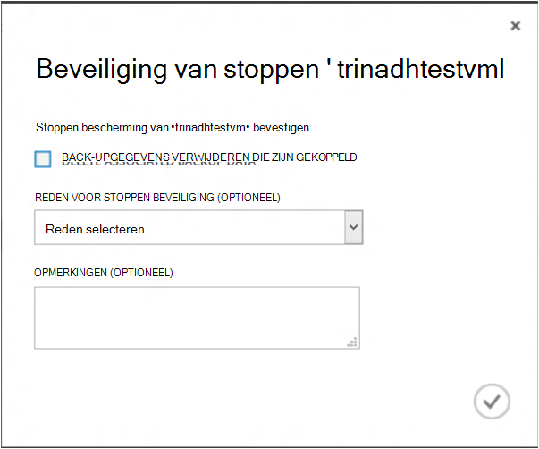

    Als u verwijderen van back-upgegevens wilt, selecteert u het selectievakje in.

    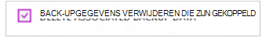

    Selecteer een reden voor het stoppen van de back-up. Dit is optioneel, helpen leveren een reden Azure back-up kunt werken op het soort feedback en prioriteit voorzien, zodat de klant-scenario's.

4. Klik op de knop **verzenden** om in te dienen de taak **Beveiliging stoppen** . Klik op **Taak weergeven** om de bijbehorende de taak in de pagina **taken** weer te geven.

    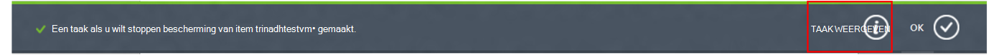

    Als u de optie **verwijderen gekoppeld back-upgegevens** tijdens de wizard **Beveiliging stoppen** en vervolgens het bericht taak voltooid niet hebt geselecteerd, wordt beveiliging status gewijzigd in **Beveiliging is gestopt**. De gegevens blijven aanwezig met back-up van Azure totdat deze expliciet wordt verwijderd. U kunt altijd de gegevens verwijderen door de virtuele machine op de pagina **Beveiligde Items** selecteren en te klikken op **verwijderen**.

    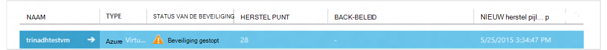

    Als u de optie **verwijderen gekoppeld back-upgegevens** hebt geselecteerd, niet de virtuele machine deel van de pagina **Beveiligde Items** .

## <a name="re-protect-virtual-machine"></a>VM opnieuw te beveiligen
Als u hebt de optie **verwijderen koppelen back-upgegevens** niet geselecteerd in **Beveiliging stoppen**, kunt u de virtuele machine opnieuw volgens de stappen die vergelijkbaar is met een back-up geregistreerde virtuele machines beveiligen. Zodra beveiligd, deze virtuele machine back-gegevens die worden bewaard voordat u de beveiliging stoppen moet en herstel punten gemaakt na opnieuw te beveiligen.

Na het opnieuw te beveiligen, wordt de VM beveiliging status wordt gewijzigd in **beveiligde** als er herstel punten voordat u **Beveiliging stoppen**.

  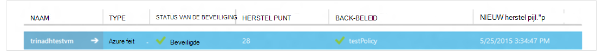

>[AZURE.NOTE] Wanneer opnieuw beveiligt de virtuele machine, kunt u een ander beleid dan het beleid waarmee VM in eerste instantie is beveiligd.

## <a name="unregister-virtual-machines"></a>Unregister virtuele machines

Als u de virtuele machine verwijderen uit de back-kluis wilt:

1. Klik op de knop **UNREGISTER** onder aan de pagina.

    

    Een mailpop-upmelding wordt onderaan in het scherm aanvragen van een bevestiging weergegeven. Klik op **Ja** om door te gaan.

    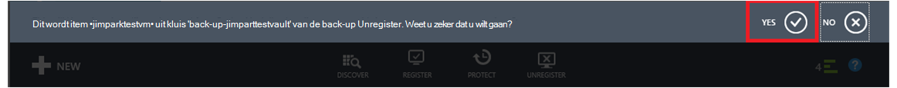

## <a name="delete-backup-data"></a>Back-up-gegevens verwijderen
U kunt de back-upgegevens die is gekoppeld aan een virtuele machine, ofwel verwijderen:

- Tijdens het stoppen beveiliging taak
- Na een beveiliging stoppen is taak voltooid op een virtuele machine

Als u wilt verwijderen boeken back-gegevens op een virtuele machine, dat wil in de stand *Beveiliging gestopt zeggen* succesvolle afronding van een **Back-ups stoppen** taak:

1. Navigeer naar de pagina **Beveiligde Items** en **Azure virtuele machines** selecteert als *type* en klik op de knop **selecteren** .

    

2. Selecteer de virtuele machine. De virtuele machine worden weergegeven in staat **Beveiliging is gestopt** .

    

3. Klik op de knop **verwijderen** onder aan de pagina.

    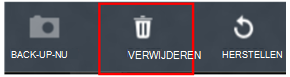

4. Selecteer een reden voor het verwijderen van back-upgegevens (sterk aanbevolen) in de wizard **back-upgegevens verwijderen** en klik op **verzenden**.

    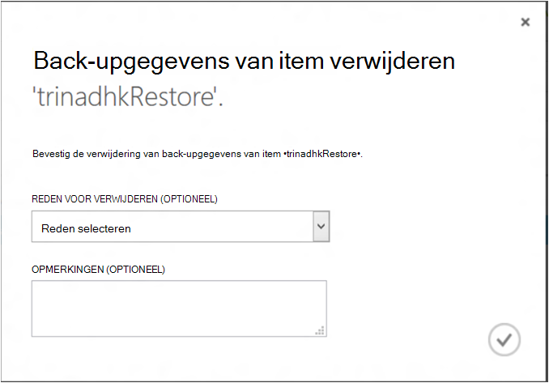

5. Hiermee maakt u een taak als back-gegevens van geselecteerde virtuele machine wilt verwijderen. Klik op **taak weergeven** als u wilt zien van de bijbehorende project in de pagina taken.

    

    Wanneer de taak is voltooid, wordt het fragment dat overeenkomt met de virtuele machine worden verwijderd uit pagina van de **beveiligde items** .

## <a name="dashboard"></a>Dashboard
U kunt informatie over Azure virtuele machines, hun opslag en taken die zijn gekoppeld aan deze in de afgelopen 24 uur bekijken op de pagina **Dashboard** . U kunt de status van de back- en bijbehorende back-fouten weergeven.

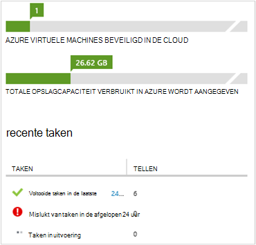

>[AZURE.NOTE] Waarden in het dashboard worden vernieuwd elke 24 uur.

## <a name="auditing-operations"></a>Controle-bewerkingen
Azure back-up biedt revisie van de 'bewerking logboeken"back-bewerkingen voor geactiveerd door de klant zodat u gemakkelijk kunt zien precies welke bewerkingen management zijn uitgevoerd op de back-kluis. Bewerkingen logboeken uitstekende postmortemkeuring inschakelen en controleren van ondersteuning voor de back-bewerkingen.

De volgende bewerkingen worden geregistreerd in Logboeken aan de bewerking:

- Register
- Unregister
- Beveiliging configureren
- Back-up (beide gepland evenals op aanvraag back-up tot en met BackupNow)
- Herstellen
- Beveiliging stoppen
- Back-upgegevens verwijderen
- Beleid toevoegen
- Beleid verwijderen
- Beleid bijwerken
- Taak annuleren

Bewerking logboeken overeenkomt met een back-kluis weergeven:

1. Navigeer naar **Management-services** in Azure-portal en klik vervolgens op het tabblad **Logboeken aan de bewerking** .

    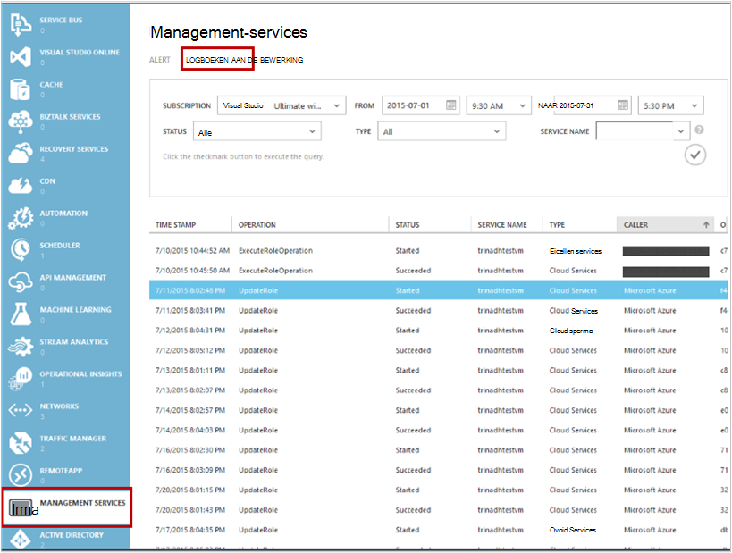

2. **Back-ups** selecteert als *Type* in de filters en geeft u de naam van de back-kluis in *de servicenaam van de* en klik op **verzenden**.

    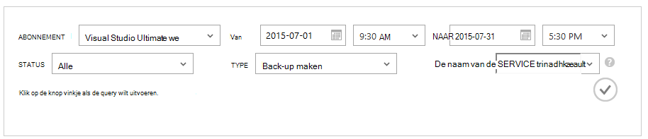

3. In de logboeken aan de bewerkingen, selecteert u een bewerking en klik op **Details** voor meer informatie overeenkomt met een bewerking.

    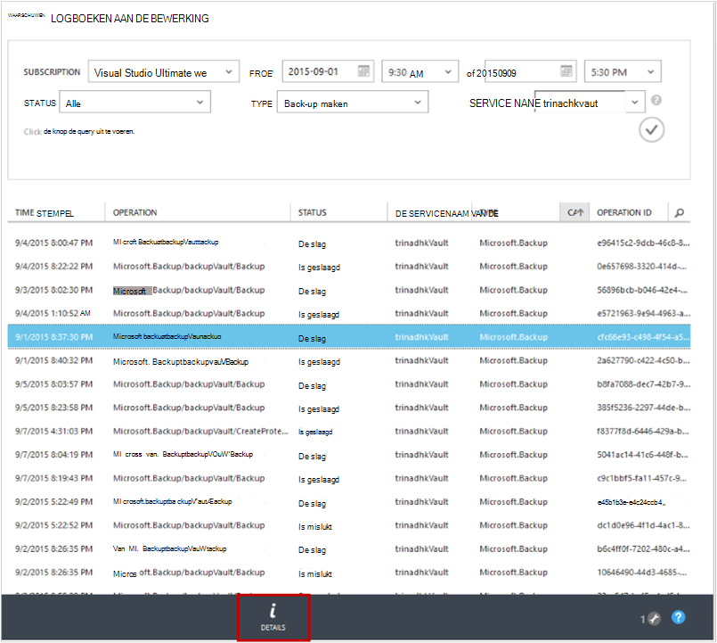

    De **wizard Details** bevat informatie over de bewerking is geactiveerd, taak-Id, resource waarop deze bewerking wordt geactiveerd en begintijd van de bewerking.

    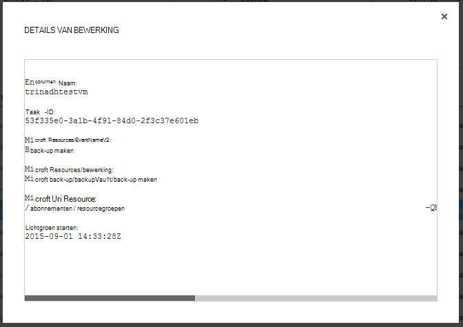

## <a name="alert-notifications"></a>Waarschuwingen
U kunt aangepaste waarschuwingen voor de taken krijgen in de portal. Dit is bereikt door het definiëren van waarschuwingsregels PowerShell gebaseerde op operationele Logboeken gebeurtenissen. We raden u aan gebruiken *PowerShell versie 1.3.0 of hoger*.

Als u wilt een aangepaste melding waarschuwing voor back-fouten wilt definiëren, eruitziet een voorbeeld van een opdracht:

```
PS C:\> $actionEmail = New-AzureRmAlertRuleEmail -CustomEmail contoso@microsoft.com
PS C:\> Add-AzureRmLogAlertRule -Name backupFailedAlert -Location "East US" -ResourceGroup RecoveryServices-DP2RCXUGWS3MLJF4LKPI3A3OMJ2DI4SRJK6HIJH22HFIHZVVELRQ-East-US -OperationName Microsoft.Backup/backupVault/Backup -Status Failed -TargetResourceId /subscriptions/86eeac34-eth9a-4de3-84db-7a27d121967e/resourceGroups/RecoveryServices-DP2RCXUGWS3MLJF4LKPI3A3OMJ2DI4SRJK6HIJH22HFIHZVVELRQ-East-US/providers/microsoft.backupbvtd2/BackupVault/trinadhVault -Actions $actionEmail
```

**ResourceId**: U kunt krijgen dit van bewerkingen logboeken pop als hierboven sectie. ResourceUri in de pop-upvenster details van een bewerking is de ResourceId te verstrekken voor deze cmdlet.

**OperationName**: dit is een van de notatie ' Microsoft.Backup/backupvault/<EventName>"wanneer EventName is een van de Register, registratie, ConfigureProtection, back-up maken, terugzetten, StopProtection, DeleteBackupData, CreateProtectionPolicy, DeleteProtectionPolicy, UpdateProtectionPolicy

**Status**: ondersteunde waarden zijn-begonnen, is geslaagd, maar is mislukt.

**ResourceGroup**: ResourceGroup van de resource is waarop bewerking wordt geactiveerd. U kunt dit aanvragen uit ResourceId waarde. Waarde tussen velden */resourceGroups/* en */providers/* ResourceId waarde is de waarde voor ResourceGroup.

**Naam**: naam van de waarschuwing regel.

**CustomEmail**: opgeven van het aangepaste e-mailadres waarnaar u wilt waarschuwingsbericht verzenden

**SendToServiceOwners**: deze optie wordt de waarschuwing melding gestuurd naar alle beheerders en CO-beheerders van het abonnement. Dit kan worden gebruikt in een **Nieuw AzureRmAlertRuleEmail** cmdlet

### <a name="limitations-on-alerts"></a>Beperkingen voor meldingen
Waarschuwingen op basis van een gebeurtenis zijn onderworpen aan de volgende beperkingen:

1. Waarschuwingen geactiveerd op alle virtuele machines in de back-kluis. U aanpassen hierop klikken voor waarschuwingen voor specifieke reeks virtuele machines in een back-kluis niet.
2. Deze functie is in de proefversie. [Meer informatie](../monitoring-and-diagnostics/insights-powershell-samples.md#create-alert-rules)
3. Ontvangt u meldingen van "alerts-noreply@mail.windowsazure.com". U kunt de afzender van e-mailbericht momenteel niet wijzigen.

## <a name="next-steps"></a>Volgende stappen

- [Azure VMs herstellen](backup-azure-restore-vms.md)
