<properties
    pageTitle="VM resourcemanager geïmplementeerd back-ups beheren | Microsoft Azure"
    description="Meer informatie over het beheren en back-ups van VM resourcemanager geïmplementeerd controleren"
    services="backup"
    documentationCenter=""
    authors="trinadhk"
    manager="shreeshd"
    editor=""/>

<tags
    ms.service="backup"
    ms.workload="storage-backup-recovery"
    ms.tgt_pltfrm="na"
    ms.devlang="na"
    ms.topic="article"
    ms.date="08/11/2016"
    ms.author="jimpark; markgal; trinadhk"/>

# Back-ups van Azure virtuele machines beheren

> [AZURE.SELECTOR]
- [Back-ups van Azure VM beheren](backup-azure-manage-vms.md)
- [Klassieke VM back-ups beheren](backup-azure-manage-vms-classic.md)

In dit artikel bevat richtlijnen voor het beheren van VM back-ups en wordt uitgelegd van de back-waarschuwingen informatie die beschikbaar zijn in de portal dashboard. De richtlijnen in dit artikel is van toepassing op VMs gebruikt met Services herstel kluizen. In dit artikel niet besproken het maken van virtuele machines, en ook niet wordt uitgelegd hoe u virtuele machines beveiligen. Zie voor een handleiding over het beveiligen van VMs Azure resourcemanager geïmplementeerd in Azure wordt aangegeven met een kluis herstel Services, [eerst zoeken: Maak een Back-up van VMs naar een kluis herstel Services](backup-azure-vms-first-look-arm.md).

## Kluizen en beveiligde virtuele machines beheren

Klik in de portal Azure biedt het dashboard van de kluis herstel Services toegang tot informatie over het opnemen van de kluis:

- de meest recente back-momentopname, dat wil ook de meest recente herstellen komma zeggen < br\>
- het back-beleid < br\>
- totale grootte van alle back-up momentopnamen < br\>
- aantal virtuele machines die zijn beveiligd met de kluis < br\>

Veel beheertaken met een virtuele machine back-up beginnen met het openen van de kluis in het dashboard. Omdat kluizen kunnen worden gebruikt om het beveiligen van meerdere items (of meerdere VMs) gedetailleerde informatie over een bepaalde VM, echter het dashboard van kluis item openen. De volgende procedure ziet u hoe u het *dashboard kluis* openen en gaat u verder met het *kluis item dashboard*. Er zijn "tips" in beide procedures die wijst u informatie over het toevoegen van de kluis en kluis item naar Azure dashboard met behulp van de vastmaken aan de opdracht dashboard. Vastmaken aan het dashboard is een manier voor het maken van een snelkoppeling naar de kluis of het item. U kunt ook veelgebruikte opdrachten uitvoeren vanuit de snelkoppeling.

>[AZURE.TIP] Als er meerdere dashboards en bladen openen, gebruikt u de schuifregelaar donker-blauw onderaan in het venster voor het Azure dashboard heen en weer.

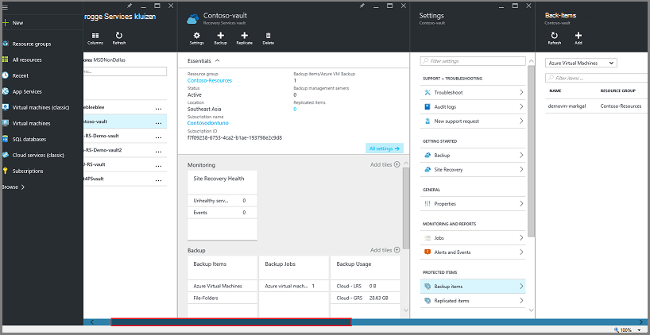

### Open een kluis herstel Services in het dashboard:

1. Meld u aan bij de [portal van Azure](https://portal.azure.com/).

2. Klik in het menu Hub klikt u op **Bladeren** en typ in de lijst met resources, **Herstel Services**. Als u te typen begint, de lijstfilters op basis van uw invoer. Klik op **Services herstel kluis**.

      

    De lijst met Services herstel kluizen worden weergegeven.

    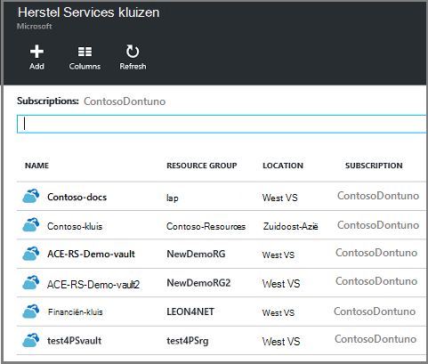  

    >[AZURE.TIP] Als u een kluis aan het Dashboard Azure vastmaakt, is dat kluis direct toegankelijk bij het openen van de Azure-portal. Als u wilt vastmaken een kluis aan het dashboard, in de lijst kluis, met de rechtermuisknop op de kluis en selecteer **vastmaken aan het dashboard**.

3. Selecteer in de lijst met kluizen, de kluis openen van de dashboard. Wanneer u de kluis selecteert, wordt het dashboard kluis en het blad **Instellingen** geopend. In de volgende afbeelding, is het dashboard **Contoso-kluis** gemarkeerd.

    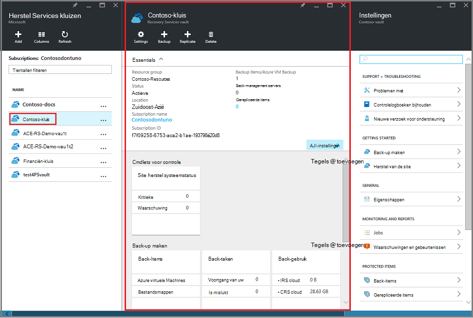

### Een dashboard kluis-item openen

In de vorige procedure moet u het dashboard kluis geopend. Het dashboard van het item kluis openen:

1. Klik in het dashboard kluis, klikt u op de tegel **Back-up Items** op **Azure virtuele Machines**.

    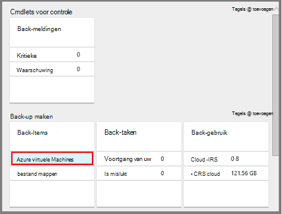

    Het blad **Back-up Items** bevat de laatste back-uptaak voor elk item. In dit voorbeeld is er een virtuele machine, demovm-markgal, beveiligd met deze kluis.  

    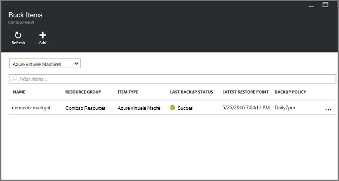

    >[AZURE.TIP] U kunt een item kluis aan het Dashboard Azure vastmaken voor eenvoudige toegang. Als u wilt vastmaken een item kluis, in de itemlijst kluis, met de rechtermuisknop op het item en selecteer **vastmaken aan het dashboard**.

2. Klik in het blad **Back-up Items** op het item om te openen van het dashboard van het item kluis.

    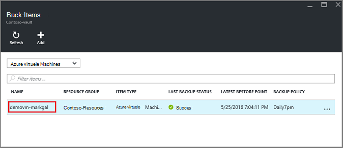

    Het dashboard van het item kluis en de bijbehorende **Instellingen** blade geopend.

    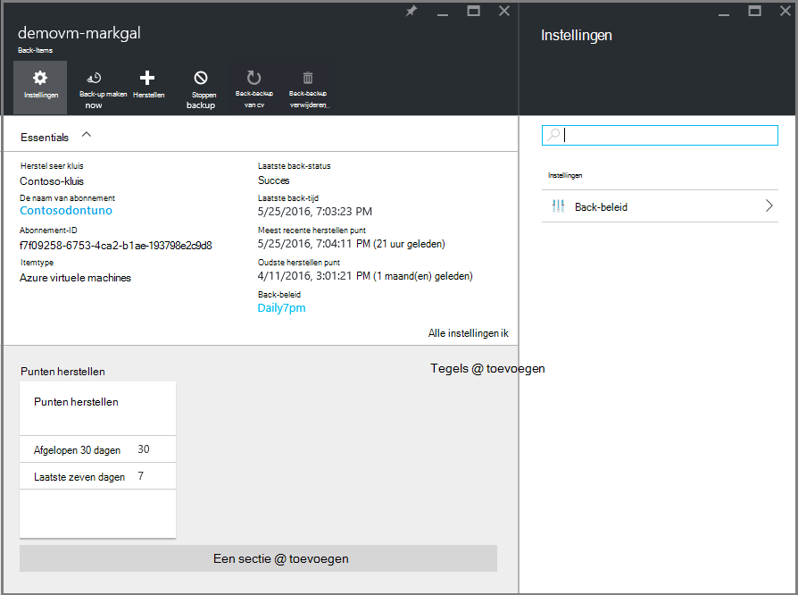

    U kunt veel belangrijkste beheertaken, zoals uitvoeren vanuit het dashboard van het item kluis:

    - beleidsregels voor wijzigen of maak een nieuw back-beleid < br\>
    - herstellen punten bekijken en bekijken van de consistentie staat < br\>
    - bellen op back-up van een virtuele machine < br\>
    - stoppen met het beveiligen van virtuele machines < br\>
    - beveiliging van een virtuele machine hervatten < br\>
    - verwijderen van een back-upgegevens (of herstelpunt) < br\>
    - [een back-up (of herstelpunt) herstellen](./backup-azure-arm-restore-vms.md#restore-a-recovery-point) < br\>

Voor de volgende procedures uit is het beginpunt het dashboard van het item kluis.

## Back-beleid beheren

1. Klik op **Alle instellingen** als u wilt openen van het blad **Instellingen** op het [dashboard van kluis item](backup-azure-manage-vms.md#open-a-vault-item-dashboard).

    

2. Klik op het blad **Instellingen** op **back-up-beleid** om te openen die blade.

    Klik op het blad, worden de back-frequentie en het bewaarbeleid bereik details weergegeven.

    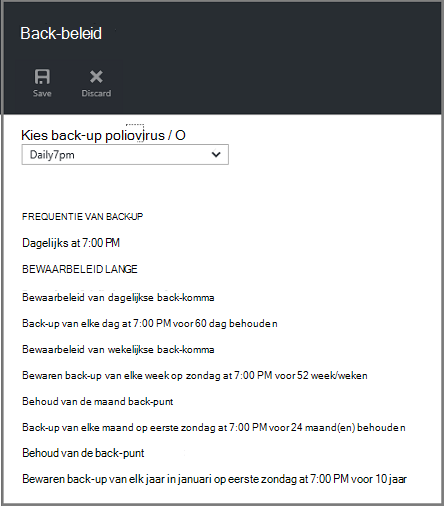

3. In het menu **back-beleid kiezen** :
    - Als u wilt wijzigen, selecteert u een ander beleid en klik op **Opslaan**. Het nieuwe beleid wordt onmiddellijk toegepast op de kluis. < br\>
    - Als u wilt een beleid maakt, door **Nieuw**te selecteren.

    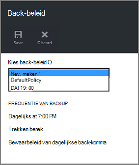

    Zie [een back-beleid definieert](backup-azure-manage-vms.md#defining-a-backup-policy)voor instructies over het maken van een back-beleid.

[AZURE.INCLUDE [backup-create-backup-policy-for-vm](../../includes/backup-create-backup-policy-for-vm.md)]

## Bellen op back-up van een virtuele machine
U kunt een op aanvraag back-up van een virtuele machine uitvoeren wanneer deze is geconfigureerd voor de beveiliging. Als de eerste back-up in behandeling is, op aanvraag back-up wordt gemaakt van een volledige kopie van de virtuele machine in de kluis herstel Services. Als de eerste back-up is voltooid, verzendt een back-up van op aanvraag alleen wijzigingen uit de vorige momentopname, om de herstel-Services. Volgende back-ups hebben dat wil zeggen altijd incrementele.

>[AZURE.NOTE] Het bereik bewaarbeleid voor een op aanvraag back-up is de waarde van het bewaarbeleid opgegeven voor het dagelijkse back-punt in het beleid. Als u geen dagelijkse back-up is geselecteerd, wordt de wekelijkse back-komma gebruikt.

Naar een op aanvraag back-up maken van een virtuele machine activeren:

- Klik op **back-up-nu**op het [dashboard van kluis item](backup-azure-manage-vms.md#open-a-vault-item-dashboard).

    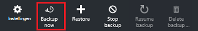

    De portal zorgt ervoor dat u wilt een back-uptaak op aanvraag starten. Klik op **Ja** om te beginnen van de back-uptaak.

    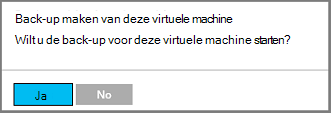

    De back-uptaak Hiermee maakt u een herstelpunt. Het bewaarbeleid bereik van de komma herstel is hetzelfde als bewaarbeleid bereik dat is opgegeven in het beleid dat is gekoppeld aan de virtuele machine. Klik op de tegel van de **Back-up taken** om de voortgang voor de taak, klikt u in het dashboard kluis te houden.  

## Stoppen met het beveiligen van virtuele machines
Als u wilt stoppen met het beveiligen van een virtuele machine, wordt u gevraagd als u wilt behouden de herstel wordt verwezen. Er zijn twee manieren om te stoppen met het beveiligen van virtuele machines:
- alle toekomstige back-taken stoppen en alle herstel wordt verwezen, verwijderen of
- alle toekomstige back-taken stoppen, maar wel laat de herstel wordt verwezen  

Er is een kosten die is gekoppeld aan de herstel wordt verwezen in opslag verlaten. Het voordeel van de punten herstel verlaten is echter dat kunt u de virtuele machine later herstellen desgewenst. Voor informatie over de kosten van de punten herstel verlaten, raadpleegt u de [prijzen van details](https://azure.microsoft.com/pricing/details/backup/). Als u cookies verwijdert alle herstel punten, kunt u de virtuele machine niet terugzetten.

Beveiliging voor een virtuele machine beëindigen:

1. Op het [dashboard van kluis item](backup-azure-manage-vms.md#open-a-vault-item-dashboard), klikt u op **Stoppen met back-up**.

    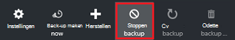

    Hiermee opent u het blad niet meer back-up.

    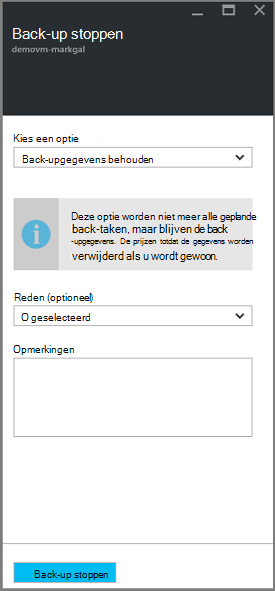

2. Klik op het blad **Back-ups stoppen** , kiest u of u wilt bewaren of verwijderen van de back-upgegevens. Het informatievak vindt u meer informatie over uw keuze.

    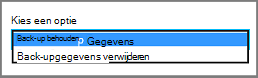

3. Als u ervoor kiest om de back-gegevens te bewaren, gaat u verder met stap 4. Als u ervoor kiest om te verwijderen van back-upgegevens, bevestigen dat u wilt stoppen met het back-taken en verwijder de herstel wordt verwezen - Typ de naam van het item.

    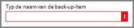

    Als u niet zeker weet van de naam van het item, plaats de muisaanwijzer op het pictogram Downloadfout om weer te geven van de naam. De naam van het item is ook onder **Stoppen back-up maken** aan de bovenkant van het blad.

4. Geef desgewenst een **reden** of **Opmerking**.

5. Als u wilt dat de back-uptaak voor het huidige item, klikt u op  

    Een melding krijgt u dat de back-taken zijn gestopt.

    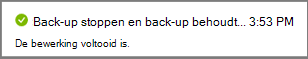

## Beveiliging van een virtuele machine hervatten
Als de optie **Back-up-gegevens behouden** is gekozen wanneer bescherming voor de virtuele machine is gestopt, is het mogelijk maakt om te hervatten beveiliging. Als de optie **Back-up-gegevens verwijderen** is gekozen, klikt u vervolgens hervatten beveiliging voor de virtuele machine niet.

Beveiliging voor de virtuele machine hervatten

1. Op het [dashboard van kluis item](backup-azure-manage-vms.md#open-a-vault-item-dashboard), klikt u op **back-up hervatten**.

    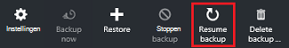

    Hiermee opent u het beleid van de back-up-blad.

    >[AZURE.NOTE] Wanneer opnieuw beveiligt de virtuele machine, kunt u een ander beleid dan het beleid waarmee VM in eerste instantie is beveiligd.

2. Volg de stappen in de [beleidsregels voor wijzigen of een nieuw back-beleid maken](backup-azure-manage-vms.md#change-policies-or-create-a-new-backup-policy), als het beleid voor de virtuele machine wilt toewijzen.

    Zodra het back-beleid wordt toegepast op de virtuele machine, ziet u het volgende bericht.

    

## Back-up-gegevens verwijderen
U kunt de back-upgegevens die is gekoppeld aan een virtuele machine verwijderen tijdens het **stoppen van back-up** of op elk gewenst moment na de back-up taak is voltooid. Het is mogelijk zelfs nuttige wachten dagen of weken voor het verwijderen van de herstel wordt verwezen. In tegenstelling tot herstellen herstel punten opgeven wanneer u back-upgegevens verwijdert, kunt u specifieke herstel wordt verwezen verwijderen niet kiezen. Als u besluit om de back-gegevens hebt verwijderd, verwijdert u alle herstel punten die is gekoppeld aan het item.

De volgende procedure wordt ervan uitgegaan van de back-uptaak voor de virtuele machine is gestopt of uitgeschakeld. Zodra de back-uptaak is uitgeschakeld, zijn de **cv-back-up maken** en **verwijderen van back-up** -opties beschikbaar in het dashboard van het item kluis.

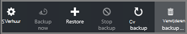

Back-upgegevens op een virtuele machine met de *back-up uitgeschakeld*verwijderen:

1. Op het [dashboard van kluis item](backup-azure-manage-vms.md#open-a-vault-item-dashboard), klikt u op **back-up verwijderen**.

    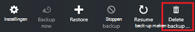

    Hiermee opent u het blad **Back-up-gegevens verwijderen** .

    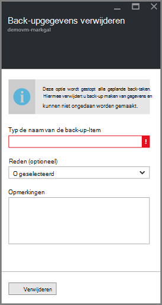

2. Typ de naam van het item om te bevestigen dat u wilt verwijderen van de herstel wordt verwezen.

    

    Als u niet zeker weet van de naam van het item, plaats de muisaanwijzer op het pictogram Downloadfout om weer te geven van de naam. De naam van het item is ook onder **Back-up-gegevens verwijderen** aan de bovenkant van het blad.

3. Geef desgewenst een **reden** of **Opmerking**.

4. Als u wilt de back-gegevens voor het huidige item verwijderen, klikt u op  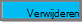

    Een melding krijgt u dat de back-upgegevens is verwijderd.

## Volgende stappen

Voor informatie over een virtuele machine vanaf een herstelpunt opnieuw te maken, raadpleegt u [Azure VMs herstellen](backup-azure-restore-vms.md). Als u informatie over het beveiligen van uw virtuele machines nodig hebt, raadpleegt u [eerst zoeken: Maak een Back-up van VMs naar een kluis herstel Services](backup-azure-vms-first-look-arm.md). Zie voor informatie over het controleren van gebeurtenissen [Monitor waarschuwingen voor back-ups van Azure virtuele machines](backup-azure-monitor-vms.md).
