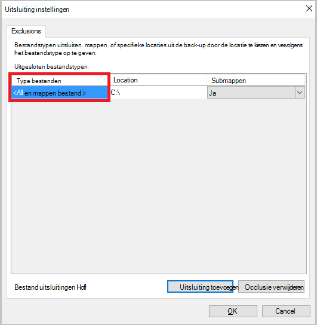

<properties
    pageTitle="Back-up van Azure kluizen en servers Azure met het implementatiemodel klassieke beheren | Microsoft Azure"
    description="Gebruik deze zelfstudie voor meer informatie over het beheren van back-up van Azure kluizen en servers."
    services="backup"
    documentationCenter=""
    authors="markgalioto"
    manager="jwhit"
    editor="tysonn"/>

<tags
    ms.service="backup"
    ms.workload="storage-backup-recovery"
    ms.tgt_pltfrm="na"
    ms.devlang="na"
    ms.topic="article"
    ms.date="09/27/2016"
    ms.author="jimpark;markgal"/>

# Back-up van Azure kluizen en servers met het implementatiemodel klassieke beheren

> [AZURE.SELECTOR]
- [Resourcemanager](backup-azure-manage-windows-server.md)
- [Klassieke](backup-azure-manage-windows-server-classic.md)

In dit artikel vindt u een overzicht van de back-up beschikbaar via de portal van Azure klassieke en de Microsoft Azure back-agent beheertaken.

[AZURE.INCLUDE [learn-about-deployment-models](../../includes/learn-about-deployment-models-classic-include.md)]Resourcemanager implementatiemodel.

## Beheertaken voor portal
1. Meld u aan bij de [beheerportal](https://manage.windowsazure.com).

2. Klik op **Herstel Services**en klik op de naam van de back-kluis om weer te geven van de pagina snel starten.

    

Als u de opties boven aan de pagina snel starten, ziet u de beschikbare beheertaken.

### Dashboard
Selecteer **Dashboard** gebruik overzicht voor de server. Het **Gebruik overzicht** bevat:

- Het aantal Windows-Servers geregistreerd in cloud
- Het aantal Azure virtuele machines beveiligd in de cloud
- De totale opslagcapaciteit verbruikt in Azure wordt aangegeven
- De status van recente taken

U kunt de volgende taken uitvoeren onder aan het Dashboard:

- **Beheren certificaat** - als een certificaat is gebruikt voor de server registreren en gebruik dit om het bijwerken van het certificaat. Als u kluis referenties gebruikt, u **beheren certificaat**niet gebruiken.
- **Verwijderen** - Hiermee verwijdert u de huidige back-kluis. Als een back-kluis niet meer wordt gebruikt, kunt u dit vrijmaken opslagruimte verwijderen. **Verwijderen** is alleen beschikbaar nadat alle geregistreerde servers zijn verwijderd uit de kluis.

## Geregistreerde artikelen
Selecteer **Items geregistreerd** voor het weergeven van de namen van de servers die zijn geregistreerd op deze kluis.

Het **Type** filter standaard naar Azure virtuele machines. Als u wilt de namen van de servers die zijn geregistreerd op deze kluis weergeven, selecteert u **Windows server** in de vervolgkeuzelijst.

Hier kunt u de volgende taken uitvoeren:

- **Toestaan opnieuw worden geregistreerd** - als deze optie is geselecteerd voor een server kunt u de **Registratiewizard** gebruiken in de Microsoft Azure back-agent van de on-premises implementatie de server met de back-kluis een tweede maal registreren. Moet u mogelijk opnieuw registreren vanwege een fout in het certificaat of als een server moest opnieuw gemaakt.
- **Verwijderen** - Hiermee verwijdert u een server uit de back-kluis. Alle gegevens in de cache die is gekoppeld aan de server wordt onmiddellijk verwijderd.

    

## Beveiligde items
Selecteer **Beveiligde Items** om weer te geven van de items die reservekopie van de servers is.

## Configureren

U kunt de juiste opslag redundantie-optie selecteren op het tabblad **configureren** . De beste tijd om de optie opslag redundantie klopt na het maken van een kluis en voordat computers zijn geregistreerd.

>[AZURE.WARNING] Nadat een item naar de kluis is geregistreerd, wordt de optie van opslag redundantie is vergrendeld en kan niet worden gewijzigd.

Zie dit artikel voor meer informatie over de [opslag redundantie](../storage/storage-redundancy.md).

## Back-up van Microsoft Azure-agent taken

### Console

Open de **back-up van Microsoft Azure-agent** (u kunt deze vinden door te zoeken van uw computer voor *Back-up van Microsoft Azure*).

U kunt de volgende beheertaken kunt uitvoeren vanuit de **Acties** die beschikbaar zijn aan de rechterkant van de back-agent-console:

- Register-Server
- Back-up plannen
- Nu een back-Up maken
- De eigenschappen van wijzigen

>[AZURE.NOTE] Zie [bestanden terugzetten naar een Windows server of Windows-clientcomputer](backup-azure-restore-windows-server.md)naar **Gegevens herstellen**.

### Een bestaande back-up wijzigen

1. Klik in de back-up van Microsoft Azure-agent op **Planning back-up**.

    

2. Klik in de **Wizard voor back-up van planning** laat het **aanbrengen van wijzigingen in de back-items of tijden** ingeschakeld en klik op **volgende**.

    

3. Als u wilt toevoegen of wijzigen van items, klikt u op het scherm **Items selecteren naar de back-up** op **Items toevoegen**.

    U kunt ook **Uitsluiting instellingen** instellen van deze pagina in de wizard. Als u wilt uitsluiten van bestanden of bestandstypen de procedure lezen voor het toevoegen van [uitsluiting-instellingen](#exclusion-settings).

4. Selecteer de bestanden en mappen die u wilt een back-up en klik op **OK**.

    

5. Geef de **back-ups plannen** en klik op **volgende**.

    U kunt dagelijks (bij maximaal 3 keer per dag) of wekelijkse back-ups plannen.

    

    >[AZURE.NOTE] Precisie van de back-planning is uitvoerig beschreven in dit [artikel](backup-azure-backup-cloud-as-tape.md).

6. Selecteer het **Bewaarbeleid** voor de back-up en klik op **volgende**.

    

7. Controleer de gegevens en klik op **Voltooien**in **het bevestigingsvenster** .

8. Als de wizard is voltooid de **back-planning**maken, klikt u op **sluiten**.

    Na het wijzigen van beveiliging, kunt u bevestigen dat de back-ups correct zijn activeert door te gaan naar het tabblad **taken** en de acceptatie van dat wijzigingen worden doorgevoerd in de back-taken.

### Inschakelen netwerk beperken  
De back-up van Azure-agent biedt een Throttling tabblad kunt u aangeven hoe netwerkbandbreedte wordt gebruikt tijdens overdracht van gegevens. Dit besturingselement is handig als u een back moet-up gegevens tijdens de werkuren, maar niet wilt dat de back-proces voor het andere internetverkeer storen zijn. Gegevens beperken doorverbinden is van toepassing als u een back-up en herstellen van activiteiten.  

Inschakelen beperken:

1. In de **back-up-agent**, klikt u op **Eigenschappen wijzigen**.

2. Schakel het selectievakje **internetbandbreedte beperken voor back-bewerkingen inschakelen** .

    

3. Zodra u hebt ingeschakeld beperken, geeft u de toegestane bandbreedte voor back-ups van gegevens tijdens de **werkuren** en **niet - werkuren**.

    De waarden bandbreedte begint in 512 kB per seconde (k) en maximaal 1023 MB per (seconde) kunnen gaan. U kunt ook aanwijzen van de begindatum en einddatum voor **kantooruren**en welke dagen van de week worden beschouwd als werk dagen. De tijd buiten de aangewezen werkuren wordt beschouwd als niet-werkuren wordt.

4. Klik op **OK**.

## Uitsluiting instellingen

1. Open de **back-up van Microsoft Azure-agent** (u kunt deze vinden door te zoeken van uw computer voor *Back-up van Microsoft Azure*).

    

2. Klik in de back-up van Microsoft Azure-agent op **Planning back-up**.

    

3. In de Wizard voor het back-up van planning laat het **aanbrengen van wijzigingen in de back-items of tijden** ingeschakeld en klik op **volgende**.

    

4. Klik op **uitsluitingen-instellingen**.

    

5. Klik op **uitsluiting toevoegen**.

    

6. Selecteer de locatie en klik vervolgens op **OK**.

    

7. De bestandsextensie in het veld **Bestandstype** toevoegen.

    

    Een MP3-uitbreiding toevoegen

    

    Een andere extensie toevoegen en klikt u op **Uitsluiting toevoegen** voert u een ander bestandstype (toe te voegen extensie .jpeg).

    

8. Als u alle het selectievakje extensies hebt toegevoegd, klikt u op **OK**.

9. Ga verder met de Wizard van de back-up planning door te klikken op **volgende** tot de **pagina bevestigen**en klik op **Voltooien**.

    

## Volgende stappen
- [Windows Server of Windows-Client herstellen van Azure](backup-azure-restore-windows-server.md)
- Meer informatie over back-up van Azure, Zie [Azure back-up-overzicht](backup-introduction-to-azure-backup.md)
- Bezoek de [Azure back-Forum](http://go.microsoft.com/fwlink/p/?LinkId=290933)
