<properties
    pageTitle="Azure herstel services kluizen en servers beheren | Microsoft Azure"
    description="Gebruik deze zelfstudie voor meer informatie over het beheren van Azure herstel services kluizen en servers."
    services="backup"
    documentationCenter=""
    authors="markgalioto"
    manager="cfreeman"
    editor="tysonn"/>

<tags
    ms.service="backup"
    ms.workload="storage-backup-recovery"
    ms.tgt_pltfrm="na"
    ms.devlang="na"
    ms.topic="article"
    ms.date="10/19/2016"
    ms.author="jimpark; markgal"/>


# <a name="monitor-and-manage-azure-recovery-services-vaults-and-servers-for-windows-machines"></a>Bewaken en beheren van Azure herstel services kluizen en servers voor Windows-computers

> [AZURE.SELECTOR]
- [Resourcemanager](backup-azure-manage-windows-server.md)
- [Klassieke](backup-azure-manage-windows-server-classic.md)

In dit artikel vindt u een overzicht van de back-up beschikbaar via de portal van Azure en de Microsoft Azure back-agent beheertaken.

[AZURE.INCLUDE [learn-about-deployment-models](../../includes/learn-about-deployment-models-rm-include.md)]klassieke implementatiemodel.

## <a name="management-portal-tasks"></a>Beheertaken voor portal

### <a name="access-your-recovery-services-vaults"></a>Toegang tot uw kluizen herstel Services

1. Meld u aan bij de [Portal van Azure](https://portal.azure.com/) met uw Azure-abonnement.

2. Klik in het menu Hub klikt u op **Bladeren** en typ in de lijst met resources, **Herstel Services**. Als u te typen begint, de lijst worden gefilterd op basis van uw invoer. Klik op **Services herstel kluizen**.

    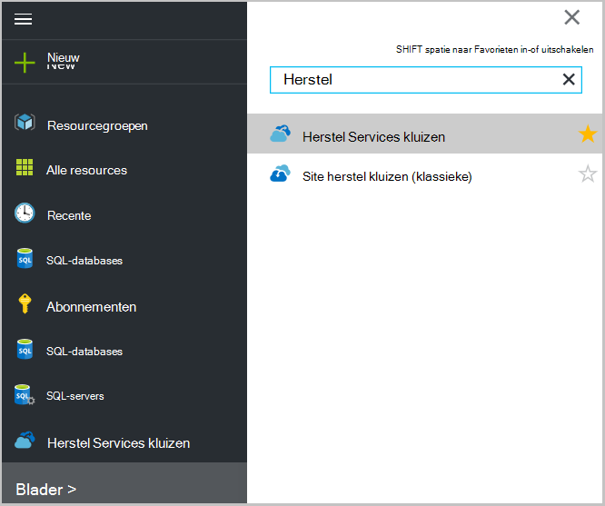 <br/>

2. Selecteer de naam van de kluis die u weergeven in de lijst wilt te openen van het blad herstel Services kluis dashboard.

    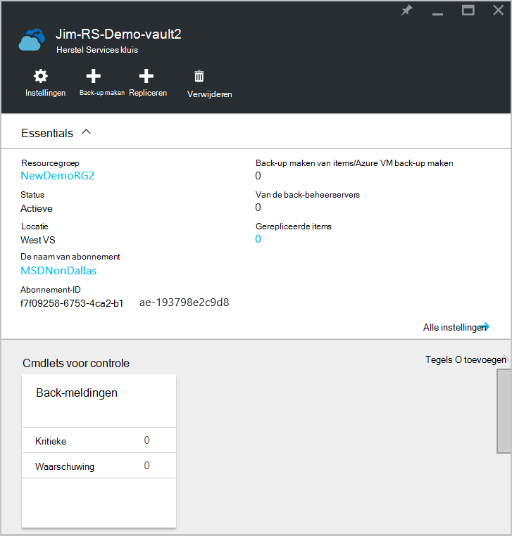 <br/>

## <a name="monitor-jobs-and-alerts"></a>Monitor taken en waarschuwingen
U kunt bewaken taken en meldingen van het herstelproces is Services kluis dashboard, waarin u ziet:

- Details van de back-meldingen
- Bestanden en mappen, evenals Azure virtuele machines beveiligd in de cloud
- Totale opslagcapaciteit verbruikt in Azure wordt aangegeven
- Status van back-uptaak

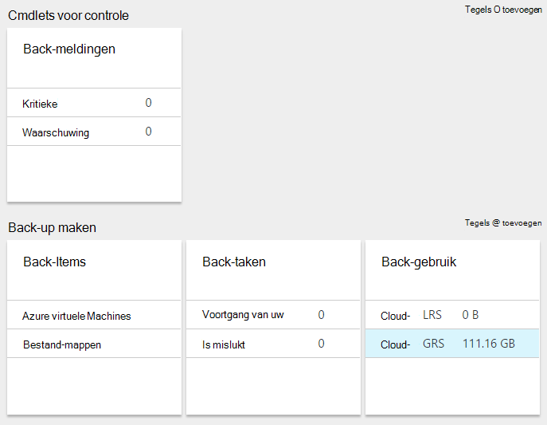

Te klikken op de informatie in elk van deze tegels, wordt het bijbehorende blad waar u verwante taken beheert geopend.

Vanaf de bovenkant van het Dashboard:

- Instellingen biedt toegang beschikbare back-taken.
- Back-up - Hiermee kunt u een back-up nieuwe bestanden en mappen (of Azure VMs) om de herstel-Services.
- DELETE - als een herstel services kluis niet meer wordt gebruikt, u kunt deze verwijderen om opslagruimte ruimte vrij te maken. Verwijderen is alleen beschikbaar nadat alle beveiligde servers zijn verwijderd uit de kluis.

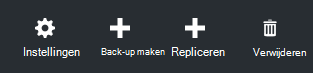
## <a name="alerts-for-backups-using-azure-backup-agent"></a>Waarschuwingen voor back-ups Azure met back-up maken van agent:
| Waarschuwingsniveau  | Waarschuwingen verzonden |
| ------------- | ------------- |
| Kritieke | Back-up is mislukt, herstel is mislukt  |
| Waarschuwing  | Back-up is voltooid met waarschuwingen (wanneer minder dan honderd bestanden niet back-up door problemen met beschadigde bestanden gemaakt worden en meer dan 1 miljoen bestanden worden doorverbonden back-up gemaakt)  |
| Informatie  | Geen  |
## <a name="manage-backup-alerts"></a>Back-up waarschuwingen beheren
Klik op de tegel van de **Back-up waarschuwingen** om te openen van het blad **Back-up meldingen** en waarschuwingen beheren.

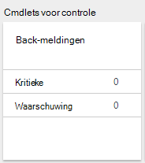

De tegel back-up waarschuwingen ziet u het aantal:

- kritieke waarschuwingen niet omgezet in de afgelopen 24 uur
- waarschuwing waarschuwingen niet omgezet in de afgelopen 24 uur

Klikken op elk van deze koppelingen Hiermee, gaat u naar het blad **Back-up waarschuwingen** met een gefilterde weergave van deze waarschuwingen (kritieke of waarschuwing).

Van het blad back-up-meldingen u:

- Kies de juiste gegevens wilt opnemen in uw waarschuwingen.

    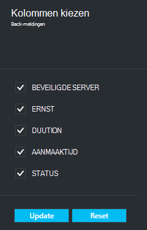

- Waarschuwingen voor ernst, status en begin/einde momenten filteren.

    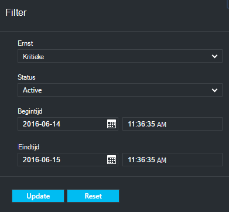

- Meldingen voor ernst, frequentie en geadresseerden configureren, evenals meldingen inschakelen of uitschakelen.

    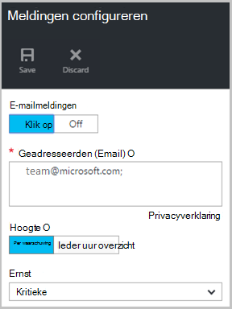

Als u **Per waarschuwing** is geselecteerd als de frequentie **Waarschuwen** wordt geen groepeer- of wilt verkleinen in e-mailberichten plaatsvindt. Een waarschuwing levert 1 melding. Dit is de standaardinstelling en het e-mailbericht resolutie ook onmiddellijk wordt verstuurd.

Als **Per uur overzicht** is geselecteerd als het **Waarschuwen** frequentie één e-mailbericht verzonden naar de gebruiker mededeling dat er niet opgelost nieuwe waarschuwingen in het laatste uur. Een resolutie van e-mailadres is verzonden aan het einde van het uur.

Voor de volgende niveaus kunnen waarschuwingen worden verzonden:

- kritieke
- Waarschuwing
- informatie

U de melding met de knop **inactief maken** in het blad van de details taak inactief maken. Wanneer u klikt op inactief maken, kunt u notities resolutie opgeeft.

U kiezen de kolommen die u wilt weergeven als onderdeel van de melding met de knop **Kies kolommen** .

>[AZURE.NOTE] Van het blad **Instellingen** u back-waarschuwingen beheren door in te schakelen **controle- en rapporten > waarschuwingen en gebeurtenissen > back-waarschuwingen** en klik vervolgens op **Filter** of **Meldingen configureren**te klikken.

## <a name="manage-backup-items"></a>Back-up-items beheren
Back-ups van on-premises implementatie beheren is nu beschikbaar in de beheerportal. Klik in de sectie back-up van het dashboard ziet de tegel **Back-Items** u het aantal back-items die zijn beveiligd om de.

Klik op **Bestand-mappen** in de tegel back-up-Items.

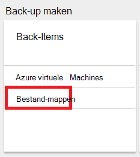

Het blad back-Items wordt geopend met het filter dat is ingesteld op bestand-map waarin u elke specifieke back-up item vermeld ziet.

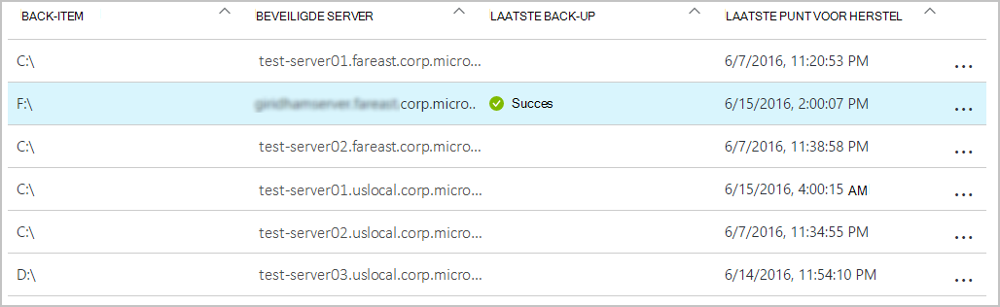

Als u een specifiek back-item uit de lijst selecteert, ziet u de essentiële details voor dat item.

>[AZURE.NOTE] Van het blad **Instellingen** u bestanden en mappen beheren door in te schakelen **beveiligde Items > back-up Items** en **- Mappen** te selecteren in de vervolgkeuzelijst.

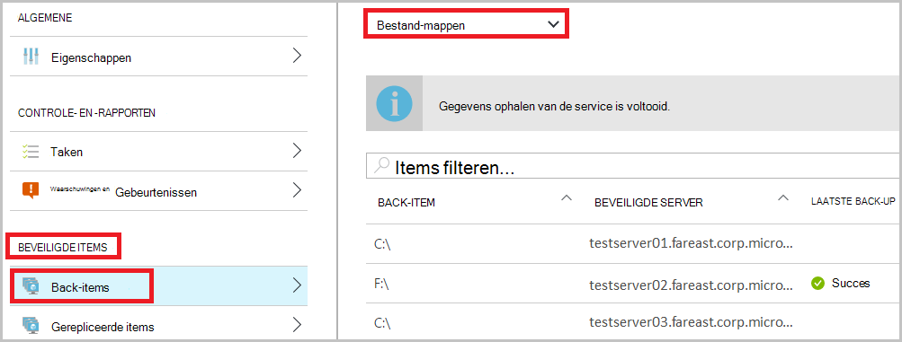

## <a name="manage-backup-jobs"></a>Back-up taken beheren
Back-up taken beide on-premises (wanneer de server on-premises implementatie is een back-up naar Azure) en Azure back-ups zijn zichtbaar in het dashboard.

Klik in de sectie back-up van het dashboard van ziet de tegel van de taak back-up u het aantal taken:

- voortgang van uw
- is mislukt in de afgelopen 24 uur.

Als u wilt uw back-taken beheren, klikt u op de tegel **Back-taken** , waarmee het blad back-taken worden geopend.

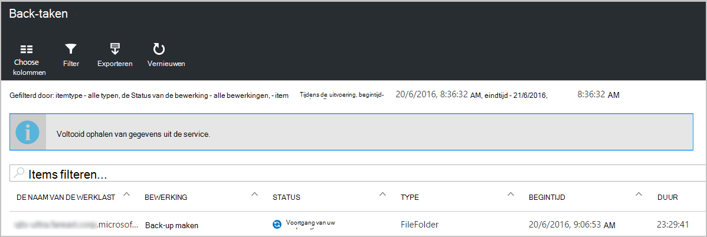

U wijzigen de informatie die beschikbaar zijn in het blad back-up-taken met de knop **Kies kolommen** aan de bovenkant van de pagina.

Gebruik de knop **Filter** om te selecteren tussen bestanden en mappen en Azure virtuele machines back-up.

Als u de back-ups van bestanden en mappen niet ziet, klik op de knop **Filter** boven aan de pagina en selecteer van **bestanden en mappen** in het menu itemtype.

>[AZURE.NOTE] Vanaf het blad **Instellingen** u back-taken beheren door in te schakelen **controle- en rapporten > taken > back-taken** en **- Mappen** te selecteren in de vervolgkeuzelijst.

## <a name="monitor-backup-usage"></a>Gebruik van de back-up controleren
In de sectie back-up van het dashboard weergegeven in de tegel van het gebruik van de back-up de opslag verbruikt in Azure wordt aangegeven. Gebruik van opslag is opgegeven voor:
- Gebruik van opslagruimte LRS die is gekoppeld aan de kluis cloud
- Gebruik van opslagruimte GRS die is gekoppeld aan de kluis cloud

## <a name="production-servers"></a>Productieservers
Als u wilt uw productieservers beheren, klikt u op **Instellingen**. Klik onder beheren op **back-up-infrastructuur > productieservers**.

De productieservers blade lijsten van alle beschikbare productieservers. Klik op een server in de lijst om de Serverdetails van de.

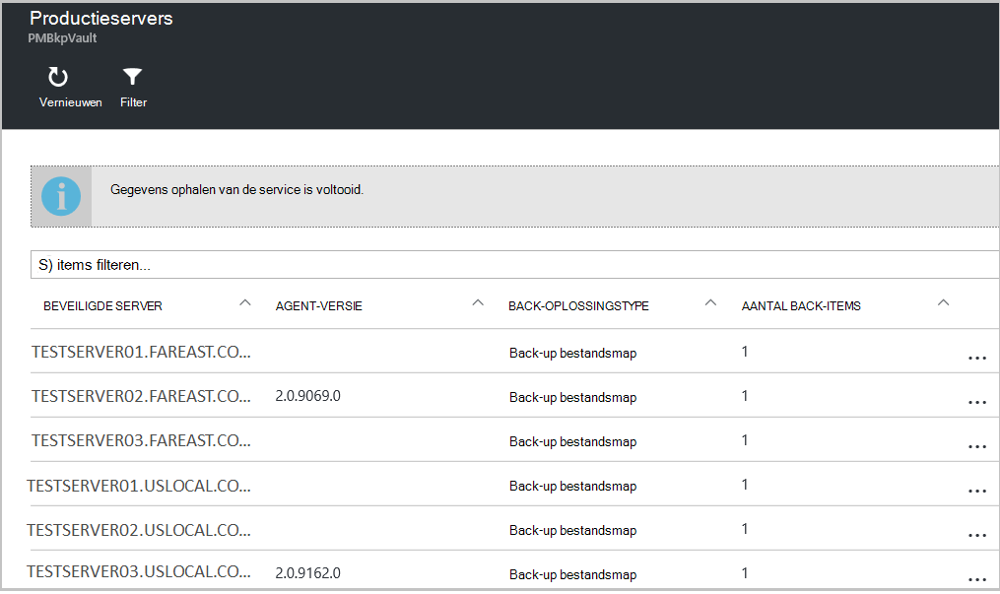

## <a name="microsoft-azure-backup-agent-tasks"></a>Back-up van Microsoft Azure-agent taken

## <a name="open-the-backup-agent"></a>Open de back-agent

Open de **back-up van Microsoft Azure-agent** (u zoeken naar deze via de computer voor *Back-up van Microsoft Azure*).


Uit de **Acties** die beschikbaar zijn aan de rechterkant van de back-agent-console uitvoeren u de volgende taken:

- Register-Server
- Back-up plannen
- Nu een back-Up maken
- De eigenschappen van wijzigen

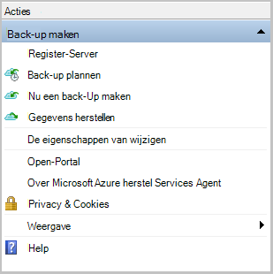

>[AZURE.NOTE] Zie [bestanden terugzetten naar een Windows server of Windows-clientcomputer](backup-azure-restore-windows-server.md)naar **Gegevens herstellen**.

## <a name="modify-an-existing-backup"></a>Een bestaande back-up wijzigen

1. Klik in de back-up van Microsoft Azure-agent op **Planning back-up**.

    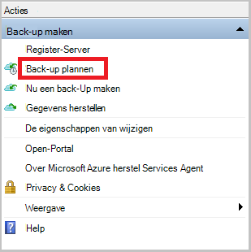

2. Klik in de **Wizard voor back-up van planning** laat het **aanbrengen van wijzigingen in de back-items of tijden** ingeschakeld en klik op **volgende**.

    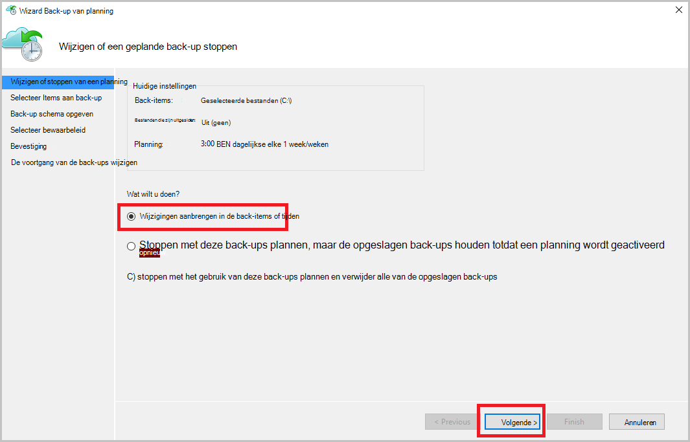

3. Als u wilt toevoegen of wijzigen van items, klikt u op het scherm **Items selecteren naar de back-up** op **Items toevoegen**.

    U kunt ook **Uitsluiting instellingen** instellen van deze pagina in de wizard. Als u wilt uitsluiten van bestanden of bestandstypen de procedure lezen voor het toevoegen van [uitsluiting-instellingen](#exclusion-settings).

4. Selecteer de bestanden en mappen die u wilt een back-up en klik op **OK**.

    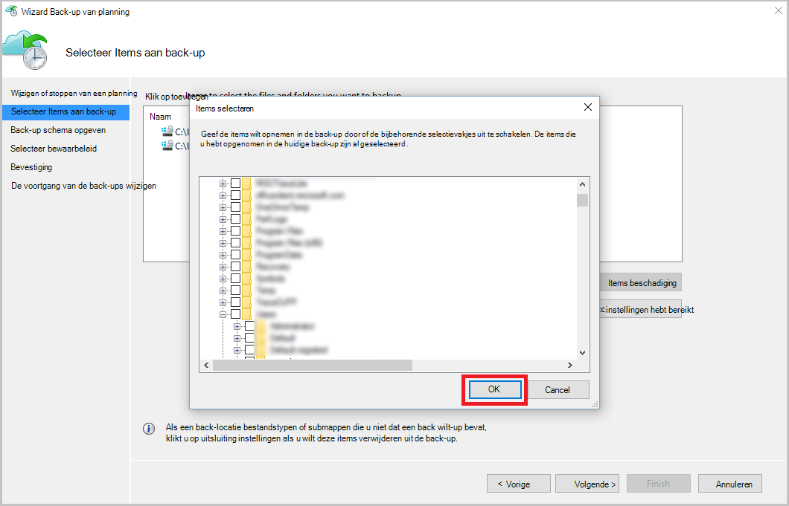

5. Geef de **back-ups plannen** en klik op **volgende**.

    U kunt dagelijks (bij maximaal 3 keer per dag) of wekelijkse back-ups plannen.

    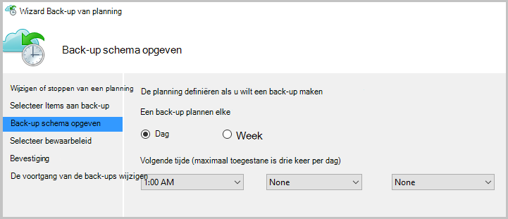

    >[AZURE.NOTE] Precisie van de back-planning is uitvoerig beschreven in dit [artikel](backup-azure-backup-cloud-as-tape.md).

6. Selecteer het **Bewaarbeleid** voor de back-up en klik op **volgende**.

    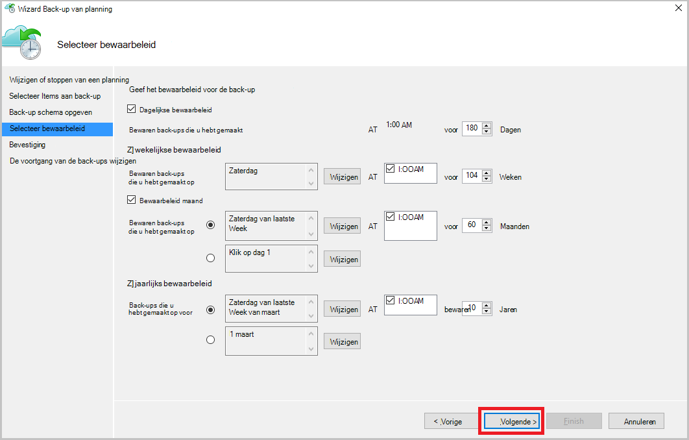

7. Controleer de gegevens en klik op **Voltooien**in **het bevestigingsvenster** .

8. Als de wizard is voltooid de **back-planning**maken, klikt u op **sluiten**.

    Na het wijzigen van beveiliging, kunt u bevestigen dat de back-ups correct zijn activeert door te gaan naar het tabblad **taken** en de acceptatie van dat wijzigingen worden doorgevoerd in de back-taken.

## <a name="enable-network-throttling"></a>Inschakelen netwerk beperken  
De back-up van Azure-agent biedt een Throttling tabblad kunt u aangeven hoe netwerkbandbreedte wordt gebruikt tijdens overdracht van gegevens. Dit besturingselement is handig als u een back moet-up gegevens tijdens de werkuren, maar niet wilt dat de back-proces voor het andere internetverkeer storen zijn. Gegevens beperken doorverbinden is van toepassing als u een back-up en herstellen van activiteiten.  

Inschakelen beperken:

1. In de **back-up-agent**, klikt u op **Eigenschappen wijzigen**.

2. Klik op het **tabblad beperken Selecteer **inschakelen internetbandbreedte beperken voor back-bewerkingen **.

    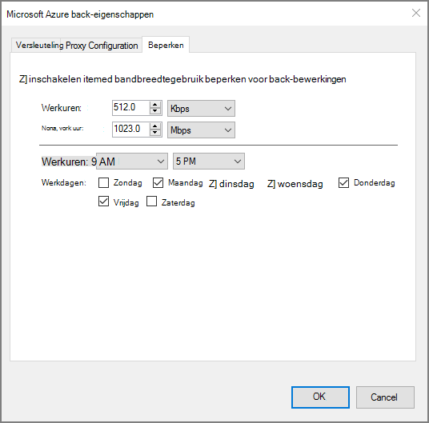

    Zodra u hebt ingeschakeld beperken, geeft u de toegestane bandbreedte voor back-ups van gegevens tijdens de **werkuren** en **niet - werkuren**.

    De waarden bandbreedte begint in 512 kB per seconde (k) en maximaal 1023 MB per (seconde) kunnen gaan. U kunt ook aanwijzen van de begindatum en einddatum voor **kantooruren**en welke dagen van de week worden beschouwd als werk dagen. De tijd buiten de aangewezen werkuren wordt beschouwd als niet-werkuren wordt.

3. Klik op **OK**.

## <a name="manage-exclusion-settings"></a>Uitsluiting instellingen beheren

1. Open de **back-up van Microsoft Azure-agent** (u kunt deze vinden door te zoeken van uw computer voor *Back-up van Microsoft Azure*).

    

2. Klik in de back-up van Microsoft Azure-agent op **Planning back-up**.

    

3. In de Wizard voor het back-up van planning laat het **aanbrengen van wijzigingen in de back-items of tijden** ingeschakeld en klik op **volgende**.

    

4. Klik op **uitsluitingen-instellingen**.

    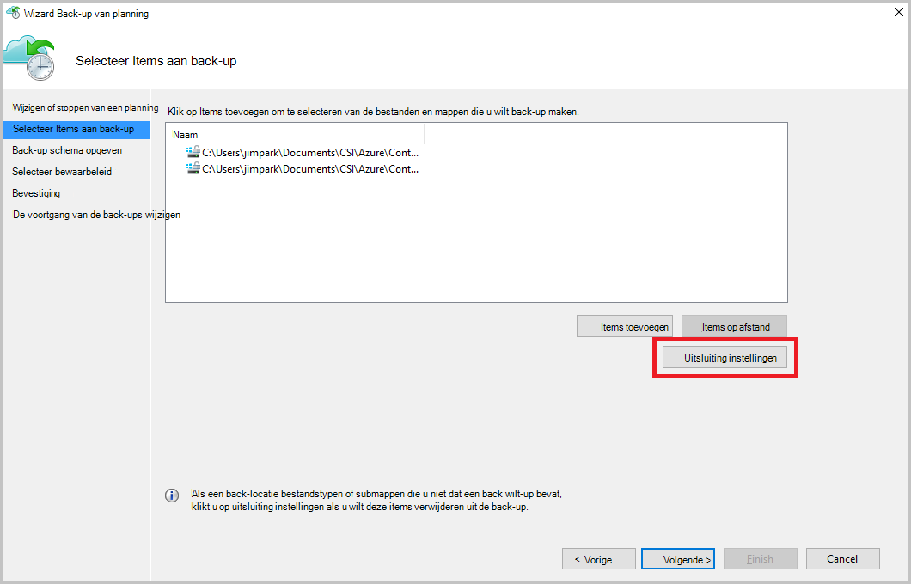

5. Klik op **uitsluiting toevoegen**.

    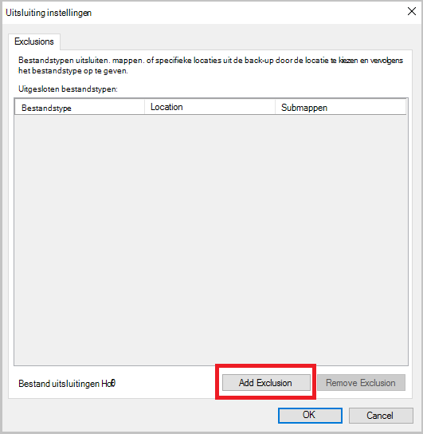

6. Selecteer de locatie en klik vervolgens op **OK**.

    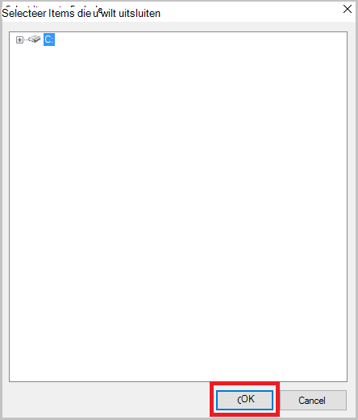

7. De bestandsextensie in het veld **Bestandstype** toevoegen.

    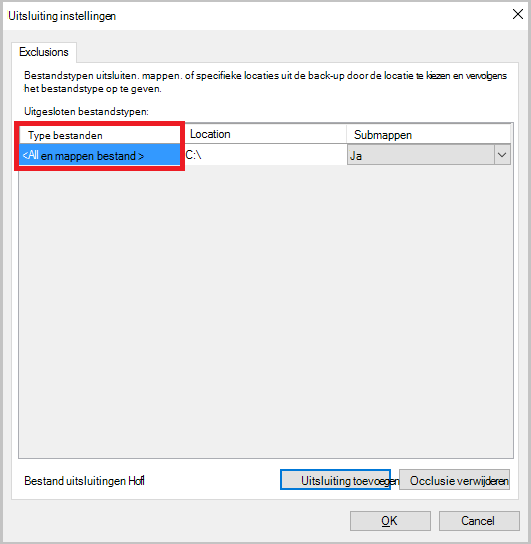

    Een MP3-uitbreiding toevoegen

    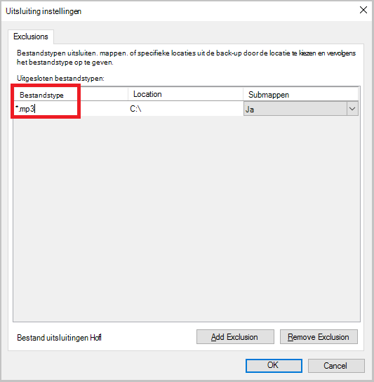

    Een andere extensie toevoegen en klikt u op **Uitsluiting toevoegen** voert u een ander bestandstype (toe te voegen extensie .jpeg).

    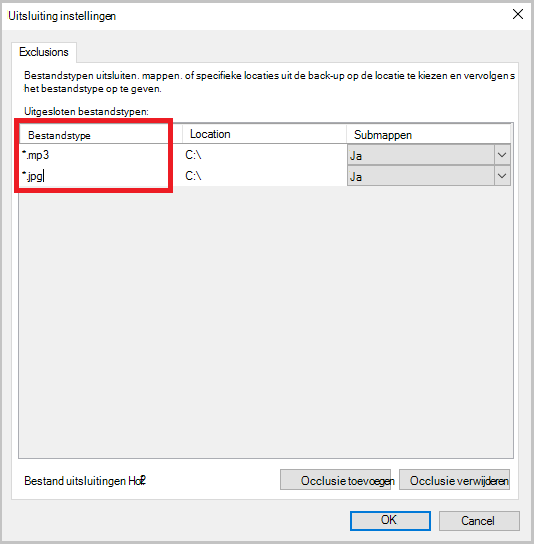

8. Als u alle het selectievakje extensies hebt toegevoegd, klikt u op **OK**.

9. Ga verder met de Wizard van de back-up planning door te klikken op **volgende** tot de **pagina bevestigen**en klik op **Voltooien**.

    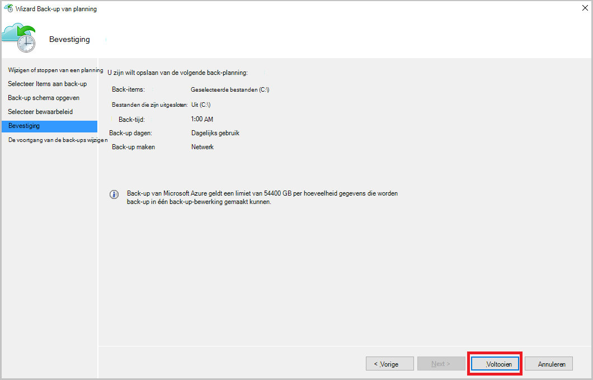

## <a name="frequently-asked-questions"></a>Veelgestelde vragen
**Q1. De status van de back-uptaak ziet als voltooid in de Azure back-up-agent, waarom niet deze ophalen onmiddellijk weergegeven in de portal?**

A1. Er is op maximale vertraging van 15 minuten tussen de status van back-uptaak doorgevoerd in de Azure back-agent en de Azure-portal.

**Q.2 wanneer een back-uptaak mislukt, hoe lang duurt een waarschuwing verhogen?**

Een waarschuwing A.2 wordt verheven binnen 20 minuten van de Azure back-fout.

**Q3. Is er een zaak waarin een e-mailbericht niet verzonden als meldingen zijn geconfigureerd?**

A3. Hieronder vindt u de gevallen waarin de melding niet wordt verzonden om te kunnen ruis uit de waarschuwing:

   - Als u meldingen per uur zijn geconfigureerd en een melding wordt ingediend en opgelost binnen het uur
   - Taak wordt geannuleerd.
   - Tweede back-uptaak is mislukt omdat het oorspronkelijke back-uptaak wordt uitgevoerd.

## <a name="troubleshooting-monitoring-issues"></a>Problemen met controle oplossen

**Probleem:** Taken en/of de meldingen van de back-up van Azure-agent worden niet weergegeven in de portal.

**Stappen voor probleemoplossing:** Het proces, ```OBRecoveryServicesManagementAgent```, de gegevens van de taak en een melding verzonden naar de back-up van Azure-service. Af en toe dit proces kan worden hangen of afsluiten.

1. Als u wilt controleren of het proces niet wordt uitgevoerd, open **Taakbeheer** en controleren als de ```OBRecoveryServicesManagementAgent``` proces wordt uitgevoerd.

2. Ervan uitgaande dat het proces niet actief is, open **Het Configuratiescherm** en bladert u de lijst met services. Starten of opnieuw starten van **Microsoft Azure herstel Services Management Agent**.

    Blader door de logboeken aan voor meer informatie:<br/>
`<AzureBackup_agent_install_folder>\Microsoft Azure Recovery Services Agent\Temp\GatewayProvider*`. Bijvoorbeeld:<br/> `C:\Program Files\Microsoft Azure Recovery Services Agent\Temp\GatewayProvider0.errlog`.

## <a name="next-steps"></a>Volgende stappen
- [Windows Server of Windows-Client herstellen van Azure](backup-azure-restore-windows-server.md)
- Meer informatie over back-up van Azure, Zie [Azure back-up-overzicht](backup-introduction-to-azure-backup.md)
- Bezoek de [Azure back-Forum](http://go.microsoft.com/fwlink/p/?LinkId=290933)
