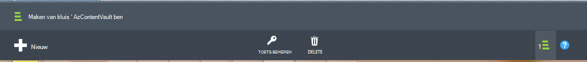

<properties
  pageTitle="Voorbereiden van uw omgeving back-up werkbelasting met Azure back-up-Server | Microsoft Azure"
  description="Controleer of dat uw omgeving is goed voorbereid back-up werkbelasting Azure back-up-Server gebruiken"
  services="backup"
  documentationCenter=""
  authors="pvrk"
  manager="shivamg"
  editor=""
  keywords="Azure back-server. back-kluis"/>

<tags
  ms.service="backup"
  ms.workload="storage-backup-recovery"
  ms.tgt_pltfrm="na"
  ms.devlang="na"
  ms.topic="article"
  ms.date="08/22/2016"
  ms.author="jimpark;trinadhk;pullabhk; markgal"/>

# <a name="preparing-to-back-up-workloads-using-azure-backup-server"></a>Back-up werkbelasting met Azure back-up Server voorbereiden

> [AZURE.SELECTOR]
- [Azure back-Server](backup-azure-microsoft-azure-backup.md)
- [SCDPM](backup-azure-dpm-introduction.md)
- [Azure back-Server (klassieke)](backup-azure-microsoft-azure-backup-classic.md)
- [SCDPM (klassieke)](backup-azure-dpm-introduction-classic.md)


In dit artikel gaat over het voorbereiden van uw omgeving back-up werkbelasting met Azure back-up-Server. Met Azure back-up-Server, kunt u de werkbelasting toepassing zoals Hyper-V VMs, Microsoft SQL Server, SharePoint-Server, Microsoft Exchange en Windows-clients beveiligen tegen één console.

>[AZURE.WARNING] Azure back-Server krijgt de functionaliteit van Data Protection Manager (DPM) voor werkbelasting back-up. U vindt u verwijzingen naar DPM documentatie voor sommige van deze mogelijkheden. Echter Azure back-up-Server biedt geen beveiliging op band of integreren met System Center.

## <a name="1-windows-server-machine"></a>1. Windows Server-computer


De eerste stap richting van de back-up-Server Azure slag is dat een computer met Windows Server.

| Locatie | Minimumvereisten | Aanvullende instructies |
| -------- | -------------------- | ----------------------- |
| Azure | Azure IaaS virtuele machines<br><br>A2 Standaard: 2 cores, 3,5 GB RAM | U kunt beginnen met een eenvoudige afbeelding van Windows Server 2012 R2 Datacenter. [IaaS beveiligen werkbelasting met Azure back-up-Server (DPM)](https://technet.microsoft.com/library/jj852163.aspx) heeft vele nuances bevatten. Zorg ervoor dat u het artikel volledig lezen voordat de computer wordt geïmplementeerd. |
| On-premises implementatie | VM Hyper-V,<br> VM VMWare,<br> of een fysieke host<br><br>2 cores en 4GB RAM | U kunt de DPM-opslag met Windows Server Deduplication deduplicate. Meer informatie over hoe [DPM en deduplication](https://technet.microsoft.com/library/dn891438.aspx) samenwerken wanneer geïmplementeerd in Hyper-V VMs. |

> [AZURE.NOTE] Het wordt aanbevolen dat Azure back-up-Server zijn geïnstalleerd op een computer met Windows Server 2012 R2 Datacenter. Een groot aantal de vereisten vallen automatisch met de meest recente versie van de Windows-besturingssysteem.

Als u van plan bent om deze server te koppelen aan een domein op een gegeven moment, is het aanbevolen dat de activiteit lid worden van een domein worden uitgevoerd voordat u de installatie van Azure back-up-Server. Een bestaande Azure back-up-servercomputer verplaatsen naar een nieuw domein na implementatie *niet ondersteund wordt*.

## <a name="2-backup-vault"></a>2. back-kluis


Of u een back-upgegevens naar Azure verzenden of lokaal behouden, moet de software niet worden verbonden met Azure. Meer specifieke, de back-Server Azure-machine moet worden geregistreerd met een back-kluis.

Een back-kluis maken:

1. Meld u aan bij de [beheerportal](http://manage.windowsazure.com/).

2. Klik op **nieuwe** > **gegevensservices** > **herstel Services** > **back-kluis** > **snel tabellen maken**. Als u meerdere abonnementen die is gekoppeld aan uw organisatie-account hebt, kiest u het juiste abonnement om te koppelen aan de back-kluis.

3. Voer in het vak **naam**een beschrijvende naam voor de kluis. Dit moet uniek zijn voor elk abonnement.

4. Selecteer in de **regio**, de geografische regio voor de kluis. Van de kluis regio is meestal gekozen op basis van gegevens te garanderen of netwerk latentie beperkingen.

    

5. Klik op **maken kluis**. Het kan even duren voordat de back-kluis moet worden gemaakt. Controleer de statusmeldingen onderaan in de portal.

    

6. Een bericht wordt bevestigd dat de kluis is gemaakt en deze wordt weergegeven op de pagina herstel Services als actief.
    

  > [AZURE.IMPORTANT] Zorg ervoor dat de juiste opslag redundantie optie wordt gekozen nadat de kluis is gemaakt. Meer informatie over [geografische-redundante](../storage/storage-redundancy.md#geo-redundant-storage) en [lokaal overtollige](../storage/storage-redundancy.md#locally-redundant-storage) opties in dit [Overzicht](../storage/storage-redundancy.md).


## <a name="3-software-package"></a>3. software-pakket


### <a name="downloading-the-software-package"></a>Het softwarepakket downloaden

Net zoals bij kluis referenties, kunt u Microsoft Azure back-ups voor downloaden werkbelasting van toepassingen uit de **Werkbalk Snel startpagina** van de back-kluis.

1. Klik op **voor de toepassing werkbelasting (schijf naar schijf naar Cloud)**. Hiermee gaat u naar de pagina Downloadcentrum vanaf waar het softwarepakket kan worden gedownload.

    

2. Klik op **downloaden**.

    

3. Selecteer alle bestanden en klik op **volgende**. Download alle bestanden die afkomstig zijn uit de downloadpagina van Microsoft Azure back-up- en plaats alle bestanden in dezelfde map.


    Aangezien de downloadgrootte van alle bestanden die samen > 3G, klikt u op een 10Mbps download koppeling die het duurt maximaal 60 minuten voor het downloaden om te voltooien.


### <a name="extracting-the-software-package"></a>De softwarepakket ophalen

Nadat u alle bestanden hebt gedownload, klikt u op **MicrosoftAzureBackupInstaller.exe**. Hiermee start u de **Wizard Setup van Microsoft Azure back-up maken** als u wilt extraheren van de setup-bestanden naar een door u opgegeven locatie. Doorloop de wizard en klik op de knop **extraheren** om te beginnen met de extractie van.

> [AZURE.WARNING] Ten minste 4GB beschikbare ruimte is vereist voor het extraheren van de setup-bestanden.


Zodra de extractie van proces voltooid, schakel het selectievakje in als u wilt starten de vers opgehaalde *setup.exe* om te beginnen met de installatie van Microsoft Azure back-up-Server en klik op de knop **Voltooien** .

### <a name="installing-the-software-package"></a>Het softwarepakket installeren

1. Klik op **Microsoft Azure back-up maken** om de installatiewizard te starten.

    

2. Klik op de knop **volgende** op het beginscherm. Hiermee gaat u naar de sectie *Vereiste Hiermee wordt gecontroleerd* . Klik op dit scherm op de knop **controleren** om te bepalen als de hardware en software vereisten voor Azure back-up-Server is voldaan. Als alle vereisten is voldaan is, ziet u een bericht dat aangeeft dat de computer aan de vereisten voldoet. Klik op de knop **volgende** .

    

3. Microsoft Azure back-up-Server vereist SQL Server Standard en het installatiepakket Azure back-up-Server wordt geleverd met de juiste SQL Server-binaire bestanden die nodig zijn. Bij het starten met een nieuwe back-up-Server Azure-installatie, moet u Kies de optie **Installeren nieuw exemplaar van SQL Server met deze instellingen** en klik op de knop **controleren en te installeren** . Zodra de vereisten zijn geïnstalleerd, klikt u op **volgende**.

    

    Als een fout met een aanbeveling om de computer opnieuw te starten optreedt, doen en klikt u op **Opnieuw controleren**.

    > [AZURE.NOTE] Azure back-up-Server werkt niet met een externe SQL Server-instantie. Het exemplaar dat wordt gebruikt door Azure back-up-Server moet lokale.

4. Een locatie voor de installatie van Microsoft Azure back-up-serverbestanden en klik op **volgende**.

    

    Het kladgebied locatie is vereist voor back-ups Azure maken. Controleer of het kladgebied locatie ten minste 5% van de gegevens die is gepland voor worden back-up gemaakt in de cloud. Voor de bescherming van de schijf moeten afzonderlijke schijven worden geconfigureerd nadat de installatie is voltooid. Zie voor meer informatie over de opslag van toepassingen [configureren opslagpools en opslagruimte op een schijf](https://technet.microsoft.com/library/hh758075.aspx).

5. Een sterk wachtwoord voor beperkte lokale gebruikersaccounts en klik op **volgende**.

    

6. Selecteer of u wilt gebruiken van *Microsoft Update* om te controleren op updates en klik op **volgende**.

    >[AZURE.NOTE] Het is raadzaam om met Windows Update omgeleid naar de Microsoft Update, die beveiligings- en belangrijke updates voor Windows en andere producten zoals Microsoft Azure back-up-Server biedt.

    

7. Bekijk het *Overzicht van instellingen* en klik op **installeren**.

    

8. De installatie, gebeurt in fasen. In de eerste fase is op de server de Microsoft Azure herstel Services-Agent geïnstalleerd. De wizard controleert ook op Internet connectivity. Als de internetverbinding is beschikbaar kunt u doorgaan met de installatie, zo niet, moet u de details proxy om verbinding met Internet te leveren.

    De volgende stap is de Agent met Microsoft Azure herstel-Services configureren. U moet als onderdeel van de configuratie, bieden dat u bent de referenties kluis registreren van de computer om de back-up. U krijgt ook een wachtwoordzin als u wilt de gegevens die zijn verzonden tussen Azure en uw lokale versleutelen/ontsleutelen. U kunt automatisch een wachtwoordzin genereren, of u kunt uw eigen minimale 16 tekens wachtwoordzin opgeven. Ga door met de wizard totdat de-agent is geconfigureerd.

    

9. Zodra de registratie van de back-up van Microsoft Azure-server is uitgevoerd, is de algehele installatiewizard gaat door naar de installatie en configuratie van SQL Server en de onderdelen van de Azure back-up-Server. Zodra de installatie van SQL Server onderdeel is voltooid, wordt de back-up-Server Azure-onderdelen zijn geïnstalleerd.

    


Wanneer de installatiestap is voltooid, wordt pictogrammen op het bureaublad van het product gemaakt als u ook. Dubbelklik op het pictogram om het product te starten.

### <a name="add-backup-storage"></a>Back-opslag toevoegen

De eerste back-up wordt op opslag die zijn bijgevoegd bij de back-Server Azure-machine bewaard. Zie voor meer informatie over het toevoegen van schijven [configureren opslagpools en opslagruimte op een schijf](https://technet.microsoft.com/library/hh758075.aspx).

> [AZURE.NOTE] U moet toevoegen van back-up opslaan, zelfs als u van plan bent om gegevens te sturen naar Azure. De back-Azure kluis bevat de *tweede* kopie van de gegevens in de huidige architectuur van Azure back-Server, terwijl de lokale opslag de eerste (en verplicht) back-up bevat.  

## <a name="4-network-connectivity"></a>4. netwerkconnectiviteit


Azure back-up-Server is connectiviteit vereist met de back-up van Azure-service voor het product goed werken. Als u wilt controleren of de computer de connectiviteit met Azure heeft, gebruikt u de ```Get-DPMCloudConnection``` commandlet in de Azure back-up Server PowerShell-console. Als de uitvoer van de commandlet waar is en vervolgens connectivity bestaat, wat er geen verbinding is.

Tegelijkertijd moet het abonnement dat Azure in orde zijn. De status van uw abonnement nagaan en als u wilt beheren, moet u zich aanmelden bij de [portal van abonnement]( https://account.windowsazure.com/Subscriptions).

Zodra u weet dat de status van de Azure connectiviteit en het Azure abonnement, kunt u de onderstaande tabel om vast te stellen de invloed op de functionaliteit back-up/herstellen.

| Connectiviteit staat | Azure-abonnement | Back-up Azure| Back-up op schijf | Herstellen van Azure | Vanaf schijf herstellen |
| -------- | ------- | --------------------- | ------------------- | --------------------------- | ----------------------- |
| Verbonden | Actieve | Toegestaan | Toegestaan | Toegestaan | Toegestaan |
| Verbonden | Verlopen | Gestopt | Gestopt | Toegestaan | Toegestaan |
| Verbonden | Opgeheven | Gestopt | Gestopt | Gestopt en Azure herstel punten verwijderd | Gestopt |
| Verloren connectivity > 15 dagen | Actieve | Gestopt | Gestopt | Toegestaan | Toegestaan |
| Verloren connectivity > 15 dagen | Verlopen | Gestopt | Gestopt | Toegestaan | Toegestaan |
| Verloren connectivity > 15 dagen | Opgeheven | Gestopt | Gestopt |  Gestopt en Azure herstel punten verwijderd | Gestopt |

### <a name="recovering-from-loss-of-connectivity"></a>Verlies van connectivity herstellen
Als u een firewall of proxy waardoor access naar Azure hebt, moet u "witte" lijst de volgende domein-adressen in de firewall/proxy-profiel:

- www.msftncsi.com
- \*. Microsoft.com
- \*. WindowsAzure.com
- \*. microsoftonline.com
- \*. windows.net

Zodra connectiviteit met Azure is hersteld naar de Azure back-up-Server, wordt de bewerkingen die kunnen worden uitgevoerd worden bepaald door de stand Azure-abonnement. De bovenstaande tabel heeft meer informatie over de bewerkingen die zijn toegestaan zodra de computer 'verbonden is'.

### <a name="handling-subscription-states"></a>Verwerking van abonnement provincies

Het is mogelijk een Azure-abonnement na een status *vervallen* of *Deprovisioned* naar de *actieve* status kunt tillen. Echter heeft dit sommige consequenties op het gedrag van het product terwijl de status niet *actief*is:

- Een abonnement *Deprovisioned* verlies van functionaliteit voor de periode dat deze wordt opgeheven. Over het *actieve*, is de functionaliteit van het product van back-up/herstellen verwijderd. De back-upgegevens op de lokale schijf kan ook worden opgehaald als deze is gehouden met een groot genoeg bewaarperiode. De back-upgegevens in Azure is echter onherstelbaar verloren wanneer het abonnement overgaat naar de status *Deprovisioned* .
- Een *verlopen* abonnement verliest alleen de functionaliteit voor totdat deze heeft aangebracht *actieve* opnieuw. Een back-ups weergegeven die is gepland voor de periode dat het abonnement *verlopen is* , wordt niet uitgevoerd.


## <a name="troubleshooting"></a>Problemen oplossen

Als Microsoft Azure back-server mislukt met fouten tijdens de installatiefase (of back-up of herstellen), raadpleegt u dit [foutbericht codes document](https://support.microsoft.com/kb/3041338) voor meer informatie.
U kunt ook verwijzen naar de [dat back-up van Azure gerelateerd Veelgestelde vragen](backup-azure-backup-faq.md)


## <a name="next-steps"></a>Volgende stappen

U gaat gedetailleerde informatie over het [voorbereiden van uw omgeving voor DPM](https://technet.microsoft.com/library/hh758176.aspx) op de Microsoft TechNet-site. Het bevat ook informatie over ondersteunde configuraties waarop Azure back-up-Server kan worden geïmplementeerd en gebruikt.

U kunt deze artikelen krijgen een beter begrip van de beveiliging van de werkbelasting met Microsoft Azure back-up-server.

- [Back-up van SQL Server](backup-azure-backup-sql.md)
- [Back-up van SharePoint server](backup-azure-backup-sharepoint.md)
- [Alternatieve server back-up maken](backup-azure-alternate-dpm-server.md)
