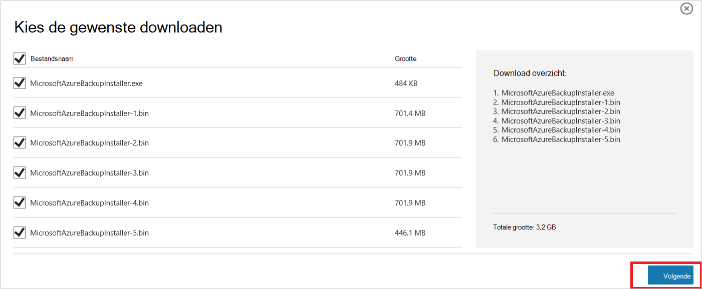
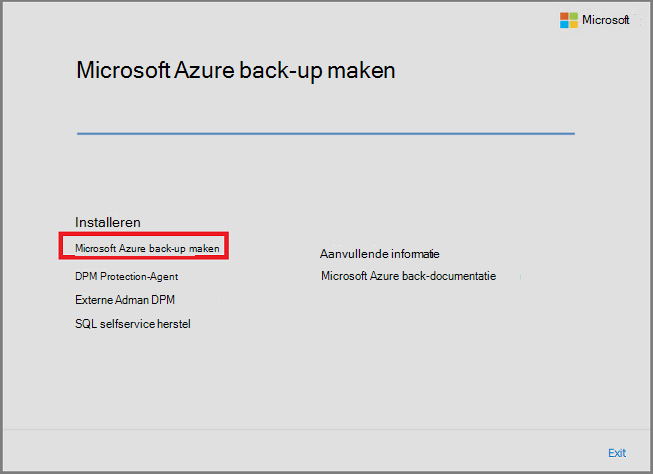
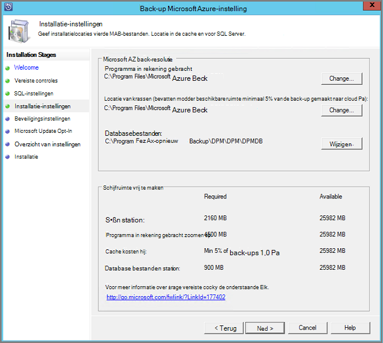
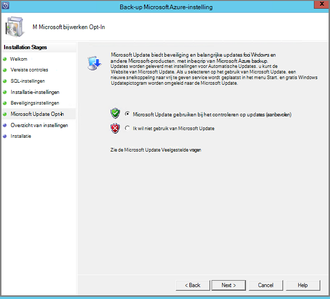
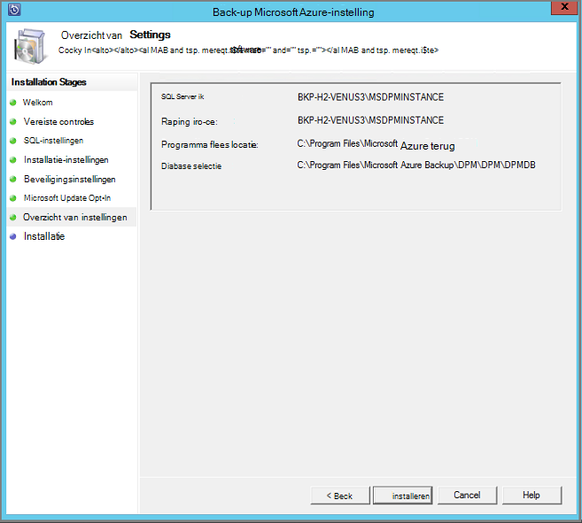
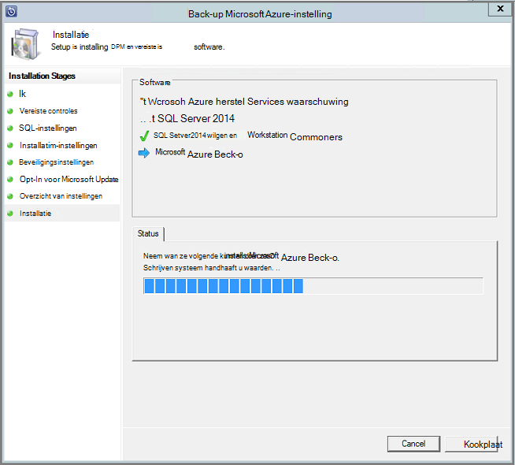

<properties
  pageTitle="Voorbereiden van uw omgeving back-up werkbelasting met Azure back-up-Server | Microsoft Azure"
  description="Het voorbereiden van uw omgeving met Azure back-up-Server kunt beveiligen of een back-up werkbelasting."
  services="backup"
  documentationCenter=""
  authors="PVRK"
  manager="shivamg"
  editor=""
  keywords="Azure back-server. werkbelasting; beveiligen een back-up werkbelasting"/>

<tags
  ms.service="backup"
  ms.workload="storage-backup-recovery"
  ms.tgt_pltfrm="na"
  ms.devlang="na"
  ms.topic="article"
  ms.date="09/27/2016"
  ms.author="jimpark;trinadhk;pullabhk;markgal"/>

# <a name="preparing-to-back-up-workloads-using-azure-backup-server"></a>Back-up werkbelasting met Azure back-up Server voorbereiden

> [AZURE.SELECTOR]
- [Azure back-Server](backup-azure-microsoft-azure-backup.md)
- [SCDPM](backup-azure-dpm-introduction.md)
- [Azure back-Server (klassieke)](backup-azure-microsoft-azure-backup-classic.md)
- [SCDPM (klassieke)](backup-azure-dpm-introduction-classic.md)

In dit artikel wordt uitgelegd hoe u het voorbereiden van uw omgeving back-up werkbelasting met Azure back-up-Server. Met Azure back-up-Server, kunt u de werkbelasting toepassing zoals Hyper-V VMs, Microsoft SQL Server, SharePoint-Server, Microsoft Exchange en Windows-clients beveiligen tegen één console. U kunt ook gegevens op een server (IaaS)-werkbelastingen, zoals VMs in Azure beveiligen.

> [AZURE.NOTE] Azure heeft twee implementatiemodellen voor het maken en werken met resources: [resourcemanager en klassiek](../resource-manager-deployment-model.md). In dit artikel vindt u de informatie en procedures voor het herstellen van VMs met behulp van het model resourcemanager geïmplementeerd.

Azure back-Server krijgt veel van de functionaliteit voor het back-up van werkbelasting uit Data Protection Manager (DPM). In dit artikel bevat koppelingen naar DPM documentatie uitleg over enkele van de gedeelde functionaliteit. Azure back-up Server deelt Hoewel veel van dezelfde functionaliteit als DPM. Azure back-up-Server niet een back-up op tape, noch heeft deze integreren met System Center.

## <a name="1-choose-an-installation-platform"></a>1. een installatieplatform kunt kiezen

De eerste stap richting van de back-up-Server Azure slag is voor het instellen van een Windows-Server. Uw server kan worden in Azure of on-premises implementatie.

### <a name="using-a-server-in-azure"></a>Gebruik van een server in Azure

Bij het kiezen van een server voor het uitvoeren van Azure back-up-Server, wordt het wordt aanbevolen begint u met een afbeelding van Windows Server 2012 R2 Datacenter. Het artikel [uw eerste virtuele Windows-computer in de portal van Azure maken](..\virtual-machines\virtual-machines-windows-hero-tutorial.md), bevat een zelfstudie voor aan de slag met de aanbevolen virtuele machine in Azure wordt aangegeven, zelfs als u Azure voordat u nooit hebt gebruikt. De aanbevolen minimale vereisten voor de server virtuele machine (VM) moeten zijn: standaard A2 2 cores en 3,5 GB RAM.

Werkbelasting met Azure back-up-Server te beveiligen, heeft vele nuances bevatten. Het artikel, [DPM installeren als een Azure virtuele machines](https://technet.microsoft.com/library/jj852163.aspx), helpt uitleggen deze nuances bevatten. Lees dit artikel volledig voordat het implementeren van de computer.

### <a name="using-an-on-premises-server"></a>Een on-premises implementatie-server gebruiken

Als u niet het grondtal server wordt uitgevoerd in Azure wordt aangegeven wilt, kunt u de server wordt uitgevoerd op een VM Hyper-V, een VM VMware of een fysieke host. De aanbevolen minimale vereisten voor de serverhardware zijn 2 cores en 4 GB RAM. De ondersteunde besturingssystemen worden vermeld in de volgende tabel.

| Besturingssysteem        | Platform           | SKU  |
| :------------- |-------------| :-----|
|Windows Server 2012 R2 en de meest recente SP 's| 64-bits| Standaard, Datacenter, Foundation|
|Windows Server 2012 en de meest recente SP 's|    64-bits| Datacenter, Foundation, standaard|
|Windows Storage Server 2012 R2 en de meest recente SP 's  |64-bits|    Standaard, werkgroep|
|Windows-opslag Server 2012 en de meest recente SP 's |64-bits |Standaard, werkgroep|


U kunt de DPM-opslag met Windows Server Deduplication deduplicate. Meer informatie over hoe [DPM en deduplication](https://technet.microsoft.com/library/dn891438.aspx) samenwerken wanneer geïmplementeerd in Hyper-V VMs.

> [AZURE.NOTE]  U kunt Azure back-up-Server niet installeren op een computer die als een domeincontroller.

U moet Azure back-up-Server toevoegen aan een domein. Als u van plan bent de server verplaatsen naar een ander domein, is het aanbevolen dat u deelneemt aan de server naar het nieuwe domein voordat u Azure back-up-Server installeert. Een bestaande Azure back-up-servercomputer verplaatsen naar een nieuw domein na implementatie *niet ondersteund wordt*.

## <a name="2-recovery-services-vault"></a>2. herstel Services kluis

Of u een back-upgegevens naar Azure verzenden of lokaal behouden, moet de software niet worden verbonden met Azure. Meer specifieke, de servercomputer Azure back-up moet worden geregistreerd met een herstel services kluis.

Een herstel services kluis maken:

1. Meld u aan bij de [portal van Azure](https://portal.azure.com/).

2. Klik in het menu Hub klikt u op **Bladeren** en typ in de lijst met resources, **Herstel Services**. Als u te typen begint, de lijst worden gefilterd op basis van uw invoer. Klik op **Services herstel kluis**.

     <br/>

    De lijst met Services herstel kluizen wordt weergegeven.

3. Klik in het menu **kluizen herstel Services** op **toevoegen**.

    

    Het herstelproces is Services kluis blad wordt geopend, waarin u een **naam**, het **abonnement**, de **resourcegroep**en de **locatie**op te geven.

    

4. Voer een beschrijvende naam voor de kluis voor de **naam**. De naam moet uniek zijn voor het Azure abonnement. Typ een naam die tussen 2 en 50 tekens bevat. Er moet beginnen met een letter en mogen alleen letters, cijfers en afbreekstreepjes.

5. Klik op **abonnement** als u wilt zien van de lijst beschikbare van abonnementen. Als u niet zeker weet welk abonnement te gebruiken, gebruik de standaardwaarde (of voorgesteld) abonnement. Er zijn meerdere keuzemogelijkheden alleen als uw organisatie-account gekoppeld aan meerdere Azure abonnementen is.

6. **Resourcegroep** als u wilt zien van de lijst beschikbare van resourcegroepen op of klik op **Nieuw** om een nieuwe resourcegroep te maken. Zie [overzicht van de Azure resourcemanager](../azure-resource-manager/resource-group-overview.md) voor volledige informatie over Resource-groepen

7. Klik op **locatie** als het geografische gebied voor de kluis wilt selecteren.

8. Klik op **maken**. Het kan even duren voordat de kluis herstel Services moet worden gemaakt. Controleer de statusmeldingen in het bovenste rechter gebied in de portal.
Nadat uw kluis is gemaakt, wordt het geopend in de portal.

### <a name="set-storage-replication"></a>Instellen opslag replicatie

De opslagruimte replicatie-optie kunt u kiezen tussen geografische-redundante opslag en lokaal redundante opslag. Standaard is uw kluis geografische-redundante opslag. Laat de optie die is ingesteld op geografische-redundante opslag als dit de primaire back-up is. Kies lokaal redundante opslag als u wilt een goedkoper optie die niet helemaal als duurzame. Meer informatie over [geografische-redundante](../storage/storage-redundancy.md#geo-redundant-storage) en [lokaal overtollige](../storage/storage-redundancy.md#locally-redundant-storage) opslagopties voor in de [opslag van Azure replicatie-overzicht](../storage/storage-redundancy.md).

De instelling van de herhaling opslag bewerken:

1. Selecteer uw kluis om het dashboard kluis en het blad instellingen te openen. Als het blad **Instellingen** niet wordt geopend, klikt u op **alle instellingen** in het dashboard kluis.

2. Klik op het blad **Instellingen** op **Back-up-infrastructuur** > **Configuratie van de back-up** openen van het blad **Back-up-configuratie** . Klik op het blad **Back-up-configuratie** , kies de optie voor het herhaling van opslagruimte voor uw kluis.

    

    Kies de optie opslagruimte voor uw kluis en bent u klaar voor de VM koppelen aan de kluis. U moet eerst de koppeling, ontdekken en registreren van de Azure virtuele machines.

## <a name="3-software-package"></a>3. software-pakket

### <a name="downloading-the-software-package"></a>Het softwarepakket downloaden
1. Meld u aan bij de [portal van Azure](https://portal.azure.com/).

2. Als u al een herstel Services kluis geopend, gaat u verder met stap 3. Als u een herstel Services kluis openen niet heb, maar in de portal Azure worden in het menu Hub klikt u op **Bladeren**.

    - Typ in de lijst met resources, **Herstel Services**.
    - Als u te typen begint, de lijst worden gefilterd op basis van uw invoer. Wanneer u **herstel Services kluizen**ziet, klikt u erop.

    

    De lijst met Services herstel kluizen wordt weergegeven.

    - Selecteer in de lijst met Services herstel kluizen, een kluis.

    Het geselecteerde kluis dashboard wordt geopend.

    

3. Instellingen blade wordt standaard zijn geopend. Als deze is gesloten, klik op **Instellingen** te openen van het blad instellingen.

    

4. Klik op **back-up** in **Aan de slag** om de wizard aan de slag te openen.

    

5. In aan de slag dat wordt geopend, doelstellingen van de back-up-scherm worden automatisch geselecteerd.
    

    Selecteer in de sectie **back-up doelstellingen** *on-premises implementatie* voor *waar uw werkzaamheden actief is*.

    

6. Selecteer de werkbelasting die u wilt beveiligen met Azure back-up-Server in *welke werkbelasting die u wilt beveiligen* en klik op **OK**.

    > [AZURE.NOTE] Als u van plan bent om te beveiligen alleen bestanden en mappen, klikt u vervolgens het beste gebruiken Azure back-up-agent. Als u van plan bent om te beveiligen meer werkbelasting dan alleen bestanden en mappen of in toekomstige als u van plan bent om uit te vouwen van de behoeften van beveiliging, selecteert u alle werkbelasting in deze.

    Hiermee wijzigt u de wizard aan de slag om voor te bereiden infrastructuur voor het beschermen van werkbelasting vanuit on-premises naar Azure.

    

7. Klik in het blad **voorbereiden infrastructuur** dat wordt geopend, klikt u op de koppelingen **downloaden** voor Azure back-up-Server installeren en Download kluis referenties. U kunt de referenties kluis gebruiken tijdens de registratie van Azure back-up-Server om de services herstel. Koppelingen gaat u naar het Downloadcentrum waar het softwarepakket kan worden gedownload.

    

8. Selecteer alle bestanden en klik op **volgende**. Download alle bestanden die afkomstig zijn uit de downloadpagina van Microsoft Azure back-up- en plaats alle bestanden in dezelfde map.

    

    Aangezien de downloadgrootte van alle bestanden die samen > 3G, klikt u op een 10Mbps download koppeling die het duurt maximaal 60 minuten voor het downloaden om te voltooien.


### <a name="extracting-the-software-package"></a>De softwarepakket ophalen

Nadat u alle bestanden hebt gedownload, klikt u op **MicrosoftAzureBackupInstaller.exe**. Hiermee start u de **Wizard Setup van Microsoft Azure back-up maken** als u wilt extraheren van de setup-bestanden naar een door u opgegeven locatie. Doorloop de wizard en klik op de knop **extraheren** om te beginnen met de extractie van.

> [AZURE.WARNING] Ten minste 4GB beschikbare ruimte is vereist voor het extraheren van de setup-bestanden.


Zodra de extractie van proces voltooid, schakel het selectievakje in als u wilt starten de vers opgehaalde *setup.exe* om te beginnen met de installatie van Microsoft Azure back-up-Server en klik op de knop **Voltooien** .

### <a name="installing-the-software-package"></a>Het softwarepakket installeren

1. Klik op **Microsoft Azure back-up maken** om de installatiewizard te starten.

    

2. Klik op de knop **volgende** op het beginscherm. Hiermee gaat u naar de sectie *Vereiste Hiermee wordt gecontroleerd* . Klik op dit scherm op de knop **controleren** om te bepalen als de hardware en software vereisten voor Azure back-up-Server is voldaan. Als alle vereisten is voldaan is, ziet u een bericht dat aangeeft dat de computer aan de vereisten voldoet. Klik op de knop **volgende** .

    

3. Microsoft Azure back-up-Server vereist SQL Server Standard en het installatiepakket Azure back-up-Server wordt geleverd met de juiste SQL Server-binaire bestanden die nodig zijn. Bij het starten met een nieuwe back-up-Server Azure-installatie, moet u Kies de optie **Installeren nieuw exemplaar van SQL Server met deze instellingen** en klik op de knop **controleren en te installeren** . Zodra de vereisten zijn geïnstalleerd, klikt u op **volgende**.

    

    Als een fout met een aanbeveling om de computer opnieuw te starten optreedt, doen en klikt u op **Opnieuw controleren**.

    > [AZURE.NOTE] Azure back-up-Server werkt niet met een externe SQL Server-instantie. Het exemplaar dat wordt gebruikt door Azure back-up-Server moet lokale.

4. Een locatie voor de installatie van Microsoft Azure back-up-serverbestanden en klik op **volgende**.

    

    Het kladgebied locatie is vereist voor back-ups Azure maken. Controleer of het kladgebied locatie ten minste 5% van de gegevens die is gepland voor worden back-up gemaakt in de cloud. Voor de bescherming van de schijf moeten afzonderlijke schijven worden geconfigureerd nadat de installatie is voltooid. Zie voor meer informatie over de opslag van toepassingen [configureren opslagpools en opslagruimte op een schijf](https://technet.microsoft.com/library/hh758075.aspx).

5. Een sterk wachtwoord voor beperkte lokale gebruikersaccounts en klik op **volgende**.

    

6. Selecteer of u wilt gebruiken van *Microsoft Update* om te controleren op updates en klik op **volgende**.

    >[AZURE.NOTE] Het is raadzaam om met Windows Update omgeleid naar de Microsoft Update, die beveiligings- en belangrijke updates voor Windows en andere producten zoals Microsoft Azure back-up-Server biedt.

    

7. Bekijk het *Overzicht van instellingen* en klik op **installeren**.

    

8. De installatie, gebeurt in fasen. In de eerste fase is op de server de Microsoft Azure herstel Services-Agent geïnstalleerd. De wizard controleert ook op Internet connectivity. Als de internetverbinding is beschikbaar kunt u doorgaan met de installatie, zo niet, moet u de details proxy om verbinding met Internet te leveren.

    De volgende stap is de Agent met Microsoft Azure herstel-Services configureren. Als onderdeel van de configuratie moet u uw referenties kluis invoeren om te registreren van de computer om de services herstel. U krijgt ook een wachtwoordzin als u wilt de gegevens die zijn verzonden tussen Azure en uw lokale versleutelen/ontsleutelen. U kunt automatisch een wachtwoordzin genereren, of u kunt uw eigen minimale 16 tekens wachtwoordzin opgeven. Ga door met de wizard totdat de-agent is geconfigureerd.

    

9. Zodra de registratie van de back-up van Microsoft Azure-server is uitgevoerd, is de algehele installatiewizard gaat door naar de installatie en configuratie van SQL Server en de onderdelen van de Azure back-up-Server. Zodra de installatie van SQL Server onderdeel is voltooid, wordt de back-up-Server Azure-onderdelen zijn geïnstalleerd.

    


Wanneer de installatiestap is voltooid, wordt pictogrammen op het bureaublad van het product gemaakt als u ook. Dubbelklik op het pictogram om het product te starten.

### <a name="add-backup-storage"></a>Back-opslag toevoegen

De eerste back-up wordt op opslag die zijn bijgevoegd bij de back-Server Azure-machine bewaard. Zie voor meer informatie over het toevoegen van schijven [configureren opslagpools en opslagruimte op een schijf](https://technet.microsoft.com/library/hh758075.aspx).

> [AZURE.NOTE] U moet toevoegen van back-up opslaan, zelfs als u van plan bent om gegevens te sturen naar Azure. De back-Azure kluis bevat de *tweede* kopie van de gegevens in de huidige architectuur van Azure back-Server, terwijl de lokale opslag de eerste (en verplicht) back-up bevat.

## <a name="4-network-connectivity"></a>4. netwerkconnectiviteit

Azure back-up-Server is connectiviteit vereist met de back-up van Azure-service voor het product goed werken. Als u wilt controleren of de computer de connectiviteit met Azure heeft, gebruikt u de ```Get-DPMCloudConnection``` cmdlet in de Azure back-up Server PowerShell-console. Als de uitvoer van de cmdlet waar is en vervolgens connectivity bestaat, wat er geen verbinding is.

Tegelijkertijd moet het abonnement dat Azure in orde zijn. De status van uw abonnement nagaan en als u wilt beheren, moet u zich aanmelden bij de [portal van abonnement]( https://account.windowsazure.com/Subscriptions).

Zodra u weet dat de status van de Azure connectiviteit en het Azure abonnement, kunt u de onderstaande tabel om vast te stellen de invloed op de functionaliteit back-up/herstellen.

| Connectiviteit staat | Azure-abonnement | Back-up Azure| Back-up op schijf | Herstellen van Azure | Vanaf schijf herstellen |
| -------- | ------- | --------------------- | ------------------- | --------------------------- | ----------------------- |
| Verbonden | Actieve | Toegestaan | Toegestaan | Toegestaan | Toegestaan |
| Verbonden | Verlopen | Gestopt | Gestopt | Toegestaan | Toegestaan |
| Verbonden | Opgeheven | Gestopt | Gestopt | Gestopt en Azure herstel punten verwijderd | Gestopt |
| Verloren connectivity > 15 dagen | Actieve | Gestopt | Gestopt | Toegestaan | Toegestaan |
| Verloren connectivity > 15 dagen | Verlopen | Gestopt | Gestopt | Toegestaan | Toegestaan |
| Verloren connectivity > 15 dagen | Opgeheven | Gestopt | Gestopt |  Gestopt en Azure herstel punten verwijderd | Gestopt |

### <a name="recovering-from-loss-of-connectivity"></a>Verlies van connectivity herstellen
Als u een firewall of proxy waardoor access naar Azure hebt, moet u "witte" lijst de volgende domein-adressen in de firewall/proxy-profiel:

- www.msftncsi.com
- \*. Microsoft.com
- \*. WindowsAzure.com
- \*. microsoftonline.com
- \*. windows.net

Zodra connectiviteit met Azure is hersteld naar de Azure back-up-Server, wordt de bewerkingen die kunnen worden uitgevoerd worden bepaald door de stand Azure-abonnement. De bovenstaande tabel heeft meer informatie over de bewerkingen die zijn toegestaan zodra de computer 'verbonden is'.

### <a name="handling-subscription-states"></a>Verwerking van abonnement provincies

Het is mogelijk een Azure-abonnement na een status *vervallen* of *Deprovisioned* naar de *actieve* status kunt tillen. Echter heeft dit sommige consequenties op het gedrag van het product terwijl de status niet *actief*is:

- Een abonnement *Deprovisioned* verlies van functionaliteit voor de periode dat deze wordt opgeheven. Over het *actieve*, is de functionaliteit van het product van back-up/herstellen verwijderd. De back-upgegevens op de lokale schijf kan ook worden opgehaald als deze is gehouden met een groot genoeg bewaarperiode. De back-upgegevens in Azure is echter onherstelbaar verloren wanneer het abonnement overgaat naar de status *Deprovisioned* .
- Een *verlopen* abonnement verliest alleen de functionaliteit voor totdat deze heeft aangebracht *actieve* opnieuw. Een back-ups weergegeven die is gepland voor de periode dat het abonnement *verlopen is* , wordt niet uitgevoerd.


## <a name="troubleshooting"></a>Problemen oplossen

Als Microsoft Azure back-server mislukt met fouten tijdens de installatiefase (of back-up of herstellen), raadpleegt u dit [foutbericht codes document](https://support.microsoft.com/kb/3041338) voor meer informatie.
U kunt ook verwijzen naar de [dat back-up van Azure gerelateerd Veelgestelde vragen](backup-azure-backup-faq.md)


## <a name="next-steps"></a>Volgende stappen

U gaat gedetailleerde informatie over het [voorbereiden van uw omgeving voor DPM](https://technet.microsoft.com/library/hh758176.aspx) op de Microsoft TechNet-site. Het bevat ook informatie over ondersteunde configuraties waarop Azure back-up-Server kan worden geïmplementeerd en gebruikt.

U kunt deze artikelen krijgen een beter begrip van de beveiliging van de werkbelasting met Microsoft Azure back-up-server.

- [Back-up van SQL Server](backup-azure-backup-sql.md)
- [Back-up van SharePoint server](backup-azure-backup-sharepoint.md)
- [Alternatieve server back-up maken](backup-azure-alternate-dpm-server.md)
