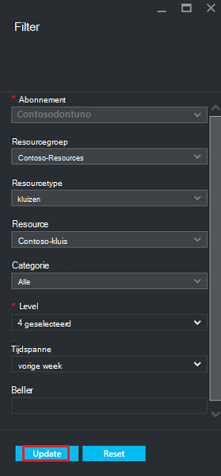

<properties
   pageTitle="VM monitor resourcemanager geïmplementeerd back-ups | Microsoft Azure"
   description="Evenementen en meldingen van back-ups van VM resourcemanager geïmplementeerd bewaken. Op basis van waarschuwingen e-mail verzenden."
   services="backup"
   documentationCenter="dev-center-name"
   authors="markgalioto"
   manager="cfreeman"
   editor=""/>

<tags
ms.service="backup"
ms.workload="storage-backup-recovery"
ms.tgt_pltfrm="na"
ms.devlang="na"
ms.topic="article"
ms.date="08/25/2016"
ms.author="trinadhk; giridham;"/>

# <a name="monitor-alerts-for-azure-virtual-machine-backups"></a>Waarschuwingen voor back-ups van Azure virtuele machines controleren

Waarschuwingen zijn antwoorden van de service dat de drempelwaarde voor een gebeurtenis is voldaan of overschreden. U weet wanneer problemen start kan zijn essentieel voor bedrijven kosten ingedrukt houden. Waarschuwingen meestal niet plaats op een planning en dus is het handig om te weten zo snel mogelijk nadat waarschuwingen optreden. Wanneer u een back-up of herstellen taak mislukt, een waarschuwing doet zich bijvoorbeeld binnen vijf minuten van de fout. De tegel back-up waarschuwingen weergegeven in het dashboard kluis kritiek en waarschuwingsniveau gebeurtenissen. In de back-up waarschuwingsinstellingen, kunt u alle gebeurtenissen weergeven. Maar wat moet u doen als er een waarschuwing optreedt wanneer u op een aparte probleem werkt? Als u niet weet wanneer de melding gebeurt, wordt een secundaire ongemak of deze kan risico opleveren voor uw gegevens. Om ervoor te zorgen dat de juiste personen zich bewust bent van een melding - wanneer het zich daadwerkelijk voordoet, de service te configureren voor waarschuwingen via e-mail verzenden. Zie voor meer informatie over het instellen van e-mailmeldingen [configureren meldingen](backup-azure-monitor-vms.md#configure-notifications).

## <a name="how-do-i-find-information-about-the-alerts"></a>Hoe vind ik informatie over de meldingen?

Als u informatie over de gebeurtenis die een waarschuwing heeft, moet u het blad back-up waarschuwingen openen. Er zijn twee manieren om te openen van het blad back-up waarschuwingen: hetzij van de meldingen voor back-up-tegel in het dashboard kluis, of vanaf het blad waarschuwingen en gebeurtenissen.

Het blad waarschuwingen voor back-up van back-up waarschuwingen tegel openen:

- Klik op **kritiek** of **Waarschuwing** als de operationele gebeurtenissen voor dat ernst niveau wilt weergeven op de tegel **Back-up waarschuwingen** op het dashboard kluis.

    


Het blad waarschuwingen voor back-up van het blad waarschuwingen en gebeurtenissen openen:

1. Klik op **Alle instellingen**vanuit het dashboard kluis. 

2. Klik op het blad **Instellingen** op **meldingen en gebeurtenissen**. 

3. Klik op het blad **waarschuwingen en gebeurtenissen** op **Back-up waarschuwingen**. 

    Het **Back-up waarschuwingen** blad geopend en de gefilterde waarschuwingen weergegeven.

    

4. Als u meer informatie over een melding voor een bepaald, in de lijst met gebeurtenissen, klikt u op de waarschuwing als u wilt openen, de blade **Details** .

    

    Als u wilt aanpassen de kenmerken die wordt weergegeven in de lijst, raadpleegt u [weergave extra gebeurtenis kenmerken](backup-azure-monitor-vms.md#view-additional-event-attributes)

## <a name="configure-notifications"></a>Meldingen configureren

 U kunt de service voor het verzenden van e-mailmeldingen voor de meldingen die zijn aangebracht via het afgelopen uur, of wanneer bepaalde typen gebeurtenissen plaatsvinden.

Voor het instellen van e-mailmeldingen voor waarschuwingen

1. Klik op het menu back-up waarschuwingen **configureren meldingen**

    

    Hiermee opent u het blad van de meldingen configureren.

    

2. Klik op het blad configureren meldingen, voor e-mailmeldingen, op **aan**.

    De geadresseerden en ernst dialoogvensters hebben een sterretje naast de cel, omdat deze informatie vereist is. Ten minste één e-mailadres en selecteer ten minste één ernst.

3. Typ het e-mailadressen voor wie de meldingen ontvangen in het dialoogvenster **geadresseerden (e)** . Gebruik de notatie: username@domainname.com. Scheid meerdere e-mailadressen met een puntkomma (;).

4. Kies in het gebied **Waarschuwen** **Per melding voor een** bericht verzenden als er een melding voor de opgegeven klinkt of **Per uur overzicht** voor het verzenden van een overzicht voor de afgelopen uur.

5. Kies een of meer niveaus die u wilt activeren e-mailmelding in het dialoogvenster **ernst** .

6. Klik op **Opslaan**.
### <a name="what-alert-types-are-available-for-azure-iaas-vm-backup"></a>Welke typen waarschuwingen zijn beschikbaar voor back-up van Azure IaaS VM?
| Waarschuwingsniveau  | Waarschuwingen verzonden |
| ------------- | ------------- |
| Kritieke | Back-up is mislukt, herstel is mislukt  |
| Waarschuwing  | Geen |
| Informatie  | Geen  |

### <a name="are-there-situations-where-email-isnt-sent-even-if-notifications-are-configured"></a>Zijn er omstandigheden waarin e-mail wordt niet verzonden evenzeer meldingen zijn geconfigureerd?

Er zijn situaties waarin een melding niet verzonden wordt, hoewel de meldingen correct zijn geconfigureerd. Meldingen worden niet in de volgende situaties van e-mail verzonden om te voorkomen waarschuwing ruis:

- Als u meldingen zijn geconfigureerd voor ieder uur overzicht, en een melding wordt ingediend en opgelost binnen het uur.
- De taak is geannuleerd.
- Een back-uptaak wordt geactiveerd en vervolgens mislukt en een andere back-uptaak wordt uitgevoerd.
- Een geplande back-uptaak voor een VM resourcemanager ingeschakelde wordt gestart, maar de VM niet langer bestaat.

## <a name="customize-your-view-of-events"></a>De weergave van gebeurtenissen aanpassen

De instelling **controlelogboeken bijhouden** wordt geleverd met een vooraf gedefinieerde set filters en kolommen met operationele gebeurtenisinformatie. U kunt de weergave kunt aanpassen, zodat wanneer het blad **gebeurtenissen** wordt geopend, deze ziet u de gewenste gegevens.

1. Het [kluis dashboard](./backup-azure-manage-vms.md#open-a-recovery-services-vault-in-the-dashboard), blader naar en klik op **Controlelogboeken bijhouden** als u wilt openen van het blad **gebeurtenissen** .

    

    Het blad **gebeurtenissen** wordt geopend op de operationele gebeurtenissen die alleen betrekking heeft op de huidige kluis gefilterd.

    

    Het blad ziet u de lijst met kritiek, fout, waarschuwing en informatieve gebeurtenissen die zijn aangebracht in de laatste week. De tijdspanne is een standaardwaarde instellen in het **Filter**. Het blad **gebeurtenissen** ziet u ook een staafdiagram bijhouden wanneer de gebeurtenissen die zijn aangebracht. Als u niet wilt zien van het staafdiagram in het menu **gebeurtenissen** , klikt u op **grafiek verbergen** om te schakelen uit de grafiek. De standaardweergave van gebeurtenissen bevat informatie voor bewerking, niveau, Status, resources en tijd. Zie de sectie [uitvouwen gebeurtenisinformatie](backup-azure-monitor-vms.md#view-additional-event-attributes)voor informatie over extra gebeurtenis kenmerken weergeeft.

2. Klik op een operationele gebeurtenis als u wilt de blade openen voor meer informatie over een operationele gebeurtenis, in de kolom **bewerking** . Het blad bevat gedetailleerde informatie over de gebeurtenissen. Gebeurtenissen die zijn gegroepeerd op hun correlatie-ID en een lijst met de gebeurtenissen die zijn aangebracht in de tijdspanne.

    

3. Als u meer informatie over een bepaalde gebeurtenis, in de lijst met gebeurtenissen, klikt u op de gebeurtenis als u wilt openen, de blade **Details** .

    

    De informatie voor de gebeurtenis is minder gedetailleerd de gegevens krijgt. Als u liever dit veel informatie over elke gebeurtenis te zien en wilt dit gedetailleerd toevoegen aan het blad **gebeurtenissen** , raadpleegt u de sectie [informatie over gebeurtenissen uitvouwen](backup-azure-monitor-vms.md#view-additional-event-attributes).


## <a name="customize-the-event-filter"></a>Het filter gebeurtenis aanpassen
Gebruik het **Filter** aanpassen of de gegevens kiezen die wordt weergegeven in een bepaalde blade. De om gebeurtenisgegevens te filteren:

1. Het [kluis dashboard](./backup-azure-manage-vms.md#open-a-recovery-services-vault-in-the-dashboard), blader naar en klik op **Controlelogboeken bijhouden** als u wilt openen van het blad **gebeurtenissen** .

    

    Het blad **gebeurtenissen** wordt geopend op de operationele gebeurtenissen die alleen betrekking heeft op de huidige kluis gefilterd.

    

2. Klik op **Filter** om te openen die blade in het menu **gebeurtenissen** .

    

3. Op het blad **Filter** aanpassen de filters **niveau** **tijd's beslaan**en **beller** . De andere filters zijn niet beschikbaar omdat ze zijn ingesteld op te geven van de actuele gegevens voor de kluis herstel Services.

    

    Kunt u het **niveau** van de gebeurtenis: kritieke, fout, waarschuwing of ter informatie. U kunt elke combinatie van gebeurtenisniveaus, maar u moet ten minste één niveau geselecteerd. Het niveau-of uitschakelen in- of uitschakelen. Het filter **tijd tijdspanne** kunt u opgeven hoe lang voor het vastleggen van gebeurtenissen. Als u een aangepaste tijdspanne gebruikt, kunt u de begin- en eindtijden instellen.

4. Nadat u klaar bent om query's in de logboeken aan de bewerkingen met het filter, klik op **bijwerken**. De resultaten weergeven in het blad **gebeurtenissen** .

    


### <a name="view-additional-event-attributes"></a>Weergave extra gebeurtenis kenmerken
De knop **kolommen** gebruikt, kunt u aanvullende gebeurtenis kenmerken worden weergegeven in de lijst op het blad **gebeurtenissen** inschakelen. De standaardlijst met gebeurtenissen wordt informatie voor bewerking, niveau, Status, resources en tijd. Extra kenmerken inschakelen:

1. Klik op het blad **gebeurtenissen** op **kolommen**.

    

    Hiermee opent u het blad **kolommen kiezen** .

    

2. Klik op het selectievakje het kenmerk. Het selectievakje kenmerk schakelt u in- of uitschakelen.

3. Klik op **opnieuw instellen** als de lijst met kenmerken in het blad **gebeurtenissen** opnieuw wilt instellen. Na het toevoegen of verwijderen van kenmerken in de lijst, kunt **opnieuw** weergeven van de nieuwe lijst met kenmerken van de gebeurtenis.

4. Klik op **bijwerken** als u wilt bijwerken van de gegevens in de kenmerken van de gebeurtenis. De volgende tabel vindt informatie over alle kenmerken.

| Kolomnaam      |Beschrijving|
| -----------------|-----------|
| Bewerking|De naam van de bewerking|
| Niveau|Het niveau van de bewerking waarden kunnen zijn: informatie, waarschuwing, fout of kritiek|
|Status|Beschrijvende status van de bewerking|
|Resource|URL van de resource; ook bekend als de resource-ID|
|Tijd|Tijd, gemeten vanaf de huidige tijd, wanneer de gebeurtenis heeft plaatsgevonden|
|Beller|Wie of wat genoemd of de gebeurtenis; het systeem of een gebruiker kan zijn|
|Tijdstempel|De tijd waarop de gebeurtenis is geactiveerd|
|Resourcegroep|De bijbehorende resourcegroep|
|Resourcetype|Het type interne resource die wordt gebruikt door Resource Manager|
|Abonnements-ID|De bijbehorende abonnements-ID|
|Categorie|Categorie van de gebeurtenis|
|Correlatie-ID|Algemene-ID voor gerelateerde gebeurtenissen|


## <a name="use-powershell-to-customize-alerts"></a>PowerShell gebruiken om aan te passen waarschuwingen
U kunt aangepaste waarschuwingen voor de taken krijgen in de portal. Als u deze taken, waarschuwingsregels PowerShell gebaseerde op de operationele Logboeken gebeurtenissen te definiëren. Gebruik *PowerShell versie 1.3.0 of hoger*.

Als u wilt een aangepaste melding waarschuwing voor back-fouten wilt definiëren, een opdracht zoals het volgende script te gebruiken:

```
PS C:\> $actionEmail = New-AzureRmAlertRuleEmail -CustomEmail contoso@microsoft.com
PS C:\> Add-AzureRmLogAlertRule -Name backupFailedAlert -Location "East US" -ResourceGroup RecoveryServices-DP2RCXUGWS3MLJF4LKPI3A3OMJ2DI4SRJK6HIJH22HFIHZVVELRQ-East-US -OperationName Microsoft.Backup/RecoveryServicesVault/Backup -Status Failed -TargetResourceId /subscriptions/86eeac34-eth9a-4de3-84db-7a27d121967e/resourceGroups/RecoveryServices-DP2RCXUGWS3MLJF4LKPI3A3OMJ2DI4SRJK6HIJH22HFIHZVVELRQ-East-US/providers/microsoft.backupbvtd2/RecoveryServicesVault/trinadhVault -Actions $actionEmail
```

**ResourceId** : U kunt ResourceId openen via de controlelogboeken bijhouden. De ResourceId is een URL die beschikbaar zijn in de kolom Resource van de logboeken aan de bewerking.

**OperationName** : OperationName is in de notatie ' Microsoft.RecoveryServices/recoveryServicesVault/*EventName*"waarbij *EventName* kan zijn:<br/>
- Register <br/>
- Unregister <br/>
- ConfigureProtection <br/>
- Back-up maken <br/>
- Herstellen <br/>
- StopProtection <br/>
- DeleteBackupData <br/>
- CreateProtectionPolicy <br/>
- DeleteProtectionPolicy <br/>
- UpdateProtectionPolicy <br/>

**Status** : ondersteunde waarden zijn gestart, geslaagd of mislukt.

**ResourceGroup** : dit is de resourcegroep waaraan de resource behoort. U kunt de resourcegroep kolom toevoegen aan de gegenereerde logboeken. Resourcegroep is een van de beschikbare soorten informatie over de gebeurtenis.

**Naam** : naam van de waarschuwing regel.

**CustomEmail** : opgeven van het aangepaste e-mailadres waarnaar u wilt een waarschuwingsbericht verzenden

**SendToServiceOwners** : deze optie waarschuwingen verzendt naar alle beheerders en CO-beheerders van het abonnement. Dit kan worden gebruikt in een **Nieuw AzureRmAlertRuleEmail** cmdlet

### <a name="limitations-on-alerts"></a>Beperkingen voor meldingen
Waarschuwingen op basis van een gebeurtenis zijn onderhevig aan de volgende beperkingen:

1. Waarschuwingen geactiveerd op alle virtuele machines in de kluis herstel Services. U kunt de melding voor een subset van virtuele machines in een kluis herstel Services niet aanpassen.
2. Deze functie is in de proefversie. [Meer informatie](../monitoring-and-diagnostics/insights-powershell-samples.md#create-alert-rules)
3. Waarschuwingen wordt verzonden vanuit "alerts-noreply@mail.windowsazure.com". U kunt de afzender van e-mailbericht momenteel niet wijzigen.


## <a name="next-steps"></a>Volgende stappen

Gebeurtenislogboeken uitstekende postmortemkeuring inschakelen en controleren van ondersteuning voor de back-bewerkingen. De volgende bewerkingen zijn geregistreerd:

- Register
- Unregister
- Beveiliging configureren
- Back-up (beide gepland en de back-up op aanvraag)
- Herstellen
- Beveiliging stoppen
- Back-upgegevens verwijderen
- Beleid toevoegen
- Beleid verwijderen
- Beleid bijwerken
- Taak annuleren

Zie het artikel, [gebeurtenissen weergeven en controlelogboeken bijhouden](../monitoring-and-diagnostics/insights-debugging-with-events.md)voor een uitgebreide uitleg van gebeurtenissen, bewerkingen en controlelogboeken tussen Azure services.

Voor informatie over een virtuele machine vanaf een herstelpunt opnieuw te maken, raadpleegt u [Azure VMs herstellen](backup-azure-restore-vms.md). Als u informatie over het beveiligen van uw virtuele machines nodig hebt, raadpleegt u [eerst zoeken: Maak een Back-up van VMs naar een kluis herstel Services](backup-azure-vms-first-look-arm.md). Meer informatie over de beheertaken voor VM back-ups in het artikel [beheren Azure virtuele machines back-ups](backup-azure-manage-vms.md).
